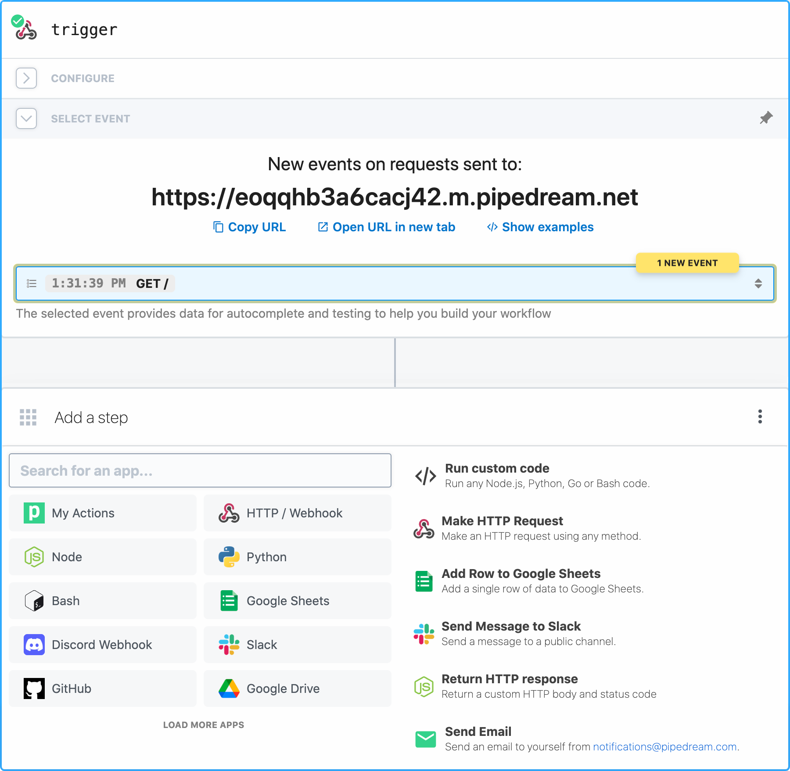

  
  
  
  

Pipedream is an integration platform for developers.

Pipedream provides a free, hosted platform for connecting apps and developing event-driven automations. The platform has over 1,000 fully-integrated applications, so you can use pre-built components to quickly send messages to Slack, add a new row to Google Sheets, and more. You can also run any Node.js, Python, Golang, or Bash code when you need custom logic. Pipedream has demonstrated SOC 2 compliance and can provide a SOC 2 Type 2 report upon request (please email support@pipedream.com).

   
  
   

This repo contains:

- [The code for all pre-built integration components](https://github.com/PipedreamHQ/pipedream/tree/master/components)
- [The product roadmap](https://github.com/PipedreamHQ/pipedream/issues)
- [The Pipedream docs](https://github.com/PipedreamHQ/pipedream/tree/master/docs)
- And other source code related to Pipedream.

This `README` explains the key features of the platform and how to get started.

To get support, please visit [https://pipedream.com/support](https://pipedream.com/support).

## Getting Started

1. **Sign up** for a free account at [pipedream.com](https://pipedream.com).
2. **Create a Workflow**: Choose a trigger (like an HTTP request or a schedule) and add actions to connect to 1,000+ APIs.
3. **Deploy**: Your workflow runs automatically in the cloud—no infrastructure to manage.
4. **CLI**: Install the [Pipedream CLI](https://pipedream.com/docs/cli/install/) to develop and deploy components from your local terminal.

## Key Features

- [Workflows](#workflows) - Workflows run automations. Workflows are sequences of steps - pre-built actions or custom [Node.js](https://pipedream.com/docs/code/nodejs/), [Python](https://pipedream.com/docs/code/python/), [Golang](https://pipedream.com/docs/code/go/), or [Bash](https://pipedream.com/docs/code/bash/) code - triggered by an event (HTTP request, timer, when a new row is added to a Google Sheets, and more).
- [Event Sources](#event-sources) - Sources trigger workflows. They emit events from services like GitHub, Slack, Airtable, RSS and [more](https://pipedream.com/apps). When you want to run a workflow when a