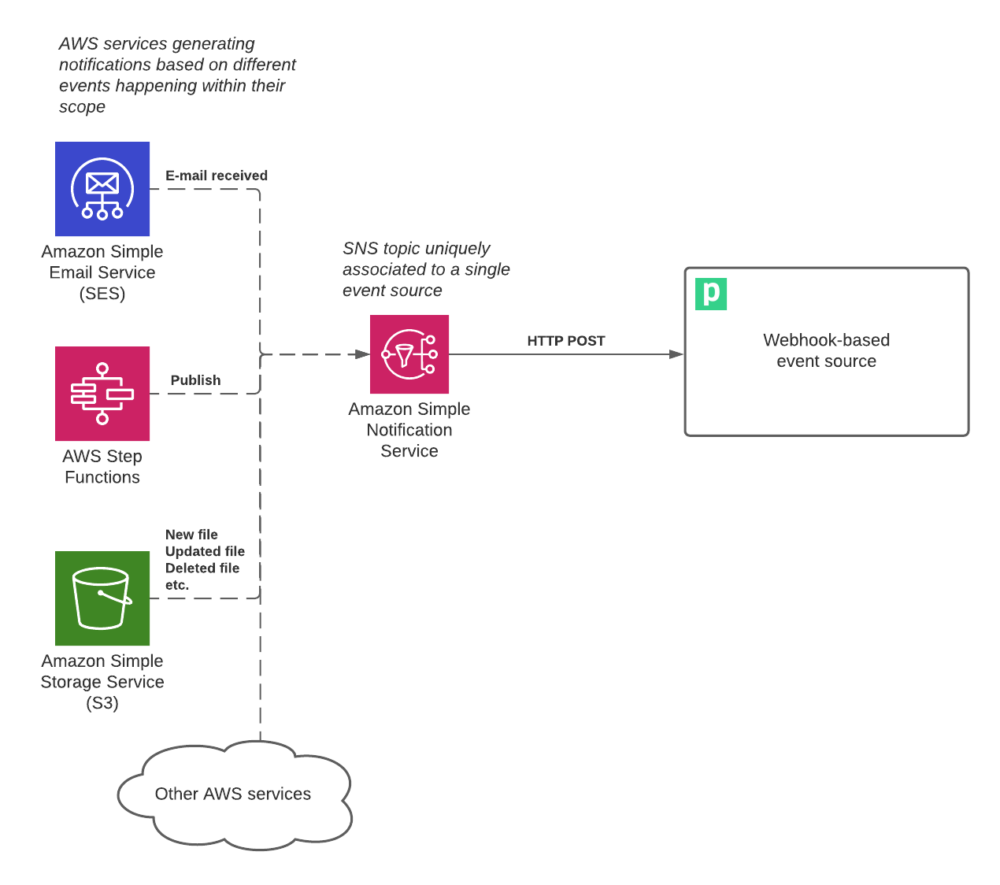
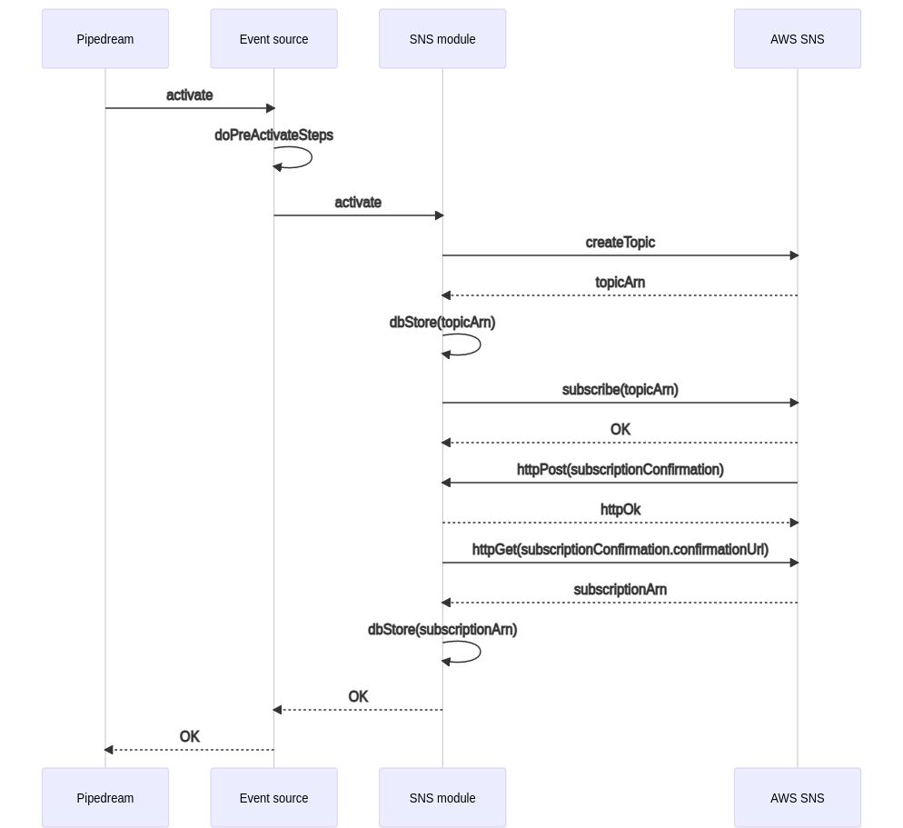
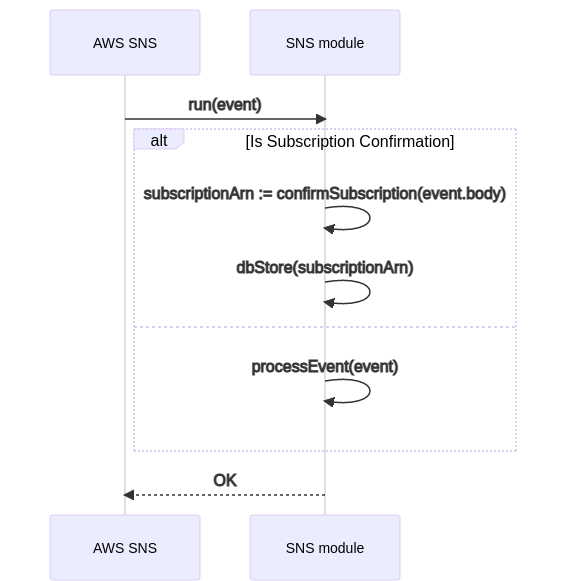

# AWS Event Sources <!-- omit in toc -->

This folder contains several event sources either directly related to or
supported by AWS services:

- **Directly related**: event sources that emit events whenever an AWS service
  experiences changes that the user is interested in watching. For example, an
  e-mail received by AWS SES (Simple Email Service).
- **Supported**: event sources that are not dependent on watching events that
  happen within an AWS service itself, but their logic relies on certain
  infrastructure running on AWS. An example of this is the **New Scheduled
  Tasks** event source, which relies on AWS Step Functions to schedule events
  that will trigger the mentioned event source.

Almost all of the AWS event sources rely on AWS SNS as the notification
mechanism to trigger them instantly whenever a relevant event happens. Given the
importance of this dependency, this document will dive deep into how these event
sources are architected around SNS.

- [Overview](#overview)
- [Prerequisites](#prerequisites)
  - [IAM User](#iam-user)
  - [Minimum Permissions](#minimum-permissions)
- [Component Architecture](#component-architecture)
  - [Activation](#activation)
  - [Deactivation](#deactivation)
  - [Normal Operation](#normal-operation)

## Overview

One of the advantages of AWS is the fact that most of its services leverage SNS
natively in order to facilitate their integration with other services and
external systems. For that reason, SNS can be seen as the main "gateway" between
AWS and Pipedream event sources when it comes to event notifications from most
of the AWS services.

At a high level, every webhook-based event source in this folder (i.e. those
event sources that are triggered via [an HTTP
endpoint](https://pipedream.com/docs/components/api/#http)) rely on an SNS topic
directly and uniquely associated to it that will deliver the relevant
notifications to the event source. The diagram below illustrates this:



Additionally, and depending on the specific AWS service to watch, the event
source will need to create additional resources to ensure that the associated
SNS topic gets properly notified. For example, if an event source wants to get
notified whenever an e-mail is received via AWS SES, the following additional
resources must be created/setup:

- A new AWS SES rule to send "e-mail received" notifications to the SNS topic
- Additional permissions to enable SES to publish notifications to the SNS topic

## Prerequisites

In order to deploy and use event sources based on AWS SNS, your Pipedream
account needs to have:

0. [An AWS
   account](https://aws.amazon.com/premiumsupport/knowledge-center/create-and-activate-aws-account/),
   if you don't already have one
1. An IAM user connected as an AWS account in Pipedream
2. A minimum set of permissions to manage the underlying SNS resources

**Note that if your currently connected AWS account already contains the
necessary permissions you can skip this section.**

### IAM User

It is **highly** recommended to [create a dedicated IAM
user](https://docs.aws.amazon.com/IAM/latest/UserGuide/id_users_create.html) for
a single type of event source in order to avoid granting too many permissions to
the event sources.

When creating the new IAM user you **only need to allow programmatic access**
for the event sources to be able to gain access to AWS. At the end of the IAM
creation flow AWS will provide you with a credential pair (i.e. **access key
ID** and **secret access key**), these are the credentials that you have to use
when creating a new [AWS connection](https://pipedream.com/apps/aws) in
Pipedream.

### Minimum Permissions

Next, you'll need to [create an IAM
policy](https://docs.aws.amazon.com/IAM/latest/UserGuide/access_policies_create-console.html)
that allows the event source permissions to create (and optionally delete) the
necessary resources inside of your AWS account.

At a minimum, this policy needs the ability to create and subscribe to SNS
topics. Event sources getting deactivated/deleted will also attempt to cleanup
the created resources, so permissions to unsubscribe from SNS topics and delete
them is also recommended in order to avoid lingering resources.

Below is an example policy with the permissions just mentioned:

```json
{
  "Version": "2012-10-17",
  "Statement": [
    {
      "Sid": "SNSCreateTopicAndSubscribe",
      "Effect": "Allow",
      "Action": [
        "sns:CreateTopic",
        "sns:DeleteTopic",
        "sns:Subscribe",
        "sns:Unsubscribe"
      ],
      "Resource": [
        "arn:aws:sns:*:*:*"
      ]
    }
  ]
}
```

## Component Architecture

Every SNS-based event source must at least perform the following steps:

- During activation:
  1. Create a new SNS topic
  2. Subscribe the event source's HTTP endpoint to the newly created topic

- During deactivation:
  1. Delete the subscription to the associated SNS topic
  2. Delete the SNS topic

- During normal operation:
  1. Receive events from the new SNS topic
  2. If the event is for an SNS subscription confirmation, confirm it and store
     the subscription ARN
  3. Otherwise, process the event via the `processEvent` method

The `common/sns` module implements the logic above as part of its
`activate`/`deactivate` hooks and its `run`/`processEvent` methods,
respectively. Any SNS-based event source can extend this behavior to support
its particular use case, taking into account that the steps listed above must be
performed in order for the notifications to happen.

### Activation

As part of the activation of an SNS-based event source (i.e. an event source
that extends `common/sns`), the `activate` hook must ensure that its "parent"
counterpart is properly invoked. This ensures that the associated topic and its
subscription are created and configured during the activation of the event
source.

Depending on the properties and logic of the event source's use case, the parent
hook could be called at the beginning, end or in-between the execution of the
child's activation hook. To illustrate this, the diagram below shows 2 calls
named `doPreActivateSteps` and `doPostActivateSteps` which symbolize the steps
that the event source performs before and after invoking the parent hook,
respectively.



The diagram above illustrates the steps described in the [Component
Architecture](#component-architecture) section, which include the creation of
the associated SNS topic and the subscription to it. The parent module also
stores references to these resources, which are exposed via getter methods to
the event sources that extend it should they need to access them.

### Deactivation

The deactivation follows the opposite pattern as the [activation](#activation)
phase since the responsibility of the former is to delete the resources created
during the latter. The details will be skipped in this document to avoid
redundancy, but it basically involves deleting the subscription to the SNS topic
and deleting the topic itself.

### Normal Operation

Normal operation of an event source means that the entry point of every
event/stimulus to the event source goes through the `run` method. The SNS module
implements such method, and it is **not recommended** for extending event
sources to override it since it contains logic to handle specific cases that
deal with the SNS topic subscription. The diagram below illustrates the logic of
the main `run` method:



The SNS module however provides a way to allow child modules to extend the way
in which input events are handled. The `processEvent` method is invoked for
every event that represents a regular SNS notification (i.e. a notification
related to the events being watched). The base implementation of the
`processEvent` method is usually enough for most purposes, and performs the
following steps:

1. Parse the input event body, and extract the `Message` field from it
2. If the `Message` field is absent, discard the event and exit
3. If the `Message` field is present, attempt to parse it as a JSON string. If
   the content is not a valid JSON string, emit an event with the "raw" content.
4. If the `Message` content is a valid JSON string, emit an event with a payload
   that matches the parsed JSON object

Overriding the `processEvent` method can be done safely since it does not break
the setup around the AWS SNS resources. Keep in mind however that this method is
responsible for eventually emitting events, so if it's not properly
extended/overridden the event source will behave unexpectedly.
