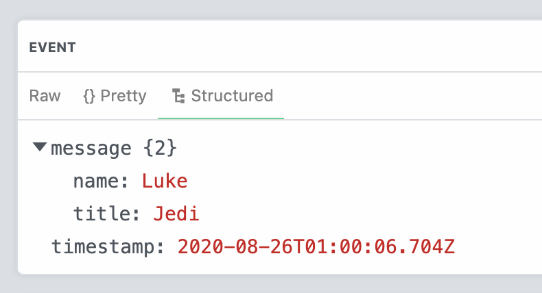

# AWS Task Scheduler <!-- omit in toc -->

**This event source creates a service for scheduling one-time tasks, at any
timestamp, up to one year in the future.**

As described in the [main `README` for AWS sources](../README.md), this event
source is of the "supported" type, meaning that it relies on infrastructure
created in AWS, but the generation of the events that it emits are not related
to any specific AWS resource.

The source [creates AWS resources](#aws-resources) in **your** AWS account that
handle task scheduling, but you don't have to worry about the AWS internals: the
source exposes a simple HTTP API for [scheduling tasks](#http-api) and
[processing them](#processing-scheduled-tasks) at the scheduled time.

To [schedule a new task](#scheduling-a-task), just send an HTTP `POST` request
to your source's endpoint, at the `/schedule` path (see the [API
specs](#api-specification) for more details).

Below is an example of a payload for a `POST /schedule` HTTP request, assuming
that the event source was configured with a secret with value `abc123`:

```json
{
  "timestamp": "2020-08-21T04:29:00.951Z",
  "message": {
    "name": "Luke"
  },
  "secret": "abc123"
}
```

When the timestamp arrives and the task is invoked, the source will emit the
payload passed in your original, scheduled request. This allows you to trigger
[a Pipedream workflow](https://docs.pipedream.com/workflows/) at the scheduled
time (provided via the `timestamp` field), passing the `message` and `timestamp`
to the workflow as an [incoming
event](https://docs.pipedream.com/workflows/events/).

You can also listen for these events in your own app / infra, by [subscribing to
your source's SSE stream](https://docs.pipedream.com/api/sse/). Each time a
scheduled task is emitted from your Pipedream source, it also emits a message to
that SSE stream. Any application (a Docker container, a Rails app, etc.)
listening to that SSE stream can react to that message to run whatever code
you'd like.


<!--ts-->
- [Quickstart](#quickstart)
- [Prerequisites](#prerequisites)
  - [An AWS account](#an-aws-account)
  - [An AWS IAM Policy for creating the necessary AWS resources](#an-aws-iam-policy-for-creating-the-necessary-aws-resources)
  - [An AWS IAM user, with an access and secret key](#an-aws-iam-user-with-an-access-and-secret-key)
- [AWS Resources](#aws-resources)
  - [Estimated AWS Costs](#estimated-aws-costs)
- [HTTP API](#http-api)
  - [API Specification](#api-specification)
  - [Scheduling a Task](#scheduling-a-task)
  - [Cancel Scheduled Tasks](#cancel-scheduled-tasks)
- [Processing Scheduled Tasks](#processing-scheduled-tasks)
- [Example: Schedule a task 30 seconds in the future](#example-schedule-a-task-30-seconds-in-the-future)
<!--te-->

## Quickstart

1. Complete the [Prerequisites](#prerequisites).

2. [Click here to create the Task Scheduler event
   source](https://pipedream.com/sources?action=create&key=aws-new-scheduled-tasks),
   linking your AWS access and secret key from **Step 1**. Adding a **Secret**
   is optional, but recommended.

3. [Copy this
   workflow](https://pipedream.com/@dylan/example-schedule-a-task-with-the-aws-task-scheduler-source-p_zAC2aK/edit)
   and enter the **Endpoint** of your source (in the source's **Events** tab) as
   the value of the **Task Scheduler URL** parameter in the `schedule_task`
   step:

   

4. In the workflow, press the **Send Test Event** button. **This will send a
   request to your Task Scheduler source, scheduling a task 30 seconds from
   now**.

5. Wait 30 seconds, and the Task Scheduler source will emit this event:

   

6. [Create a new workflow](https://pipedream.com/new) and select the Task
   Scheduler source as the trigger. When configured as a workflow trigger, tasks
   will run the workflow as soon as they're scheduled. This lets you run a
   workflow on custom events at any arbitrary time - pretty powerful stuff!

## Prerequisites

This section is an extension of [the Prerequisites section in the main `README`
document](../README.md#prerequisites). Make sure to review that document for
more information.

### An AWS account

This source requires an [AWS
account](https://aws.amazon.com/premiumsupport/knowledge-center/create-and-activate-aws-account/).

### An AWS IAM Policy for creating the necessary AWS resources

Next, you'll need to [create an IAM
policy](https://docs.aws.amazon.com/IAM/latest/UserGuide/access_policies_create-console.html)
that allows the event source permissions to create (and optionally delete) the
necessary resources inside of your AWS account.

**On top of the [permissions listed in the main `README`
document](../README.md#minimum-permissions)** , this policy needs the ability to
create and execute Step Functions State Machines, create and modify IAM roles,
and create IAM policies:

```json
{
  "Version": "2012-10-17",
  "Statement": [
    {
      "Sid": "IAMRoleManagement",
      "Effect": "Allow",
      "Action": [
        "iam:CreateRole",
        "iam:PassRole",
        "iam:PutRolePolicy"
      ],
      "Resource": [
        "arn:aws:iam::[YOUR AWS ACCOUNT ID]:role/*"
      ]
    },
    {
      "Sid": "StateMachineManagement",
      "Effect": "Allow",
      "Action": [
        "states:CreateStateMachine",
        "states:StartExecution"
      ],
      "Resource": [
        "arn:aws:states:*:*:stateMachine:*"
      ]
    }
  ]
}
```

The event source will automatically delete the resources it created if your IAM
policy allows it to. The IAM policy below contains the **additional set of
permissions** (on top of the basic ones listed
[here](../README.md#minimum-permissions)) necessary to both create and delete
these resources.

If you don't want to allow these `Delete*` privileges, you can also manually
delete the resources after deleting the event source.

```json
{
  "Version": "2012-10-17",
  "Statement": [
    {
      "Sid": "IAMRoleManagement",
      "Effect": "Allow",
      "Action": [
        "iam:CreateRole",
        "iam:DeleteRole",
        "iam:DeleteRolePolicy",
        "iam:ListRolePolicies",
        "iam:PassRole",
        "iam:PutRolePolicy"
      ],
      "Resource": [
        "arn:aws:iam::[YOUR AWS ACCOUNT ID]:role/*"
      ]
    },
    {
      "Sid": "StateMachineManagement",
      "Effect": "Allow",
      "Action": [
        "states:CreateStateMachine",
        "states:DeleteStateMachine",
        "states:StartExecution"
      ],
      "Resource": [
        "arn:aws:states:*:*:stateMachine:*"
      ]
    }
  ]
}
```

### An AWS IAM user, with an access and secret key

When you create the source, you'll be asked to add an access key and secret key
tied to an IAM user. First, [create an IAM
user](https://docs.aws.amazon.com/IAM/latest/UserGuide/id_users_create.html#id_users_create_console),
linking the IAM policy you created above. After creating the user, AWS will
generate an access and secret key that you can enter in Pipedream.

## AWS Resources

When you create this event source, Pipedream will use the linked AWS credentials
to create the following resources, in the region you specified:

- A Step Functions State Machine. This accepts new scheduled tasks, waits until
  the specified timestamp, and sends the `message` to an SNS topic.
- An IAM role that runs your Step Functions State Machine.
- An SNS topic that accepts messages from State Machine executions.
- An SNS HTTP subscription that sends messages received by the SNS topic to your
  Pipedream source.

### Estimated AWS Costs

**These costs were estimated on 2020-08-22, based on the current prices of these
AWS services in the `us-east-1` region. These prices may have changed since the
time of this writing and will differ by AWS region. Please consult the AWS
Pricing docs for each service.**

| Service                                                                     | Price per task (USD) | Notes                                                  |
| --------------------------------------------------------------------------- | -------------------- | ------------------------------------------------------ |
| [Step Functions executions](https://aws.amazon.com/step-functions/pricing/) | \$0.00005            | Each state machine execution has two state transitions |
| [SNS published messages](https://aws.amazon.com/sns/pricing/)               | \$0.0000005          |                                                        |
| [SNS -> Pipedream HTTPS delivery](https://aws.amazon.com/sns/pricing/)      | \$0.0000006          |                                                        |
| Total                                                                       | \$0.0000511          |                                                        |

## HTTP API

This source exposes an HTTP endpoint where you can send `POST` requests to
schedule or cancel new tasks. Your endpoint URL should appear as the
**Endpoint** in your source's details, in the **Events** tab:


### API Specification

The API specification details can be found in the [accompanying Swagger
file](./swagger.yaml).

### Scheduling a Task

```text
POST /schedule
```

To schedule a new task, `POST` a JSON object with an
[ISO-8601](https://developer.mozilla.org/en-US/docs/Web/JavaScript/Reference/Global_Objects/Date/toISOString)
`timestamp`, a `message`, and an optional `secret` to the **`/schedule` path**
of your source's HTTP endpoint:

```json
{
  "timestamp": "2020-08-21T04:29:00.951Z",
  "message": {
    "name": "Luke"
  },
  "secret": "abc123"
}
```

[**See this workflow for sample Node.js code to schedule new
tasks**](https://pipedream.com/@dylburger/copy-of-example-schedule-a-task-with-the-aws-task-scheduler-source-p_13CZwd/edit)

Successful task schedule requests yield a `200 OK` response with the following
payload:

```json
{
  "executionArn": "arn:aws:states:us-east-1:123456789:execution:pipedream-scheduled-tasks-dc_abc123:8699662d-f707-4005-91a2-ac956223c47c",
  "timestamp": "2020-08-21T04:29:00.951Z"
}
```

### Cancel Scheduled Tasks

```text
POST /cancel
```

If you've scheduled a task, but need to cancel it before it's executed, you can
make an HTTP POST request to the `/cancel` path:

```javascript
{
  "executionArn": "arn:aws:states:us-east-1:123456789:execution:pipedream-scheduled-tasks-dc_abc123:8699662d-f707-4005-91a2-ac956223c47c",
  "secret": "abc123"
}
```

[**See this workflow for sample Node.js code to cancel
tasks**](https://pipedream.com/@dylburger/copy-of-copy-of-example-schedule-a-task-with-the-aws-task-scheduler-source-p_7NCbga/edit)

## Processing Scheduled Tasks

Scheduled tasks are emitted by the event source as events, which you can consume
with

- [Pipedream workflows](https://docs.pipedream.com/workflows/)
- [A source-specific SSE stream](https://docs.pipedream.com/api/sse/)
- [The Pipedream REST API](https://docs.pipedream.com/api/rest/)
- [The Pipedream
  CLI](https://docs.pipedream.com/cli/reference/#installing-the-cli)

[See the docs on consuming events from
sources](https://docs.pipedream.com/event-sources/#consuming-events-from-sources)
for more information.

## Example: Schedule a task 30 seconds in the future

You can use [this
workflow](https://pipedream.com/@dylan/example-schedule-a-task-with-the-aws-task-scheduler-source-p_zAC2aK/edit)
to schedule a new task N seconds in the future:

```javascript
// N seconds from now
this.ts = new Date(+new Date() + params.numSeconds * 1000).toISOString();

return await require("@pipedreamhq/platform").axios(this, {
  url: `${params.taskSchedulerURL}/schedule`,
  headers: {
    "Content-Type": "application/json",
  },
  data: {
    timestamp: this.ts,
    message: {
      name: "Luke",
      title: "Jedi",
    },
  },
});
```

Or send the same request with `curl`:

```shell
curl \
  -d '{ "timestamp": "2020-08-21T04:29:00.951Z", "message": { "name": "Luke", "title": "Jedi" }}' \
  -H "Content-Type: application/json" \
  https://d00ca068fb5d375a3b95d0a70ba25e3f.m.pipedream.net/schedule

{"message":"Scheduled task at 2020-08-21T04:29:00.951Z"}
```
