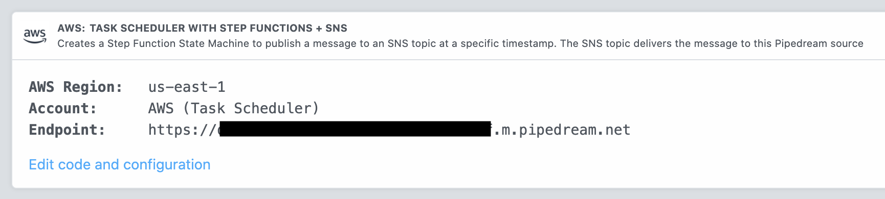

## AWS Task Scheduler

## How this works

## Estimated Costs

## API

This source exposes an HTTP endpoint where you can send POST request to schedule new tasks. Your endpoint URL should appear as the **Endpoint** in your source's details, in the **Events** tab:



To schedule a new task, send a message to the **`/schedule` path** with the following format:

```json
{
  "timestamp": "2020-08-21T04:29:00.951Z", // timestamp: an ISO 8601 timestamp
  "message": { "name": "Luke" } // message: any object or string
}
```

## Example: Schedule a task 30 seconds in the future

You can use [this workflow](https://pipedream.com/@dylan/example-schedule-a-task-with-the-aws-task-scheduler-source-p_zAC2aK/edit) to schedule a new task N seconds in the future:

```javascript
// N seconds from now
this.ts = new Date(+new Date() + params.numSeconds * 1000).toISOString();

return await require("@pipedreamhq/platform").axios(this, {
  url: `${params.taskSchedulerURL}/schedule`,
  headers: {
    "Content-Type": "application/json",
  },
  data: {
    timestamp: this.ts,
    message: {
      name: "Luke",
      title: "Jedi",
    },
  },
});
```

Or with `cURL`:

```bash
> curl -d '{ "timestamp": "2020-08-21T04:29:00.951Z", "message": { "name": "Luke" }}' \
  -H "Content-Type: application/json" \
  https://d00ca068fb5d375a3b95d0a70ba25e3f.m.pipedream.net/schedule

{"message":"Scheduled task at 2020-08-21T04:29:00.951Z"}
```

### Example: Run a workflow at sunrise and sunset

### IAM Policy

At a minimum, this policy needs the ability to create and delete Step Functions State Machines, IAM roles / policies, and SNS topics:

```json
{
  "Version": "2012-10-17",
  "Statement": [
    {
      "Sid": "VisualEditor0",
      "Effect": "Allow",
      "Action": [
        "iam:PassRole",
        "sns:DeleteTopic",
        "iam:DeleteRolePolicy",
        "states:DeleteStateMachine",
        "sns:CreateTopic",
        "iam:CreateRole",
        "iam:DeleteRole",
        "states:StartExecution",
        "states:StopExecution",
        "sns:Subscribe",
        "iam:PutRolePolicy",
        "states:CreateStateMachine"
      ],
      "Resource": [
        "arn:aws:iam::[YOUR AWS ACCOUNT ID]:role/*",
        "arn:aws:states:*:*:execution:*:*",
        "arn:aws:states:*:*:stateMachine:*",
        "arn:aws:sns:*:*:*"
      ]
    },
    {
      "Sid": "VisualEditor1",
      "Effect": "Allow",
      "Action": "sns:Unsubscribe",
      "Resource": "*"
    }
  ]
}
```
