<p align="center">
        </p>
<h1 align="center"><strong>RSS for Hackers</strong></h1>

<p align="center">Patterns for processing and producing RSS feeds</p>

<p align="center">
    <a alt="Getting Started" href="#getting-started">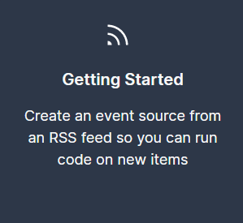</a>
    <a alt="Example Worksflows" href="#example-workflows">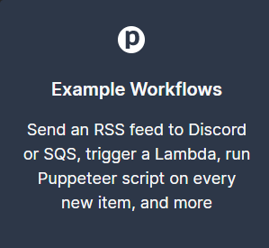</a>
    <a "SSE + REST API" href="#sse-and-rest-apis"></a>
</p>

&nbsp;&nbsp;

## Getting Started

If you want to process an RSS feed programmatically, you have to run code to poll the feed and keep track of items already processed. This isn't hard to write, but it's often not core to your app's logic. **You probably just want to run code on each new item in the feed.**

```js
// Don't care how I get feed

for (const item of feed) {
  // Just want to run code
}
```

Pipedream lets you treat an RSS feed as an [**event source**](https://docs.pipedream.com/event-sources/). Pipedream runs the code to poll the feed, emitting new items as the feed produces them:

<p align="center">
    
</p>

Then, you can process items from your event source in 3 ways:

- Subscribe to a private SSE stream, which publishes items in real time
- Trigger a Pipedream workflow for each item, running hosted Node.js code (also real time)
- Access items in batch using Pipedream's REST API
  To get started, [**create a new RSS source in the Pipedream UI**](https://pipedream.com/sources?action=create&key=rss-new-item-in-feed). Name the source and add your feed URL:

<p align="center">
    <kbd></kbd>
</p>

You can also visit **https://pipedream.com/sources** and click the Create Source button, then choose the `rss/rss.js` source from the modal that appears.

If you don't have a feed handy, you can use **https://rss.m.pipedream.net**. This generates a new, random item once every 15 minutes.

You can also create an event source using [the Pipedream CLI](https://docs.pipedream.com/cli/install/):

```bash
  $ pd deploy # Select the rss source, enter your URL
```

Once deployed, you can retrieve items emitted by the source using the pd eventscommand:

```bash
$ pd events -n 1 sample-feed  # Retrieve the newest item

$ pd events -f sample-feed  # Tail the feed in real time
```

Then, you can trigger a Pipedream workflow— a serverless Node.js script — on every event:

<p align="center">
    <kbd></kbd>
</p>

or process items in your own app using [**the SSE stream or REST API**](https://rss.pipedream.com/#apis) tied to your source.

&nbsp;&nbsp;

## Example Workflows

Workflows are linear sequences of steps — just Node.js code —hosted and run by Pipedream.

**You can copy the workflows below and run them in your Pipedream account [**for free**](https://docs.pipedream.com/pricing/)**. When you copy these workflows, you'll be asked to add the URL to your RSS feed, and to name the feed something memorable. This creates an [**RSS event source**](https://rss.pipedream.com/#getting-started) and runs your workflow every time an item is added to your feed.

If you already created RSS source, and want to run a workflow on that same feed, you can click the **Select Another Trigger** button and choose from any event source already running in your account.

<p align="center">
    <kbd></kbd>
</p>

They should work as is, but you can modify them in any way. For example, you can add a step to [**run any Node.js code**](https://docs.pipedream.com/workflows/steps/code/) or use [**pre-built functions**](https://docs.pipedream.com/workflows/steps/actions/) to send data to other destinations.

<p align="center">
    <a alt="RSS to Email" href="https://pipedream.com/@dylburger/rss-to-email-p_NMCqyV/readme">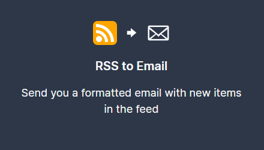</a>
    <a alt="RSS to Twitter" href="https://pipedream.com/@dylan/rss-to-twitter-p_5VCkQ7/readme">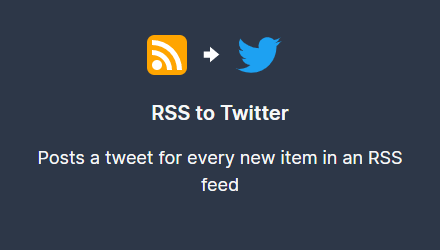</a>
    <a alt="RSS to AWS SQS" href="https://pipedream.com/@dylburger/rss-aws-sqs-p_D1CDjB/readme">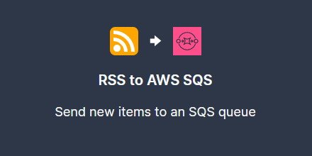</a>
    <a alt="RSS to AWS EventBridge" href="https://pipedream.com/@dylburger/rss-aws-eventbridge-event-bus-p_JZCk29/readme">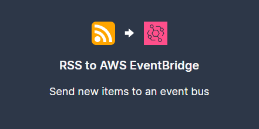</a>
    <a alt="RSS to AWS lambda" href="https://pipedream.com/@dylburger/rss-aws-lambda-p_ZJC9BG/readme"></a>
    <a alt="RSS to Webhook" href="https://pipedream.com/@dylburger/rss-http-request-p_MOCq8K/readme">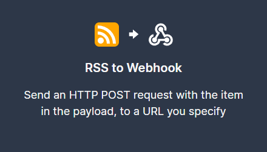</a>
    <a alt="RSS to Slack" href="https://pipedream.com/@dylburger/rss-slack-p_YyCDyK/readme">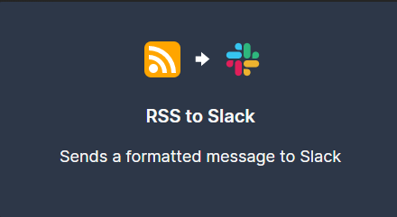</a>
    <a alt="RSS to Discord" href="https://pipedream.com/@dylburger/rss-discord-p_7NCWrm/readme">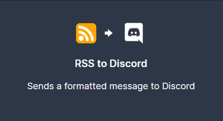</a>
    <a alt="RSS to Telegram" href="https://pipedream.com/@dylburger/rss-telegram-p_PACwrm/readme">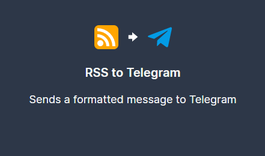</a>
    <a alt="RSS to Google Sheets" href="https://pipedream.com/@dylburger/rss-to-google-sheets-p_ezCqGG/readme"></a>
    <a alt="HTTP to RSS" href="https://pipedream.com/@dylburger/generate-an-rss-feed-from-http-post-requests-retrieve-via-get-request-p_n1CrQG/readme">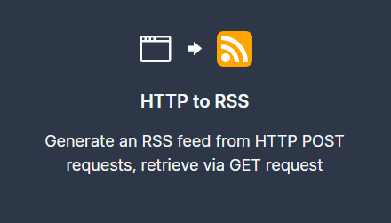</a>
    <a alt="RSS to Browserless to S3" href="https://pipedream.com/@dylburger/rss-to-browserless-to-s3-p_95Cv5z/readme">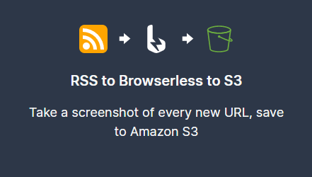</a>
</p>

&nbsp;&nbsp;

## SSE and REST APIs

Pipedream provides two other interfaces for accessing events produced by sources:

- A private SSE stream specific to your source
- A REST API

This way, you can run an event source in Pipedream but access its events in your own application.

### SSE

SSE — [**Server-sent events**](https://developer.mozilla.org/en-US/docs/Web/API/Server-sent_events) — defines a spec for how servers can send events directly to clients that subscribe to those events, similar to [**WebSockets**](https://developer.mozilla.org/en-US/docs/Web/API/WebSockets_API) and related server-to-client push technologies. If you listen for new items using SSE, **you can run any code in your own application, in real time, as soon as those items are added to the feed.**

Streams are private by default. You authenticate by passing your Pipedream API key in the Authorization header:

```js
$ curl -H "Authorization: Bearer API_KEY" \

https://api.pipedream.com/sources/SOURCE_ID/sse
```

[**See the Pipedream SSE docs**](https://docs.pipedream.com/api/sse) for more information on authentication, example Node code, and other details on the interface.

### REST API

If you prefer to process items from an RSS feed in batch, you can fetch them using [**Pipedream's REST API**](https://docs.pipedream.com/api/rest/):

```js
$ curl -H "Authorization: Bearer API_KEY" \

https://api.pipedream.com/v1/sources/SOURCE_ID/events?limit=1
```

Note the `?limit=1` query string. You can vary the number of events returned (most recent first) by setting this param.

## Questions or Feedback?

Please [**reach out**](https://docs.pipedream.com/support/) with any questions or feedback. We're happy to add other RSS-specific developer resources to this list, and we'd love to hear what can be improved about event sources or the example workflows.

&nbsp;&nbsp;  
&nbsp;&nbsp;

---

<p align="center">
Pipedream, Inc. — San Francisco, CA
</p>
<p align="center">
<a href="https://twitter.com/PipedreamHQ">Twitter</a> | <a href="https://pipedream.com/community">Community</a> | <a href="https://docs.pipedream.com/">Docs</a> | <a href="https://pipedream.com/terms">Terms</a> |
    <a href="https://pipedream.com/privacy">Privacy</a>
</p>

---
