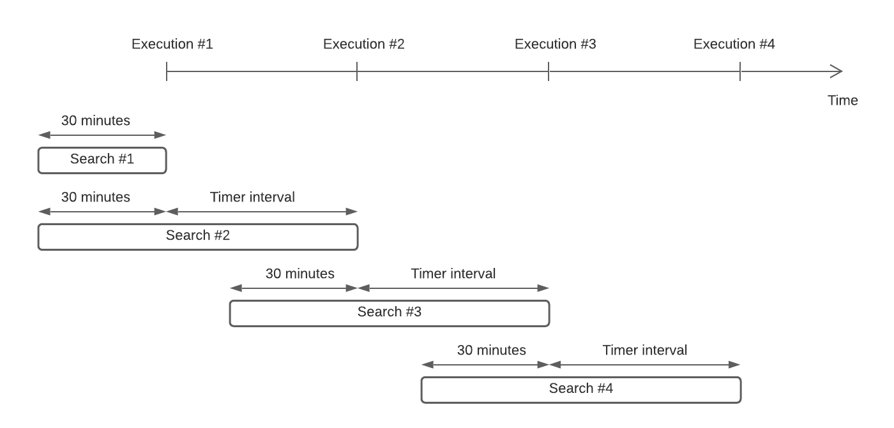

# SendGrid New Contact Source

## Introduction <a name="introduction"></a>

This source emits a new event each time a new contact is added to your SendGrid
contact list. For that purpose, it makes usage of the **New Marketing Campaign**
SendGrid APIs that allow integrations to perform searches in the contact list.

The specific API is [**Search
contacts**](https://sendgrid.com/docs/API_Reference/api_v3.html), which accepts
a parameter `query` holding a valid
[**SGQL**](https://sendgrid.com/docs/for-developers/sending-email/segmentation-query-language/)
query to perform the necessary search results filtering.

## Prerequisites

The only pre-requisite to use this event source is for users to provide a valid
[API key](https://sendgrid.com/docs/API_Reference/api_v3.html). This key must
have permission to call the
[search contacts](https://sendgrid.com/docs/API_Reference/api_v3.html) endpoint
(in the **New Marketing Campaigns** category).

To set up the SendGrid API Key, go to the [Pipedream
Accounts](https://pipedream.com/accounts) page, and click on the **CONNECT AN
APP** button. Look for the **Twilio SendGrid** app, and click on it. Under the
`api_key` field, enter the API key you created in SendGrid. Give this API key a
nickname (optional), and click on **SAVE**.

## Usage

1. Visit the [Pipedream Sources](https://pipedream.com/sources) page and
   click **Create Source**.
2. Select the **SendGrid** app and choose the **New Contact (Instant)**
   source.
3. You'll be prompted to enter the time interval for the executions. The default
   value is 15 minutes.

## Technical Details

As mentioned in the [introduction](#introduction), this event source makes use
of the SendGrid contact search API by issuing custom queries using the [SGQL
query
language](https://sendgrid.com/docs/for-developers/sending-email/segmentation-query-language/)

An example of a query in that language (which also represents the queries that
this event source makes) is the following:

```sql
contact_id NOT IN (
  "f5bff139-1e95-45df-bfaf-8ca48407f885",
  "40dafc77-92e1-47ad-8245-a9688e6de6bc"
) AND
created_at BETWEEN
  TIMESTAMP "2020-11-08T20:18:12" AND
  TIMESTAMP "2020-11-08T20:08:12"
```

This query will return a list of contacts that were created on November 8th,
2020, between 20:08:12 and 20:18:12 (UTC), and whose ID is neither
`f5bff139-1e95-45df-bfaf-8ca48407f885` nor
`40dafc77-92e1-47ad-8245-a9688e6de6bc`. _Please note there might be contacts
created within that time range that do not show up in the search results at the
time the search request is executed. See the [limitations](#limitations) section
for more information._

This event source leverages this query together with a time-based execution in
order to monitor the creation of new contacts.

### Limitations <a name="limitations"></a>

Given existing limitations on the contact search API, this event source does not
yield deterministic results:

1. Records created in at a specific time in the past might not show up in the
   search results immediately after being created. This is particularly
   important because there is no way to perfectly adjust the search time range
   to make sure all possible records are covered.
2. The API returns a list of up to 50 records, and does not offer pagination.
   This means that if we perform a search limited to a specific time range, and
   more than 50 contacts were created during that time, we won't have full
   visibility for that range unless we perform subsequent requests.

### General Approach

The principle under which this event source works is a time-based _sliding
window_. The execution of this event source is done by a
[timer](../../../../COMPONENT-API.md#timer) whose frequency can be customized
by the user. During each iteration, the component will perform a call to
SendGrid's contact search API to search for contacts that were created
within a time range in the past.

Given the 1st [limitation](#limitations) described above, there is an
adjustment that needs to be done to the search API parameters so that
the results are as exhaustive as possible. Given that search results can vary if
performed at different times (especially if the specified time range is a recent
one) we need to keep querying the API for a specific time internal until we are
confident enough that all records created within that time interval have already
appeared in the search results.

The estimated time for a record to be available in search results after its
creation is no more than 30 minutes (but that's only based on recent
experiments, and is not specified by SendGrid). This means that for every search
call performed, the event source needs to specify a time range that takes into
account any records that could've possibly been created within the previous 30
minutes of such time range, since these records might not have appeared in
previous search results, but are likely to appear now if we execute that same
search again.

To help clarify this approach, see the following diagram:


During the first execution, the event source searches for contacts created within
the last 30 minutes. It also keeps track of the time the component was executed,
since this will be needed in the next execution.

In the following executions, the event source will perform a search of contacts
created within the time elapsed between the last execution and the current one,
and also within 30 minutes prior to the last execution. That is because contacts
created in that time range might not have appeared in previous search results,
but will appear now.

Let's take for example the 3rd execution, which is executed at time `t = t3`.
This execution will search for contacts created between `t = t3` and `t = t2`,
with `t2` being the time at which the previous (i.e. the 2nd) execution
happened. It will **also** search for contacts created between `t = t2` and
`t = t2 - 30 minutes`, since there might be records within that time window that
weren't captured during the 2nd execution.

Let's say that the 3rd execution happens on November 8th, at 20:00 UTC, and that
the configured time interval is 15 minutes. The time range for the search query
will then be filtered like this:

```sql
created_at BETWEEN
  TIMESTAMP "2020-11-08T19:15:00" AND
  TIMESTAMP "2020-11-08T20:00:00"
```

The calculation is the following:

1. Current execution timestamp is `20:00:00`
2. Previous execution timestamp is `19:45:00` (given that the timer is set at 15
   minutes)
3. 30 minutes prior to the previous execution is `19:15:00`
4. Ergo, the overall time range for which to search new contacts goes from
   `19:15:00` (as per step 3) and `20:00:00` (as per step 1)

Every record created between **19:15** and **19:30 UTC** will very likely show
up in those search results. Records created within the last 30 minutes (i.e.
from **19:30** to **20:00 UTC**) might not appear in the search results queried
by the current execution, and will need to be retrieved during upcoming ones
(i.e. the 4th execution or later).

### Results Limits <a name="results-limits"></a>

The 2nd [limitation](#limitations) points out that the search API does not
provide an exhaustive list of contacts in a single search query, which means
that this event source is likely to have to issue multiple queries within a
certain time range to make sure the search is exhaustive.

This is accomplished by:

- Using the `contact_count` attribute of the search results. This attribute's
  value is the actual number of records that match the search query, and can be
  arbitrarily big. When `contact_count` is lower than 50, it will of course
  match the amount of records in the search result.
- Keeping track of all the record ID's returned for the search query. We use
  those records in subsequent search queries to exclude them from search
  results. So each time we issue a search query for a time range, we append
  those ID's to the list of already-processed records and persist such list so
  that subsequent executions can use it.
- Keeping the time range across subsequent executions (fairly) constant so that
  we continue retrieving the records created during such range. The time range
  can be safely adjusted as we retrieve and process records, by inspecting the
  `created_at` attribute of the last processed record, and the amount of records
  left to retrieve (e.g. if there are few enough records to retrieve, we can
  extend the upper bound of the time range to try and retrieve more records next
  time).

_Please note that the maximum amount of processed records within a single
iteration is **50**, which is the limit imposed by the SendGrid search API. The
rationale behind that decision is that even though we could perform multiple
searches within a single execution, it is more likely for records to appear in
search results after some time has passed. Doing several searches in a row can
push the API rate limits without much gain._

#### Example

We'll go through an example to illustrate the approach detailed above. For
simplicity, let's make **the following assumptions**:

- The search API returns a maximum of 2 records per call
- Timestamps are expressed in minutes
- Time starts at `t = 0` (i.e. no contacts were created before that time)
- The first execution of the event source happens at `t = 60`
- The timer is set at **15 minutes** intervals

**1st execution:**

**`t = 60`**

The event source runs the following search query (for simplicity, we're not
expressing timestamps in ISO format even though that's what the SendGrid API
expects):

```sql
contact_id NOT IN ("") AND
created_at BETWEEN
  TIMESTAMP "30" AND
  TIMESTAMP "60"
```

The search results look like this:

```json
{
  "result": [
    {
      "id": "a",
      "email": "a@example.com",
      "created_at": "40"
    },
    {
      "id": "c",
      "email": "c@example.com",
      "created_at": "45"
    }
  ],
  "contact_count": 4
}
```

These results tell us that even though we currently see 2 records (ID's `a`
and `c`), there are more records that fall within the search query parameters.

Finally, the current event source execution will:

1. Emit an event for each one of these 2 records, ordered by `created_at` in
    ascending order.
2. Keep track of their ID's so that they can be excluded from subsequent
    searches.
3. The lower bound will maintain the same value, since adjusting it will
    imply looking for records way in the past (which is not something we want
    to achieve in this event source).
4. The upper bound will also remain the same, since there
    are enough records to retrieve next so that we can emit enough events.

**2nd execution:**

**`t = 75`**

The following time the event source is executed, it will issue the following
search query:

```sql
contact_id NOT IN (
  "a",
  "b"
) AND
created_at BETWEEN
  TIMESTAMP "30" and
  TIMESTAMP "60"
```

Note that the time range is the same as the one in the previous execution,
but now we're excluding the accounts that we already processed.

The search results will now look like this:

```json
{
  "result": [
    {
      "id": "b",
      "email": "b@example.com",
      "created_at": "42"
    },
    {
      "id": "d",
      "email": "d@example.com",
      "created_at": "46"
    }
  ],
  "contact_count": 3
}
```

There's a couple of things to notice here:

- The `contact_count` value is not 2, which would be the value of
  `contact_count` returned in the previous search result minus the number of
  records we're excluding. It is instead 3, meaning that within the time
  elapsed between the two search queries a record appeared in the search
  results.
- Record `b` was created at `t = 42`, which is right in-between when the 2
  records from the previous execution were created. **The SendGrid search API
  is eventually consistent and does not guarantee any ordering of when the
  records will appear in the search results, regardless of when they were
  created and in what order**.

Keeping all this in mind, the current event source execution will:

1. Emit an event for each one of these 2 records, ordered by `created_at` in
    ascending order (just like before).
2. Keep track of their ID's so that they can be excluded from subsequent
    searches. The new ID list is `["a", "b", "c", "d"]`.
3. The lower bound will maintain the same value, since adjusting it will
    imply looking for records way in the past (which is not something we want
    to achieve in this event source).
4. The upper bound will now be adjusted. This is because if we keep the same
    time range we're likely to retrieve only 1 contact the next time we do a
    search query (although, like mentioned before, this is not guaranteed). To
    make an attempt to retrieve more contacts, we set the upper limit of the
    next time range to `t = 75` (which is the current execution time).

**3rd execution:**

**`t = 90`**

The following time the event source is executed it will issue the following
search query:

```sql
contact_id NOT IN (
  "a",
  "b",
  "c",
  "d"
) AND
created_at BETWEEN
  TIMESTAMP "30" and
  TIMESTAMP "75"
```

Note that the time range is **NOT** the same as the one in the previous
execution, since we adjusted the upper bound (now set to `t = 75`).

The search results will now look like this:

```json
{
  "result": [
    {
      "id": "e",
      "email": "e@example.com",
      "created_at": "75"
    },
    {
      "id": "f",
      "email": "f@example.com",
      "created_at": "65"
    }
  ],
  "contact_count": 3
}
```

One thing to notice here is that the search results are ordered by `email` and
not `created_at`. The event source sort them from oldest to newest before
processing them.

So the event source will now do the following:

1. Emit an event for each one of these 2 records, ordered by `created_at` in
    ascending order (just like before).
2. Keep track of their ID's so that they can be excluded from subsequent
    searches. The new ID list is `["a", "b", "c", "d", "e", "f"]`.
3. In this case, we adjust the lower bound of the search time range to the
    timestamp of the earliest processed record (i.e. `t = 65` in this case, which
    corresponds to record `f`) minus the 30 minute offset. The new lower
    bound would be `t = 35`.
4. The upper bound will be adjusted just like in the previous execution. The
    new upper limit of the next time range to `t = 90` (which is the current
    execution time).
