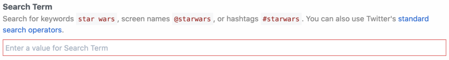

import Callout from '@/components/Callout'

# Components Guidelines & Patterns

For a component to be accepted into the Pipedream registry, it should follow
these guidelines below. These guidelines help ensure components are high
quality, are intuitive for both Pipedream users and component developers to use
and extend.

<Callout type="info">
Questions about best practices?

Join the discussion with fellow Pipedream component developers at the
[#contribute channel](https://pipedream-users.slack.com/archives/C01E5KCTR16) in
Slack or [on Discourse](https://pipedream.com/community/c/dev/11).

</Callout>

## Local Checks

When submitting pull requests, the new code will run through a series of
automated checks like linting the code. If you want to run those checks locally
for quicker feedback you must have [pnpm](https://pnpm.io/) installed and run
the following commands at the root of the project:

1. To install all the project's dependencies (only needed once):

   ```shell
   pnpm install
   ```

2. To install all required dependencies:

   ```shell
   npx pnpm install -r
   ```

3. To run the linter checks against your code (assuming that your changes are
   located at `components/foo` for example):

   ```shell
   npx eslint components/foo
   ```

4. Optionally, you can automatically fix any linter issues by running the
   following command:

   ```shell
   npx eslint --fix components/foo
   ```

Keep in mind that not all issues can be automatically fixed by the linter since
they could alter the behaviour of the code.

## General

### Components Should Be ES Modules

The Node.js community has started publishing
[ESM-only](https://flaviocopes.com/es-modules/) packages that do not work with
[CommonJS
modules](https://nodejs.org/docs/latest/api/modules.html#modules_modules_commonjs_modules).
This means you must `import` the package. You can't use `require`.

You also cannot mix ESM with CJS. This will **not** work:

```javascript
// ESM
import axios from "axios";

// CommonJS - this should be `export default`
module.exports = {
  // ...
}
```

Therefore, all components should be written as ES modules:

```javascript
import axios from "axios";

export default {
  //...
}
```

**You'll need to use [the `.mjs` file
extension](https://developer.mozilla.org/en-US/docs/Web/JavaScript/Guide/Modules#aside_%E2%80%94_.mjs_versus_.js)
for any components written as ES modules**.

You'll notice that many of the existing components are written as CommonJS
modules. Please fix these and submit a pull request as you refactor related
code. For example, if you're developing new Spotify actions, and you notice the
existing event sources use CommonJS, change them to ESM:

1. Rename the file extension from `.js` to `.mjs` using `git mv` (e.g. `git mv
   source.js source.mjs`).
2. Change all `require` statements to `import`s.
3. Change instances of `module.exports` to `export default`.

### Component Scope

Create components to address specific use cases whenever possible. For example,
when a user subscribes to a Github webhook to listen for “star” activity, events
can be generated when users star or unstar a repository. The “New Star” source
filters events for only new star activity so the user doesn't have to.

There may be cases where it's valuable to create a generic component that
provides users with broad latitude (e.g., see the [custom
webhook](https://github.com/pipedreamhq/pipedream/blob/master/components/github/sources/custom-webhook-events)
event source for GitHub). However, as a general heuristic, we found that tightly
scoped components are easier for users to understand and use.

### Required Metadata

Registry [components](/components/api/#component-structure) require a unique
`key` and `version`, and a friendly `name` and `description`. Action components
require a `type` field to be set to `action` (sources will require a type to be
set in the future).

```javascript
export default {
  key: "google_drive-new-shared-drive",
  name: "New Shared Drive",
  description: "Emits a new event any time a shared drive is created.",
  version: "0.0.1",
};
```

### Component Key Pattern

When publishing components to the Pipedream registry, the `key` must be unique
across registry components and should follow the pattern:

`app_name_slug`-`slugified-component-name`

**Source** keys should use past tense verbs that describe the event that
occurred (e.g., `linear_app-issue-created-instant`). For **action** keys, use
active verbs to describe the action that will occur, (e.g.,
`linear_app-create-issue`).

### Versioning

When you first publish a component to the registry, set its version to `0.0.1`.

Pipedream registry components try to follow [semantic
versioning](https://semver.org/). From their site:

Given a version number `MAJOR.MINOR.PATCH`, increment the:

1. `MAJOR` version when you make incompatible API changes,
2. `MINOR` version when you add functionality in a backwards compatible manner,
   and
3. `PATCH` version when you make backwards compatible bug fixes.

When you're developing actions locally, and you've incremented the version in
your account multiple times, make sure to set it to the version it should be at
in the registry prior to submitting your PR. For example, when you add an action
to the registry, the version should be `0.0.1`. If the action was at version
`0.1.0` and you've fixed a bug, change it to `0.1.1` when committing your final
code.

### Folder Structure

Registry components are organized by app in the `components` directory of the
`pipedreamhq/pipedream` repo.

```text
/components
 /[app-name-slug]
  /[app-name-slug].app.js
  /actions
   /[action-name-slug]
    /[action-name-slug].js
  /sources
   /[source-name-slug]
    /[source-name-slug].js
```

- The name of each app folder corresponds with the name slug for each app
- The app file should be in the root of the app folder (e.g.,
  `/components/[app_slug]/[app_slug].app.js`)
- Components for each app are organized into `/sources` and `/actions`
  subfolders
- Each component should be placed in its own subfolder (with the name of the
  folder and the name of the `js` file equivalent to the slugified component
  name). For example, the path for the "Search Mentions" source for Twitter is
  `/components/twitter/sources/search-mentions/search-mentions.js`.
- Aside from `app_slug`, words in folder and file names are separated by dashes
  (-) (i.e., in kebab case)

You can explore examples in the [components
directory](https://github.com/pipedreamhq/pipedream/tree/master/components).

#### Using APIs vs Client Libraries

If the app has a well-supported [Node.js client
library](/components/api/#using-npm-packages), feel free to use that instead of
manually constructing API requests.

### `package.json`

Each app should have a `package.json` in its root folder. If one doesn't exist,
run `npm init` in the app's root folder and customize the file using [this
`package.json`](https://github.com/PipedreamHQ/pipedream/blob/55236b3aa993cbcb545e245803d8654c6358b0a2/components/stripe/package.json)
as a template.

Each time you change the code for an app file, or change the dependencies for
any app component, modify the package `version`.

Save any dependencies in the component app directory:

```bash
npm i --save package
npm i --save-dev package
```

#### Error-Handling and Input Validation

When you use the SDK of a popular API, the SDK might raise clear errors to the
user. For example, if the user is asked to pass an email address, and that email
address doesn't validate, the library might raise that in the error message.

But other libraries will _not_ raise clear errors. In these cases, you may need
to `throw` your own custom error that wraps the error from the API / lib. [See
the Airtable
components](https://github.com/PipedreamHQ/pipedream/blob/9e4e400cda62335dfabfae384d9224e04a585beb/components/airtable/airtable.app.js#L70)
for an example of custom error-handling and input validation.

In general, **imagine you are a user troubleshooting an issue. Is the error
easy-to-understand? If not, `throw` a better error**.

### `README` files

New actions and sources should include `README.md` files within the same
directory to describe how to use the action or source to users.

Here's an example `README.md` structure:

```markdown

# Overview

# Example Use Cases

# Getting Started

# Troubleshooting

```

These sections will appear within the correponding app, source and action page,
along with any subheadings and content.

Here's an example of an [app `README.md` within the `discord` component on the
Pipedream
registry](https://github.com/PipedreamHQ/pipedream/blob/master/components/discord/README.md).
That same content is rendered within the [Pipedream integration page for the
Discord app](https://pipedream.com/apps/discord).

You can add additional subheadings to each of the top level `Overview`, `Example
Use Cases`, `Getting Started` and `Troubleshooting` headings:

```markdown
# Overview

## Limitations

Perhaps there are some limitations about the API that users should know about.

# Example Use Cases

1. Sync data in real time
2. Automate tedious actions
3. Introduce A.I. into the workflow

# Getting Started

## Generating an API Key

Instructions on how to generate an API key from within the service's dashboard.

# Troubleshooting

## Required OAuth Scopes

Please take note, you'll need to have sufficient privileges in order to complete
authentication.
```

<Callout type="info">
Only these three top level headings `Overview`, `Getting Starting` and
`Troubleshooting` will appear within the corresponding App Marketplace page. All
other headings will be ignored.
</Callout>

#### Pagination

When making API requests, handle pagination to ensure all data/events are
processed. Moreover, if the underlying account experiences and/or generates too
much data paginating through the entire collection of records, it might cause
out-of-memory or timeout issues (or both!), so as a rule of thumb the pagination
logic should:

- Be encapsulated as a [generator](https://mzl.la/37z6Sh6) so that the component
  can start processing records after the very first API call. As an example, you
  can check the [Microsoft OneDrive
  methods](https://github.com/PipedreamHQ/pipedream/tree/master/components/microsoft_onedrive/microsoft_onedrive.app.mjs)
  to list files.
- Accept a "next token/page/ID" whenever possible, so that API calls do not
  retrieve the entire collection of records during every execution but rather
  from a recent point in time. The `scanDeltaItems` generator method in the
  example above follows this pattern.
- Persist the last page number, token or record ID right after processing, so
  that following executions of the component process new records to minimize the
  amount of duplicate events, execution time and delayed events. Following the
  same Microsoft OneDrive example, check the `processEvent` method [in this
  component](https://github.com/PipedreamHQ/pipedream/tree/master/components/microsoft_onedrive/sources/new-file/new-file.mjs)
  for an example.

#### Capturing Sensitive Data

If users are required to enter sensitive data, always use
[secret](/components/api/#general) props.

### Promoting Reusability

#### App Files

App files contain components that declare the app and include prop definitions
and methods that may be reused across components. App files should adhere to the
following naming convention: `[app_name_slug].app.js`. If an app file does not
exist for your app, please [reach
out](https://pipedream.com/community/c/dev/11).

##### Prop Definitions

Whenever possible, reuse existing [prop
definitions](/components/api/#prop-definitions-example).

If a prop definition does not exist and you are adding an app-specific prop that
may be reused in future components, add it as a prop definition to the app file.
Prop definitions will also be surfaced for apps the Pipedream marketplace.

##### Methods

Whenever possible, reuse [methods](/components/api/#methods) defined in the app
file. If you need to use an API for which a method is not defined and it may be
used in future components, define a new method in the app file.

Use the [JS Docs](https://jsdoc.app/about-getting-started.html) pattern for
lightweight documentation of each method in the app file. Provide a description
and define @params and @returns block tags (with default values if applicable —
e.g., `[foo=bar]`). This data will both help with reusability and will be
surfaced in documentation for apps in the Pipedream marketplace. For example:

```javascript
export default {
  methods: {
    /**
     * Get the most recently liked Tweets for a user
     *
     * @params {Object} opts - An object representing the configuration options
     * for this method
     * @params {String} opts.screenName - The user's Twitter screen name (e.g.,
     * `pipedream`)
     * @params {String} [opts.count=200] - The maximum number of Tweets to
     * return
     * @params {String} [opts.tweetMode=extended] - Use the default of
     * `extended` to return non-truncated Tweets
     * @returns {Array} Array of most recent Tweets liked by the specified user
     */
    async getLikedTweets(opts = {}) {
      const { screenName, count = 200, tweetMode = "extended" } = opts;
      const { data } = await this._makeRequest({
        url: "https://api.twitter.com/1.1/favorites/list.json",
        params: {
          screen_name: screenName,
          count,
          tweet_mode: tweetMode,
        },
      });
      return data;
    },
  },
};
```

#### Testing

Pipedream does not currently support unit tests to validate that changes to app
files are backwards compatible with existing components. Therefore, if you make
changes to an app file that may impact other sources, you must currently test
potentially impacted components to confirm their functionality is not negatively
affected. We expect to support a testing framework in the future.

### Common Files (Optional)

An optional pattern to improve reusability is to use a `common` module to
abstract elements that are used across to multiple components. The trade-off
with this approach is that it increases complexity for end-users who have the
option of customizing the code for components within Pipedream. When using this
approach, the general pattern is:

- The `.app.js` module contains the logic related to making the actual API calls
  (e.g. calling `axios.get`, encapsulate the API URL and token, etc).
- The `common.js` module contains logic and structure that is not specific to
  any single component. Its structure is equivalent to a component, except that
  it doesn't define attributes such as `version`, `dedupe`, `key`, `name`, etc
  (those are specific to each component). It defines the main logic/flow and
  relies on calling its methods (which might not be implemented by this
  component) to get any necessary data that it needs. In OOP terms, it would be
  the equivalent of a base abstract class.
- The component module of each action would inherit/extend the `common.js`
  component by setting additional attributes (e.g. `name`, `description`, `key`,
  etc) and potentially redefining any inherited methods.

See [Google
Drive](https://github.com/PipedreamHQ/pipedream/tree/master/components/google_drive)
for an example of this pattern. When using this approach, prop definitions
should still be maintained in the app file.

Please note that the name `common` is just a convention and depending on each
case it might make sense to name any common module differently. For example, the
[AWS
sources](https://github.com/PipedreamHQ/pipedream/tree/master/components/aws)
contains a `common` directory instead of a `common.js` file, and the directory
contains several modules that are shared between different event sources.

## Props

As a general rule of thumb, we should strive to only incorporate the 3-4 most
relevant options from a given API as props. This is not a hard limit, but the
goal is to optimize for usability. We should aim to solve specific use cases as
simply as possible.

### Labels

Use [prop](/components/api/#user-input-props) labels to customize the name of a
prop or propDefinition (independent of the variable name in the code). The label
should mirror the name users of an app are familiar with; i.e., it should mirror
the equivalent label in the app’s UI. This applies to usage in labels,
descriptions, etc. E.g., the Twitter API property for search keywords is “q”,
but its label is set to “Search Term”.

### Descriptions

Include a description for [props](/components/api/#user-input-props) if it helps
the user understand what they need to do. Use Markdown as appropriate to improve
the clarity of the description or instructions. When using Markdown:

- Enclose sample input values in backticks (`` ` ``)
- Refer to other props using **bold** by surrounding with double asterisks (\*)
- Use Markdown links with descriptive text rather than displaying a full URL.
- If the description isn't self-explanatory, link to the API docs of the
  relevant method to further clarify how the prop works. When the value of the
  prop is complex (for example, an object with many properties), link to the
  section of the API docs that include details on this format. Users may pass
  values from previous steps using expressions, so they'll need to know how to
  structure the input data.

Examples:

- The async option to select an Airtable Base is self-explanatory so includes no
  description:

  

- The “Search Term” prop for Twitter includes a description that helps the user
  understand what values they can enter, with specific values highlighted using
  backticks and links to external content.

  

### Optional vs Required Props

Use optional [props](/components/api/#user-input-props) whenever possible to
minimize the input fields required to use a component.

For example, the Twitter search mentions source only requires that a user
connect their account and enter a search term. The remaining fields are optional
for users who want to filter the results, but they do not require any action to
activate the source:


### Default Values

Provide [default values](/components/api/#user-input-props) whenever possible.
NOTE: the best default for a source doesn’t always map to the default
recommended by the app. For example, Twitter defaults search results to an
algorithm that balances recency and popularity. However, the best default for
the use case on Pipedream is recency.

### Async Options

Avoid asking users to enter ID values. Use [async
options](/components/api/#async-options-example) (with label/value definitions)
so users can make selections from a drop down menu. For example, Todoist
identifies projects by numeric IDs (e.g., 12345). The async option to select a
project displays the name of the project as the label, so that’s the value the
user sees when interacting with the source (e.g., “My Project”). The code
referencing the selection receives the numeric ID (12345).

Async options should also support
[pagination](/components/api/#async-options-example) (so users can navigate
across multiple pages of options for long lists). See
[Hubspot](https://github.com/PipedreamHQ/pipedream/blob/a9b45d8be3b84504dc22bb2748d925f0d5c1541f/components/hubspot/hubspot.app.mjs#L136)
for an example of offset-based pagination. See
[Twitter](https://github.com/PipedreamHQ/pipedream/blob/d240752028e2a17f7cca1a512b40725566ea97bd/components/twitter/twitter.app.mjs#L200)
for an example of cursor-based pagination.

### Dynamic Props

[Dynamic props](/components/api/#dynamic-props) can improve the user experience
for components. They let you render props in Pipedream dynamically, based on the
value of other props, and can be used to collect more specific information that
can make it easier to use the component. See the Google Sheets example in the
linked component API docs.

### Interface & Service Props

In the interest of consistency, use the following naming patterns when defining
[interface](/components/api/#interface-props) and
[service](/components/api/#service-props) props in source components:

| Prop                | **Recommended Prop Variable Name** |
| ------------------- | ---------------------------------- |
| `$.interface.http`  | `http`                             |
| `$.interface.timer` | `timer`                            |
| `$.service.db`      | `db`                               |

Use getters and setters when dealing with `$.service.db` to avoid potential
typos and leverage encapsulation (e.g., see the [Search
Mentions](https://github.com/PipedreamHQ/pipedream/blob/master/components/twitter/sources/search-mentions/search-mentions.mjs#L83-L88)
event source for Twitter).

## Source Guidelines

These guidelines are specific to [source](/sources/) development.

### Webhook vs Polling Sources

Create subscription webhooks sources (vs polling sources) whenever possible.
Webhook sources receive/emit events in real-time and typically use less compute
time from the user’s account. Note: In some cases, it may be appropriate to
support webhook and polling sources for the same event. For example, Calendly
supports subscription webhooks for their premium users, but non-premium users
are limited to the REST API. A webhook source can be created to emit new
Calendly events for premium users, and a polling source can be created to
support similar functionality for non-premium users.

### Source Name

Source name should be a singular, title-cased name and should start with "New"
(unless emits are not limited to new items). Name should not be slugified and
should not include the app name. NOTE: Pipedream does not currently distinguish
real-time event sources for end-users automatically. The current pattern to
identify a real-time event source is to include “(Instant)” in the source name.
E.g., “New Search Mention” or “New Submission (Instant)”.

### Source Description

Enter a short description that provides more detail than the name alone.
Typically starts with "Emit new". E.g., “Emit new Tweets that matches your
search criteria”.

### Emit a Summary

Always [emit a summary](/components/api/#emit) for each event. For example, the
summary for each new Tweet emitted by the Search Mentions source is the content
of the Tweet itself.

If no sensible summary can be identified, submit the event payload in string
format as the summary.

### Deduping

Use built-in [deduping strategies](/components/api/#dedupe-strategies) whenever
possible (`unique`, `greatest`, `last`) vs developing custom deduping code.
Develop custom deduping code if the existing strategies do not support the
requirements for a source.

### Surfacing Test Events

In order to provide users with source events that they can immediately reference
when building their workflow, we should implement 2 strategies whenever
possible:

#### Emit Events on First Run

- Polling sources should always emit events on the first run (see the [Spotify:
  New
  Playlist](https://github.com/PipedreamHQ/pipedream/blob/master/components/spotify/sources/new-playlist/new-playlist.mjs)
  source as an example)
- Webhook-based sources should attempt to fetch existing events in the
  `deploy()` hook during source creation (see the [Jotform: New
  Submission](https://github.com/PipedreamHQ/pipedream/blob/master/components/jotform/sources/new-submission/new-submission.mjs)
  source)

_Note – make sure to emit the most recent events (considering pagination), and
limit the count to no more than 50 events._

#### Include a Static Sample Event

There are times where there may not be any historical events available (think
about sources that emit less frequently, like "New Customer" or "New Order",
etc). In these cases, we should include a static sample event so users can see
the event shape and reference it while building their workflow, even if it's
using fake data.

To achieve this, follow these steps:

1. Copy the JSON output from the source's emit (what you get from
   `steps.trigger.event`) and **make sure to remove or scrub any sensitive or
   personal data** (you can also copy this from the app's API docs)
2. Add a new file called `test-event.mjs` in the same directory as the component
   source and export the JSON event via `export default`
   ([example](https://github.com/PipedreamHQ/pipedream/blob/master/components/jotform/sources/new-submission/test-event.mjs))
3. In the source component code, make sure to import that file as `sampleEmit`
   ([example](https://github.com/PipedreamHQ/pipedream/blob/master/components/jotform/sources/new-submission/new-submission.mjs#L2))
4. And finally, export the `sampleEmit` object
   ([example](https://github.com/PipedreamHQ/pipedream/blob/master/components/jotform/sources/new-submission/new-submission.mjs#L96))

This will render a "Generate Test Event" button in the UI for users to emit that
sample event:


### Polling Sources

#### Default Timer Interval

As a general heuristic, set the default timer interval to 15 minutes. However,
you may set a custom interval (greater or less than 15 minutes) if appropriate
for the specific source. Users may also override the default value at any time.

For polling sources in the Pipedream registry, the default polling interval is
set as a global config. Individual sources can access that default within the
props definition:

``` javascript
import { DEFAULT_POLLING_SOURCE_TIMER_INTERVAL } from "@pipedream/platform";

export default {
  props: {
    timer: {
      type: "$.interface.timer",
      default: {
        intervalSeconds: DEFAULT_POLLING_SOURCE_TIMER_INTERVAL,
      },
    },
  },
  // rest of component...
}
```

#### Rate Limit Optimization

When building a polling source, cache the most recently processed ID or
timestamp using `$.service.db` whenever the API accepts a `since_id` or "since
timestamp" (or equivalent). Some apps (e.g., Github) do not count requests that
do not return new results against a user’s API quota.

If the service has a well-supported Node.js client library, it'll often build in
retries for issues like rate limits, so using the client lib (when available)
should be preferred. In the absence of that,
[Bottleneck](https://www.npmjs.com/package/bottleneck) can be useful for
managing rate limits. 429s should be handled with exponential backoff (instead
of just letting the error bubble up).

### Webhook Sources

#### Hooks

[Hooks](/components/api/#hooks) are methods that are automatically invoked by
Pipedream at different stages of the [component
lifecycle](/components/api/#source-lifecycle). Webhook subscriptions are
typically created when components are instantiated or activated via the
`activate()` hook, and deleted when components are deactivated or deleted via
the `deactivate()` hook.

#### Helper Methods

Whenever possible, create methods in the app file to manage [creating and
deleting webhook subscriptions](/components/api/#hooks).

| **Description**                         | **Method Name** |
| --------------------------------------- | --------------- |
| Method to create a webhook subscription | `createHook()`  |
| Method to delete a webhook subscription | `deleteHook()`  |

#### Storing the 3rd Party Webhook ID

After subscribing to a webhook, save the ID for the hook returned by the 3rd
party service to the `$.service.db` for a source using the key `hookId`. This ID
will be referenced when managing or deleting the webhook. Note: some apps may
not return a unique ID for the registered webhook (e.g., Jotform).

#### Signature Validation

Subscription webhook components should always validate the incoming event
signature if the source app supports it.

#### Shared Secrets

If the source app supports shared secrets, implement support transparent to the
end user. Generate and use a GUID for the shared secret value, save it to a
`$.service.db` key, and use the saved value to validate incoming events.

## Action Guidelines

### Action Name

Like [source name](#source-name), action name should be a singular, title-cased
name, should not be slugified, and should not include the app name.

As a general pattern, articles are not included in the action name. For example,
instead of "Create a Post", use "Create Post".

#### Use `@pipedream/platform` axios for all HTTP Requests

By default, the standard `axios` package doesn't return useful debugging data to
the user when it `throw`s errors on HTTP 4XX and 5XX status codes. This makes it
hard for the user to troubleshoot the issue.

Instead, [use `@pipedream/platform` axios](/pipedream-axios/).

#### Return JavaScript Objects

When you `return` data from an action, it's exposed as a [step
export](/workflows/steps/#step-exports) for users to reference in future steps
of their workflow. Return JavaScript objects in all cases, unless there's a
specific reason not to.

For example, some APIs return XML responses. If you return XML from the step,
it's harder for users to parse and reference in future steps. Convert the XML to
a JavaScript object, and return that, instead.

### "List" Actions

#### Return an Array of Objects

To simplify using results from "list"/"search" actions in future steps of a
workflow, return an array of the items being listed rather than an object with a
nested array. [See this example for
Airtable](https://github.com/PipedreamHQ/pipedream/blob/cb4b830d93e1495d8622b0c7dbd80cd3664e4eb3/components/airtable/actions/common-list.js#L48-L63).

#### Handle Pagination

For actions that return a list of items, the common use case is to retrieve all
items. Handle pagination within the action to remove the complexity of needing
to paginate from users. We may revisit this in the future and expose the
pagination / offset params directly to the user.

In some cases, it may be appropriate to limit the number of API requests made or
records returned in an action. For example, some Twitter actions optionally
limit the number of API requests that are made per execution (using a
[`maxRequests`
prop](https://github.com/PipedreamHQ/pipedream/blob/cb4b830d93e1495d8622b0c7dbd80cd3664e4eb3/components/twitter/twitter.app.mjs#L52))
to avoid exceeding Twitter's rate limits. [See the Airtable
components](https://github.com/PipedreamHQ/pipedream/blob/e2bb7b7bea2fdf5869f18e84644f5dc61d9c22f0/components/airtable/airtable.app.js#L14)
for an example of using a `maxRecords` prop to optionally limit the maximum
number of records to return.

### Use `$.summary` to Summarize What Happened

[Describe what happened](/components/api/#returning-data-from-steps) when an
action succeeds by following these guidelines:

- Use plain language and provide helpful and contextually relevant information
  (especially the count of items)
- Whenever possible, use names and titles instead of IDs
- Basic structure: _Successfully [action performed (like added, removed,
  updated)] “[relevant destination]”_

### Don't Export Data You Know Will Be Large

Browsers can crash when users load large exports (many MBs of data). When you
know the content being returned is likely to be large – e.g. files — don't
export the full content. Consider writing the data to the `/tmp` directory and
exporting a reference to the file.

## Database Components

Pipedream supports a special category of apps called ["databases"](/databases),
such as
[MySQL](https://github.com/PipedreamHQ/pipedream/tree/master/components/mysql),
[PostgreSQL](https://github.com/PipedreamHQ/pipedream/tree/master/components/postgresql),
[Snowflake](https://github.com/PipedreamHQ/pipedream/tree/master/components/snowflake),
etc. Components tied to these apps offer unique features _as long as_ they
comply with some requirements. The most important features are:

1. A built-in SQL editor that allows users to input a SQL query to be run
   against their DB
2. Proxied execution of commands against a DB, which guarantees that such
   requests are always being made from the same range of static IPs (see the
   [shared static IPs docs](databases#send-requests-from-a-shared-static-ip))

When dealing with database components, the Pipedream runtime performs certain
actions internally to make these features work. For this reason, these
components must implement specific interfaces that allows the runtime to
properly interact with their code. These interfaces are usually defined in the
[`@pipedream/platform`](https://github.com/PipedreamHQ/pipedream/tree/master/platform)
package.

### SQL Editor

This code editor is rendered specifically for props of type `sql`, and it uses
(whenever possible) the underlying's database schema information to provide
auto-complete suggestions. Each database engine not only has its own SQL
dialect, but also its own way of inspecting the schemas and table information it
stores. For this reason, each app file must implement the logic that's
applicable to the target engine.

To support the schema retrieval, the app file must implement a method called
`getSchema` that takes no parameters, and returns a data structure with a format
like this:

```javascript
{
  users: {  // The entries at the root correspond to table names
    metadata: {
      rowCount: 100,
    },
    schema: {
      id: { // The entries under `schema` correspond to column names
        columnDefault: null,
        dataType: "number",
        isNullable: false,
        tableSchema: "public",
      },
      email: {
        columnDefault: null,
        dataType: "varchar",
        isNullable: false,
        tableSchema: "public",
      },
      dateOfBirth: {
        columnDefault: null,
        dataType: "varchar",
        isNullable: true,
        tableSchema: "public",
      },
    },
  },
}
```

The
[`lib/sql-prop.ts`](https://github.com/PipedreamHQ/pipedream/blob/master/platform/lib/sql-prop.ts)
file in the `@pipedream/platform` package define the schema format and the
signature of the `getSchema` method. You can also check out existing examples in
the
[MySQL](https://github.com/PipedreamHQ/pipedream/blob/master/components/mysql/mysql.app.mjs),
[PostgreSQL](https://github.com/PipedreamHQ/pipedream/blob/master/components/postgresql/postgresql.app.mjs)
and
[Snowflake](https://github.com/PipedreamHQ/pipedream/blob/master/components/snowflake/snowflake.app.mjs)
components.

### Shared Static IPs

When a user runs a SQL query against a database, the request is proxied through
a separate internal service that's guaranteed to always use the same range of
static IPs when making outbound requests. This is important for users that have
their databases protected behind a firewall, as they can whitelist these IPs to
allow Pipedream components to access their databases.

To make this work, the app file must implement the interface defined in the
[`lib/sql-proxy.ts`](https://github.com/PipedreamHQ/pipedream/blob/master/platform/lib/sql-proxy.ts)
file in the `@pipedream/platform` package. This interface defines the following
methods:

1. **`getClientConfiguration`**: This method takes no parameters and returns an
   object that can be fed directly to the database's client library to
   initialize/establish a connection to the database. This guarantees that both
   the component and the proxy service use the same connection settings, **so
   make sure the component uses this method when initializing the client**.
2. **`executeQuery`**: This method takes a query object and returns the result
   of executing the query against the database. The Pipedream runtime will
   replace this method with a call to the proxy service, so **every component
   must make use of this method in order to support this feature**.
3. **`proxyAdapter`**: This method allows the proxy service to take the
   arguments passed to the `executeQuery` method and transform them into a
   "generic" query object that the service can then use. The expected format
   looks something like this:
   ```javascript
   {
     query: "SELECT * FROM users WHERE id = ?",
     params: [42],
   }
   ```

You can check out these example pull requests that allowed components to support
this proxy feature:

- [#11201 (MySQL)](https://github.com/PipedreamHQ/pipedream/pull/11201)
- [#11202 (PostgreSQL)](https://github.com/PipedreamHQ/pipedream/pull/11202)
- [#12511 (Snowflake)](https://github.com/PipedreamHQ/pipedream/pull/12511)
