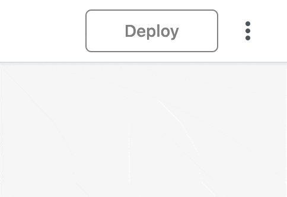
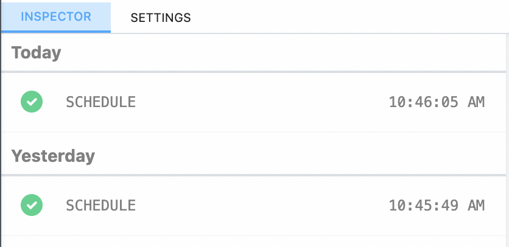
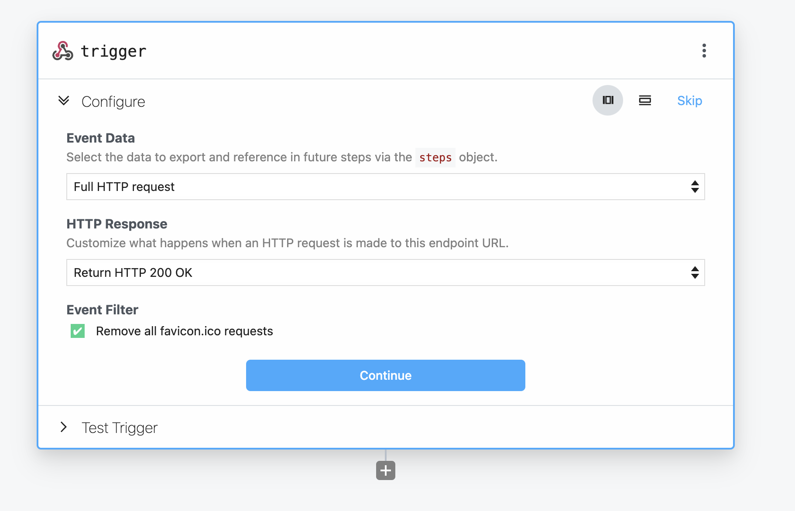
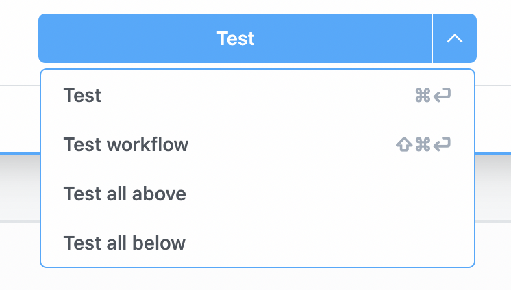
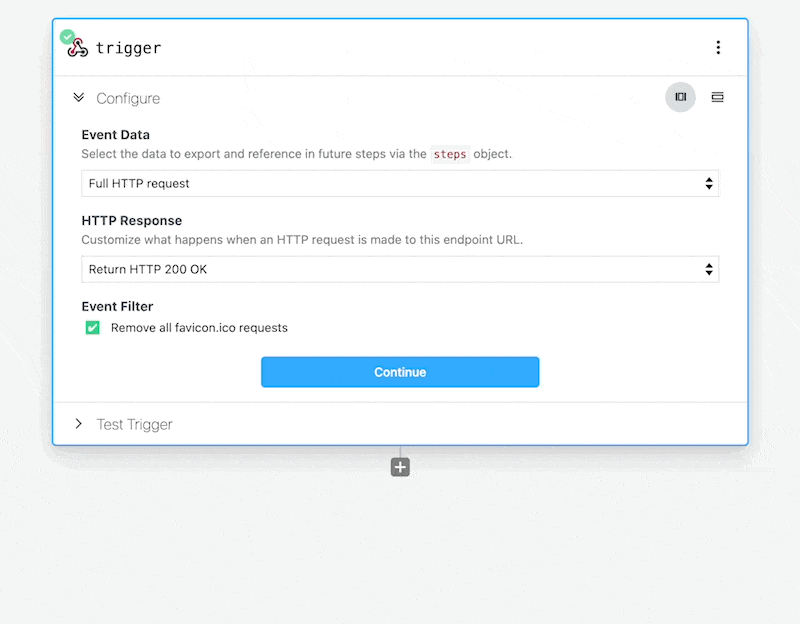
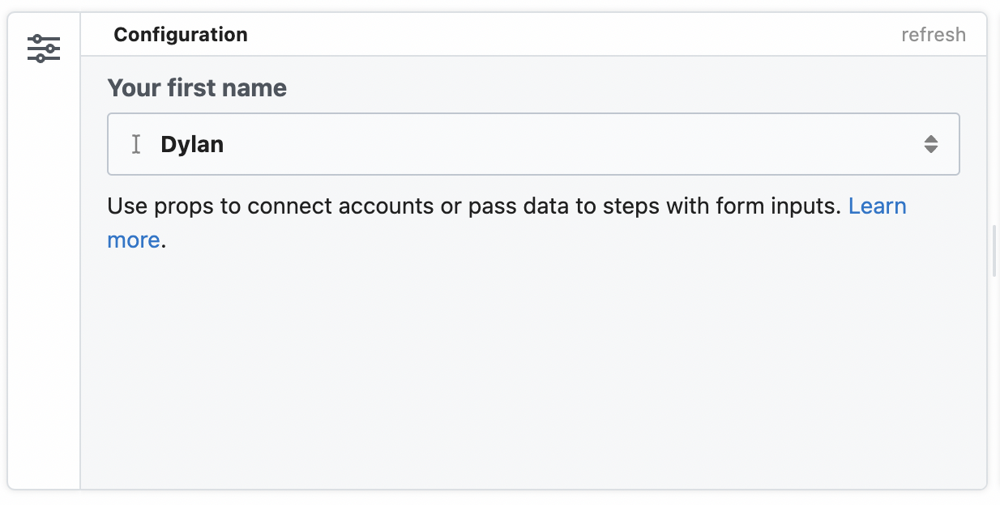
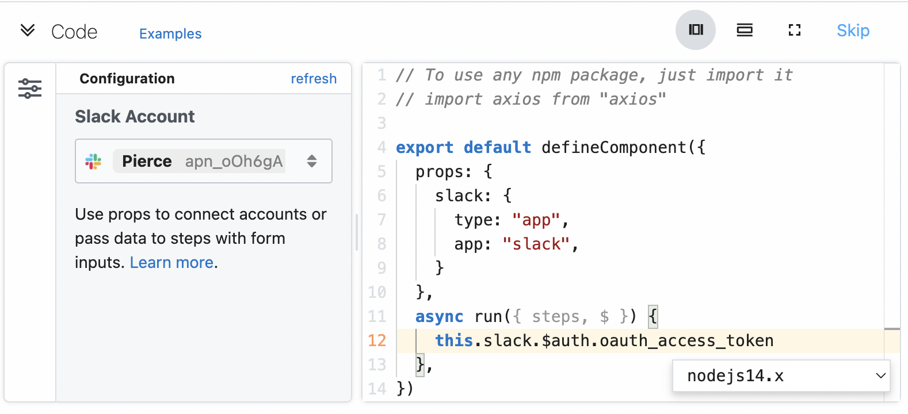
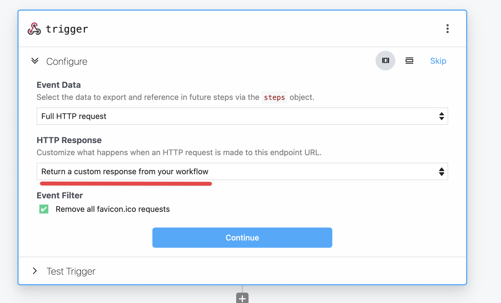

import Callout from '@/components/Callout'

# Migrate from v1

<Callout type="info">
Never used Pipedream v1? You can skip this migration guide and read on about [Steps](/workflows/steps/).
</Callout>

We are excited to announce that we have launched a new version (v2) of Pipedream to all new and existing users!

We have re-imagined the UX from the ground up, made the product much easier to use and have improved performance. In addition, we are introducing powerful new features including:

- **Edit & test** your workflows in separate editing mode without impacting live workflows
- **Support for multiple languages** including [Node.js](/code/nodejs), [Python](/code/python), [Bash](/code/bash) and [Go](/code/go)
- **Granular testing** including the ability to test individual steps and more
- **Multiple triggers** are now supported per workflow
- **Improved** forms for easier configuration and streamlined building

_Get Started_

- Read our [quickstart](/quickstart/), [docs](/), and/or [FAQ](#faqs)
- Have questions? Ask here or on [Discourse](https://pipedream.com/community)
- As a reminder, all integration components are source-available and [hosted on GitHub](https://github.com/PipedreamHQ/pipedream). You can [contribute your own components](/apps/contributing/) or improve existing ones.

Watch a demo:

<video controls poster="./images/demo-poster.png" width="100%">
  <source src="https://res.cloudinary.com/pipedreamin/video/upload/v1644985143/homepage/pipedream-demo_qyvlni.mp4" type="video/mp4" />
Your browser does not support the video tag.
</video>

And this is just the beginning — we have an exciting roadmap planned for 2022 including workflow serialization and GitHub integration.

## New Builder Overview

Fundamentally, the new version of the workflow builder gives you the same abilities to build, test and deploy your workflows. However, you'll notice some differences in how to build workflows.

### Building vs Inspecting

In v1, building your workflow and inspecting past events were visible in the same view. The new v2 builder has improved this by separating the workflow **Builder** from the workflow events **Inspector**.

Switch between these contexts using the menu in the top right of the workflow builder.



When you first open a deployed workflow, you're presented with the **Inspector** version of the workflow. In this view you can see logs of past events, and select them to see the results of each step in the workflow.



To edit the workflow, click the **Edit** button in the top right hand corner. This will close the inspector and allow you to edit your workflow without the distraction of logs from the production flow.



### Testing Changes

In the v1 workflow builder, you had to deploy the whole workflow to test changes to any step. To make changes to a deployed workflow, you had to made edits on the live version.

We've improved this flow. Now you can test your changes with a new **Test** button without effecting the live version of the workflow.

In addition to testing single steps, you can now selectively test portions of your workflow (e.g. all steps above or below the selected step):



#### Testing individual events

Not only can you test portions of your workflow in isolation, but you can also select a specific event to run against your workflow.

In the **Test Trigger** portion of your trigger, you can select a past event seen by the workflow and build your steps against it - without having to re-trigger it manually:



### Deploying Changes

After you're happy with your changes, **deploy** them to your production workflow. Just click the **Deploy** button in the top right hand corner of the screen.

After deploying your changes, your workflow is now live, and any changes you made will run against incoming events.

## Node.js Code Step Changes

There are a few changes to the Node.js code steps that you should know about. Some functions have been renamed for more clarity, and we've aligned the Node.js code steps closer to the [Component API](/components/).

### Code Scaffolding Format

In v1, the Node.js steps would automatically scaffold new Node.js steps in this format:

```javascript
async (event, steps) {
  // your code could be entered in here
}
```

In v2, the new scaffolding is wrapped with a new `defineComponent` function:

```javascript
defineComponent({
  async run({ steps, $ }) {
    // your code can be entered here
  },
});
```

1. The `event` from the trigger step is still available, but exposed in `steps.trigger.event` instead.
2. The `$` variable has been passed into the `run` function where your code is executed.

You can think of the `$` as the entry point to built in Pipedream functions. In v1, this special functions included `$end`, `$respond`, etc. In v2, these have been remapped to `$.flow.exit` and `$.respond` respectively.

These changes unify workflow development to the [Component API](/components/api) used by pre-built actions and also allows the [defining of props](#params-vs-props) from within your code steps.

### Using 3rd party packages

In v1, you had to define your imports of 3rd party packages within the scaffolded function:

```javascript
async (event, steps) {
  const axios = require('axios');
  // your code could be entered in here
}
```

Now, in v2 workflows you can `import` your packages in the top of the step, just like a normal Node.js module:

```javascript
import axios from "axios";

defineComponent({
  async run({ steps, $ }) {
    // your code can be entered here
  },
});
```

Allowing all of the scaffolding to be edited opens up the ability to [pass props](/code/nodejs/#passing-props-to-code-steps) into your Node.js code steps, which we'll cover later.

### Step Exports

In v1, you could assign arbitrary properties to `this` within a Node.js step and the properties would be available as step exports:

```javascript
// this step's name is get_customer_data
async (event, steps) {
  this.name = 'Dylan';
  // downstream steps could use steps.get_customer_data.name to retrieve 'Dylan'
}
```

In v2 you use $.export to export data, instead::

```javascript
// this step's name is get_customer_data
defineComponent({
  async run({ steps, $ }) {
    $.export("name", "Dylan");
    // downstream steps can use steps.get_customer_data.name to retrieve 'Dylan'
  },
});
```

<Callout type="info">
Using `return` to export data is the same from v1 to v2. You can still `return` data, and it will be available to other steps with `steps.[stepName].$return_value.
</Callout>

### Exiting a workflow early

In v1, the `$end` function can be called to exit a flow early:

```javascript
async (event, steps) {
  $end('Exiting the whole workflow early');
  console.log('I will never run');
}
```

In v2, this same function is available, but under `$.flow.exit`:

```javascript
defineComponent({
  async run({ steps, $ }) {
    return $.flow.exit("Exiting the workflow early");
    console.log("I will never run");
  },
});
```

### Params vs Props

In the v1 builder, you could pass input to steps using `params`. In the v2 builder, you pass input using [props](/components/api/#component-api).

You can still enter free text and select data from other steps in pre-built actions. Also can add your own custom props that accept input like strings, numbers and more just like in v1.

#### Defining params

In the v1 workflow builder, params could be structured or unstructured. The [params schema builder](https://pipedream.com/docs/v1/workflows/steps/params/#configuring-custom-params) allowed you to add your own custom params to steps.

In v2, you can add your own custom props without leaving the code editor.

```javascript
export default defineComponent({
  props: {
    firstName: {
      type: "string",
      label: "Your first name",
    },
  },
  async run({ steps, $ }) {
    console.log(this.firstName);
  },
});
```

In the example, you added a firstName string prop. The value assigned to this prop in the workflow builder.

Additionally, Pipedream renders a visual component in the step **Configuration** to accept this input:



### Connecting apps

In the v2 builder, you can connect apps with your code using [props](/components/api/#props).

Above the `run` function, define an app prop that your Node.js step integrates with:

```javascript
import { axios } from "@pipedream/platform";

export default defineComponent({
  props: {
    slack: {
      type: "app",
      app: "slack",
    },
  },
  async run({ steps, $ }) {
    return await axios($, {
      url: `https://slack.com/api/users.profile.get`,
      headers: {
        Authorization: `Bearer ${this.slack.$auth.oauth_access_token}`,
      },
    });
  },
});
```

After testing the step, you'll see the Slack app will appear in the **Configuration** section on the left hand side. In this section you can choose which Slack account you'd like to use in the step.



### HTTP Response

You can still return an HTTP response from an HTTP-triggered workflow.

Use [`$.respond`](/workflows/steps/triggers/#http) to send a JSON or string response from the HTTP call that triggered the workflow.

```javascript
export default defineComponent({
  async run({ steps, $ }) {
    $.respond({
      status: 200,
      headers: {},
      body: {
        message: "hello world!",
      },
    });
  },
});
```

Please note, you'll also need to configure the HTTP trigger step to also allow custom responses. Use the dropdown in the **HTTP Response** section of the HTTP trigger to select the **Return a custom response from your workflow** option:



## Known Gaps & Limitations

However, some features from the original builder are not currently available in v2. The Pipedream team is working to quickly address these items, but if you have feedback that isn't listed here, please [reach out](https://pipedream.com/support).

### Sharing workflows

At this time, sharing is not yet implemented in v2 of the workflow builder. As workaround, create your workflows in a organization which make workflows available to your team members.

If you need assistance transferring workflows across accounts, [please contact us](https://pipedream.com/support).

### `$checkpoint`

The `$checkpoint` functionality to save data between workflow runs is not supported in v2, and has been replaced by [Data Stores](/code/nodejs/using-data-stores/).

### Public workflows

At this time, all v2 workflows are private. Unfortunately at this time there is no workaround. We'll announce when a workaround for this limitation is available.

If you're working with Pipedream support to troubleshoot your workflow, you can share it with the support team under your workflow's **Settings**.

### Rolling back a specific version

In v2, you can test and save your progress on a workflow _without_ deploying it.

However, after deploying it's not possible to rollback to a prior version of a deployed workflow.

You can still edit a deployed workflow, just like in v1 but automatic version rollbacks are not currently possible.

### Replaying production events

In the v2 builder, you can still view individual events that trigger your v2 workflows in the **Inspector** events log. You can delete specific events or all of them in one click as well.

To replay past events against your deploy v2 workflows, open the event's menu and click **Replay Event**. This will rerun your workflow with this same event.

## FAQs

### What are the benefits of the new (v2) workflow builder?

- **Edit & test** your workflows in separate editing mode without impacting live workflows
- **Support for multiple languages** including Node, Python, Golang & bash
- **Granular testing** including the ability to test individual steps and more
- **Multiple triggers** are now supported per workflow
- **Improved** forms for easier configuration and streamlined building

### What are the limitations of the new (v2) workflow builder?

- `$checkpoint` has been removed from v2 workflows, but [Data Stores](/code/nodejs/using-data-stores/) provides a similar API.
- Sharing workflows is not supported
- Making workflows public is not supported

### Are v2 workflows backwards compatible?

No, v2 workflows are not currently compatible with the v1 builder.

However, pre-built component actions are still compatible across both versions. If you do encounter a gap from v1 actions in the v2 builder, [reach out to us](https://pipedream.com/support).

### Is the Component API changing as well? Will I need to rewrite Components?

No. Any components in the public registry or any private components you have published in your account are compatible with v2.

The v2 workflow builder utilizes the same Component API allowing you to create components from within your workflows, which was not possible in v1.

### Will I still be able to open and edit v1 workflows?

Yes, absolutely you will still be able to view and edit v1 workflows. There is no need to immediately change your workflows from v1 to v2.

### How do I migrate v1 workflows to v2 workflows?

At this time we do not have an automated process to change v1 to v2. To create a v2 equivalent workflow, you can recompose your v1 workflow in the v2 builder.

However, if it uses custom Node.js code steps, be sure to [follow the changes we describe in the guide above](/migrate-from-v1/#node-js-code-step-changes).

### When will the new (v2) workflow builder be the default builder for all customers?

By default, existing users will still default to the v1 builder. You can create new v2 workflows from the dropdown menu next to the New workflow button.

if you'd like to default to the v2 builder when creating new workflows, you can change the **Builder Version** in [your account settings](https://pipedream.com/settings/account).

### When will I no longer be able to create v1 workflows?

There is currently no deprecation date for v1 workflows. We will continue to support of v1 workflows until we have feature parity with v2.

When this date becomes clear we will provide assistance to automatically and assist migrate v1 to v2 workflows for you.
