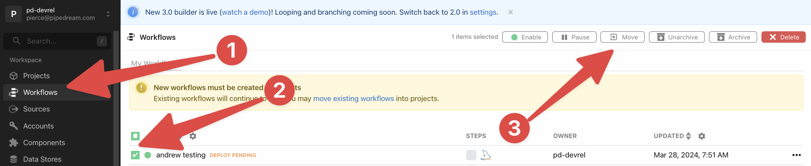

import Callout from "@/components/Callout";

# Managing Projects

### Creating projects

To create a new project, first [open the Projects section in the dashboard](https://pipedream.com/projects).

Then click **Create project** to start a new project.

Enter in your desired name for the project in the prompt, then click **Create**.

That's it, you now have a dedicated new project created within your workspace. Now you can create workflows within this project, or move workflows into it or create folders for further organization.

### Creating folders and workflows in projects

Within a given project, you can create folders for your workflows.

Open your project, and then click the **New** button for a dropdown to create a workflow in your current project.

<Callout type="info">
Helpful hotkeys to speed up your development

- `C then F` creates a new folder.
- `C then W` creates a new workflow.

</Callout>

Folders can also contain sub-folders, which allows you to create a filing system to organize your workflows.

### Moving workflows into folders

To move workflows into folders, simply drag and drop the workflow into the folder.

You can move workflows or folders up a level by dragging and dropping the workflow to the folder icon at the top of the list.

### Importing workflows into projects

<Callout type="info">
  This only applies to Pipedream accounts that created workflows before the
  projects feature was released.
</Callout>

To import a workflow from the general **Workflows** area of your dashboard into a project:

1. Open the Workflows area in the dashboard
2. Select one or more workflows you'd like to import into a project
3. Click *Move* in the top right and select a project to move them to

### Moving workflows between projects

To move a workflow from one project to another project, first check the workflow and then click **Move** to open a dropdown of projects. Select the project to move this workflow to, and click **Move** once more to complete the move.

<Callout type="warning">
Github Sync limitation

At this time it's not possible to move workflows out of GitHub Synchronized Projects.

</Callout>

## Project variables and secrets

Environment variables defined at the global workspace level are accessible to all workspace members and workflows within the workspace. To restrict access to sensitive variables or secrets, define them at the project-level and [configure access controls for the project](/projects/#managing-access).

[See here](/environment-variables) for info on creating, managing, and using environment variables and secrets.

<Callout type="info">
  **Project variables override workspace variables**. When the same variable is
  defined at both the workspace and project levels (for example,
  `process.env.BASE_DOMAIN`), the **project** variable takes precedence.
</Callout>

## Frequently Asked Questions

### Can sources and connected accounts be organized into projects as well?

At this time no, but that is on our roadmap. Projects will eventually contain all the resources needed for a complete system of workflows to work together.

### Can projects be synchronized to a Github repository?

Yes, [please read here](/projects/git/) for more information on the Github synchronization feature for projects.

### Can I configure which members in my workspace have access to individual projects?

Yes! Learn about managing access [here](/projects/#managing-access).
