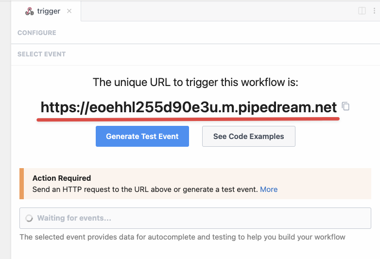
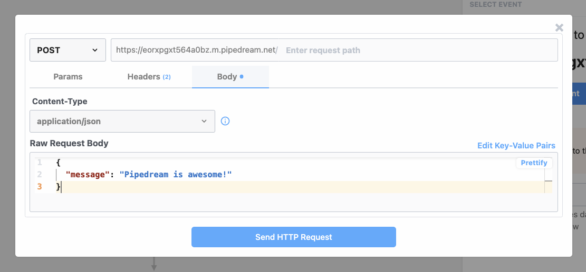
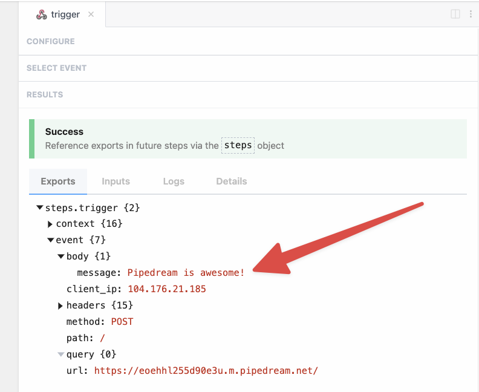
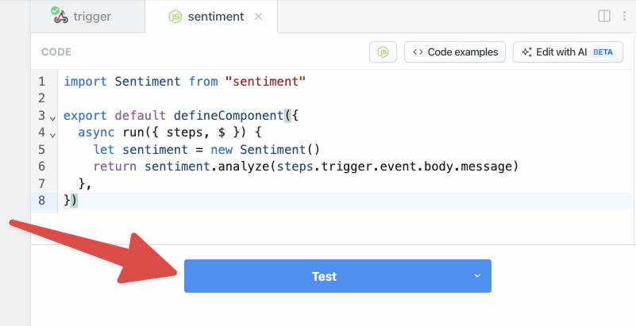
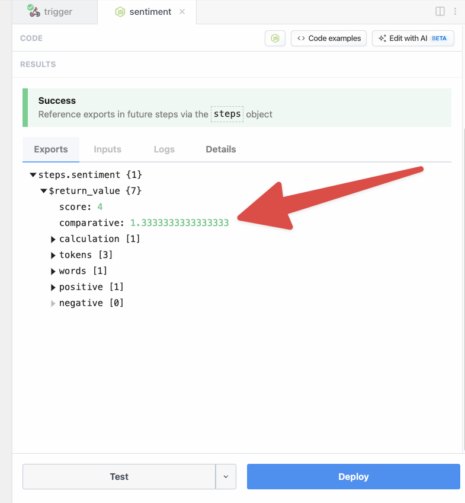
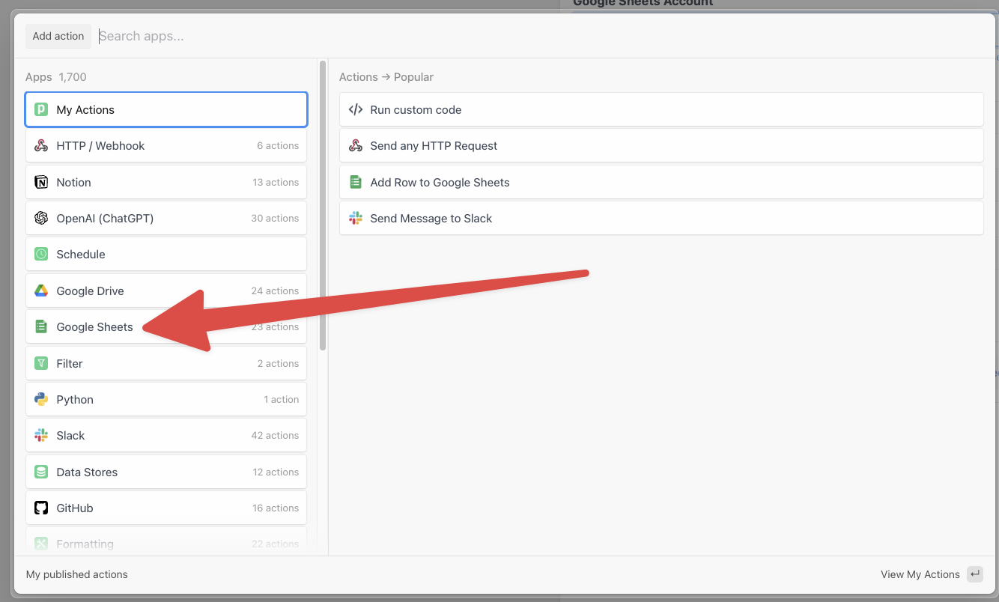

import Callout from '@/components/Callout'
import { Steps } from 'nextra/components'

# Quickstart - Workflow Development

Sign up for a [free Pipedream account](https://pipedream.com/auth/signup) (no credit card required) and complete this quickstart guide to learn the basic patterns for workflow development:

<Steps>
### Create a project

Workflows must be created in **Projects**. Projects make it easy to organize your workflows and collaborate with your team. 

Go to [https://pipedream.com/projects](https://pipedream.com/projects) and click on **Create Project**.


Next, enter a project name and click **Create Project**. For this example, we'll name our project **Getting Started**. You may also click the icon to the right to generate a random project name.


<Callout type="info">
Configure GitHub Sync for projects to enable git-based version control and unlock the ability to develop in branches, commit to or pull changes from GitHub, view diffs, create PRs and more. To learn more, complete this quickstart guide to learn the basics of workflow development and then follow the [quickstart guide for GitHub Sync](./github-sync/).
</Callout>

### Create a workflow

After the project is created, use the **New** button to create a new workflow.


Name the workflow and click **Create Workflow** to use the default settings. For this example, we'll name the workflow **Pipedream Quickstart**.


### Add an HTTP / Webhook trigger

Next, Pipedream will launch the workflow builder and prompt you to add a trigger. 


Clicking the trigger opens a new menu to select the trigger. For this example, select **New HTTP / Webhook Requests**.


Click **Save and continue** in the step editor on the right to accept the default settings.


Pipedream will generate a unique URL to trigger this workflow. Once your workflow is deployed, your workflow will run on every request to this URL.



### Generate a test event

Next, generate a test event to help you build the workflow. 

<Callout type="info">
The test event will be used to provide autocomplete suggestion as you build your workflow. The data will also be used when testing later steps. You may generate or select a different test event at any time when building a workflow.
</Callout>

For this example, let's use the following test event data:

```json
{
  "message": "Pipedream is awesome!"
}
```

Pipedream makes it easy to generate test events for your HTTP trigger. Click on **Generate Test Event** to open the HTTP request builder. Copy and paste the JSON data above into the **Raw Request Body** field and click **Send HTTP Request**.



Pipedream will automatically select and display the contents of the selected event. Validate that the `message` was received as part the event `body`. 



<Callout type="info">

You may also send live data to the unique URL for your workflow using your favorite HTTP tool or by running a `cURL` command, e.g.,

```bash
curl -d '{"message": "Pipedream is awesome!"}' \
  -H "Content-Type: application/json" \
  YOUR_ENDPOINT_URL
```
</Callout>

### Enrich trigger data using Node.js and npm

Before we send data to Google Sheets, let's use the npm [`sentiment`](https://www.npmjs.com/package/sentiment) package to generate a sentiment score for our message. To do that, click **Continue** or the **+** button.


That will open the **Add a step** menu. Select **Run custom code**.

 

Pipedream will add a Node.js code step to the workflow.


Rename the step to **sentiment**.

 

Next, add the following code to the code step:

```javascript
import Sentiment from "sentiment"

export default defineComponent({
  async run({ steps, $ }) {
    let sentiment = new Sentiment()
    return sentiment.analyze(steps.trigger.event.body.message)
  },
})
```

This code imports the npm package, passes the message we sent to our trigger to the `analyze()` function by referencing `steps.trigger.event.body.message` and then returns the result. 

<Callout type="info">
To use any npm package on Pipedream, just `import` it. There's no `npm install` or `package.json` required.
</Callout>

<Callout type="info">
Any data you `return` from a step is exported so it can be inspected and referenced it in future steps via the `steps` object. In this example, return values will be exported to `steps.sentiment.$return_value` because we renamed the step to **sentiment** .
</Callout>

Your code step should now look like the screenshot below. To run the step and test the code, click the **Test** button.



You should see the results of the sentiment analysis when the test is complete.




<Callout type="info">
When you **Test** a step, only the current step is executed. Use the caret to test different ranges of steps including the entire workflow.
</Callout>

### Save data to Google Sheets

Next, create a Google Sheet and add **Timestamp**, **Message** and **Sentiment Score** to the first row. These labels act as our column headers amd will help us configure the Google Sheets step of the workflow. 


Next, let's add a step to the workflow to send the data to Google Sheets. First, click **+** after the `sentiment` code step and select the **Google Sheets** app.



Then select the **Add Single Row** action.


Click to connect you Google Sheets account to Pipedream (or select it from the dropdown if you previously connected an account).


Pipedream will open Google's sign in flow in a new window. Sign in with the account you want to connect.


<Callout type="warning">
If prompted, you must check the box for Pipedream to **See, edit, create and delete all of your Google Drive files**. These permissions are required for configure and use the pre-built actions for Google Sheets.
</Callout>


Learn more about Pipedream's [privacy and security policy](/privacy-and-security/).

When you complete connecting your Google account, the window should close and you should return to Pipedream. Your connected account should automatically be selected. Next, select your spreadsheet from the dropdown menu:


Then select the sheet name (the default sheet name in Google Sheets is **Sheet1**):


Next, select if the spreadsheet has headers in the first row. When a header row exists, Pipedream will automatically retrieve the header labels to make it easy to enter data (if not, you can manually construct an array of values). Since the sheet for this example contains headers, select **Yes**.


Pipedream will retrieve the headers and generate a form to enter data in your sheet:


First, let's use the object explorer to pass the timestamp for the workflow event as the value for the first column. This data can be found in the context object on the trigger. 

When you click into the **Timestamp** field, Pipedream will display an object explorer to make it easy to find data. Scroll or search to find the `ts` key under `steps.trigger.context`.


Click **select path** to insert a reference to <code>steps.trigger.context.ts</code>:


Next, let's use autocomplete to enter a value for the **Message** column. First, add double braces `{{` — Pipedream will automatically add the closing braces `}}`. 

Then, type `steps.trigger.event.body.message` between the pairs of braces. Pipedream will provide autocomplete suggestions as you type. Press **Tab**  to use a suggestion and then click `.` to get suggestions for the next key. The final value in the **Message** field should be `steps.trigger.event.body.message`.


Finally, let's copy a reference from a previous step. Click on the `sentiment` step to open the results in the editor:


Next,  click the **Copy Path** link next to the score.

 

Click the Google Steps step or click the open tab in the editor. Then paste the value into the **Sentiment Score** field — Pipedream will automatically wrap the reference in double braces `{{ }}`.


Now that the configuration is complete, click **Test** to validate the configuration for this step. When the test is complete, you will see a success message and a summary of the action performed:


If you load your spreadsheet, you should see the data Pipedream inserted.


Next, return to your workflow and click **Deploy** to run your workflow on every trigger event.


When your workflow deploys, you will be redirected to the **Inspector**. Your workflow is now live. 


To validate your workflow is working as expected, send a new request to your workflow: You can edit and run the following `cURL` command:

```bash
curl -d '{ "message": "Pipedream is awesome!" }' \
  -H "Content-Type: application/json" \
  YOUR-TRIGGER-URL
```

The event will instantly appear in the event list. Select it to inspect the workflow execution.


Finally, you can return to Google Sheets to validate that the new data was automatically inserted.

 

</Steps>

## Next Steps

Congratulations! You completed the quickstart and should now understand the basic patterns for workflow development. Next, try creating your own workflows, explore the quickstart for [GitHub Sync](./github-sync/) and check out the rest of the [docs](/)!
