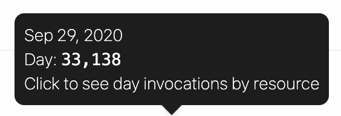
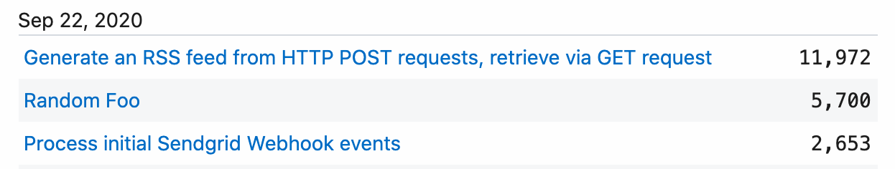

import Callout from '@/components/Callout'
import VideoPlayer from '@/components/VideoPlayer'

# User and Billing Settings

You can find important account details, text editor configuration, and more in your [User Settings](https://pipedream.com/user).

## Account

You'll find your Pipedream email and other basic account details in your [Account Settings](https://pipedream.com/user).

### Changing your email

Pipedream sends system emails to the email address tied to your Pipedream login. You can change the email address to which these emails are delivered by modifying the **Email** in your Account Settings. Once changed, an email will be delivered to the new address requesting you verify it.

Pipedream marketing emails may still be sent to the original email address you used when signing up for Pipedream. To change the email address tied to marketing emails, please [reach out to our team](https://pipedream.com/support).

### Two-Factor Authentication

<VideoPlayer src="https://www.youtube.com/embed/M2_JrDh6cVI?si=1Yee9XJ10PhzoMmJ" title="Two Factor Authenitcation" />

Two-factor authentication (2FA) adds an additional layer of security for your Pipedream account and is recommended for all users.

#### Configuring 2FA

1. Open your [Account Settings](https://pipedream.com/user)
2. Click **Configure** under **Two-Factor Authentication**
3. Scan the QR code in an authenticator app like [1Password](https://1password.com/) or Google Authenticator (available on [iOS](https://apps.apple.com/us/app/google-authenticator/id388497605) and [Android](https://play.google.com/store/apps/details?id=com.google.android.apps.authenticator2&hl=en_US&gl=US))
4. If you're unable to scan the QR code, you can view the setup key to configure 2FA manually in your authenticator app
5. Enter the one-time-password (OTP) from your authenticator app
6. **Save your recovery codes in a secure location**. You'll need these to access your Pipedream account in the case you lose access to your authenticator app.

<Callout type="error">
Save your recovery codes

If you lose access to your authenticator app and your recovery codes, you will permanently lose access to your Pipedream account. **Pipedream Support cannot recover these accounts.**
</Callout>

#### Signing in with 2FA

1. You'll be prompted to enter your OTP the next time you sign in to Pipedream
2. When prompted, you can enter the OTP from your authenticator app or a recovery code

<Callout type="info">
Using recovery codes

Each recovery code is a one-time-use code, so make sure to generate new recovery codes in your [Account Settings](https://pipedream.com/user) when you need to. All previously generated recovery codes expire when you generate new ones.
</Callout>

<Callout type="warning">
2FA is not currently supported with Single Sign On
Pipedream recommends enabling 2FA with your identity provider.
</Callout>

#### Requiring 2-Factor Authentication

Workspaces on the Business plan can [require all workspace members to configure 2FA](/workspaces/#requiring-two-factor-authentication) in order to log in to Pipedream.

If you are a member of any workspace where 2FA is required, you cannot disable 2FA, but you can still reconfigure it in your [account settings](https://pipedream.com/account/) if necessary.

<Callout type="info">
Admins and Owners control 2FA settings

Only workspace owner and admin members can enable or disable 2FA for an entire workspace.
</Callout>

### Pipedream API Key

Pipedream provides a [REST API](/api/) for interacting with Pipedream programmatically. You'll find your API key here, which you use to [authorize requests to the API](/rest-api/auth/).

You can revoke and regenerate your API key from here at any time.

### Delete Account

You can delete your Pipedream account at any time by visiting your Account Settings and pressing the **Delete your Account** button. Account deletion is immediately and irreversible.

## Application

You can change how the Pipedream app displays data, and basic text editor config, in your [Application Settings](https://pipedream.com/settings/app).

For example, you can:

- Change the clock format to 12-hour or 24-hour mode
- Enable Vim keyboard shortcuts in the Pipedream text editor, or enable word wrap
- Set the number of spaces that will be added in the editor when pressing `Tab`

## Environment Variables

Environment variables allow you to securely store secrets or other config values that you can access in Pipedream workflows via `process.env`. [Read more about environment variables here](/environment-variables/).

## Billing and Usage

You'll find information on your usage data (for specific [Pipedream limits](/limits/)) in your [Billing Settings](https://pipedream.com/settings/billing). You can also upgrade to [paid plans](https://pipedream.com/pricing) from this page.

### Subscription

You can upgrade to [paid plans](https://pipedream.com/pricing) from this section.

If you've already upgraded, you'll see an option to **Manage Subscription** here, which directs you to your personal Stripe portal. Here, you can change your payment method, review the details of previous invoices, and more.

### Usage

[Credits](/pricing/#credits) are Pipedream's billable unit, and users on the [free tier](/pricing/#free-tier) are limited on the number of daily free credits allocated. The **Usage** section displays a chart of the daily credits across a historical range of time to provide insight into your usage patterns.

Hover over a specific column in the chart to see the number of credits run for that specific day:

_Click_ on a specific column to see credits for that day, broken out by workflow / source:

Users on the free tier will see the last 30 days of usage in this chart. Users on [paid plans](https://pipedream.com/pricing) will see the cumulative usage tied to their current billing period.

### Compute Budget

Control the maximum number of compute credits permitted on your account with an _Credit Budget_.

This will restrict your account-wide usage to the specified number of [credits](/pricing/#credits) on a monthly or daily basis. The compute budget does not apply to credits incurred by [dedicated workers](/workflows/settings/#eliminate-cold-starts).

To enable this feature, _click_ on the toggle and define your maximum number of credits in the period.

<Callout type="info">
Due to how credits are accrued, there may be cases where your credit usage may _slightly_ go over the cap.

In an example scenario, with cap set at 20 credits and long running workflow that uses 10 credits per run; it's possible that two concurrent events trigger the workflow, and the cap will won't apply until after the concurrent events are processed.
</Callout>

### Limits

For users on the [Free tier](/pricing/#free-tier), this section displays your usage towards your [credits quota](/limits/#daily-credits-limit) for the current UTC day.
