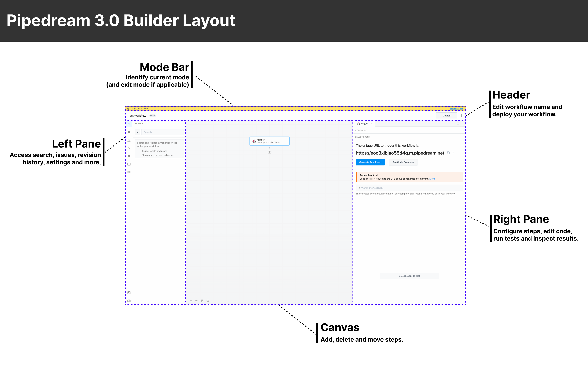

# Builder Overview

The Pipedream 3.0 builder is backwards compatible with workflows created in the 2.0 builder, introduces powerful new capabilities and adapts common IDE patterns:

- Split panes to edit steps side-by-side
- Quickly switch between recent steps via tabs
- Resize the editor (you're no longer limited by the width of a step)
- Workflow-wide find and replace (across code and action inputs)
- More performant code editor
- Drag-and-drop steps on the canvas
- Refined design, performance improvements and much more

## Builder Layout

| Section | Description  |
| :-- | :-- |
| Mode Bar | Identifies the current mode (edit, inspect, revision history). Exit modes using the link on the right.  |
| Header | Edit the workflow name and deploy your workflow. |
| Left Pane | Access search, workflow issues (warnings and errors), revision history, settings and more. |
| Canvas | Add, delete and move steps. |
| Right Pane | Configure steps, edit code, run tests and inspect results. |

If you encounter any issues you can switch back to the Legacy 2.0 builder in [application settings](https://pipedream.com/settings/application).
