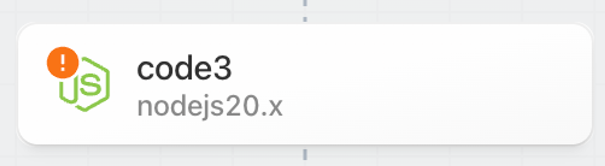
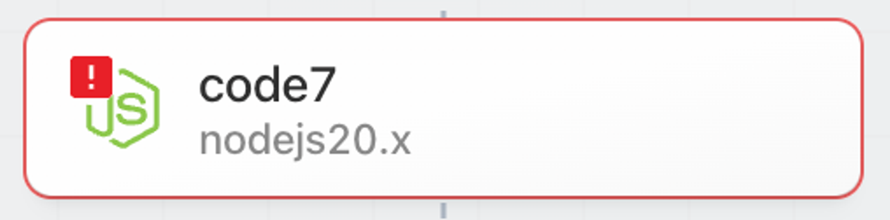
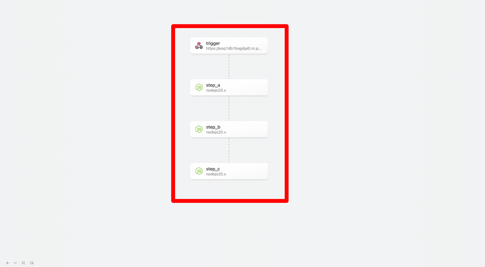
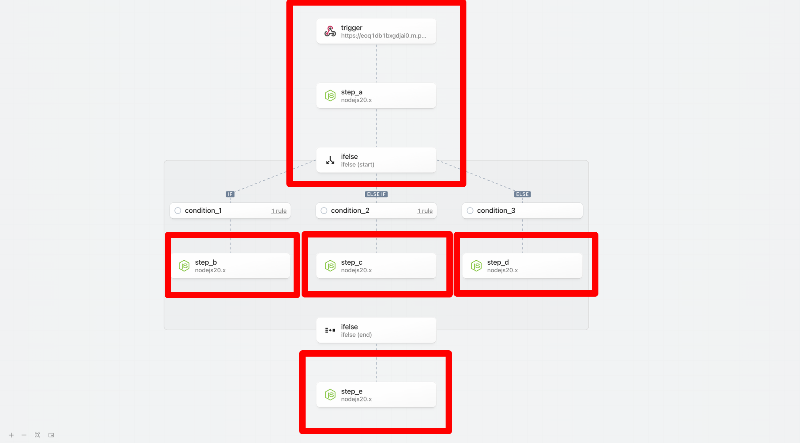

# Execution Path

### Context

The execution path represents the specific steps (and the order of steps) that run when a workflow is triggered.

- Simple linear workflows are executed from top to bottom — every step is in the execution path.
    
    
    
- With the introduction of non-linear workflows, steps may or may not be executed depending on the rules configured for control flow operators and the results exported from prior steps.
    
    
    
    Therefore, we introduced new patterns to signal the execution path and help you build, test and inspect workflows.
    

### Executed Path

Step borders, backgrounds and connectors now highlight the **executed path** — the steps that are executed on the execution path. If a non-execution path step is tested, it will not be reflected as being on the execution path.

### Building and Testing in an Unknown or Non-Execution Path

You may add and test steps in any path. However, Pipedream highlights that the results may not be reliable if the step is outside the executed path; the results may not match the outcome if the steps were in a known execution path and may lead to invalid or misleading results. 

### Signaling Steps are “Out of Date”

If prior steps in a workflow are modified or retested, Pipedream marks later steps in the execution path as _stale_ to signal that the results may be out of date. In the non-linear model, Pipedream only marks steps that are in the confirmed execution path as stale.

- If a change is made to a prior step, then the executed path is cleared.
    
    
    
- Steps in the known execution path are immediately marked as stale
- State within conditional blocks is not updated until the start phase is tested and execution path is identified.
    
    
    

### Test State vs Execution Path

Steps may be tested whether or not they are in the execution path. The test state for a step reflects whether a step was successfully tested or needs attention (the step may have errored, the results may be out of date, etc) and is denoted by the icon at the top left of each step.

- Last test was successful
    
    
    
- Results may be stale, step may be untested, etc
    
    
    
- **Step has an error or is not configured**
    
    
    

## Workflow Segments

### Context

Workflow segments are a linear series of steps that with no control flow operators. 

- A simple linear workflow is composed of a single workflow segment.
    
    
    
- When a control flow operator is introduced, then the workflow contains multiple segments. For example, when a Delay operator is added to the simple linear workflow above the workflow goes from 1 to 2 segements.
    
    
    
- The following example using If/Else contains 5 workflow segments. However, since only 1 branch within the If/Else control flow block is run on each workflow execution, the maximum number of segments that will be executed for each trigger event is 3.
    
    
    