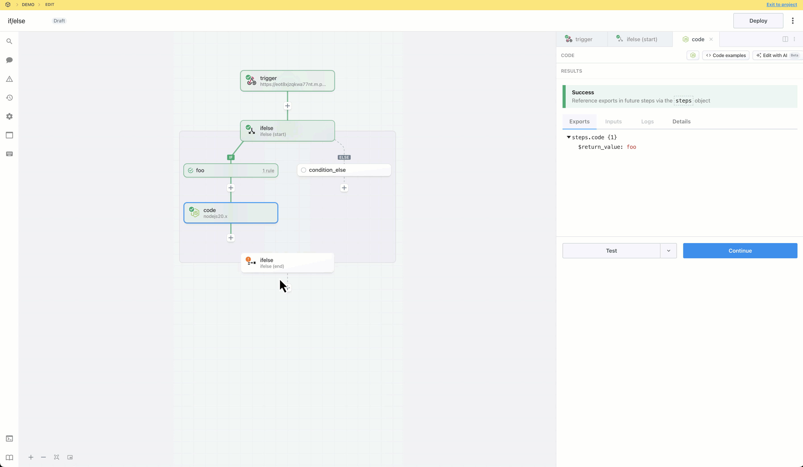

import Callout from '@/components/Callout'
import VideoPlayer from "@/components/VideoPlayer";

# If/Else

## Overview

**If/Else** is a single path branching operator. 

- You may create multiple execution branches
- Pipedream will execute the **first** branch that matches the configured rules
- The rules for multiple branches may match the configured rules, so the order in which rules are defined will affect the path of execution

## Demo

<VideoPlayer title="If/Else Demo" src="https://www.youtube.com/embed/HtXoXWbXO3g?si=afBad22GoGbDgYvV" />

## Getting Started

Add a trigger and generate a trigger event:

Click the + button to add a step to the canvas and select If/Else from the Control Flow section on the right. In the “start” phase, configure rules for each branch (optionally toggle the else branch) and then test the step.

<Callout type="info">
**IMPORTANT:** If you disable the **Else** condition and an event does not match any of the rules, the workflow will continue to the next step after the **If/Else** section. If you want to end workflow execution if no other conditions evaluate to `true`, enable the Else condition and add a **Terminate Workflow** action.
</Callout>

Add a step to the success branch and test it.

Test the end phase to export results from the If/Else control flow block.

Add a step and reference the exports from `ifelse` using the steps object.

Generate or select an alternate event to generate data to help you test other branches as you build. When you select a new event, the steps in the root workflow segments go stale. Steps in control flow blocks will only go stale if they are in the known path of execution; i.e., if you test a start phase, the steps in the success path will become stale.

Build, test and deploy the workflow.

Generate test events to trigger the deployed workflow and inspect the executions.

