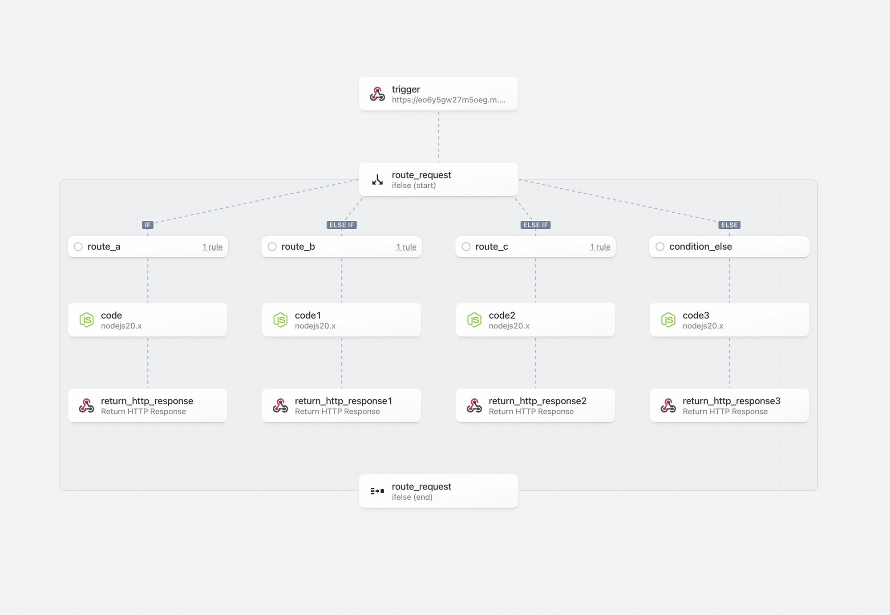
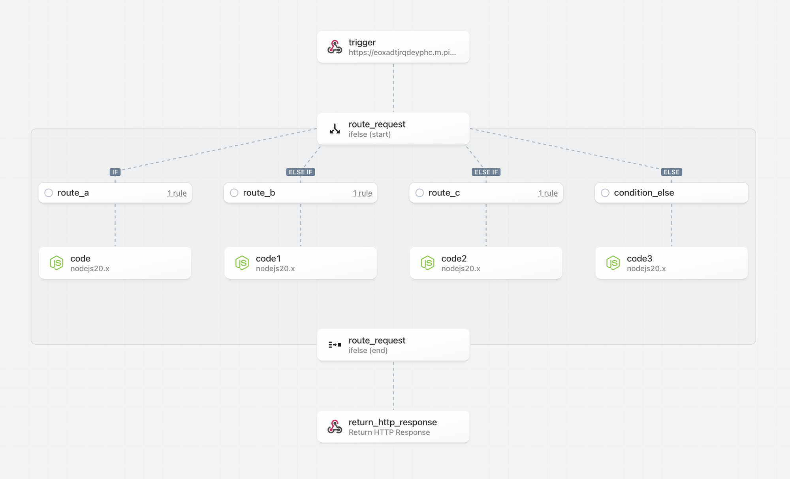
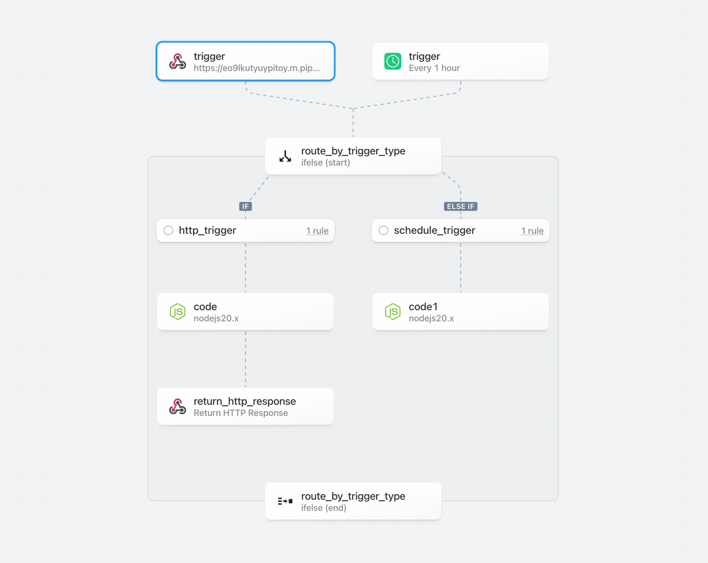

import Callout from '@/components/Callout'

# Returning an HTTP Response

## Using the HTTP Response Action

The HTTP Response action lets you return HTTP responses without the need to write code. You can customize the response status code, and optionally specify response headers and body.

This action uses `$.respond()` and will always [respond immediately](#returning-a-response-immediately) when called in your workflow. A [response error](#errors-with-http-responses) will still occur if your workflow throws an Error before this action runs.

## Using custom code with `$.respond()`

You can return HTTP responses in Node.js code with the `$.respond()` function.

`$.respond()` takes a single argument: an object with properties that specify the body, headers, and HTTP status code you'd like to respond with:

```javascript
defineComponent({
  async run({ steps, $ }) {
    await $.respond({
      status: 200,
      headers: { "my-custom-header": "value" },
      body: { message: "My custom response" }, // This can be any string, object, Buffer, or Readable stream
    });
  },
});
```

The value of the `body` property can be either a string, object, a [Buffer](https://nodejs.org/api/buffer.html#buffer_buffer) (binary data), or a [Readable stream](https://nodejs.org/api/stream.html#stream_readable_streams). Attempting to return any other data may yield an error.

In the case where you return a Readable stream:

- You must `await` the `$.respond` function (`await $.respond({ ... }`)
- The stream must close and be finished reading within your [workflow execution timeout](/limits/#time-per-execution).
- You cannot return a Readable and use the [`immediate: true`](#returning-a-response-immediately) property of `$.respond`.

## Timing of `$.respond()` execution

You may notice some response latency calling workflows that use `$.respond()` from your HTTP client. By default, `$.respond()` is called at the end of your workflow, after all other code is done executing, so it may take some time to issue the response back.

If you need to issue an HTTP response in the middle of a workflow, see the section on [returning a response immediately](#returning-a-response-immediately).

#### Returning a response immediately

You can issue an HTTP response within a workflow, and continue the rest of the workflow execution, by setting the `immediate` property to `true`:

```javascript
defineComponent({
  async run({ steps, $ }) {
    await $.respond({
      immediate: true,
      status: 200,
      headers: { "my-custom-header": "value" },
      body: { message: "My custom response" },
    });
  },
});
```

Passing `immediate: true` tells `$.respond()` to issue a response back to the client at this point in the workflow. After the HTTP response has been issued, the remaining code in your workflow runs.

This can be helpful, for example, when you're building a Slack bot. When you send a message to a bot, Slack requires a `200 OK` response be issued immediately, to confirm receipt:

```javascript
defineComponent({
  async run({ steps, $ }) {
    await $.respond({
      immediate: true,
      status: 200,
      body: "",
    });
  },
});
```

Once you issue the response, you'll probably want to process the message from the user and respond back with another message or data requested by the user.

[Here's an example workflow](https://pipedream.com/@dylburger/issue-http-response-immediately-continue-running-workflow-p_pWCWGJ) that shows how to use `immediate: true` and run code after the HTTP response is issued.

## Errors with HTTP Responses

If you use `$.respond()` in a workflow, **you must always make sure `$.respond()` is called in your code**. If you make an HTTP request to a workflow, and run code where `$.respond()` is _not_ called, your endpoint URL will issue a `400 Bad Request` error with the following body:

```
No $.respond called in workflow
```

This might happen if:

- You call `$.respond()` conditionally, where it does not run under certain conditions.
- Your workflow throws an Error before you run `$.respond()`.
- You return data in the `body` property that isn't a string, object, or Buffer.

If you can't handle the `400 Bad Request` error in the application calling your workflow, you can implement `try` / `finally` logic to ensure `$.respond()` always gets called with some default message. For example:

```javascript
defineComponent({
  async run({ steps, $ }) {
    try {
      // Your code here that might throw an exception or not run
      throw new Error("Whoops, something unexpected happened.");
    } finally {
      await $.respond({
        status: 200,
        body: {
          msg: "Default response",
        },
      });
    }
  },
});
```

## Returning HTTP Responses from Non-Linear Workflows

Workflows may return HTTP responses to trigger events when they are invoked by an HTTP trigger configured to return a custom response. Returning HTTP responses are also supported with non-linear workflows (within and after most control flow operators / blocks). HTTP responses are not supported after the following operations:

- Workflow Delay
- Workflow End (including a workflow ended by a Filter operation)

<Callout type="info">
Pipedream recommends including the response step as close to the trigger step as possible to minimize latency; the response will be immediately returned by the first HTTP response operator that is executed in a workflow.
</Callout>

<Callout type="info">
If your workflow contains multiple HTTP response steps, the first response will be returned.
</Callout>

### Return an HTTP response from within a control flow block

You may return an HTTP response from within a control flow block. In the following example, every branch includes a response action (you may also respond in a code step).



### Return an HTTP response after a control flow block

You may return an HTTP response after a control flow block. In the following example, the HTTP response is issued immediately after the control flow block and it may refer to the data exported by the If/Else block.



### Conditionally return an HTTP response

You may conditionally return an HTTP response. In the following example, the `http_trigger` branch returns a response while the `schedule_trigger` branch does not.

