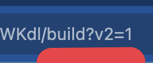

# Classic Workflow Editor (v2)

The newest version of the workflow builder streamlines your development by keeping editing steps to a dedicated pane with tabs for easy switching without scrolling.

However, if you're more comfortable with the classic linear workflow builder, you can switch to this older version by using a query parameter in the URL.

## Switching to the Classic Workflow Editor

To switch to the Classic editor, and with the workflow editor open, add the query parameter `?v2=1` to your workflow's URL. Then refresh the page.



The URL should be formatted like so:

```
https://pipedream.com/@your-org/projects/proj_123456/your-workflow-name-p_123456/build?v2=1
```

## Switching to the New Workflow Editor

To switch back to the new editor, you can remove the `?v2=1` query parameter, or replace it with `?v3=1`.

### FAQs

#### Are v2 workflows compatible with v3 workflows?

Yes, only the builder editor experience has been changed. The underlying workflow structure is exactly the same.

#### Are there any limitations to using the v2 editor?

Not yet, but soon the v3 editor will feature branching and looping, which will not be available in the v2 editor.

#### Are there any plans to sunset the v2 editor?

Not at this time, but the new editor is the new default for new workflows.
