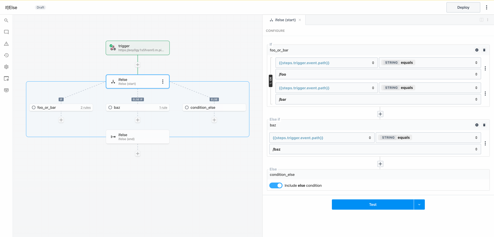

import Callout from '@/components/Callout'
import VideoPlayer from "@/components/VideoPlayer";
import { Steps } from 'nextra/components'

# If/Else

## Overview

**If/Else** is single path branching operator. You can create multiple execution branches, but Pipedream will execute the **first** branch that matches the configured rules. <b>The order in which rules are defined will affect the path of execution.</b>

If/Else operator is useful when you need to branch based on the value of <b>multiple input variables</b>. You must define both the input variable and condition to evaluate for every rule. If you only need to test for the value of a <b>single input variable</b> (e.g., if you are branching based on the path of an inbound request), the [Switch operator](./switch) may be a better choice.

## Capabilities

- Define rules to conditionally execute one of many branches
- Evaluate one or more expressions for each condition (use boolean operators to combine muliple rules)
- Use the **Else** condition as a fallback
- Merge and continue execution in the parent flow after the branching operation

<Callout type="info">
If you disable the **Else** branch and there are no matching cases, the workflow will continue execution in the parent workflow after the **end** phase of the If/Else block
</Callout>

<Callout type="info">
The If/Else operator is a control flow **Block** with **start** and **end** phases. [Learn more about Blocks](./#blocks).
</Callout>

## Demo

<VideoPlayer title="If/Else Demo" src="https://www.youtube.com/embed/HtXoXWbXO3g?si=afBad22GoGbDgYvV" />

## Getting Started

<Steps>

### Generate a test event

Add a trigger and generate an event to help you build and test your workflow:

### Add the If/Else control flow block

Click the + button to add a step to the canvas and select If/Else from the Control Flow section on the right. In the “start” phase, configure rules for each branch (optionally toggle the else branch) and then test the step.

<Callout type="info">
**IMPORTANT:** If you disable the **Else** condition and an event does not match any of the rules, the workflow will continue to the next step after the **If/Else** section. If you want to end workflow execution if no other conditions evaluate to `true`, enable the Else condition and add a **Terminate Workflow** action.
</Callout>

### Build and test along the execution path

Add a step to the success branch and test it

### Merge and continue the parent flow after the branching operation

Test the end phase to export results from the If/Else control flow block.

Add a step and reference the exports from `ifelse` using the steps object.

### Build and test alternate paths

Generate or select an alternate event to generate data to help you test other branches as you build. When you select a new event, the steps in the root workflow segments go stale. Steps in control flow blocks will only go stale if they are in the known path of execution; i.e., if you test a start phase, the steps in the success path will become stale.

Build, test and deploy the workflow.

### Test the deployed workflow

Generate test events to trigger the deployed workflow and inspect the executions.

</Steps>