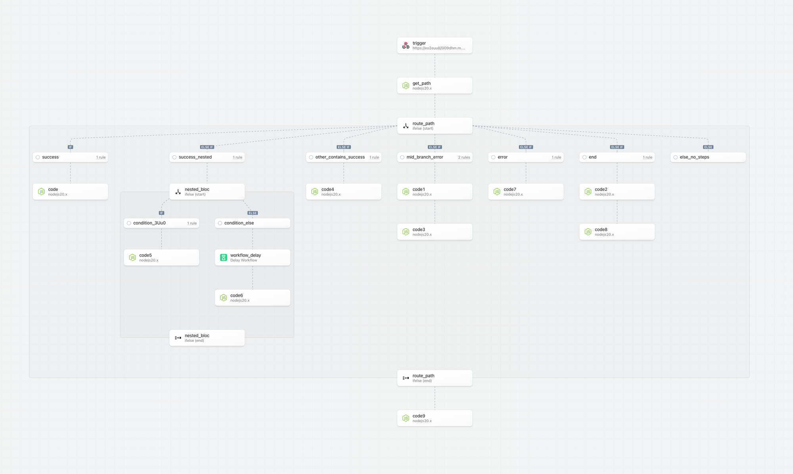
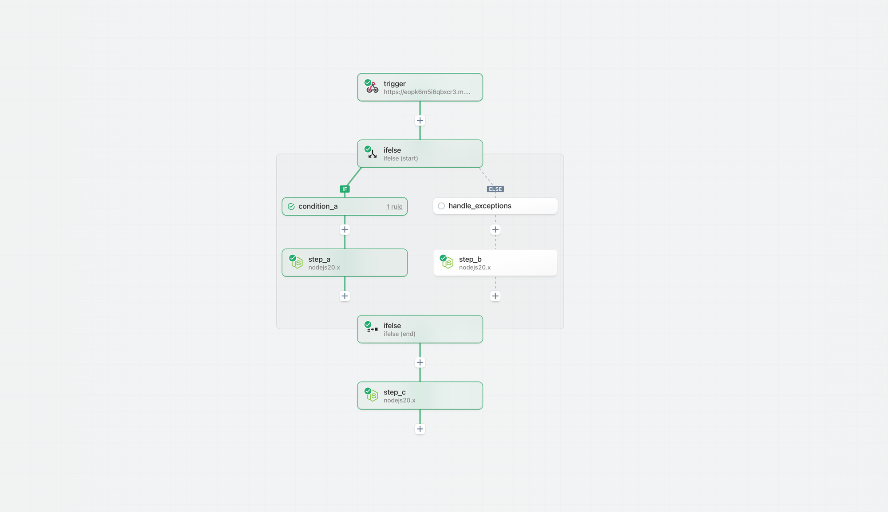
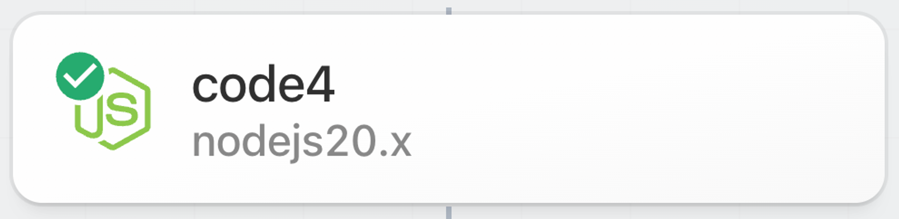

import VideoPlayer from "@/components/VideoPlayer";

# Overview

Pipedream is adding powerful control flow operators so you can build and run non-linear workflows to unlock use cases that require advanced orchestration.

<VideoPlayer title="If/Else Demo" src="https://www.youtube.com/embed/HtXoXWbXO3g?si=afBad22GoGbDgYvV" />

## Operators

| Operator | Description |
| :--- | :--- |
| [If/Else (beta)](./control-flow/ifelse) | Supports single-path, logical branching orchestration. |
| [Delay](./control-flow/delay) | Add a delay from 1 millisecond to 1 year before the next step of your workflow proceeds. |
| [Filter](./control-flow/filter) | Define rules to stop or continue workflow execution. |
| [End Workflow](./control-flow/end-workflow) | Terminate the workflow prior to the last step. |

More operators (including parallel and looping) are coming soon.

## Key Capabilities

- Orchestrate execution of linear and non-linear workflows
- Normalize results and continue after a non-linear operation
- Nest control flow operators for advanced use cases
- Return HTTP responses during or after most non-linear operations
- Execute long running workflows (workflow timeout resets at each control flow boundary)

## Execution Path

### Context

The execution path represents the specific steps (and the order of steps) that run when a workflow is triggered.

- Simple linear workflows are executed from top to bottom — every step is in the execution path.
    
    
    
- With the introduction of non-linear workflows, steps may or may not be executed depending on the rules configured for control flow operators and the results exported from prior steps.
    
    
    
    Therefore, we introduced new patterns to signal the execution path and help you build, test and inspect workflows.
    

### Executed Path

Step borders, backgrounds and connectors now highlight the **executed path** — the steps that are executed on the execution path. If a non-execution path step is tested, it will not be reflected as being on the execution path.

### Building and Testing in an Unknown or Non-Execution Path

You may add and test steps in any path. However, Pipedream highlights that the results may not be reliable if the step is outside the executed path; the results may not match the outcome if the steps were in a known execution path and may lead to invalid or misleading results. 

### Signaling Steps are “Out of Date”

If prior steps in a workflow are modified or retested, Pipedream marks later steps in the execution path as _stale_ to signal that the results may be out of date. In the non-linear model, Pipedream only marks steps that are in the confirmed execution path as stale.

- If a change is made to a prior step, then the executed path is cleared.
    
    
    
- Steps in the known execution path are immediately marked as stale
- State within conditional blocks is not updated until the start phase is tested and execution path is identified.
    
    
    

### Test State vs Execution Path

Steps may be tested whether or not they are in the execution path. The test state for a step reflects whether a step was successfully tested or needs attention (the step may have errored, the results may be out of date, etc) and is denoted by the icon at the top left of each step.

- Last test was successful
    
    
    
- Results may be stale, step may be untested, etc
    
    
    
- **Step has an error or is not configured**
    
    
    

## Workflow Segments

### Context

Workflow segments are a linear series of steps that with no control flow operators. 

- A simple linear workflow is composed of a single workflow segment.
    
    
    
- When a control flow operator is introduced, then the workflow contains multiple segments. For example, when a Delay operator is added to the simple linear workflow above the workflow goes from 1 to 2 segements.
    
    
    
- The following example using If/Else contains 5 workflow segments. However, since only 1 branch within the If/Else control flow block is run on each workflow execution, the maximum number of segments that will be executed for each trigger event is 3.
    
    
    

### Billing

Pipedream compiles each workflow segment into an executable function to optimize performance and reduce credit usage; credit usage is calculated independently for each workflow segment independent of the number of steps (rather than per step like many other platforms). 

- For example, the two workflow segments below both use a single credit:
    - **Trigger + 1 step workflow segment (1 credit)**
        
        
        
    - **Trigger + 5 step workflow segment (1 credit)**
        
        
        
- The If/Else example above that contains 5 workflow segments, but only 3 workflow segments in any given execution path will only incur 3 credits of usage per execution.
    
    
    

### Timeout and Memory

For the preview, all workflow segments inherit the global timeout and memory settings. In the future, Pipedream will support customization of timeout and memory settings for each segment. For example, if you need expanded memory for select steps, you will be able to restrict higher memory execution to that segment instead of having to run the entire workflow with the higher memory settings. This can help you reduce credit usage.

### Long Running Workflows

Users may create long running workflows that greatly exceed the upper bound timeout of 12 minutes for current workflow (each workflow segment has an upper bound of 12 minutes).

### `/tmp` directory access

`tmp` directory access is scoped per workflow segment (since each segment is executed as an independent function). If you need to persist files across multiple segments (or workflow executions) use File Stores.

### Warm Workers

Warm workers are globally configured per segment. For example, if you have a workflow with 3 segments and you configure your workflow to use 1 warm worker per segment, 3 warm workers will be used.

### Segment Relationships

Steps may only reference prior steps in the same workflow segment or it’s direct ancestors.

| Type | Description |
| --- | --- |
| Root | The root segment is the top level for a workflow — it may have children but no parents. If you do not include any control flow blocks in your workflow, your entire workflow definition is contained within the root segment. |
| Parent | A segment that has a child. |
| Child | A flow that has a parent. |

## Blocks

### Context

**Blocks** are compound steps that are composed of a **start** and an **end** phase. Blocks may contain one or more workflow segments between the phases.

- Most non-linear control flow operators will be structured as blocks (vs. standard steps)
- You may add steps or blocks to [workflow segments](https://www.notion.so/Pipedream-3-0-Control-Flow-Preview-feb105a8c7ba41bbbb87028d2eb1e47b?pvs=21) between start and end phases of a block
- The start and end phases are independently testable
    - The start phase evaluates the rules/configuration for a block; the results may influence the execution path
    - The end phase exports results from the control flow block that can be referenced in future workflow steps
    - For example, for the If/Else control flow operator, the start phase evaluates the branching rules while the end phase exports the results from the executed branch.

### Testing

When building a workflow with a control flow block, we recommend testing the start phase, followed by steps in the execution path followed by the end phase.

For a conditional operator like if/else, we then recommend generating events that trigger alternate conditions and testing those.

#### Passing data to steps in a control flow block

Steps may only reference prior steps in the same workflow segment or it’s direct ancestors. In the following example, `step_c` and `step_d` (within the if/else control flow block) can directly reference any exports from `trigger`, `step_a`, or `step_b` (in the parent/root workflow segment) via the steps object. `step_c` and `step_d` are siblings and cannot reference exports from each other.

#### Referencing data from steps in a previous block

Steps after the end phase may not directly reference steps within a control flow block (between the start and end phases). E.g., in the following workflow there are two branches:

In this example, `step_f` is executed after a control flow block. It can directly reference prior steps in the root workflow segment (`trigger`, `step_a` and `step_b` using the `steps` object).

However, `step_f` cannot reference directly reference data exported by `step_c` or `step_d`. The reason is that due to the non-linear execution, `step_c` and `step_d` are not guaranteed to execute for every event. **To reference data from a control flow block, reference the exports of the end phase.** Refer to the documentation to understand how data is exported for each control flow operator (e.g., for if/else, the exports of the last step in the branch are returned as the exports for the end phase; you can easily normalize the results across branches using a code step).

In this example, `step_f` can reference the exported data for an executed branch by referencing `steps.ifelse.$return_value`.  

### Nesting

Control flow blocks may be nested within other control flow blocks:

- If/Else blocks may be nested within other If/Else blocks
- In the future, Loops may be nested within If/Else blocks and vice versa.

There is currently no limit on the number of nested elements.

## Rule Builder

### Context

Pipedream is introducing a rule builder for comparative operations. The rule builder is currently only supported by the If/Else operator, but it will be extended to other operators including Switch and Filter.

### Simple conditions

Compare values using supported operators.

### Combine multiple conditions using AND / OR

Click “Add condition” using the menu on the right to add multiple conditions. Click on AND / OR to toggle the operator.

### Test for multiple conditions using Groups

Create and manage groups using the menu options to “Add group”, “Make condition into group”, “Nest group” and “Remove group”.

### Supported Operators

- Exists
- Doesn’t exist
- String
    - Equals
    - Doesn’t equal
    - Is blank
    - Is not blank
    - Starts with
    - Contains
    - Ends with
- Number
    - Equals
    - Does not equal
    - Is greater than
    - Is greater than or equal to
    - Is less than
    - Is less than or equal to
- Boolean (equals)
- Type checks
    - Is null
    - Is not null
    - Is string
    - Is not a string
    - Is a number
    - Is not a number
    - Is a boolean
    - Is not a boolean
- Value checks
    - Is true
    - Is false
