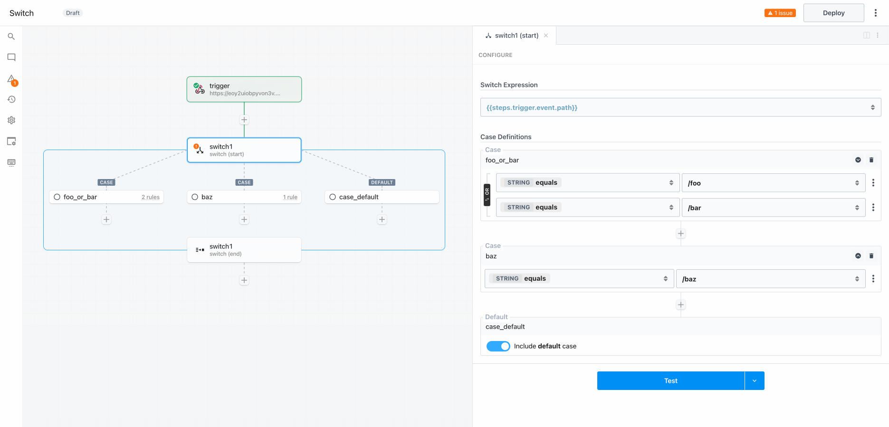
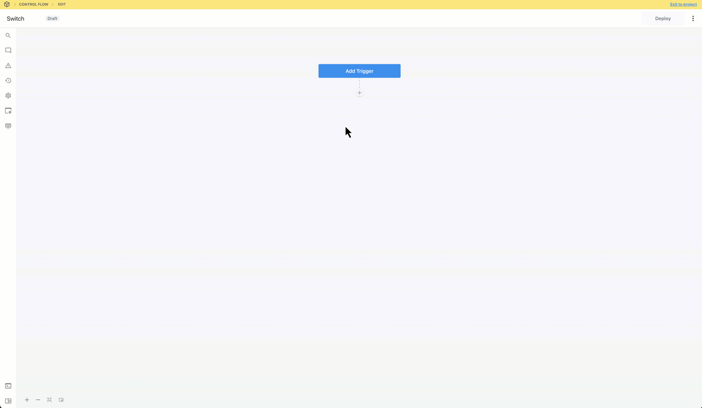
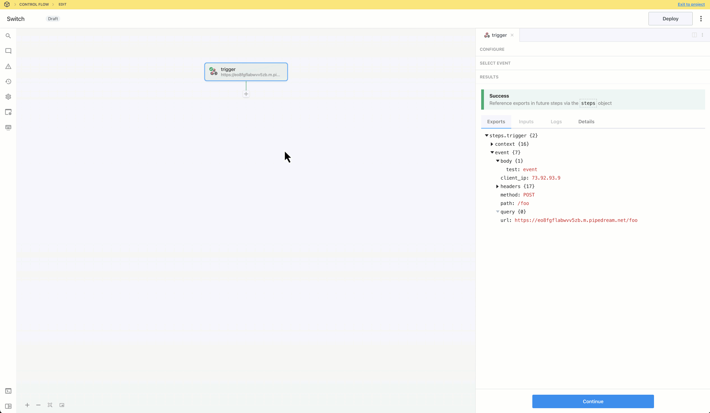
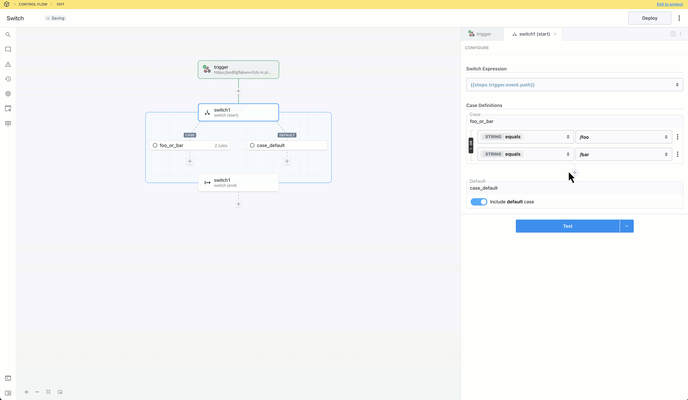
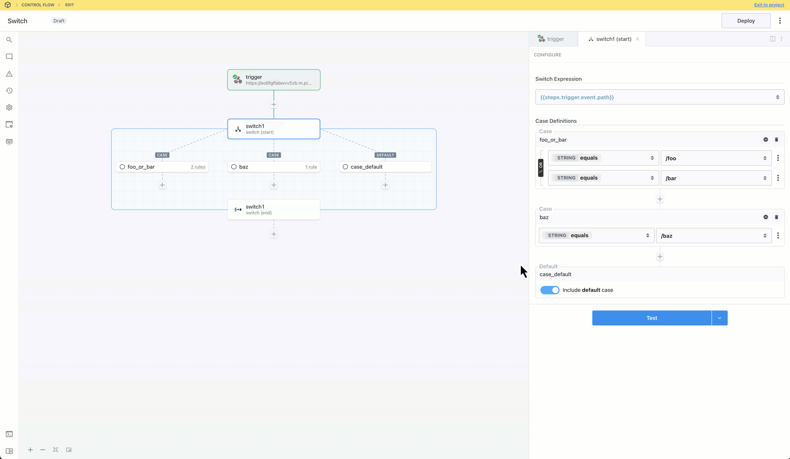
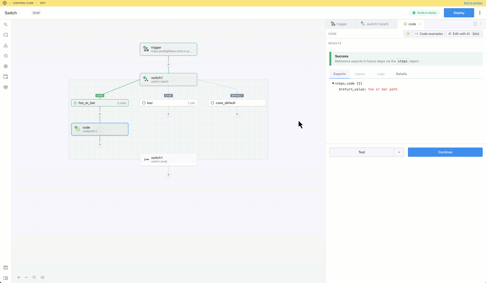

import Callout from '@/components/Callout'
import VideoPlayer from "@/components/VideoPlayer";
import { Steps } from 'nextra/components'

# Switch

## Overview

**Switch** is single path branching operator. You can create multiple execution branches, but Pipedream will execute the **first** branch that matches the configured rules. <b>The order in which rules are defined will affect the path of execution.</b>

Switch is useful when you need to make a branching decision based on the value of a <b>single input variable</b> (e.g., based on the path of an inbound request). You can define the input variable once and then branch based on the value(s). If you need to branch based on the values of <b>multiple input variables</b> use the [If/Else operator](./ifelse).

## Capabilities

- Define cases to conditionally execute one of many branches
- Define the expression to evaluate once and configure cases to compare values (use boolean operators to combine muliple rules for each case)
- Use the **Default** case as a fallback
- Merge and continue execution in the parent flow after the branching operation

<Callout type="info">
If you disable the **Default** branch and there are no matching cases, the workflow will continue execution in the parent workflow after the **end** phase of the Switch block
</Callout>

<Callout type="info">
The Switch operator is a control flow **Block** with **start** and **end** phases. [Learn more about Blocks](./#blocks).
</Callout>

## Getting Started

<Steps>

### Generate a test event

Add a trigger and generate an event to help you build and test your workflow:

### Add the Switch control flow block

Click the + button to add a step to the canvas and select Switch from the Control Flow section on the right. In the “start” phase, configure rules for a case.

<Callout type="info">
**IMPORTANT:** If you disable the **Default** condition and an event does not match any of the rules, the workflow will continue to the next step after the **Switch** section. If you want to end workflow execution if no other conditions evaluate to `true`, enable the Default condition and add a **Terminate Workflow** action.
</Callout>

### Optionally add additional cases

To add additional cases, click the **+** button.

### Test and build along the execution path

Test the **start** phase and add a step to the branch in the execution path,

### Optionally merge and continue the parent flow

Test the **end** phase to export the results of the last step in the execution path. This makes them available to reference in the parent flow.

### Scaffold alternate paths

You may add steps to alternate paths and test them. Pipedream will signal that the results may not be reliable if the branch is not in the execution path.

### Validate alternate paths

Generate or select alternate events to trigger and validate alternate paths.

### Deploy and test the live workflow

Deploy the workflow and trigger it to inspect the executions.

</Steps>