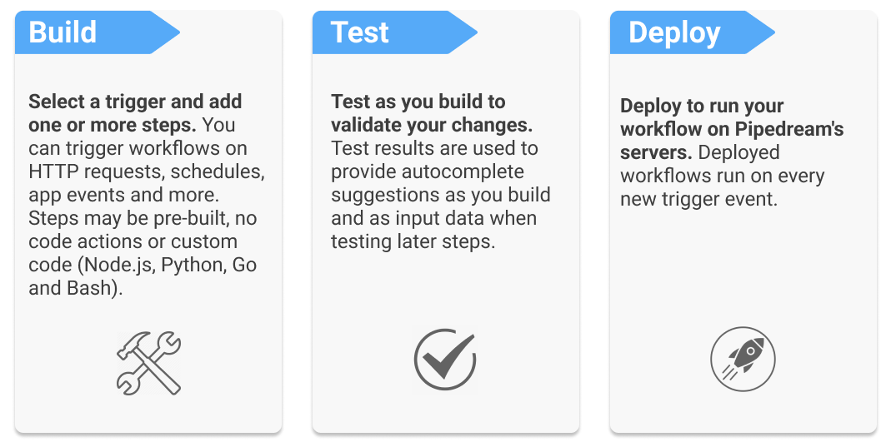

# Overview

<!--## Connect APIs, Remarkably Fast-->

Pipedream is the fastest way to automate any process that connects APIs. Build and run workflows with code-level control when you need it, and no code when you don't. 

<!-- The Pipedream platform includes:

- A serverless runtime
- Open source triggers and actions for integrated apps
- One-click OAuth and key-based authentication for hundreds of APIs (use tokens directly in code or with pre-built actions)
- A purpose-built, web-based IDE and much more! -->

## Getting Started

To get started, [sign up for a free account](https://pipedream.com/auth/signup) (no credit card required) and follow our [quickstart guide](/quickstart/).

<!--
### **Build** 
Select a trigger (HTTP requests, schedules, app events and more) and add one or more steps (write custom Node.js, Python, Go or Bash or pre-built, no code building blocks).

### **Test** 
Test your trigger and each step as you build. The results are used to provide autocomplete suggestions in later steps and the data is used when you test your workflow.

### **Deploy** 
Just click "Deploy" to run your workflow on Pipedream's servers on every new trigger event.
-->
<!--
1. **Select a trigger** and generate an event to help you build your workflow (trigger data is used for autocomplete and when testing your workflow). Workflows can be triggered on HTTP requests, schedules, app events and more.

2. **Add steps** to your workflow and test them. Step can be code (Node.js, Python, Go or Bash) or pre-built, no code building blocks.

3. **Deploy** to run your workflow on Pipedream's servers on every new trigger event.
-->

<!--
- Connect accounts for hundreds of OAuth and key-based APIs in seconds.
- Reference connected accounts in your code or use them with no-code building blocks.
- Build and run workflows triggered on HTTP requests, schedules, app events and more.
-->

<!--With Pipedream, you can stop writing boilerplate code, struggling with authentication and managing infrastructure, and start connecting APIs with code-level control when you need it — and no code when you don't. -->

<!--Pipedream is a low code integration platform for developers. We make it easy to connect APIs remarkably fast so you can stop writing boilerplate code, struggling with authentication and managing infrastructure, and start connecting APIs with code-level control when you need it — and no code when you don't.-->

<!--
Watch a 4-minute demo or review our [quickstart guide](/quickstart/):

<video controls poster="./images/demo-poster.png" width="100%">
  <source src="https://res.cloudinary.com/pipedreamin/video/upload/v1612307285/homepage/Using_Event_Sources_and_Workflows__Analyze_Twitter_Sentiment_in_Real-Time_and_Save_to_Google_Sheets_ehy2ho.mp4" type="video/mp4">
Your browser does not support the video tag.
</video>
-->

<!--
Pipedream offers a generous free tier (no credit card required) so you can test out the platform and use it for personal projects with no risk or commitment. As your needs grow, it's easy to upgrade to [paid plans](https://pipedream.com/pricing) to run without limits for individuals, teams and enterprises.
-->

<!--
## Getting Started

Sign up for a [free account (no credit card required)](https://pipedream.com/auth/signup) and create a worklow.

### 1. Build

Select a trigger and add steps to your workflows. Step can be code (Node.js, Python, Go and Bash currently supported) or no code building blocks.

<!--The trigger event is used to provide auto-complete suggestions as you build your workflow. The data is also used when you test your workflow.-->
<!--
### 2. Test

Test each step as you build your workflow. Pipedream uses the results to provide autocomplete suggestions and uses the data to when testing later steps.

### 3. Deploy

Deploy to run your workflow on Pipedream's servers 24 x 7 x 365

<!--HTTP requests, schedules, app events and more.-->

<!--Pipedream also makes it easy to test and validate your integrations, scaffold API requests for any app, maintain state between executions, manage execution rate and concurrency and more. -->

<!---->

<!--img src="https://res.cloudinary.com/pipedreamin/image/upload/v1612919959/homepage/workflow-demo_ks64up.png"-->

<!--
Trusted by developers from startups to Fortune 500 companies:

## How Pipedream Works

Pipedream provides a serverless platform to build and run workflows that connect APIs:

- Connect your OAuth and key-based API accounts in seconds
- Use connected accounts to auth APIs in code steps or in "no code" building blocks
- Compose steps into workflows and trigger on HTTP requests, schedules or app events

Pipedream also provides easy to use services to solve common serverless and integration challenges including state management, execution rate and concurrency controls, large file support (up to 5TB) and more! 

Watch a demo (4 mins):

-->
<!--
## Is Pipedream for Me?

We make it easy to connect APIs with code-level control when you need it — and no code when you don't. If you and your team want to stop writing boilerplate code, struggling with authentication and managing infrastructure for integrations, then Pipedream is for you. 

Developers with a working knowledge of Node.js or Javascript will get the most value from Pipedream (Python, TypeScript, and GitHub integration are coming soon).

<!--
Pipedream is trusted by 150k+ developers from startups to Fortune 500 companies:

-->
<!--
## Getting Started

Sign up for a [free account (no credit card required)](https://pipedream.com/auth/signup) and complete our [quickstart guide](/quickstart/) to learn the basic patterns for workflow development:

- Trigger workflows on HTTP requests, schedules and app events
- Return a custom response from your workflow on HTTP requests 
- Use connected accounts in actions and code steps
- Pass data between code steps and no code actions
- Use npm packages in Node.js code steps
- Scaffold an API request in Node.js
- End workflow execution early

<!--

-->

## Use Cases

Pipedream supports use cases from prototype to production and is trusted by 200k+ developers from startups to Fortune 500 companies:

The platform processes billions of events and is built and [priced](https://pipedream.com/pricing/) for use at scale. [Our team](https://pipedream.com/about) has built internet scale applications and managed data pipelines in excess of 10 million events per second (EPS) at startups and high-growth environments like BrightRoll, Yahoo!, Affirm and Instacart. 

Our [community](https://pipedream.com/community) uses Pipedream for a wide variety of use cases including:

- Connecting SaaS apps
- General API orchestration and automation
- Database automations ([reach out](https://pipedream.com/community) to learn about connecting to resources behind a firewall)
- Custom notifications and alerting
- Mobile and JAMstack backends
- Rate limiting, request smoothing
- Event queueing and concurrency management
- Webhook inspection and routing
- Prototyping and demos

## Open Source

Pipedream maintains an [open source component registry](https://github.com/pipedreamhq/pipedream/) on GitHub so you can avoid writing boilerplate code for common API integrations. Use components as no code building blocks in workflows, or use them to scaffold code that you can customize. You can also [create a PR contribute new or enhanced components](/components/guidelines/#process) via GitHub.

## Contributing

We hope is that by providing a generous free tier, you will not only get value from Pipedream, but you will give back to help us improve the product for the entire community and grow the platform by:

- [Contributing](/components/guidelines/) open source components to our [registry](https://github.com/pipedreamhq/pipedream) or sharing via your own GitHub repo
- Asking and answering questions in our [public community](https://pipedream.com/community/)
- [Reporting bugs](https://pipedream.com/community/c/bugs/9) and [requesting features](https://github.com/PipedreamHQ/pipedream/issues/new?assignees=&labels=enhancement&template=feature_request.md&title=%5BFEATURE%5D+) that help us build a better product
- Following us on [Twitter](https://twitter.com/pipedream), starring our [GitHub repo](https://github.com/PipedreamHQ/pipedream) and subscribing to our [YouTube channel](https://www.youtube.com/c/pipedreamhq)
- Recommending us to your friends and colleagues

Learn about [all the ways you can contribute](https://pipedream.com/contributing).

## Support & Community

If you have any questions or feedback, please [reach out in our community forum](https://pipedream.com/community).

## Service Status

Pipedream operates a status page at [https://status.pipedream.com](https://status.pipedream.com). That page displays the uptime history and current status of every Pipedream service.

When incidents occur, updates are published to the **#incidents** channel of [Pipedream's Slack Community](https://pipedream.com/support) and to the [@PipedreamStatus](https://twitter.com/PipedreamStatus) account on Twitter. On the status page itself, you can also subscribe to updates directly.