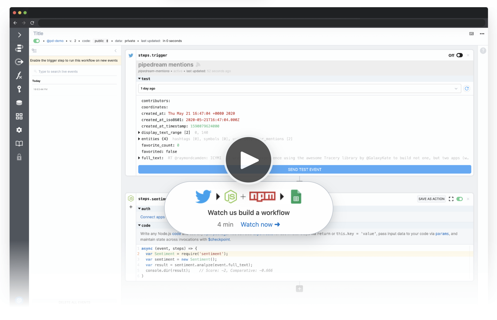

# Overview

## What is Pipedream?

Pipedream is a production-scale serverless platform to connect APIs, remarkably fast.

1. Connect OAuth and key-based API accounts in seconds.
2. Use connected accounts in Node.js code steps or no-code building blocks.
3. Build and run workflows triggered on HTTP requests, schedules, app events and more.

<!--Pipedream also makes it easy to test and validate your integrations, scaffold API requests for any app, maintain state between executions, manage execution rate and concurrency and more. -->

Watch a 4-minute demo or review our [quickstart guide](/quickstart/):

<!--With Pipedream, you can stop writing boilerplate code, struggling with authentication and managing infrastructure, and start connecting APIs with code-level control when you need it — and no code when you don't. -->

<!--Pipedream is a low code integration platform for developers. We make it easy to connect APIs remarkably fast so you can stop writing boilerplate code, struggling with authentication and managing infrastructure, and start connecting APIs with code-level control when you need it — and no code when you don't.-->

<video controls poster="./images/demo-poster.png" width="100%">
  <source src="https://res.cloudinary.com/pipedreamin/video/upload/v1612307285/homepage/Using_Event_Sources_and_Workflows__Analyze_Twitter_Sentiment_in_Real-Time_and_Save_to_Google_Sheets_ehy2ho.mp4" type="video/mp4">
Your browser does not support the video tag.
</video>

<!---->

<!--img src="https://res.cloudinary.com/pipedreamin/image/upload/v1612919959/homepage/workflow-demo_ks64up.png"-->

<!--
Trusted by developers from startups to Fortune 500 companies:

## How Pipedream Works

Pipedream provides a serverless platform to build and run workflows that connect APIs:

- Connect your OAuth and key-based API accounts in seconds
- Use connected accounts to auth APIs in code steps or in "no code" building blocks
- Compose steps into workflows and trigger on HTTP requests, schedules or app events

Pipedream also provides easy to use services to solve common serverless and integration challenges including state management, execution rate and concurrency controls, large file support (up to 5TB) and more! 

Watch a demo (4 mins):

-->

## Is Pipedream for Me?

We make it easy to connect APIs with code-level control when you need it — and no code when you don't. If you and your team want to stop writing boilerplate code, struggling with authentication and managing infrastructure for integrations, then Pipedream is for you. 

Developers with a working knowledge of Node.js or Javascript will get the most value from Pipedream (Python, TypeScript, and GitHub integration are coming soon).

<!--
Pipedream is trusted by 150k+ developers from startups to Fortune 500 companies:

-->

## Getting Started

Sign up for a [free account (no credit card required)](https://pipedream.com/auth/signup) and complete our [quickstart guide](/quickstart/) to learn the basic patterns for workflow development:

- Trigger workflows on HTTP requests, schedules and app events
- Return a custom response from your workflow on HTTP requests 
- Use connected accounts in actions and code steps
- Pass data between code steps and no code actions
- Use npm packages in Node.js code steps
- Scaffold an API request in Node.js
- End workflow execution early

<!--

-->
Pipedream offers a generous free tier (no credit card required) so you can test out the platform and use it for personal projects with no risk or commitment. As your needs grow, it's easy to upgrade to [paid plans](https://pipedream.com/pricing) to run without limits for individuals, teams and enterprises.

## Use Cases

Pipedream supports use cases from prototype to production and is trusted by 150k+ developers from startups to Fortune 500 companies:

The platform processes billions of events and is built and [priced](https://pipedream.com/pricing/) for use at scale. [Our team](https://pipedream.com/about) has built internet scale applications and managed data pipelines in excess of 10 million events per second (EPS) at startups and high-growth environments like BrightRoll, Yahoo!, Affirm and Instacart. 

Our [community](https://pipedream.com/community) uses Pipedream for a wide variety of use cases including:

- Connecting SaaS apps
- General API orchestration and automation
- Database automations ([reach out](https://pipedream.com/community) to learn about connecting to resources behind a firewall)
- Custom notifications and alerting
- Mobile and JAMstack backends
- Rate limiting, request smoothing
- Event queueing and concurrency management
- Webhook inspection and routing
- Prototyping and demos

## Open Source

Pipedream maintains an [open source component registry](https://github.com/pipedreamhq/pipedream/) on GitHub so you can avoid writing boilerplate code for common API integrations. Use components as no code building blocks in workflows, or use them to scaffold code that you can customize. You can also [create a PR contribute new or enhanced components](/components/guidelines/#process) via GitHub.

## Contributing

We hope is that by providing a generous free tier, you will not only get value from Pipedream, but you will give back to help us improve the product for the entire community and grow the platform by:

- [Contributing](/components/guidelines/) open source components to our [registry](https://github.com/pipedreamhq/pipedream.) or sharing via your own GitHub repo
- Asking and answering questions in our [public community](https://pipedream.com/community/)
- [Reporting bugs](https://pipedream.com/community/c/bugs/9) and [requesting features](https://github.com/PipedreamHQ/pipedream/issues/new?assignees=&labels=enhancement&template=feature_request.md&title=%5BFEATURE%5D+) that help us build a better product
- Following us on [Twitter](https://twitter.com/pipedream), starring our [GitHub repo](https://github.com/PipedreamHQ/pipedream) and subscribing to our [YouTube channel](https://www.youtube.com/c/pipedreamhq)
- Recommending us to your friends and colleagues

Learn about [all the ways you can contribute](https://pipedream.com/contributing).

## Getting Help

If you have any questions or feedback, please [reach out in our community forum](https://pipedream.com/community).