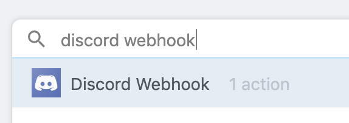
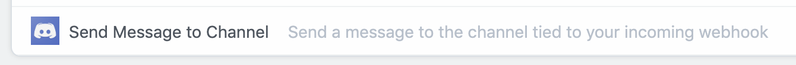

# Discord

<div>

</div>

Pipedream supports two [Discord](https://discordapp.com) integrations: 

- [Discord Webhook](#discord-webhook)
- [Discord Bot](#discord-bot)

If you just need to send messages to a channel, use the [**Webhook integration**](#discord-webhook).

The [**Bot integration**](#discord-bot) lets you interact with the [Discord API](https://discordapp.com/developers/docs/intro) to programmatically create channel invites, kick users from a guild, and more. You'll need to create your own bot and add it to your guild before using this integration. We describe that process [below](#discord-bot).

You can also use both types of integrations in the same workflow. Read on to learn more.

[[toc]]

## Discord Webhook

The **Discord Webhook** integration is the easiest way to send messages to a channel.

You can use Pipedream to automate any workflow where you need to receive a message in Discord. For example, you can:

- Receive data [via webhooks](/workflows/steps/triggers/#http), [modify it with code](/workflows/steps/code/), and format a specific Discord message.
- [Run code on a schedule](/workflows/steps/triggers/#schedule) to hit an API and send the data on to a Discord channel.
- Use the [email trigger](/workflows/steps/triggers/#email) to accept emails and forward them to Discord.

Watch this video to see how to create a new Discord webhook using Pipedream, and how to send the name of a random Star Wars character to a Discord channel once an hour:

<iframe width="560" height="315" src="https://www.youtube.com/embed/SLNqwnMbAKA" frameborder="0" allow="accelerometer; autoplay; encrypted-media; gyroscope; picture-in-picture" allowfullscreen></iframe>

[See the finished workflow here](https://pipedream.com/@dylburger/send-a-random-star-wars-character-name-to-a-discord-channel-discord-webhooks-p_QPCNpq/readme). We'll walk through the setup described in the video below.

### Using the Discord Webhook integration

To use this integration, add a new step to your workflow and choose the **Discord Webhook** app:

<div>

</div>

select the **Send Message to Channel** action:

<div>

</div>

then [connect your Discord account](/connected-accounts/#connecting-accounts). When authorizing Pipedream access to your Discord account, you'll be asked to create a webhook for your target Discord server and channel.

If you'd like to create another webhooks in another channel, you can create another Discord Webhook connection. You can send a message to any number of Discord webhooks within a single workflow.

### Example: Send an embed

[Discord embeds](https://discordjs.guide/popular-topics/embeds.html) are richly-formatted messages that include images, fields, and text, arranged in a custom way. You can send embeds using the Discord Webhook **Send Message to Channel** action in Pipedream.

[**Copy this example workflow to get started**](https://pipedream.com/@dylburger/discord-embed-example-p_6lCoe8/edit). This workflow formats an example embed in the `format_embed_message` step, [exporting it](/workflows/steps/#step-exports) for use in future steps.

```javascript
this.msg = [
  {
    title: "Hello!",
    description: "Hi! :grinning:",
  },
];
```

In the next step, we use the Discord Webhook **Send Message to Channel** action. This action expects _either_ a **Message** _or_ an **Embeds** parameter, which is delivered to your target channel. In this example workflow, we've selected the **Embeds** param, turned structured mode **off** (this allows us to [enter an expression](/workflows/steps/params/#params-types) for the Embeds array), and entered the value <code v-pre>{{steps.format_embed_message.msg}}</code>, which evaluates to the array of objects we formatted in the step above:

<div>

</div>

This should send a message to Discord that looks something like:

<div>

</div>

## Discord Bot

The **Discord Bot** integration should be used when you have a Discord bot that you've added to a server, and you want to automate interaction with the Discord API using Pipedream. You can use this integration to:

- Accept HTTP requests from a [webhook](/workflows/steps/triggers/#http) and automate common server actions, like automatically sending any new user who signs up for your app a channel invite.
- [Run code on a schedule](/workflows/steps/triggers/#schedule) to regularly check your [Discord audit log](https://discordapp.com/developers/docs/resources/audit-log) and send you an email of any events you want to monitor.
- Any other administrative action you want to drive programmatically, triggered from any event.

If you just want to send messages to a channel, check out the [**Discord Webhook**](#discord-webhook) integration, instead.

Watch this video to see how to create your own Discord bot, add it to a server, and make some requests to the Discord API from Pipedream:

<iframe width="560" height="315" src="https://www.youtube.com/embed/8pTx0MD1Cjw" frameborder="0" allow="accelerometer; autoplay; encrypted-media; gyroscope; picture-in-picture" allowfullscreen></iframe>

[See the finished workflow here](https://pipedream.com/@dylburger/modify-a-discord-server-name-using-a-discord-bot-p_OKC1Jb/readme). We'll walk through the setup described in the video below.

### Using the Discord Bot integration

You'll need to create a Discord bot and add it to your server before you begin. Watch the first couple minutes of the video above, or [follow the instructions in this guide](https://github.com/SinisterRectus/Discordia/wiki/Setting-up-a-Discord-application) to create that bot and add it to your server.

Once that's done, add a new step to your workflow and choose the **Discord Bot** app:

<div>

</div>

select any of the actions that appear:

<div>

</div>

and [connect your account](/connected-accounts/#connecting-accounts). You'll be asked to add your Discord bot token, which you can find under the **Bot** section of your app. Then deploy your workflow and start making API requests.

### Requesting more Discord Bot Actions

To request a new Discord Bot action, please file an issue on our [Github repo](https://github.com/PipedreamHQ/pipedream).

### Limitations of the Bot integration on Pipedream

Right now, the Discord Bot integration cannot utilize the [Discord Gateway](https://discordapp.com/developers/docs/topics/gateway) to receive events via websockets or make API requests that require an initial connection to the gateway.

Please [reach out](/support) if prevents you from building a workflow. We're happy to prioritize support for this in the future.

## Discord Event Sources

[Event sources](/event-sources/) let you trigger workflows on new events from Discord. For example, you can create a source that listens for new messages in a Discord channel, triggering a workflow on each new message.

### New Messages in Channel

[Read the Github docs](https://github.com/PipedreamHQ/pipedream/blob/master/components/discord_bot/README.md) to create an event source that emits a new event each time a new message arrives in a Discord channel. This lets you trigger a Pipedream workflow on each new message, or listen for new messages via Pipedream's [SSE interface](/api/sse/) or [REST API](/api/rest/).
