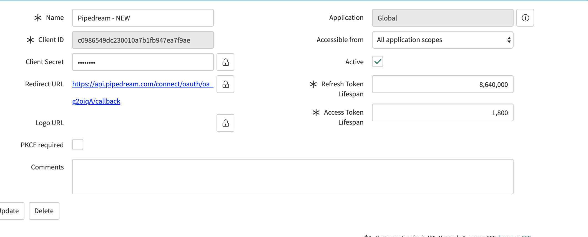

# ServiceNow

Pipedream lets you interact with the [ServiceNow REST API](https://docs.servicenow.com/bundle/orlando-application-development/page/build/applications/concept/api-rest.html) in workflows. You can use Pipedream's [prebuilt actions](/workflows/steps/actions/) (or write your own) to perform common operations, or [run any Node code](/workflows/steps/code/) to talk to their API.

## Setting up an app in your ServiceNow instance

Before you can use the ServiceNow REST API from a workflow, you need to configure an OAuth app in your ServiceNow instance that will grant access tokens to your users and authenticate requests to its REST API. 

1. In your ServiceNow instance, visit the **Application Registry** and create a new app, choosing the **Create an OAuth API endpoint for external clients** option.
2. Name it something memorable, then leave every other field blank or keep the defaults, except for the **Redirect URL**, which should be: `https://api.pipedream.com/connect/oauth/oa_g2oiqA/callback`. Your app should look something like this:

3. Next, you'll need to copy the client ID and secret generated in **Step 2**, and add another app. This time, select the option to **Connect to a third party OAuth Provider**.
4. Name this app something like **Pipedream OAuth Validator**, and add the client ID / secret from **Step 2**. Change the grant type to **Authorization Code**, and set the **Token URL** to `oauth_token.do` (without any hostname, this refers to the current instance). Finally, add the same **Redirect URL** as you did above: `https://api.pipedream.com/connect/oauth/oa_g2oiqA/callback`. This app's configuration should look something like this when complete:

5. Visit [https://pipedream.com/accounts](https://pipedream.com/accounts), and click the button labeled **Click Here to Connect An App** in the top-right. In the modal that appears, search for **ServiceNow** and select it. You'll be prompted to enter the client ID and client secret from **Step 2** above, as well as the name of your instance. The instance name is the _host_ portion of your instance's URL: that is, the `dev98042` in `https://dev98042.service-now.com/`.

6. Press **Connect** in the bottom-right of the modal. This should open up a new window asking you to login to your ServiceNow instance. This authorizes Pipedream's access to your ServiceNow account, and you should be ready to connect to your instance's REST API!

Collectively, the two apps you configured in your ServiceNow instance allow your instance to issue new OAuth access tokens for the user who authenticated in **Step 6**. This allows Pipedream to retrieve a fresh access token before it makes requests to the ServiceNow REST API.

## ServiceNow Authorization Reference

[This ServiceNow doc](https://docs.servicenow.com/bundle/orlando-platform-administration/page/administer/security/concept/c_OAuthAuthorizationCodeFlow.html) describes the general flow we ask you to implement above. In that doc, the app you create in **Step 2** is referred to as the **client application**, and the app in **Step 4** is referred to as the **OAuth provider application registry record**.
