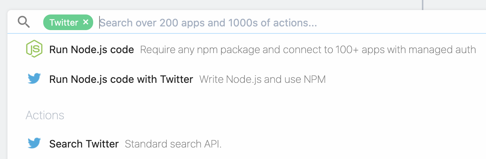

# Twitter

Pipedream facilitates access to the Twitter API and Twitter events in two ways:

- Within [Pipedream workflows](/workflows), you can use [prebuilt actions](/workflows/steps/actions/) to post tweets, search tweets by keyword, and more. You can also run [any custom Node.js code](/workflows/steps/code/) that interacts with the Twitter API.
- You can also _trigger_ Pipedream workflows on new tweets, new followers, and other Twitter events. This allows you to run custom code in response to these events. 

[[toc]]

## Using the Twitter API in Pipedream workflows

### Pipedream's built-in Twitter app and actions

Pipedream provides a **Twitter** OAuth app for interacting with the Twitter API. To use this app, [add a new step](/workflows/steps/) to your workflow, search for "Twitter", and select the Twitter app from the list. This will display a list of [prebuilt actions](/workflows/steps/actions/) (for example, **Post Tweet**, **Search Twitter**) associated with Twitter:

<div>

</div>

Select the **Post Tweet** action. Press **Connect Account** to authorize the Pipedream Twitter app access the Twitter API on your behalf. Then, add the text of your tweet in the **Status** field:

<div>

</div>

Like with all actions, you can set additional options using the **add individual property** menu, and you can view and edit the code for the action in the editor below this menu.

### Run your own custom code to interact with the Twitter API

You can [connect the Twitter app to any code step](/connected-accounts/#from-a-code-step), which allows you to use your Twitter account to interact with the API in a custom way that the built-in actions don't provide.

### Limitations on `@` mentions

Twitter's [Automation Rules](https://help.twitter.com/en/rules-and-policies/twitter-automation) forbids replies or mentions in certain circumstances. For example, you cannot `@` mention users in an unsolicited way. Because of these limitations, **Pipedream prevents the use of `@` mentions when posting tweets**.

If you attempt to post tweets with `@` mentions using the **Post Tweet** action, the action will remove the `@` and post the remaining text of the tweet.

If you write custom code that attempts to post a tweet with an `@` mention, you'll encounter a `400 Bad Request` error. You must remove the `@` mention to post your tweet successfully.

This limitation only applies to Pipedream's **Twitter** app. You can use the [**Twitter Developer App** integration](#twitter-developer-app-integration) to interact with the Twitter API using credentials for a Twitter bot you've created in your own developer account, and use `@` mentions. When you use this integration, [Twitter's Automation Rules](https://help.twitter.com/en/rules-and-policies/twitter-automation) still govern your bot's use of the Twitter API.

### Pipedream, Inc label on tweets

When you use the Pipedream Twitter app to send tweets, you'll notice a **Pipedream, Inc** label on these tweets:

<div>

</div>

Twitter displays the name of the source app that produced the tweet, and cannot be removed when using the Pipedream app. You can use the [**Twitter Developer App** integration](#twitter-developer-app-integration) to post tweets using your own app.

### Twitter Developer App integration

If you operate your own Twitter bot, and you want to interact with the Twitter API using that bot's credentials, you can use the **Twitter Developer App** integration.

To use this app, [add a new step](/workflows/steps/) to your workflow, search for "Twitter Developer App", and select that app from the list. When you select an action and press **Connect Account**, you'll be prompted to enter the API Key, API Secret, Access Token, and Access Token Secret tied to your app in the [Twitter Developer Dashboard](https://developer.twitter.com/en/docs/basics/apps/guides/the-app-management-dashboard).

Once connected, you can run any custom code that uses these credentials to interact with the Twitter API. The **Post Tweet** action associated with this app, for example, uses the [`twit` Twitter API client](https://github.com/ttezel/twit) to send tweets:

```javascript
const Twit = require("twit");

const {
  api_key,
  api_secret_key,
  access_token,
  access_token_secret,
} = auths.twitter_developer_app;

const T = new Twit({
  consumer_key: api_key,
  consumer_secret: api_secret_key,
  access_token,
  access_token_secret,
  timeout_ms: 60 * 1000, // optional HTTP request timeout to apply to all requests.
  strictSSL: true, // optional - requires SSL certificates to be valid.
});

return await T.post("statuses/update", {
  status: params.status,
  in_reply_to_status_id: params.in_reply_to_status_id,
});
```

## Run code on new tweets, followers, and more

Pipedream [event sources](/event-sources) emit Twitter events — tweets, follows, likes, and more — in real time. Sources can trigger [Pipedream workflows](/workflows), and can be accessed via [SSE](/api/sse/) and [REST APIs](/api/rest/).

Create a new Twitter event source at [https://pipedream.com/sources](https://pipedream.com/sources), or by clicking on any of the links below:

- [Search mentions for a keyword, user, hashtag, and more](https://pipedream.com/sources?action=create&key=twitter-search-mentions&app=twitter)

When you create a Pipedream workflow, you can also [create an event source in the trigger step](/workflows/steps/triggers/#app-based-triggers) directly.

A single event source can trigger any number of Pipedream workflows. For example, you might create a single source to listen for new Twitter mentions for a keyword, then trigger multiple workflows each time a new tweet is found: one to [send new tweets to Slack](https://pipedream.com/@pravin/twitter-mentions-slack-p_dDCA5e/edit), another to [save those tweets to an Amazon S3 bucket](https://pipedream.com/@dylan/twitter-to-s3-p_KwCZGA/readme), etc.
