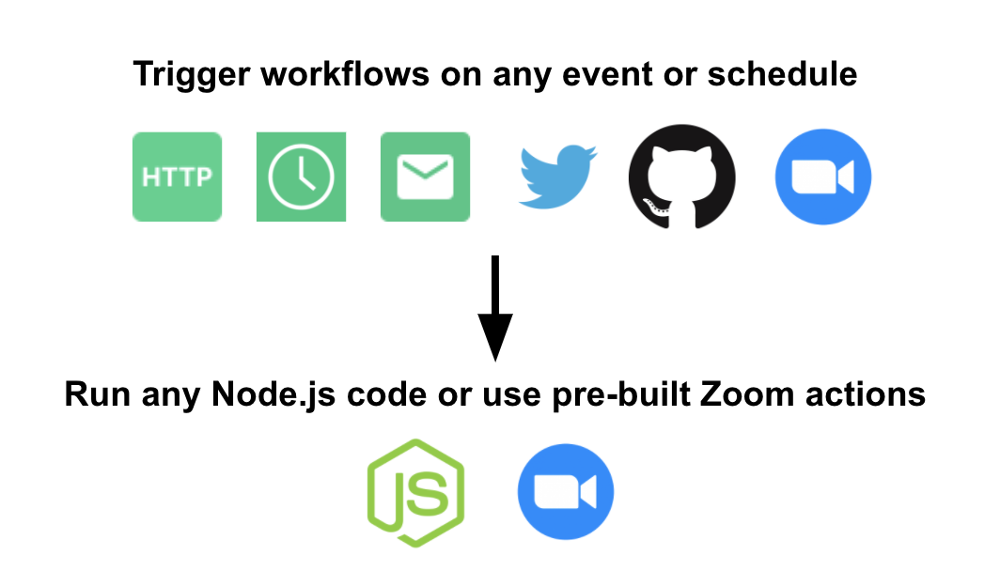
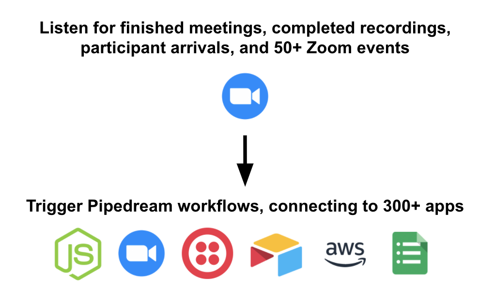
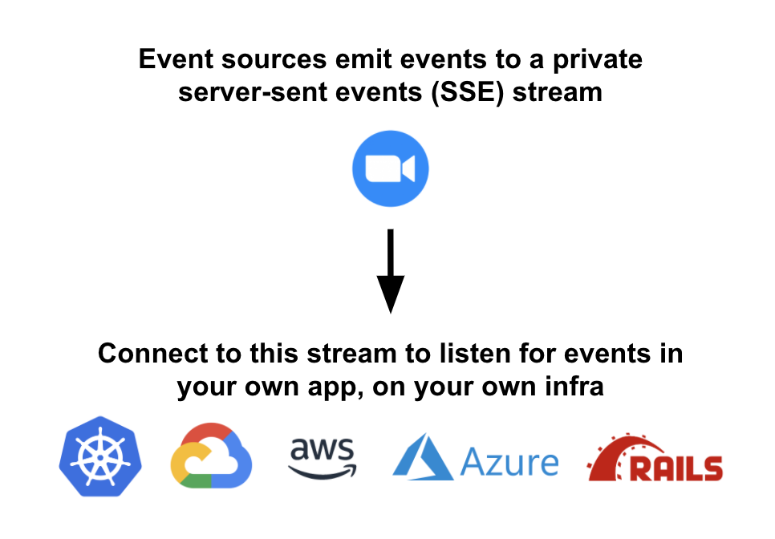
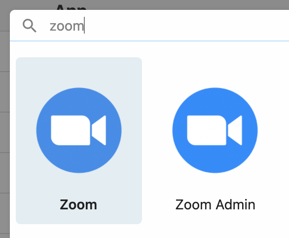
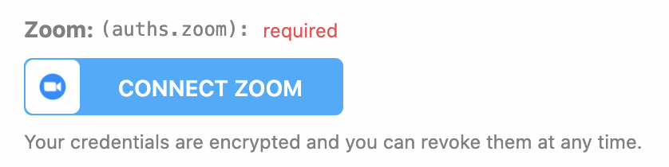
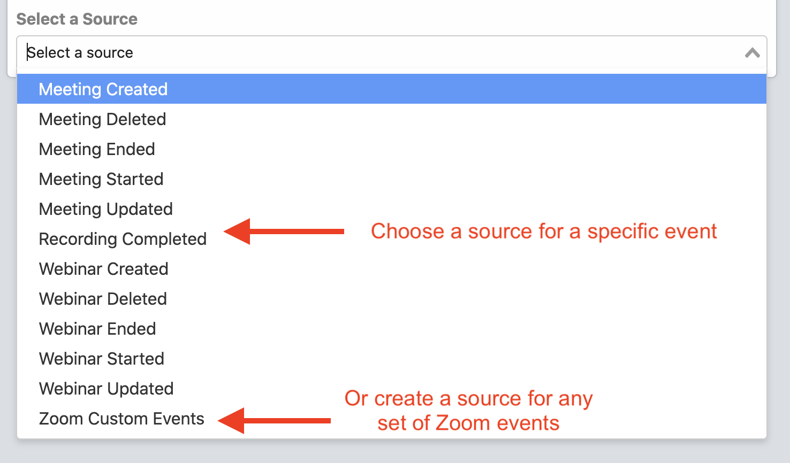
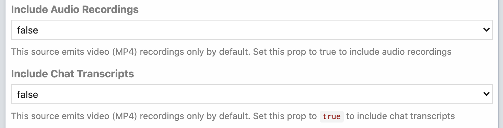
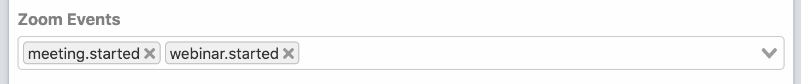

# Zoom

Pipedream provides a serverless programming platform for building event-driven [workflows](/workflows/) that integrate apps. Pipedream comes with [prebuilt actions](/workflows/steps/actions/) for interacting with the Zoom API, and allows you to listen for Zoom events in your account and trigger code when they happen.

Pipedream is fully programmable - you can write [any Node.js code](/workflows/steps/code/) to control your workflows - but also fully-managed: Pipedream runs your code, so you don't have to manage any infrastructure and can focus on your workflow's logic.

[[toc]]

## Overview

**Pipedream [workflows](/workflows/) allow you to run any Node.js code that connects to the Zoom API**. Just [create a new workflow](https://pipedream.com/new), then add prebuilt Zoom [actions](/workflows/steps/actions/) (create a meeting, send a chat message, etc.) or [write your own Node code](/workflows/steps/code/). These workflows can be triggered by HTTP requests, timers, email, or on any app-based event (new tweets, a Github PR, Zoom events, etc). 

**Pipedream [**event sources**](/event-sources/) expose real-time event streams for any [Zoom event](https://marketplace.zoom.us/docs/api-reference/webhook-reference)** - just connect your Zoom account, and get an event stream. Event sources can trigger workflows, running custom code each time an event occurs in Zoom. For example, to run a workflow each time a meeting ends, you can create a **Meeting Ended** source. This source emits an event as soon as a meeting ends in your account, which can trigger a workflow that pulls participant stats, emails those participants a survey, or anything else you'd like.

You can also subscribe to a [private SSE stream](/api/sse/) that lets you listen for these events **in your own application**, in real time. This allows you to use Pipedream to host the event source, which can trigger existing code in your own infrastructure (vs. a Pipedream workflow).

## Zoom vs. Zoom Admin app

Zoom users can be classified into two groups: non-admins and admins. Admins have account-level permissions that users do not, and Zoom has corresponding admin-level scopes that aren't relevant for normal users. Therefore, Pipedream exposes two apps — **Zoom** and **Zoom Admin** — to serve the two groups.

In the Zoom Marketplace, these apps are named [Pipedream](https://marketplace.zoom.us/apps/jGaV-kRrT3igAYnn-J5v2g), and [Pipedream for Zoom Admins](https://marketplace.zoom.us/apps/tZvUsiucR96SqtvfBsemXg), respectively.

Non-admins have [permissions](https://marketplace.zoom.us/docs/guides/authorization/permissions#user-managed-scopes) to manage standard Zoom resources in their account: meetings, webinars, recordings, and more. **If you're a non-admin, you'll want to use the Zoom app**.

Zoom admins have [permissions](https://marketplace.zoom.us/docs/guides/authorization/permissions#account-level-scopes) to manage account-level resources, like users and reports. They can also manage webinars and meetings across their organization. **If you're an admin and need to manage these resources via API, you'll want to use the Zoom Admin app**.

The [Zoom API docs on permissions](https://marketplace.zoom.us/docs/guides/authorization/permissions) provide detailed information on these permissions and their associated OAuth scopes.

## Connecting to Zoom from Pipedream

1. First, sign up for Pipedream at [https://pipedream.com](https://pipedream.com).
2. Visit [https://pipedream.com/accounts](https://pipedream.com/accounts).
3. Click the button labeled **Click Here to Connect an App**.
4. Search for "Zoom" and select either **Zoom** or **Zoom Admin** ([see the differences above](#zoom-vs-zoom-admin-app)):

This will open up a new window prompting you to authorize Pipedream's access to your Zoom account. Once you authorize access, you should see your Zoom account listed among your apps.

5. [Create a new workflow](https://pipedream.com/new), [add a new step](/workflows/steps/), search for "Zoom" or "Zoom Admin". Once you've selected either app, you can choose to either "Run Node.js code" or select one of the prebuilt actions for performing common API operations.
6. At this stage, you'll be asked to link the Zoom account you connected above, authorizing the request to the Zoom API with your credentials:

## Zoom Event Sources

**Pipedream [**event sources**](/event-sources/) expose real-time event streams for any [Zoom event](https://marketplace.zoom.us/docs/api-reference/webhook-reference)** - just connect your Zoom account, and get an event stream.

Event sources can trigger workflows, running custom code each time an event occurs in Zoom. For example, to run a workflow each time a meeting ends, you can create a **Meeting Ended** source. This source emits an event as soon as a meeting ends in your account, which can trigger a workflow that pulls participant stats, emails those participants a survey, or anything else you'd like.

There are two categories of Zoom event sources:

- [Event-specific sources](#event-specific-sources) listen for a _specific_ Zoom event (**Meeting Created**, **Recording Completed**, etc). Event-specific sources exist only for the most common Zoom events, but you can [request another source here](https://github.com/PipedreamHQ/pipedream/issues/new?assignees=&labels=enhancement&template=new-source.md&title=%5BTRIGGER%5D).
- The [Custom Events source](#zoom-custom-events-source) allows you to listen for _any_ event from Zoom, and even lets you listen for _multiple_ events at the same time. For example, if you want to run a workflow on both **Meeting Started** and **Webinar Started** events, you can create a custom source that listens for them both, and use that event source as your workflow's trigger.

### Creating a Zoom event source

1. Visit [https://pipedream.com/sources](https://pipedream.com/sources).
2. Click the **Create Source** button.
3. In the **Select an App** drop-down, select either **Zoom** or **Zoom Admin** ([see the difference above](#zoom-vs-zoom-admin-app)).
4. In the **Select a Source** drop-down, you can either choose from the list of sources tied to a [specific event](#event-specific-sources) (**Meeting Created**, **Recording Completed**, etc.), or create an event source that listens for _any_ Zoom event by selecting the [**Zoom Custom Events** or **Zoom Admin Custom Events** source](#zoom-custom-events-source).

### Event-specific sources

You can create event sources tied to common Zoom events, like **Meeting Created** and **Recording Completed**, by selecting one of the corresponding event sources. These event sources are built to process specific events, and emit data in a format that makes sense for the event type.

For example, the **Recording Completed** source lets you filter on options specific to recordings:

and **it emits each recording file as its own event** - that is, if you're listening for video, audio, and chat recordings, this source will emit up to 3 events for each meeting: one for each file type.

You can find the source code for each of these event sources in the [PipedreamHQ/pipedream](https://github.com/PipedreamHQ/pipedream) Github repo:

- [Zoom event sources](https://github.com/PipedreamHQ/pipedream/tree/master/components/zoom)
- [Zoom Admin event sources](https://github.com/PipedreamHQ/pipedream/tree/master/components/zoom-admin)

If you can't find the source you're looking for, you can use the [Zoom Custom Events source](#zoom-custom-events-source) to listen for any events from Zoom. You can also [request another source here](https://github.com/PipedreamHQ/pipedream/issues/new?assignees=&labels=enhancement&template=new-source.md&title=%5BTRIGGER%5D), or develop your own Zoom source and open up a pull request in the [PipedreamHQ/pipedream](https://github.com/PipedreamHQ/pipedream) Github repo to add that source to the Pipedream platform for anyone to use.

### Zoom Custom Events source

The **Zoom Custom Events** or **Zoom Admin Custom Events** source allows you to listen for _any_ event from Zoom, and even lets you listen for _multiple_ events at the same time.

For example, if you want to run a workflow on both **Meeting Started** and **Webinar Started** events, you can create a custom source that listens for them both, and use that event source as your workflow's trigger. Just create the **Zoom Custom Events** source and select `meeting.started` and `webinar.started` from the list of events in the **Zoom Events** drop-:down:

#### List of Custom Events

Below, you'll find a full list of the events that you can listen for, with links to the corresponding Zoom docs. Some events are also only available for _either_ the Zoom _or_ Zoom Admin apps, which is indicated by the **Zoom** and **Zoom Admin** columns.

|                                                                            Event                                                                             |                      Description                      | Zoom | Zoom Admin |
| :----------------------------------------------------------------------------------------------------------------------------------------------------------: | :---------------------------------------------------: | :--: | :--------: |
|                     [`account.created`](https://marketplace.zoom.us/docs/api-reference/webhook-reference/account-events/account-created)                     |                New Sub Account created                |      |     ✓      |
|                     [`account.updated`](https://marketplace.zoom.us/docs/api-reference/webhook-reference/account-events/account-updated)                     |   An Account or a Sub Account's profile is updated    |      |     ✓      |
|            [`account.settings_updated`](https://marketplace.zoom.us/docs/api-reference/webhook-reference/account-events/account-settings-updated)            |  An account or a Sub Account’s settings are updated   |      |     ✓      |
|               [`account.disassociated`](https://marketplace.zoom.us/docs/api-reference/webhook-reference/account-events/account-disassociated)               |    Sub Account Disassociated from a Master Account    |      |     ✓      |
|                      [`meeting.alert`](https://marketplace.zoom.us/docs/api-reference/webhook-reference/meeting-events/meeting-alerted)                      |           Meeting service issue encountered           |  ✓   |     ✓      |
|                     [`meeting.created`](https://marketplace.zoom.us/docs/api-reference/webhook-reference/meeting-events/meeting-created)                     |          Meeting created in my Zoom account           |      |     ✓      |
|                  [`meeting.created.by_me`](https://marketplace.zoom.us/docs/api-reference/webhook-reference/meeting-events/meeting-created)                  |                 Meeting created by me                 |  ✓   |            |
|                 [`meeting.created.for_me`](https://marketplace.zoom.us/docs/api-reference/webhook-reference/meeting-events/meeting-created)                  |          Meeting created where I'm the host           |  ✓   |            |
|                     [`meeting.updated`](https://marketplace.zoom.us/docs/api-reference/webhook-reference/meeting-events/meeting-updated)                     |                    Meeting updated                    |  ✓   |     ✓      |
|                     [`meeting.deleted`](https://marketplace.zoom.us/docs/api-reference/webhook-reference/meeting-events/meeting-deleted)                     |          Meeting deleted in my Zoom account           |      |     ✓      |
|                  [`meeting.deleted.by_me`](https://marketplace.zoom.us/docs/api-reference/webhook-reference/meeting-events/meeting-deleted)                  |                 Meeting deleted by me                 |  ✓   |            |
|                 [`meeting.deleted.for_me`](https://marketplace.zoom.us/docs/api-reference/webhook-reference/meeting-events/meeting-deleted)                  |         Meeting deleted where I was the host          |  ✓   |            |
|                     [`meeting.started`](https://marketplace.zoom.us/docs/api-reference/webhook-reference/meeting-events/meeting-started)                     |                    Meeting started                    |  ✓   |     ✓      |
|                      [`meeting.ended`](https://marketplace.zoom.us/docs/api-reference/webhook-reference/meeting-events/meeting-ending)                       |                     Meeting ended                     |  ✓   |     ✓      |
|         [`meeting.registration_created`](https://marketplace.zoom.us/docs/api-reference/webhook-reference/meeting-events/meeting-registrant-created)         |              User registered for meeting              |  ✓   |     ✓      |
|       [`meeting.registration_approved`](https://marketplace.zoom.us/docs/api-reference/webhook-reference/meeting-events/meeting-registration-approved)       |             Meeting registration approved             |  ✓   |     ✓      |
|      [`meeting.registration_cancelled`](https://marketplace.zoom.us/docs/api-reference/webhook-reference/meeting-events/meeting-registration-cancelled)      |            Meeting registration cancelled             |  ✓   |     ✓      |
|                                                                `meeting.registration_denied`                                                                 |              Meeting registration denied              |  ✓   |     ✓      |
|             [`meeting.sharing_started`](https://marketplace.zoom.us/docs/api-reference/webhook-reference/meeting-events/meeting-sharing-started)             |        A host or attendee shared their screen         |      |     ✓      |
|          [`meeting.sharing_started.host`](https://marketplace.zoom.us/docs/api-reference/webhook-reference/meeting-events/meeting-sharing-started)           |              A host shared their screen               |  ✓   |            |
|       [`meeting.sharing_started.participant`](https://marketplace.zoom.us/docs/api-reference/webhook-reference/meeting-events/meeting-sharing-started)       |            An attendee shared their screen            |  ✓   |            |
|               [`meeting.sharing_ended`](https://marketplace.zoom.us/docs/api-reference/webhook-reference/meeting-events/meeting-sharing-ended)               |    A host or attendee stopped sharing their screen    |      |     ✓      |
|            [`meeting.sharing_ended.host`](https://marketplace.zoom.us/docs/api-reference/webhook-reference/meeting-events/meeting-sharing-ended)             |          A host stopped sharing their screen          |  ✓   |            |
|         [`meeting.sharing_ended.participant`](https://marketplace.zoom.us/docs/api-reference/webhook-reference/meeting-events/meeting-sharing-ended)         |       An attendee stopped sharing their screen        |  ✓   |            |
|  [`meeting.participant_jbh_joined`](https://marketplace.zoom.us/docs/api-reference/webhook-reference/meeting-events/meeting-participant-joined-before-host)  |          Attendee joined meeting before host          |  ✓   |     ✓      |
|  [`meeting.participant_jbh_waiting`](https://marketplace.zoom.us/docs/api-reference/webhook-reference/meeting-events/meeting-participant-waiting-for-host)   |       Attendee waiting for host to join meeting       |  ✓   |     ✓      |
|          [`meeting.participant_joined`](https://marketplace.zoom.us/docs/api-reference/webhook-reference/meeting-events/participant-joined-meeting)          |            Host or attendee joined meeting            |  ✓   |     ✓      |
| [`meeting.participant_joined_waiting_room`](https://marketplace.zoom.us/docs/api-reference/webhook-reference/meeting-events/participant-joined-waiting-room) |            Participant joined waiting room            |  ✓   |     ✓      |
|            [`meeting.participant_admitted`](https://marketplace.zoom.us/docs/api-reference/webhook-reference/meeting-events/participant-admitted)            | Participant was admitted to meeting from waiting room |  ✓   |     ✓      |
| [`meeting.participant_put_in_waiting_room`](https://marketplace.zoom.us/docs/api-reference/webhook-reference/meeting-events/participant-put-in-waiting-room) |    Participant placed in waiting room from meeting    |  ✓   |     ✓      |
|   [`meeting.participant_left_waiting_room`](https://marketplace.zoom.us/docs/api-reference/webhook-reference/meeting-events/participant-left-waiting-room)   |     Participant left waiting room, or was removed     |  ✓   |     ✓      |
|                  [`recording.started`](https://marketplace.zoom.us/docs/api-reference/webhook-reference/recording-events/recording-started)                  |                   Recording started                   |  ✓   |     ✓      |
|                   [`recording.paused`](https://marketplace.zoom.us/docs/api-reference/webhook-reference/recording-events/recording-paused)                   |                   Recording paused                    |  ✓   |     ✓      |
|                  [`recording.resumed`](https://marketplace.zoom.us/docs/api-reference/webhook-reference/recording-events/recording-resumed)                  |                   Recording resumed                   |  ✓   |     ✓      |
|                  [`recording.stopped`](https://marketplace.zoom.us/docs/api-reference/webhook-reference/recording-events/recording-stopped)                  |                   Recording stopped                   |  ✓   |     ✓      |
|                [`recording.completed`](https://marketplace.zoom.us/docs/api-reference/webhook-reference/recording-events/recording-completed)                |                  Recording completed                  |  ✓   |     ✓      |
|                  [`recording.renamed`](https://marketplace.zoom.us/docs/api-reference/webhook-reference/recording-events/recording-renamed)                  |                   Recording renamed                   |      |     ✓      |
|               [`recording.renamed.by_me`](https://marketplace.zoom.us/docs/api-reference/webhook-reference/recording-events/recording-renamed)               |                Recording renamed by me                |  ✓   |            |
|                  [`recording.renamed`](https://marketplace.zoom.us/docs/api-reference/webhook-reference/recording-events/recording-renamed)                  |  Recording renamed for an event where I was the host  |  ✓   |            |
|                  [`recording.trashed`](https://marketplace.zoom.us/docs/api-reference/webhook-reference/recording-events/recording-trashed)                  |                   Recording trashed                   |      |     ✓      |
|               [`recording.trashed.by_me`](https://marketplace.zoom.us/docs/api-reference/webhook-reference/recording-events/recording-trashed)               |                Recording trashed by me                |  ✓   |            |
|              [`recording.trashed.for_me`](https://marketplace.zoom.us/docs/api-reference/webhook-reference/recording-events/recording-trashed)               |  Recording trashed for an event where I was the host  |  ✓   |            |
|                  [`recording.deleted`](https://marketplace.zoom.us/docs/api-reference/webhook-reference/recording-events/recording-deleted)                  |                   Recording deleted                   |      |     ✓      |
|               [`recording.deleted.by_me`](https://marketplace.zoom.us/docs/api-reference/webhook-reference/recording-events/recording-deleted)               |                Recording deleted by me                |  ✓   |            |
|              [`recording.deleted.for_me`](https://marketplace.zoom.us/docs/api-reference/webhook-reference/recording-events/recording-deleted)               |  Recording deleted for an event where I was the host  |  ✓   |            |
|                [`recording.recovered`](https://marketplace.zoom.us/docs/api-reference/webhook-reference/recording-events/recording-recovered)                |                  Recording recovered                  |      |     ✓      |
|                [`recording.recovered`](https://marketplace.zoom.us/docs/api-reference/webhook-reference/recording-events/recording-recovered)                |               Recording recovered by me               |  ✓   |            |
|                [`recording.recovered`](https://marketplace.zoom.us/docs/api-reference/webhook-reference/recording-events/recording-recovered)                | Recording recovered for an event where I was the host |  ✓   |            |
|     [`recording.transcript_completed`](https://marketplace.zoom.us/docs/api-reference/webhook-reference/recording-events/recording-transcript-completed)     |            Recording transcript completed             |  ✓   |     ✓      |
|    [`recording.registration_completed`](https://marketplace.zoom.us/docs/api-reference/webhook-reference/recording-events/recording-registration-created)    |      User registered for an on-demand recording       |  ✓   |     ✓      |
|    [`recording.registration_approved`](https://marketplace.zoom.us/docs/api-reference/webhook-reference/recording-events/recording-registration-approved)    |            User approved to view recording            |  ✓   |     ✓      |
|      [`recording.registration_denied`](https://marketplace.zoom.us/docs/api-reference/webhook-reference/recording-events/recording-registration-denied)      |         User denied access to cloud recording         |  ✓   |     ✓      |
|                         [`user.created`](https://marketplace.zoom.us/docs/api-reference/webhook-reference/user-events/user-created)                          |                     User created                      |      |     ✓      |
|             [`user.invitation_accepted`](https://marketplace.zoom.us/docs/api-reference/webhook-reference/user-events/user-invitation-accepted)              |           User accepted account invitation            |      |     ✓      |
|                         [`user.updated`](https://marketplace.zoom.us/docs/api-reference/webhook-reference/user-events/user-updated)                          |                 User profile updated                  |  ✓   |     ✓      |
|                [`user.settings_updated`](https://marketplace.zoom.us/docs/api-reference/webhook-reference/user-events/user-settings-updated)                 |                 User settings updated                 |  ✓   |     ✓      |
|                       [`user.activated`](https://marketplace.zoom.us/docs/api-reference/webhook-reference/user-events/user-activated)                        |                    User activated                     |  ✓   |     ✓      |
|                     [`user.deactivated`](https://marketplace.zoom.us/docs/api-reference/webhook-reference/user-events/user-deactivated)                      |                   User deactivated                    |      |     ✓      |
|                   [`user.disassociated`](https://marketplace.zoom.us/docs/api-reference/webhook-reference/user-events/user-disassociated)                    |                  User disassociated                   |      |     ✓      |
|                         [`user.deleted`](https://marketplace.zoom.us/docs/api-reference/webhook-reference/user-events/user-deleted)                          |                     User deleted                      |      |     ✓      |
|                       [`user.signed_in`](https://marketplace.zoom.us/docs/api-reference/webhook-reference/user-events/user-signed-in)                        |                    User signed in                     |  ✓   |     ✓      |
|                      [`user.signed_out`](https://marketplace.zoom.us/docs/api-reference/webhook-reference/user-events/user-signed-out)                       |                    User signed out                    |  ✓   |     ✓      |
|                     [`webinar.created`](https://marketplace.zoom.us/docs/api-reference/webhook-reference/webinar-events/webinar-created)                     |             Webinar created in my account             |      |     ✓      |
|                  [`webinar.created.by_me`](https://marketplace.zoom.us/docs/api-reference/webhook-reference/webinar-events/webinar-created)                  |                 Webinar created by me                 |  ✓   |            |
|                 [`webinar.created.for_me`](https://marketplace.zoom.us/docs/api-reference/webhook-reference/webinar-events/webinar-created)                  |          Webinar created where I'm the host           |  ✓   |            |
|                     [`webinar.updated`](https://marketplace.zoom.us/docs/api-reference/webhook-reference/webinar-events/webinar-updated)                     |                    Webinar updated                    |  ✓   |     ✓      |
|                     [`webinar.deleted`](https://marketplace.zoom.us/docs/api-reference/webhook-reference/webinar-events/webinar-deleted)                     |             Webinar deleted in my account             |      |     ✓      |
|                  [`webinar.deleted.by_me`](https://marketplace.zoom.us/docs/api-reference/webhook-reference/webinar-events/webinar-deleted)                  |                 Webinar deleted by me                 |  ✓   |            |
|                     [`webinar.deleted`](https://marketplace.zoom.us/docs/api-reference/webhook-reference/webinar-events/webinar-deleted)                     |          Webinar deleted where I'm the host           |  ✓   |            |
|                     [`webinar.started`](https://marketplace.zoom.us/docs/api-reference/webhook-reference/webinar-events/webinar-started)                     |                    Webinar started                    |  ✓   |     ✓      |
|                       [`webinar.ended`](https://marketplace.zoom.us/docs/api-reference/webhook-reference/webinar-events/webinar-ended)                       |                     Webinar ended                     |  ✓   |     ✓      |
|                       [`webinar.alert`](https://marketplace.zoom.us/docs/api-reference/webhook-reference/webinar-events/webinar-alert)                       |           Webinar service issue encountered           |  ✓   |     ✓      |
|             [`webinar.sharing_started`](https://marketplace.zoom.us/docs/api-reference/webhook-reference/webinar-events/webinar-sharing-started)             |        A host or attendee shared their screen         |  ✓   |     ✓      |
|          [`webinar.sharing_started.host`](https://marketplace.zoom.us/docs/api-reference/webhook-reference/webinar-events/webinar-sharing-started)           |              A host shared their screen               |  ✓   |     ✓      |
|       [`webinar.sharing_started.participant`](https://marketplace.zoom.us/docs/api-reference/webhook-reference/webinar-events/webinar-sharing-started)       |            An attendee shared their screen            |  ✓   |     ✓      |
|               [`webinar.sharing_ended`](https://marketplace.zoom.us/docs/api-reference/webhook-reference/webinar-events/webinar-sharing-ended)               |    A host or attendee stopped sharing their screen    |  ✓   |     ✓      |
|        [`webinar.registration_created`](https://marketplace.zoom.us/docs/api-reference/webhook-reference/webinar-events/webinar-registration-created)        |              User registered for webinar              |  ✓   |     ✓      |
|       [`webinar.registration_approved`](https://marketplace.zoom.us/docs/api-reference/webhook-reference/webinar-events/webinar-registration-approved)       |             Webinar registration approved             |  ✓   |     ✓      |
|      [`webinar.registration_cancelled`](https://marketplace.zoom.us/docs/api-reference/webhook-reference/webinar-events/webinar-registration-cancelled)      |            Webinar registration cancelled             |  ✓   |     ✓      |
|         [`webinar.registration_denied`](https://marketplace.zoom.us/docs/api-reference/webhook-reference/webinar-events/webinar-registration-denied)         |              Webinar registration denied              |  ✓   |     ✓      |
|          [`webinar.participant_joined`](https://marketplace.zoom.us/docs/api-reference/webhook-reference/webinar-events/webinar-participant-joined)          |            Host or attendee joined webinar            |  ✓   |     ✓      |
|                [`webinar.participant_left`](https://marketplace.zoom.us/docs/api-reference/webhook-reference/webinar-events/participant-left)                |             Host or attendee left webinar             |  ✓   |     ✓      |

## Example workflows

You can copy any of the workflows below by clicking **Copy** in the top-right corner of the workflow. This will create a copy of the workflow in your account, where you can connect your Zoom account.

- [Save Zoom recordings to Amazon S3, email host, then delete Zoom recording](https://pipedream.com/@zoom-demo/save-zoom-recordings-to-amazon-s3-email-host-then-delete-zoom-recording-p_gYCjqj/edit)
- [Send meeting metrics to host via email](https://pipedream.com/@zoom-demo/send-meeting-metrics-to-host-via-email-p_n1CMZN/edit)

## Common Issues

If you encounter any issues connecting to Zoom with Pipedream, please [reach out to our Support team](/support).

### My Zoom event source isn't receiving events

It's likely that you need to re-authorize Pipedream's access to your Zoom account to start receiving events. Here's how to do that:

1. Visit [https://pipedream.com/sources](https://pipedream.com/sources)
2. Select your event source, and click on the **Configuration** tab.
3. Press **unlink** next to your connected Zoom account, then press the **Connect Zoom** button.
4. When your list of connected Zoom accounts appears, click **New**. **This will prompt you to authorize Pipedream's access to your Zoom account _again_, creating a new auth grant.**
5. This should renew the link between your Zoom account and Pipedream. Try triggering your Zoom event again.

## Removing Pipedream's access to your Zoom account

You can revoke Pipedream's access to your Zoom account by visiting your [list of installed apps in Zoom](https://marketplace.zoom.us/user/installed).

As soon as you do, any Pipedream workflows that connect to Zoom will immediately fail to work.

You can delete any Zoom connected accounts in [your list of Pipedream Accounts](https://pipedream.com/accounts), as well.

## Usage

Please see the section on [Connecting to Zoom from Pipedream](#connecting-to-zoom-from-pipedream) to create a Pipedream workflow that connects to the Zoom API.

Pipedream's Zoom app requests all [Zoom user-managed App Scopes](https://marketplace.zoom.us/docs/guides/authorization/permissions#user-managed-scopes).

Pipedream's Zoom Admin app requests all [Zoom account-level App Scopes](https://marketplace.zoom.us/docs/guides/authorization/permissions#account-level-scopes).

<Footer />
