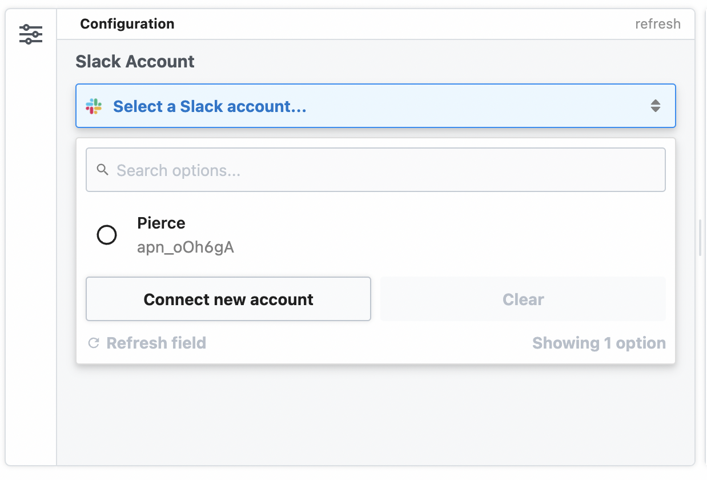

# Connecting apps in Node.js 

When you use [prebuilt actions](/components/actions/) tied to apps, you don't need to write the code to authorize API requests. Just [connect your account](/connected-accounts/#connecting-accounts) for that app and run your workflow.

But sometimes you'll need to [write your own code](/code/nodejs/). You can also connect apps to custom code steps, using the auth information to authorize requests to that app.

For example, you may want to send a Slack message from a step. We use Slack's OAuth integration to authorize sending messages from your workflows. 

To wire up a Slack account to a workflow, define it as a `prop` to the workflow. 

```javascript
import { WebClient } from '@slack/web-api'

export default defineComponent({
  props: {
    // This creates a connection called "slack" that connects a Slack account.
    slack: {
      type: 'app',
      app: 'slack'
    }
  },
  async run({ steps, $ }) {
    const web = new WebClient(this.slack.$auth.oauth_access_token)

    return await web.chat.postMessage({
      text: "Hello, world!",
      channel: "#general",
    })
  }
});
```

Now the step in the workflow builder will allow you to connect your Slack account:

<div>
  
</div>

[[toc]]

## Accessing connected account data with `this.appName.$auth`

In our Slack example above, we created a Slack `WebClient` using the Slack OAuth access token:

```javascript
const web = new WebClient(this.slack.$auth.oauth_access_token);
```

Where did `this.slack` come from? Good question. It was generated by the definition we made in `props`:

```javascript{4,6,8}
export default defineComponent({
  props: {
    // the name of the app from the key of the prop, in this case it's "slack"
    slack: {
      // define that this prop is an app
      type: 'app',
      // define that this app connects to Slack 
      app: 'slack'
    }
  }
  // ... rest of the Node.js step 
```

The Slack access token is generated by Pipedream, and is available to this step in the `this.slack.$auth` object:

```javascript
export default defineComponent({
  props: {
    slack: {
      type: 'app',
      app: 'slack'
    }
  },
  async run({ steps, $ }) {
    async (steps, $) => {
      // Authentication details for all of your apps are accessible under the special $ variable:
      console.log(this.slack.$auth);
    }
  })
});
```

`this.appName.$auth` contains named properties for each account you connect to the associated step. Here, we connected Slack, so `this.slack.$auth` contains the Slack auth info (the `oauth_access_token`).

The names of the properties for each connected account will differ with the account. Pipedream typically exposes OAuth access tokens as `oauth_access_token`, and API keys under the property `api_key`. But if there's a service-specific name for the tokens (for example, if the service calls it `server_token`), we prefer that name, instead.

To list the `this.[app name].$auth` properties available to you for a given app, run `Object.keys` on the app:

```javascript
console.log(Object.keys(this.slack.$auth)) // Replace this.slack with your app's name
```

and run your workflow. You'll see the property names in the logs below your step.

## Writing custom steps to use `this.appName.$auth`

You can write code that utilizes connected accounts in a few different ways:

### Using the code templates tied to apps

When you write custom code that connects to an app, you can start with a code snippet Pipedream provides for each app. This is called the **test request**.

When you search for an app in a step:

1. Click the **+** button below any step.
2. Search for the app you're looking for and select it from the list.
3. Select the option to **Use any [app] API**.

This code operates as a template you can extend, and comes preconfigured with the connection to the target app and the code for authorizing requests to the API. You can modify this code however you'd like.

### Manually connecting apps to steps

See the Connected Accounts docs for [connecting an account to a code step](/connected-accounts/#from-a-code-step).

## Custom auth tokens / secrets

When you want to connect to a 3rd party service that isn't supported by Pipedream, you can store those secrets in [Environment Variables](/environment-variables/).

## Learn more about `props`

Not only can `props` be used to connect apps to workflow steps, but they can also be used to [collect properties collected from user input](/code/nodejs/#passing-props-to-code-steps) and [save data between workflow runs](/code/nodejs/#managing-state).

<Footer />
