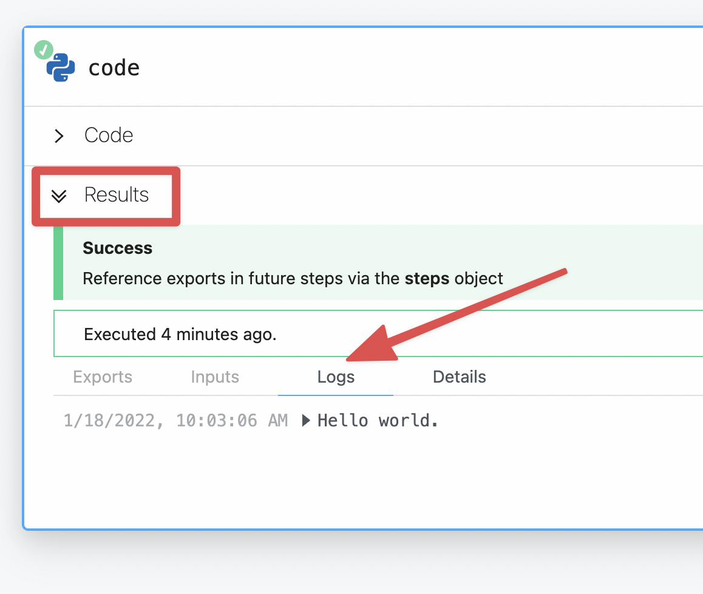

# Python

**Anything you can do in Python can be done in a Pipedream Workflow**. This includes using any of the [350,000+ PyPi packages available](https://pypi.org/) in your Python powered workflows. 

Pipedream supports [Python v{{$site.themeConfig.PYTHON_VERSION}}](https://www.python.org) in workflows.

::: warning
Python steps are available in a limited alpha release.

You can still run arbitrary Python code, including [sharing data between steps](/code/python/#sharing-data-between-steps) as well as [accessing environment variables](/code/python/#using-environment-variables).

However, you can't connect accounts, return HTTP responses, or take advantage of other features available in the [Node.js](/code/nodejs/) environment at this time. If you have any questions please [contact support](https://pipedream.com/support).
:::


## Adding a Python code step

1. Click the + icon to add a new step
2. Click **Custom Code**
3. In the new step, select the `python` language runtime in language dropdown

## Logging and debugging

You can use `print` at any time in a Python code step to log information as the script is running.

The output for the `print` **logs** will appear in the `Results` section just beneath the code editor.

<div>

</div>

## Using third party packages

You can use any packages from [PyPi](https://pypi.org) in your Pipedream workflows. This includes popular choices such as:

* [`requests` for making HTTP requests](https://pypi.org/project/requests/)
* [`sqlalchemy`for retrieving or inserting data in a SQL database](https://pypi.org/project/sqlalchemy/)
* [`pandas` for working with complex datasets](https://pypi.org/project/pandas/)

To use a PyPi package, just include it in your step's code:

```python
import requests
```

And that's it.

No need to update a `requirements.txt` or specify elsewhere in your workflow of which packages you need. Pipedream will automatically install the dependency for you.

## Making an HTTP request

We recommend using the popular `requests` HTTP client package available in Python to send HTTP requests.

No need to run `pip install`, just `import requests` at the top of your step's code and it's available for your code to use.

### Making a `GET` request

GET requests typically are for retrieving data from an API. Below is an example.

```python
import requests

url = 'https://swapi.dev/api/people/1'

r = requests.get(url)

# The response is logged in your Pipedream step results:
print(r.text)

# The response status code is logged in your Pipedream step results:
print(r.status)
```

### Making a POST request

```python
import requests

# This a POST request to this URL will echo back whatever data we send to it
url = 'https://postman-echo.com/post'

data = {"name": "Bulbasaur"}

r = requests.post(url, data)

# The response is logged in your Pipedream step results:
print(r.text)

# The response status code is logged in your Pipedream step results:
print(r.status)
```

### Sending files

You can also send files within a step.

An example of sending a previously stored file in the workflow's `/tmp` directory: 

```python
# Retrieving a previously saved file from workflow storage
files = {'image': open('/tmp/python-logo.png', 'rb')}

r = requests.post(url='https://api.imgur.com/3/image', files=files)
```

## Sharing data between steps

A step can accept data from other steps in the same workflow, or pass data downstream to others.

### Using data from another step

In Python steps, data from the initial workflow trigger and other steps are available in the `pipedream.script_helpers.export` module.

In this example, we'll pretend this data is coming into our HTTP trigger via POST request.

```json
{
  "id": 1,
  "name": "Bulbasaur",
  "type": "plant"
}
```

In our Python step, we can access this data in the `exports` variable from the `pipedream.script_helpers` module. Specifically, this data from the POST request into our workflow is available in the `trigger` dictionary item. 

```python
from pipedream.script_helpers import (steps, export)

# retrieve the data points from the HTTP request in the initial workflow trigger 
name = steps["trigger"]["event"]["name"]
pokemon_type = steps["trigger"]["event"]["type"]

print(f"{pokemon_name} is a {pokemon_type} type Pokemon")
```

### Sending data downstream to other steps

To share data created, retrieved, transformed or manipulated by a step to others downstream call the `export` module from `pipedream.script_helpers`.

```python
# This step is named "code" in the workflow
from pipedream.script_helpers import (steps, export)

r = requests.get("https://pokeapi.co/api/v2/pokemon/charizard")
# Store the JSON contents into a variable called "pokemon"
pokemon = r.json()

# Expose the pokemon data downstream to others steps in the "pokemon" key from this step
export('pokemon', pokemon)
```

Now this `pokemon` data is accessible to downstream steps within `steps["code"]["pokemon"]`

::: warning
Not all data types can be stored in the `steps` data shared between workflow steps.

For the best experience, we recommend only exporting these types of data from Python steps:

* lists 
* dictionaries

[Read more details on step limitations here.](/workflows/steps/#limitations-on-step-exports)
:::

## Using environment variables

You can leverage any [environment variables defined in your Pipedream account](/environment-variables/#environment-variables) in a Python step. This is useful for keeping your secrets out of code as well as keeping them flexible to swap API keys without having to update each step individually.

To access them, use the `os` module.

```python
import os
import requests

token = os.environ['TWITTER_API_KEY']

print(token)
```

Or an even more useful example, using the stored environment variable to make an authenticated API request.

### Using API key authentication

If an particular service requires you to use an API key, you can pass it via the headers of the request.

This proves your identity to the service so you can interact with it:

```python
import requests
import os

token = os.environ['TWITTER_API_KEY']

url = 'https://api.twitter.com/2/users/@pipedream/mentions'

headers { 'Authorization': f"Bearer {token}"}
r = requests.get(url, headers=headers)

print(r.text)
```

:::tip
There are 2 different ways of using the `os` module to access your environment variables.

`os.environ['ENV_NAME_HERE']` will raise an error that stops your workflow if that key doesn't exist in your Pipedream account.

Whereas `os.environ.get('ENV_NAME_HERE')` will _not_ throw an error and instead returns an empty string. 

If your code relies on the presence of a environment variable, consider using `os.environ['ENV_NAME_HERE']` instead.
:::

## Handling errors

You may need to exit a workflow early. In a Python step, just a `raise` an error to halt a step's execution.


```python
raise NameError('Something happened that should not. Exiting early.')
```

All exceptions from your Python code will appear in the **logs** area of the results.

## File storage

You can also store and read files with Python steps. This means you can upload photos, retrieve datasets, accept files from an HTTP request and more.

The `/tmp` directory is accessible from your workflow steps for saving and retrieving files.

You have full access to read and write both files in `/tmp`. 

### Writing a file to /tmp

```python
import requests

# Download the Python logo
r = requests.get('https://www.python.org/static/img/python-logo@2x.png')

# Create a new file python-logo.png in the /tmp/data directory
with open('/tmp/python-logo.png', 'wb') as f:
  # Save the content of the HTTP response into the file
  f.write(r.content)
```

Now `/tmp/python-logo.png` holds the official Python logo.

### Reading a file from /tmp

You can also open files you have previously stored in the `/tmp` directory. Let's open the `python-logo.png` file.

```python
import os

with open('/tmp/python-logo.png') as f:
  # Store the contents of the file into a variable
  file_data = f.read()
```

### Listing files in /tmp

If you need to check what files are currently in `/tmp` you can list them and print the results to the **Logs** section of **Results**:

```python
import os

# Prints the files in the tmp directory
print(os.listdir('/tmp'))
```

:::warning
The `/tmp` directory does not have unlimited storage. Please refer to the [disk limits](/limits/#disk) for details.
:::
