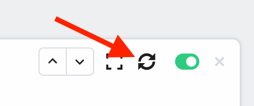

# Actions

Actions are reusable code steps that integrate your apps, data and APIs. For example, you can send HTTP requests to an external service using our HTTP actions, or use our Google Sheets actions to add new data. You can use thousands of actions across 400+ apps today.

Typically, integrating with these services requires custom code to manage connection logic, error handling, and more. Actions handle that for you. You only need to specify the parameters required for the action. For example, the HTTP `GET` Request action requires you enter the URL whose data you want to retrieve.

**You can also create your own actions that can be shared across your own workflows, or published to all Pipedream users**.

[[toc]]

## Using Existing Actions

Adding existing actions to your workflow is easy:

1. Click the **+** button below any step.
2. Search for the app you're looking for and select it from the list.
3. Search for the action and select it to add it to your workflow.

For example, here's how to add the HTTP `GET` Request action:

## Updating actions to the latest version

When you use existing actions or create your own, you'll often want to update an action you added to a workflow to the newest version. For example, the community might publish a new feature or bug fix that you want to use.

To update your action to the latest version, hover over the step in your workflow and click the icon with two arrows in a circle:

## Creating your own actions

You can author your own actions on Pipedream, too. Anytime you need to reuse the same code across steps, consider making that an action.

Start with our [action development quickstart](/components/quickstart/nodejs/actions/). You can read more about all the capabilities of actions in [our API docs](/components/api/), and review [example actions here](/components/api/#example-components).

You can also publish actions to [the Pipedream registry](/components/guidelines/#pipedream-registry), which makes them available for anyone on Pipedream to use.

## Reporting a bug / feature request

If you'd like to report a bug, request a new action, or submit a feature request for an existing action, [open an issue in our GitHub repo](https://github.com/pipedreamhq/pipedream).
