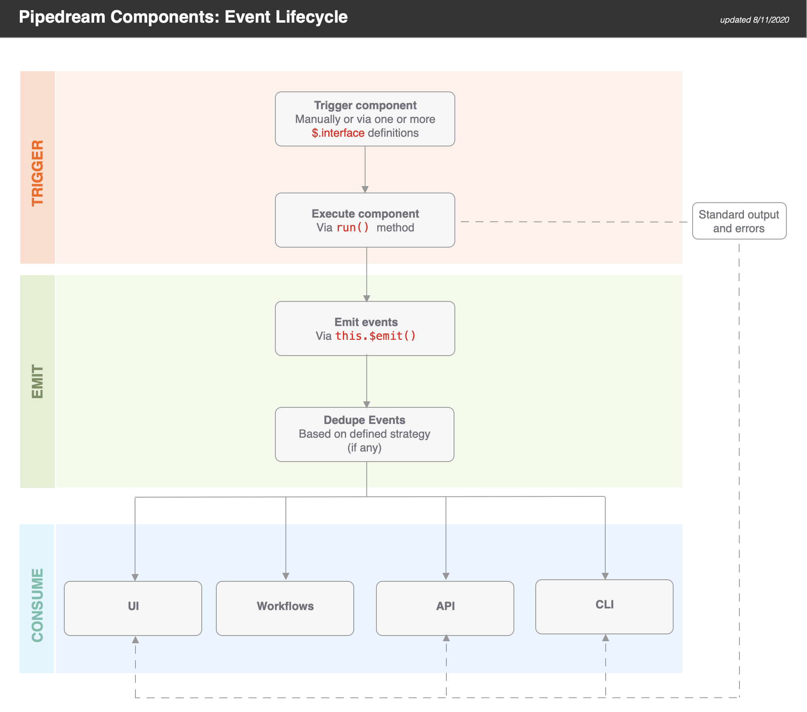

# Component API Reference

This document was created to help developers author and use Pipedream components.

[[toc]]

## Overview

### What is a component?

Components are Node.js modules that run on Pipedream's serverless infrastructure.

- Trigger Node.js on HTTP requests, timers, cron schedules, or manually
- Emit data on each event to inspect it, trigger Pipedream hosted workflows or access it outside of Pipedream via API
- Accept user input on deploy via [CLI](/cli/reference/#pd-deploy), [API](/api/rest/#overview), or [UI](https://pipedream.com/sources)
- Connect to 300+ apps using Pipedream managed auth
- Use most npm packages with no `npm install` or `package.json` required
- Store and retrieve state using the [built-in key-value store](#db)

### Quickstart

To help you get started, we created a [step-by-step walkthrough](/components/quickstart/nodejs/sources/) that demonstrates how to:

- Deploy components to Pipedream using the CLI
- Invoke a component manually, or on a schedule or HTTP request
- Maintain state across component invocations
- Emit deduped events using the `unique` and `greatest` strategies
- Use Pipedream managed OAuth for an app
- Use npm packages in components

### Getting Started with the CLI

Several examples below use the CLI. To install it, [follow the instructions for your OS / architecture](/cli/install/).

See the [CLI reference](/cli/reference/) for detailed usage and examples beyond those covered below.

### Contributing

Deploy or contribute to curated open source components in Pipedream's Github repo. Or author, deploy and maintain your own via your standard CI/CD process.

## Component Lifecycle

### States

Pipedream components support `activate()` and `deactivate()` lifecycle hooks. The code for these hooks are defined within the component. Learn more about the [component structure](#component-structure) and [hook usage](#hooks).

#### Saved Component

A saved component is non-instantiated component code that has previously been deployed to Pipedream. Each saved component has a unique saved component ID. Saved components cannot be invoked directly — they must first be deployed.

#### Deployed Component

A deployed component is an instance of a saved component that can be invoked. Deployed components can be active or inactive. On deploy, Pipedream instantiates a saved component and invokes the `Activate()` hook.

#### Deleted Component

On delete, Pipedream invokes the `Deactivate()` hook and then deletes the deployed component instance.

### Operations

#### Deploy

On deploy, Pipedream creates an instance of a saved component and invokes the optional `Activate()` hook. A unique deployed component ID is generated for the component.

You can deploy a component via the [CLI, UI or API](#management).

#### Update

On update, Pipedream, invokes the optional `Deactivate()` hook, updates the code and props for a deployed component, and then invokes the optional `Activate()` hook. The deployed component ID is not changed by an update operation.

#### Delete

On delete, Pipedream invokes the optional `Deactivate()` hook and deletes the component instance.

### Hooks

#### `deploy`

The `deploy()` hook is automatically invoked by Pipedream when a component is deployed. A common use case for the deploy hook is to create webhook subscriptions when the component is created, but you can run any valid code. To learn more about defining a custom `deploy()` hook, refer to the [API documentation](#hooks-1).

#### `activate`

The `activate()` hook is automatically invoked by Pipedream when a component is deployed or updated. For example, this hook will be run when users update component props, so you can run code here that handles those changes. To learn more about defining a custom `activate()` hook, refer to the [API documentation](#hooks-1).

#### `deactivate`

The `deactivate()` hook is automatically invoked by Pipedream when a component is updated or deleted. A common use case for the deactivate hook is to automatically delete a webhook subscription when a component is deleted, but you can run any valid code. To learn more about defining a custom `deactivate()` hook, refer to the [API documentation](#hooks-1).

### Management

#### CLI

##### Development Mode

The easiest way to develop and iteratively test is to use the `pd dev` command to deploy a local file, attach to a component, and automatically update the component on each local save. To deploy a new component with `pd dev`, run:

```bash
pd dev <filename>
```

To attach to an existing deployed component, run:

```bash
pd dev [--dc <existing-deployed-component-id>] <file-or-name>
```

##### Deploy

###### From Local Code

To deploy a via CLI, use the `pd deploy` command.

```bash
pd deploy <filename>
```

E.g.,

```bash
pd deploy my-component.js
```

###### From Pipedream Github Repo

You can explore the components available to deploy in [Pipedream's Github repo](https://github.com/pipedreamhq/pipedream/components).

```bash
pd deploy <source-key>
```

E.g.,

```bash
pd deploy http-new-requests
```

###### From Any URL

```bash
pd deploy <url-to-raw-code>
```

E.g.,

```bash
pd deploy https://raw.githubusercontent.com/PipedreamHQ/pipedream/master/components/http/http.js
```

##### Update

View the [CLI command reference](/cli/reference/#command-reference).

##### Delete

View the [CLI command reference](/cli/reference/#command-reference).

#### UI

##### Deploy

You can find and deploy curated components at https://pipedream.com/sources/new, or you can deploy code via the UI using following URL patterns.

###### From Pipedream Github Repo

```bash
https://pipedream.com/sources?action=create&key=<source-key>
```

E.g.,

```bash
https://pipedream.com/sources?action=create&key=http-new-requests
```

###### From Any URL

```bash
https://pipedream.com/sources?action=create&url=<url-encoded-url>
```

E.g.,

```bash
https://pipedream.com/sources?action=create&url=https%3A%2F%2Fraw.githubusercontent.com%2FPipedreamHQ%2Fpipedream%2Fmaster%2Fcomponents%2Fhttp%2Fhttp.js
```

##### Update

You can update the code and props for a component from the configuration tab for a source in the Pipedream UI.

##### Delete

You can delete a component via the UI at https://pipedream.com/sources.

#### API

See the [docs](/api/rest/#operations).

## Event Lifecycle

The event lifecycle applies to deployed components. Learn about the [component lifecycle](#component-lifecycle).

### Diagram



### Triggering Components

Components are triggered when you manually run them (e.g., via the **RUN NOW** button in the UI) or when one of their [interfaces](#interface-props) is triggered. Pipedream currently support **HTTP** and **timer** interfaces.

When a component is triggered, the `run()` method of the component is executed. Standard output and errors are surfaced in the **logs** tab.

### Emitting Events

Components can emit events via `this.$emit()`. If you define a dedupe strategy for a component, Pipedream automatically dedupes the events you emit.

> **TIP:** if you want to use a dedupe strategy, be sure to pass an `id` for each event. Pipedream uses this value for deduping purposes.

### Consuming Events

Pipedream makes it easy to consume events via:

- The UI
- Workflows
- APIs
- CLI

#### UI

When you navigate to your source component in the UI, you will be able to select and inspect the most recent 100 events (i.e., an event bin). For example, if you send requests to a simple HTTP source, you will be able to inspect the events (i.e., a request bin).

#### Workflows

Trigger hosted Node.js workflows on each event. Integrate with 300+ apps including Google Sheets, Discord, Slack, AWS, and more!

#### API

Events can be retrieved using the [REST API](/api/rest/) or [SSE stream tied to your component](/api/sse/). This makes it easy to retrieve data processed by your component from another app. Typically, you'll want to use the [REST API](/api/rest/) to retrieve events in batch, and connect to the [SSE stream](/api/sse/) to process them in real time.

#### CLI

Use the `pd events` command to retrieve the last 10 events via the CLI:

```
pd events -n 10 <source-name>
```

## Component API

### Component Structure

Pipedream components export an object with the following properties:

```javascript
module.exports = {
  name: "",
  version: "",
  description: "",
  props: {},
  methods: {},
  hooks: {
    async activate() {},
    async deactivate() {},
  },
  dedupe: "",
  async run(event) {
    this.$emit();
  },
};
```

| Property      | Type     | Required?   | Description                                                  |
| ------------- | -------- | ----------- | ------------------------------------------------------------ |
| `name`        | `string` | required    | The name of the component, a string which identifies components deployed to users' accounts. This name will show up in the Pipedream UI, in CLI output (for example, from `pd list` commands), etc. It will also be converted to a unique slug on deploy to reference a specific component instance (it will be auto-incremented if not unique within a user account). |
| `version`     | `string` | required    | The component version. There are no constraints on the version, but consider using [semantic versioning](https://semver.org/). |
| `description` | `string` | recommended | The description will appear in the Pipedream UI to aid in discovery and to contextualize instantiated components |
| `key`         | `string` | recommended | The `key` uniquely identifies a component within a namespace. The default namespace for components is your account.<br /><br />When publishing components to the Pipedream registry, the `key` must be unique across registry components and should follow the pattern:<br /><br />`app-name-slug`-`slugified-component-name` |
| `props`       | `object` | optional    | Props are custom attributes you can register on a component. When a value is passed to a prop attribute, it becomes a property on that component instance. You can reference these properties in component code using `this` (e.g., `this.propName`). |
| `methods`     | `object` | optional    | Define component methods for the component instance. They can be referenced via `this` (e.g., `this.methodName()`). |
| `hooks`       | `object` | optional    | Hooks are functions that are executed when specific component lifecycle events occur. Currently supported hooks are `activate()` and `deactivate()` (they execute when the component is activated or deactivated). |
| `dedupe`      | `string` | optional    | You may specify a dedupe strategy (`unique`, `greatest`, `last`) to be applied to emitted events |
| `run`         | `method` | required    | Each time a component is invoked (for example, via HTTP request), its `run` method is called. The event that triggered the component is passed to `run`, so that you can access it within the method. Events are emitted using `this.$emit()`. |

### Props

Props are custom attributes you can register on a component. When a value is passed to a prop attribute, it becomes a property on that component instance. You can reference these properties in component code using `this` (e.g., `this.propName`).

| Prop Type                       | Description                                                                                   |
| ------------------------------- | --------------------------------------------------------------------------------------------- |
| [User Input](#user-input-props) | Enable components to accept input on deploy                                                   |
| [Interface](#interface-props)   | Attaches a Pipedream interface to your component (e.g., an HTTP interface or timer)           |
| [Service](#service-props)       | Attaches a Pipedream service to your component (e.g., a key-value database to maintain state) |
| [App](#user-input-props)        | Enables managed auth for a component                                                          |

#### User Input Props

User input props allow components to accept input on deploy. When deploying a component, users will be prompted to enter values for these props, setting the behavior of the component accordingly.

##### General

**Definition**

```javascript
props: {
  myPropName: {
    type: "",
    label: "",
    description: "",
    options: [], // OR async options() {} to return dynamic options
    optional: true || false,
    propDefinition: [],
    default: "",
  },
},
```

| Property         | Type                                 | Required? | Description                                                                                                                                                                                                                                                                                                                                                                                                                                                                                                      |
| ---------------- | ------------------------------------ | --------- | ---------------------------------------------------------------------------------------------------------------------------------------------------------------------------------------------------------------------------------------------------------------------------------------------------------------------------------------------------------------------------------------------------------------------------------------------------------------------------------------------------------------- |
| `type`           | `string`                             | required  | Value must be set to a valid `PropType` (see below). Suffix with `[]` (e.g. `string[]`) to denote array of that type (if supported).                                                                                                                                                                                                                                                                                                                                                                                                                       |
| `label`          | `string`                             | optional  | A friendly label to show to user for this prop. If a label is not provided, the `propName` is displayed to the user.                                                                                                                                                                                                                                                                                                                                                                                             |
| `description`    | `string`                             | optional  | Displayed near the prop input. Typically used to contextualize the prop or provide instructions to help users input the correct value. Markdown is supported.                                                                                                                                                                                                                                                                                                                                                    |
| `options`        | `string[]` or `object[]` or `method` | optional  | Provide an array to display options to a user in a drop down menu.<br>&nbsp;<br>**`[]` Basic usage**<br>Array of strings. E.g.,<br>`['option 1', 'option 2']`<br>&nbsp;<br>**`object[]` Define Label and Value**<br>`[{ label: 'Label 1', value: 'label1'}, { label: 'Label 2', value: 'label2'}]`<br>&nbsp;<br>**`method` Dynamic Options**<br>You can generate options dynamically (e.g., based on real-time API requests with pagination). See configuration details below. |
| `optional`       | `boolean`                            | optional  | Set to `true` to make this prop optional. Defaults to `false`.                                                                                                                                                                                                                                                                                                                                                                                                                                                   |
| `propDefinition` | `[]`                                 | optional  | Re-use a prop defined in an app file. When you include a prop definition, the prop will inherit values for all the properties listed here. However, you can override those values by redefining them for a given prop instance. See **propDefinitions** below for usage.                                                                                                                                                                                                                                         |
| `default`        | `string`                             | optional  | Define a default value if the field is not completed. Can only be defined for optional fields (required fields require explicit user input).                                                                                                                                                                                                                                                                                                                                                                     |

**`PropType`s**

| `PropType` | Array Supported | Custom properties
| -- | -- | :--
| `app` | | See [App Props](#app-props) below
| `boolean` | ✓ |
| `integer` | ✓ | - `min` (`integer`): Minimum allowed integer value.<br/>- `max` (`integer`): Maximum allowed integer value.
| `string` | ✓ | - `secret` (`boolean`): Whether to treat the value as a secret.
| `object` |  |
| `$.interface.http` | | 
| `$.interface.timer` | | 
| `$.service.db` | | 

**Usage**

| Code              | Description                              | Read Scope                | Write Scope                                                                             |
| ----------------- | ---------------------------------------- | ------------------------- | --------------------------------------------------------------------------------------- |
| `this.myPropName` | Returns the configured value of the prop | `run()` `hooks` `methods` | n/a (input props may only be modified on component deploy or update via UI, CLI or API) |

**Example**

Following is a basic example that demonstrates how to capture user input via a prop and emit it on each event. 

```javascript
module.exports = {
  name: "User Input Prop Example",
  version: "0.1",
  props: {
    msg: {
      type: "string",
      label: "Message",
      description: "Enter a message to `console.log()`",
    },
  },
  async run() {
    this.$emit(this.msg);
  },
};
```

To see more examples, explore the curated components in Pipedream's Github repo.

##### Advanced Configuration

##### Async Options ([example](components/github/github.app.js))

Async options allow users to select prop values that can be programmatically generated (e.g., based on a real-time API response).

```javascript
async options({
  page,
  prevContext,
}) {},
```

| Property      | Type      | Required? | Description                                                                                                                                                                                                                                                                                                                                                                                                                                                    |
| ------------- | --------- | --------- | -------------------------------------------------------------------------------------------------------------------------------------------------------------------------------------------------------------------------------------------------------------------------------------------------------------------------------------------------------------------------------------------------------------------------------------------------------------- |
| `options()`   | `method`  | optional  | Typically returns an array of values matching the prop type (e.g., `string`) or an array of object that define the `label` and `value` for each option. The `page` and `prevContext` input parameter names are reserved for pagination (see below).<br>&nbsp;<br>When using `prevContext` for pagination, it must return an object with an `options` array and a `context` object with a `nextPageToken` key. E.g., `{ options, context: { nextPageToken }, }` |
| `page`        | `integer` | optional  | Returns a `0` indexed page number. For use with APIs that accept a numeric page number for pagination.                                                                                                                                                                                                                                                                                                                                                         |
| `prevContext` | `string`  | optional  | Return a string representing the context for the previous `options` invocation. For use with APIs that accept a token representing the last record for pagination.                                                                                                                                                                                                                                                                                             |

Following is a code example demonstrating the usage of async options.

```javascript
module.exports = {
  name: "Async Options Example",
  version: "0.1",
  props: {
    msg: {
      type: "string",
      label: "Message",
      description: "Select a message to `console.log()`",
      async options() {
        // write any node code that returns a string[] or object[] (with label/value keys)
        return ["This is option 1", "This is option 2"];
      },
    },
  },
  async run() {
    this.$emit(this.msg);
  },
};
```

###### Prop Definitions ([example](components/github/new-commit.js))

Prop definitions enable you to reuse props that are defined in another object. A common use case is to enable re-use of props that are defined for a specific app.

```javascript
props: {
  myPropName: {
    propDefinition: [
      app,
      "propDefinitionName",
      inputValues
    ]
  },
},

```

| Property             | Type     | Required? | Description                                                                                                                                                                |
| -------------------- | -------- | --------- | -------------------------------------------------------------------------------------------------------------------------------------------------------------------------- |
| `propDefinition`     | `array`  | optional  | An array of options that define a reference to a `propDefinitions` within the `propDefinitions` for an `app`                                                               |
| `app`                | `object` | required  | An app object                                                                                                                                                              |
| `propDefinitionName` | `string` | required  | The name of a specific `propDefinition` defined in the corresponding `app` object                                                                                          |
| `inputValues`        | `object` | optional  | Values to pass into the prop definition. To reference values from previous props, use an arrow function. E.g.,:<br>&nbsp;<br>`c => ({ variableName: c.previousPropName })` |

Following is a code example that demonstrates how to use `propDefinitions`.

```javascript
const rss = {
  type: "app",
  app: "rss",
  propDefinitions: {
    urlDef: {
      type: "string",
      label: "RSS URL",
      description: "Enter a URL for an RSS feed.",
    },
  },
};

module.exports = {
  name: "Prop Definition Example",
  description: `This component captures an RSS URL and logs it`,
  version: "0.1",
  props: {
    rss,
    url: { propDefinition: [rss, "urlDef"] },
  },
  async run() {
    console.log(this.url);
  },
};
```

#### Interface Props

Interface props are infrastructure abstractions provided by the Pipedream platform. They declare how a component is invoked — via HTTP request, run on a schedule, etc. — and therefore define the shape of the events it processes.

| Interface Type  | Description                                                                                 |
| --------------- | ------------------------------------------------------------------------------------------- |
| [Timer](#timer) | Invoke your component on an interval (defaults to every hour) or based on a cron expression |
| [HTTP](#http)   | Invoke your code on HTTP requests                                                           |

#### Timer

To use the timer interface, declare a prop whose value is the string `$.interface.timer`:

**Definition**

```javascript
props: {
  myPropName: {
    type: "$.interface.timer",
    default: {},
  },
}
```

| Property  | Type     | Required? | Description                                                                                                                                  |
| --------- | -------- | --------- | -------------------------------------------------------------------------------------------------------------------------------------------- |
| `type`    | `string` | required  | Must be set to `$.interface.timer`                                                                                                           |
| `default` | `object` | optional  | **Define a default interval**<br>`{ intervalSeconds: 60, },`<br>&nbsp;<br>**Define a default cron expression**<br>` { cron: "0 0 * * *", },` |

**Usage**

| Code              | Description                                                                                                                                 | Read Scope                | Write Scope                                                                                 |
| ----------------- | ------------------------------------------------------------------------------------------------------------------------------------------- | ------------------------- | ------------------------------------------------------------------------------------------- |
| `this.myPropName` | Returns the type of interface configured (e.g., `{ type: '$.interface.timer' }`)                                                            | `run()` `hooks` `methods` | n/a (interface props may only be modified on component deploy or update via UI, CLI or API) |
| `event`           | Returns an object with the invocation timestamp and interface configuration (e.g., `{ "timestamp": 1593937896, "interval_seconds": 3600 }`) | `run(event)`              | n/a (interface props may only be modified on component deploy or update via UI, CLI or API) |

**Example**

Following is a basic example of a component that is triggered by a `$.interface.timer` and has default defined as a cron expression.

```javascript
module.exports = {
  name: "Cron Example",
  version: "0.1",
  props: {
    timer: {
      type: "$.interface.timer",
      default: {
        cron: "0 0 * * *", // Run job once a day
      },
    },
  },
  async run() {
    console.log("hello world!");
  },
};
```

Following is a basic example of a component that is triggered by a `$.interface.timer` and has default defined as an interval.

```javascript
module.exports = {
  name: "Interval Example",
  version: "0.1",
  props: {
    timer: {
      type: "$.interface.timer",
      default: {
        intervalSeconds: 60 * 60 * 24, // Run job once a day
      },
    },
  },
  async run() {
    console.log("hello world!");
  },
};
```

##### HTTP

To use the HTTP interface, declare a prop whose value is the string `$.interface.http`:

```javascript
props: {
  myPropName: {
    type: "$.interface.http",
    customResponse: true, // optional: defaults to false
  },
}
```

**Definition**

| Property  | Type     | Required? | Description                                                                                                  |
| --------- | -------- | --------- | ------------------------------------------------------------------------------------------------------------ |
| `type`    | `string` | required  | Must be set to `$.interface.http`                                                                            |
| `respond` | `method` | required  | The HTTP interface exposes a `respond()` method that lets your component issue HTTP responses to the client. |

**Usage**

| Code                        | Description                                                                                                                             | Read Scope                | Write Scope                                                                                                                   |
| --------------------------- | --------------------------------------------------------------------------------------------------------------------------------------- | ------------------------- | ----------------------------------------------------------------------------------------------------------------------------- |
| `this.myPropName`           | Returns an object with the unique endpoint URL generated by Pipedream (e.g., `{ endpoint: 'https://abcde.m.pipedream.net' }`)           | `run()` `hooks` `methods` | n/a (interface props may only be modified on component deploy or update via UI, CLI or API)                                   |
| `event`                     | Returns an object representing the HTTP request (e.g., `{ method: 'POST', path: '/', query: {}, headers: {}, bodyRaw: '', body: {}, }`) | `run(event)`              | The shape of `event` corresponds with the the HTTP request you make to the endpoint generated by Pipedream for this interface |
| `this.myPropName.respond()` | Returns an HTTP response to the client (e.g., `this.http.respond({status: 200})`).                                                      | n/a                       | `run()`                                                                                                                       |

###### Responding to HTTP requests

The HTTP interface exposes a `respond()` method that lets your component issue HTTP responses. You may run `this.http.respond()` to respond to the client from the `run()` method of a component.  In this case you should also pass the `customResponse: true` parameter to the prop.

| Property  | Type                       | Required? | Description                                                                                                                    |
| --------- | -------------------------- | --------- | ------------------------------------------------------------------------------------------------------------------------------ |
| `status`  | `integer`                  | required  | An integer representing the HTTP status code. Return `200` to indicate success. Standard status codes range from `100` - `599` |
| `headers` | `object`                   | optional  | Return custom key-value pairs in the HTTP response                                                                             |
| `body`    | `string` `object` `buffer` | optional  | Return a custom body in the HTTP response. This can be any string, object, or Buffer.                                          |

###### HTTP Event Shape

Following is the shape of the event passed to the `run()` method of your component.

```javascript
{
  method: 'POST',
  path: '/',
  query: {},
  headers: {},
  bodyRaw: '',
  body:
}
```

**Example**

Following is a basic example of a component that is triggered by `$.interface.http` and returns `{ 'msg': 'hello world!' }` in the HTTP response. On deploy, Pipedream will generate a unique URL to run this component.

```javascript
module.exports = {
  name: "HTTP Example",
  version: "0.0.1",
  props: {
    http: {
      type: "$.interface.http",
      customResponse: true,
    },
  },
  async run(event) {
    this.http.respond({
      status: 200,
      body: {
        msg: "hello world!",
      },
      headers: {
        "content-type": "application/json",
      },
    });
    console.log(event);
  },
};
```

#### Service Props

| Service | Description                                                                                           |
| ------- | ----------------------------------------------------------------------------------------------------- |
| _DB_    | Provides access to a simple, component-specific key-value store to maintain state across invocations. |

##### DB

**Definition**

```javascript
props: {
  myPropName: "$.service.db",
}
```

**Usage**

| Code                                | Description                                                                                  | Read Scope                            | Write Scope                            |
| ----------------------------------- | -------------------------------------------------------------------------------------------- | ------------------------------------- | -------------------------------------- |
| `this.myPropName.get('key')`        | Method to get a previously set value for a key. Returns `undefined` if a key does not exist. | `run()` `hooks` `methods`             | Use the `set()` method to write values |
| `this.myPropName.set('key', value)` | Method to set a value for a key. Values must be JSON serializable data.                      | Use the `get()` method to read values | `run()` `hooks` `methods`              |

#### App Props

**Definition**

```javascript
props: {
  myPropName: {
    type: "app",
    app: "",
    propDefinitions: {}
    methods: {},
  },
},
```

| Property          | Type     | Required? | Description                                                                                                                                                                                                                      |
| ----------------- | -------- | --------- | -------------------------------------------------------------------------------------------------------------------------------------------------------------------------------------------------------------------------------- |
| `type`            | `string` | required  | Value must be `app`                                                                                                                                                                                                              |
| `app`             | `string` | required  | Value must be set to the name slug for an app registered on Pipedream. If you don't see an app listed, please reach out in our public Slack. This data will be discoverable in a self-service way in the near future.            |
| `propDefinitions` | `object` | optional  | An object that contains objects with predefined user input props. See the section on User Input Props above to learn about the shapes that can be defined and how to reference in components using the `propDefinition` property |
| `methods`         | `object` | optional  | Define app-specific methods. Methods can be referenced within the app object context via `this` (e.g., `this.methodName()`) and within a component via `this.myAppPropName` (e.g., `this.myAppPropName.methodName()`).           |

**Usage**

| Code                              | Description                                                                                      | Read Scope                                      | Write Scope |
| --------------------------------- | ------------------------------------------------------------------------------------------------ | ----------------------------------------------- | ----------- |
| `this.$auth`                      | Provides access to OAuth tokens and API keys for Pipedream managed auth                          | **App Object:** `methods`                       | n/a         |
| `this.myAppPropName.$auth`        | Provides access to OAuth tokens and API keys for Pipedream managed auth                          | **Parent Component:** `run()` `hooks` `methods` | n/a         |
| `this.methodName()`               | Execute a common method defined for an app within the app definition (e.g., from another method) | **App Object:** `methods`                       | n/a         |
| `this.myAppPropName.methodName()` | Execute a common method defined for an app from a component that includes the app as a prop      | **Parent Component:** `run()` `hooks` `methods` | n/a         |

> **Note:** The specific `$auth` keys supported for each app will be published in the near future.

### Methods

You can define helper functions within the `methods` property of your component. You have access to these functions within the [`run` method](#run), or within other methods.

Methods can be accessed using `this.<method-name>`. For example, a `random` method:

```javascript
methods: {
  random() {
    return Math.random()
  },
}
```

can be run like so:

```javascript
const randomNum = this.random();
```

### Hooks

```javascript
hooks: {
  async deploy() {},
  async activate() {},
  async deactivate() {},
},
```

| Property     | Type     | Required? | Description                                           |
| ------------ | -------- | --------- | ----------------------------------------------------- |
| `deploy`     | `method` | optional  | Executed each time a component is deployed            |
| `activate`   | `method` | optional  | Executed each time a component is deployed or updated |
| `deactivate` | `method` | optional  | Executed each time a component is deactivated         |

### Dedupe Strategies

> **IMPORTANT:** To use a dedupe strategy, you must emit an `id` as part of the event metadata (dedupe strategies are applied to the submitted `id`)

| Strategy   | Description                                                                                                                                                                                                                                                                                                                                                              |
| ---------- | ------------------------------------------------------------------------------------------------------------------------------------------------------------------------------------------------------------------------------------------------------------------------------------------------------------------------------------------------------------------------ |
| `unique`   | Pipedream maintains a cache of 100 emitted `id` values. Events with `id` values that are not in the cache are emitted, and the `id` value is added to the cache. After 100 events, `id` values are purged from the cache based on the order received (first in, first out). A common use case for this strategy is an RSS feed which typically does not exceed 100 items |
| `greatest` | Pipedream caches the largest `id` value (must be numeric). Only events with larger `id` values are emitted (and the cache is updated to match the new, largest value).                                                                                                                                                                                                   |
| `last`     | Pipedream caches the ID associated with the last emitted event. When new events are emitted, only events after the matching `id` value will be emitted as events. If no `id` values match, then all events will be emitted.                                                                                                                                              |

### Run

Each time a component is invoked (for example, via HTTP request), its `run` method is called.

The event that triggered the component is passed to `run`, so that you can access it within the method:

```javascript
async run(event) {
  console.log(event)
}
```

You can reference [`this`](#referencing-this) within the `run` method. `this` refers to the component, and provides access to [props](#props), [methods](#methods), and Pipedream-provided functions like `this.$emit`.

You can view logs produced by the `run` method in the **LOGS** section of the Pipedream UI for the component, or using the `pd logs` CLI command:

```bash
pd logs <deployed-component-name>
```

If the `run` method emits events using `this.$emit`, you can access the events in the **EVENTS** section of the Pipedream UI for the component, or using the `pd events` CLI command:

```bash
pd events <deployed-component-name>
```

#### \$emit

`this.$emit()` is a method in scope for the `run` method of a component

```javascript
this.$emit(event, {
  id,
  summary,
  ts,
});
```

| Property  | Type                   | Required?                                | Description                                                                                                                                                                                                                                            |
| --------- | ---------------------- | ---------------------------------------- | ------------------------------------------------------------------------------------------------------------------------------------------------------------------------------------------------------------------------------------------------------ |
| `event`   | JSON serializable data | optional                                 | The data to emit as the event                                                                                                                                                                                                                          |
| `id`      | `string` or `number`   | Required if a dedupe strategy is applied | A value to uniquely identify this event. Common `id` values may be a 3rd party ID, a timestamp, or a data hash                                                                                                                                         |
| `summary` | `string`               | optional                                 | Define a summary to customize the data displayed in the events list to help differentiate events at a glance                                                                                                                                           |
| `ts`      | `integer`              | optional                                 | Accepts an epoch timestamp in **milliseconds**. If you submit a timestamp, events will automatically be ordered and emitted from oldest to newest. If using the `last` dedupe strategy, the value cached as the `last` event for an invocation will correspond to the event with the newest timestamp. |

Following is a basic example that emits an event on each component execution.

```javascript
module.exports = {
  name: "this.$emit() example",
  description: "Deploy and run this component manually via the Pipedream UI",
  async run() {
    this.$emit({ message: "hello world!" });
  },
};
```

### Using npm packages

To use an npm package in a component, just require it. There is no `package.json` or `npm install` required.

```javascript
const myVariable = require("npmPackageName");
```

When you deploy a component, Pipedream downloads these packages and bundles them with your deployment.

Some packages — for example, packages like [Puppeteer](https://pptr.dev/), which includes large dependencies like Chromium — may not work on Pipedream. Please [reach out](https://pipedream.com/community) if you encounter a specific issue.

By default, Pipedream pins the current version of the package to the component. For example, if you `require("axios")` and the current version of `axios` is `0.20.0`, Pipedream downloads that version of the package and also pins future updates to that version. When the component updates, Pipedream will always download version `0.20.0`. 

If you want to always download the latest version of the package, you can `require("axios@latest")`, and Pipedream will download the latest version of the package on all component updates.

If you'd like to use a _specific_ version of a package, you can add that version in the `require` string, for example: `require("axios@0.19.2")`. Moreover, you can pass the same version specifiers that npm and other tools allow to specify allowed semantic version upgrades. For example, 

- To allow for future patch version upgrades, use `require("axios@~0.20.0")`
- To allow for patch and minor version upgrades, use `require("axios@^0.20.0")`
