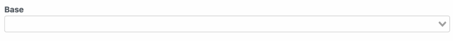
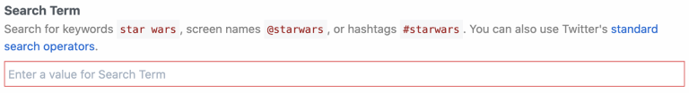
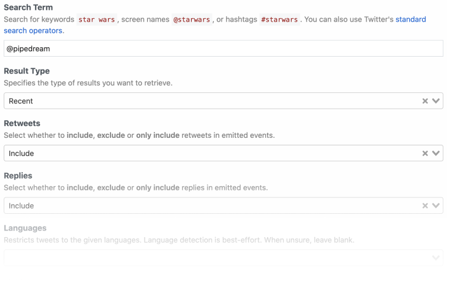

# Contributing to the Pipedream Registry

This document is intended for a technical audience (including those interested
in learning how to author and edit components). It defines guidelines and
patterns developers should follow when building components for the Pipedream
registry.

Developers may create, deploy and share [components](#components) that do not
conform to these guidelines, but they will not be eligible to be listed in the
curated registry (e.g., they may be hosted in a Github repo). If you develop a
component that does not adhere to these guidelines, but you believe there is
value to the broader community, please [reach out in our community
forum](https://pipedream.com/community/c/dev/11). 

[[toc]]

## Overview

[Pipedream](https://pipedream.com) is a low code integration platform that makes
it easy to connect APIs remarkably fast. Users can select from thousands of
customizable, open source components for hundreds of apps and orchestrate their
execution in workflows. Developers can
[contribute](https://pipedream.com/contributing) to these open source components
on [Github](https://github.com/pipedreamhq/pipedream) by:

- Creating new components (sources and actions)
- Updating existing components (e.g., fixing bugs, enhancing functionality)
- Adding or updating metadata (e.g., descriptions, labels)

Once a PR is merged to the `master` branch of the
[`pipedreamhq/pipedream`](https://github.com/PipedreamHQ/pipedream) repo, the
components are automatically registered and immediately become available to the
150k+ users of the Pipedream platform.

### Components

Components are [Node.js modules](../api/#component-structure) that run on
Pipedream's serverless infrastructure. They may use Pipedream managed auth for
[300+ apps](https://pipedream.com/explore) and [use most npm
packages](../api/#using-npm-packages) with no `npm install` or `package.json`
required. Pipedream currently supports two types of components — sources and
actions.

#### Sources

- Emit events that can trigger Pipedream [workflows](/workflows/) (events may
  also be consumed outside of Pipedream via [API](/api/overview/))
- Emitted event data can be inspected and referenced by
  [steps](/workflows/steps/) in the target workflow
- Can use any of Pipedream's built-in [deduping
  strategies](../api/#dedupe-strategies)
- Can be [triggered](../api/#interface-props) on HTTP requests, timers, cron
  schedules, or manually
- May store and retrieve state using the [built-in key-value store](../api/#db)

#### Actions

- May be used as [steps](/workflows/steps/) in [workflows](/workflows/) to
  perform common functions (e.g., get or modify data in an app)
- [Data returned by actions](/workflows/steps/#step-exports) may be inspected
  and used in future workflow steps

### Pipedream Registry

The Pipedream registry consists of sources and actions that have been curated
for the community. Registered components are verified by Pipedream through the
[Github PR process](#process) and:

- Can be trusted by end users
- Follow consistent patterns for usability
- Are supported by Pipedream if issues arise

Registered components also appear in the Pipedream marketplace and are listed in
Pipedream's UI when building workflows.

## Getting Started

**If you're new to Pipedream, we recommend watching this [5 minute
demo](https://www.youtube.com/watch?v=hJ-KRbp6EO8).**

If you're ready to build a component for the Pipedream registry, we recommend
starting with our Quickstart Guides for [source](../quickstart/nodejs/sources/)
and [actions](../quickstart/nodejs/actions/). Then review the [Component API
Reference](../api/).

### Prerequisites

- A free [Pipedream](https://pipedream.com) account
- A free [Github](https://github.com) account
- Basic proficiency with Node.js or Javascript
- Pipedream [CLI](/cli/reference/)

Finally, the target app must be integrated with Pipedream. You can explore all
apps supported by Pipedream in the [marketplace](https://pipedream.com/explore).
If your app is not listed, please [create a Github
issue](https://github.com/PipedreamHQ/pipedream/issues/new?assignees=&labels=app%2C+enhancement&template=app---service-integration.md&title=%5BAPP%5D)
to request it and [reach out](https://pipedream.com/community/c/dev/11) to our
team to let us know that you're blocked on source or action development.

#### Local Checks

When submitting pull requests, the new code will run through a series of
automated checks like linting the code. If you want to run those checks locally
for quicker feedback you must have [NPM](https://www.npmjs.com/) installed and
run the following commands at the root of the project:

1. To install all the project's dependencies (only needed once):

   ```shell
   npm ci
   ```

2. To run the linter checks against your code (assuming that your changes are
   located at `components/foo` for example):

   ```shell
   npx eslint components/foo
   ```

3. Optionally, you can automatically fix any linter issues by running the
   following command:

   ```shell
   npx eslint --fix components/foo
   ```

   Keep in mind that not all issues can be automatically fixed by the linter
   since they could alter the behaviour of the code.

### Process

Anyone from the community can build [sources](/event-sources/) and [actions](/components/actions/) for integrated apps (we refer to these collectively as "[components](/components/#what-are-components)").

All development happens in [this GitHub repo](https://github.com/PipedreamHQ/pipedream). Fork the repo and refer to the [contribution docs](/components/guidelines/#prerequisites) to get your development environment setup.

To submit new components:

1. If you don't see the app listed in [our marketplace](https://pipedream.com/apps), you can [request it here](https://github.com/PipedreamHQ/pipedream/issues/new?assignees=&labels=app%2C+enhancement&template=app---service-integration.md&title=%5BAPP%5D).
2. Once the Pipedream team integrates the app, we'll create a directory for the app in the `components` directory of the GitHub repo. That directory will contain an "[app file](/components/guidelines/#app-files)" that contains the basic code you'll need to get started developing components. App files should contain props, methods, and other code you're using across different components. [See this example for Airtable](https://github.com/PipedreamHQ/pipedream/blob/master/components/airtable/airtable.app.js)).
3. Refer to the quickstarts for [sources](/components/quickstart/nodejs/sources/) and [actions](/components/quickstart/nodejs/actions/) to learn how to create components.
4. When you're ready to develop your own components, you can reference the [component API docs](/components/api/) and our [contribution guidelines](/components/guidelines/#guidelines-patterns).
5. Create a PR for the Pipedream team to review and post a message in our [community forum](https://pipedream.com/community/c/dev/11) or [public Slack](https://pipedream-users.slack.com/archives/C01E5KCTR16).
6. Address any feedback provided by Pipedream.
7. Once the review is complete and approved, Pipedream will merge the PR to the `master` branch! :tada:

Have questions? Reach out in the [#contribute channel](https://pipedream-users.slack.com/archives/C01E5KCTR16) in Slack or [on Discourse](https://pipedream.com/community/c/dev/11).

Looking for ideas? Check out [sources](https://github.com/PipedreamHQ/pipedream/issues?q=is%3Aissue+is%3Aopen+%5BSOURCE%5D+in%3Atitle)
and [actions](https://github.com/PipedreamHQ/pipedream/issues?q=is%3Aissue+is%3Aopen+%5BACTION%5D+in%3Atitle+) requested by the community!

## Reference Components

The following components may be used as models for developing sources and
actions for Pipedream's registry.

### Reference Sources

| Name                                                                                                                                             | App          | Type                                         |
| ------------------------------------------------------------------------------------------------------------------------------------------------ | ------------ | -------------------------------------------- |
| [New Card](https://github.com/pipedreamhq/pipedream/blob/master/components/trello/sources/new-card/new-card.js)                                              | Trello       | Webhook                                      |
| [Search Mentions](https://github.com/PipedreamHQ/pipedream/blob/master/components/twitter/sources/search-mentions/search-mentions.js)                        | Twitter      | Polling                                      |
| [New or Modified Files](https://github.com/pipedreamhq/pipedream/blob/master/components/google_drive/sources/new-or-modified-files/new-or-modified-files.js) | Google Drive | Webhook + Polling                            |
| [New Submission](https://github.com/pipedreamhq/pipedream/blob/master/components/jotform/sources/new-submission/new-submission.js)                           | Jotform      | Webhook (with no unique hook ID)             |
| [New Stars](https://github.com/pipedreamhq/pipedream/blob/master/components/github/sources/new-star/new-star.js)                                             | Github       | Webhook (with extensive use of common files) |

### Reference Actions

| Name | App |
| ---- | --- |
| [Create Single Record](https://github.com/PipedreamHQ/pipedream/blob/master/components/airtable/actions/create-single-record/create-single-record.js) | Airtable |
| [Add Multiple Rows](https://github.com/PipedreamHQ/pipedream/blob/master/components/google_sheets/actions/add-multiple-rows/add-multiple-rows.mjs) | Google Sheets |
| [Send Message](https://github.com/PipedreamHQ/pipedream/blob/master/components/discord_webhook/actions/send-message/send-message.js) | Discord |
| [Append Text](https://github.com/PipedreamHQ/pipedream/blob/master/components/google_docs/actions/append-text/append-text.js) | Google Docs |
| [`GET` request](https://github.com/PipedreamHQ/pipedream/blob/master/components/http/actions/get-request/get-request.js) | HTTP |

## Guidelines & Patterns

### General

#### Components should be ES modules

The Node.js community has started publishing [ESM-only](https://flaviocopes.com/es-modules/) packages that do not work with [CommonJS modules](https://nodejs.org/docs/latest/api/modules.html#modules_modules_commonjs_modules). This means you must `import` the package. You can't use `require`.

You also cannot mix ESM with CJS. This will **not** work:

```javascript
// ESM
import axios from "axios";

// CommonJS - this should be `export default`
module.exports = {
  ...
}
```

Therefore, all components should be written as ES modules:

```javascript
import axios from "axios";

export default {
  ...
}
```

**You'll need to use [the `.mjs` file extension](https://developer.mozilla.org/en-US/docs/Web/JavaScript/Guide/Modules#aside_%E2%80%94_.mjs_versus_.js) for any components written as ES modules**.

You'll notice that many of the existing components are written as CommonJS modules. Please fix these and submit a pull request as you refactor related code. For example, if you're developing new Spotify actions, and you notice the existing event sources use CommonJS, change them to ESM:

1. Rename the file extension from `.js` to `.mjs` using `git mv` (e.g. `git mv source.js source.mjs`).
2. Change all `require` statements to `import`s.
3. Change instances of `module.exports` to `export default`.

#### Component Scope

Create components to address specific use cases whenever possible. For example,
when a user subscribes to a Github webhook to listen for “star” activity, events
can be generated when users star or unstar a repository. The “New Star” source
filters events for only new star activity so the user doesn’t have to.

There may be cases where it's valuable to create a generic component that
provides users with broad latitude (e.g., see the [custom
webhook](https://github.com/pipedreamhq/pipedream/blob/master/components/github/sources/custom-webhook-events)
event source for GitHub). However, as a general heuristic, we found that tightly
scoped components are easier for users to understand and use.

#### Required Metadata

Registry [components](../api/#component-structure) require a unique `key` and
`version`, and a friendly `name` and `description`. Action components require a
`type` field to be set to `action` (sources will require a type to be set in the
future).

```javascript
export default {
  key: "google_drive-new-shared-drive",
  name: "New Shared Drive",
  description: "Emits a new event any time a shared drive is created.",
  version: "0.0.1",
};
```

#### Component Key Pattern

When publishing components to the Pipedream registry, the `key` must be unique
across registry components and should follow the pattern:

`app_name_slug`-`slugified-component-name`

#### Versioning

When you first publish a component to the registry, set its version to `0.0.1`.

Pipedream registry components try to follow [semantic versioning](https://semver.org/). From their site:

Given a version number `MAJOR.MINOR.PATCH`, increment the:

1. `MAJOR` version when you make incompatible API changes,
2. `MINOR` version when you add functionality in a backwards compatible manner, and
3. `PATCH` version when you make backwards compatible bug fixes.

When you're developing actions locally, and you've incremented the version in your account multiple times, make sure to set it to the version it should be at in the registry prior to submitting your PR. For example, when you add an action to the registry, the version should be `0.0.1`. If the action was at version `0.1.0` and you've fixed a bug, change it to `0.1.1` when committing your final code.

#### Folder Structure

Registry components are organized by app in the `components` directory of the
`pipedreamhq/pipedream` repo.

```text
/components
 /[app-name-slug]
  /[app-name-slug].app.js
  /actions
   /[action-name-slug]
    /[action-name-slug].js
  /sources
   /[source-name-slug]
    /[source-name-slug].js
```

- The name of each app folder corresponds with the name slug for each app
- The app file should be in the root of the app folder (e.g.,
  `/components/[app_slug]/[app_slug].app.js`)
- Components for each app are organized into `/sources` and `/actions`
  subfolders
- Each component should be placed in its own subfolder (with the name of the
  folder and the name of the `js` file equivalent to the slugified component
  name). For example, the path for the "Search Mentions" source for Twitter is
  `/components/twitter/sources/search-mentions/search-mentions.js`.

You can explore examples in the [components
directory](https://github.com/pipedreamhq/pipedream/tree/master/components).

#### Using APIs vs Client Libraries

If the app has a well-supported [Node.js client
library](../api/#using-npm-packages), that should be preferred to manually
constructed API requests to reduce code and improve maintenance.

#### Error-handling and input validation

When you use the SDK of a popular API, the SDK might raise clear errors to the user. For example, if the user is asked to pass an email address, and that email address doesn't validate, the library might raise that in the error message.

But other libraries will _not_ raise clear errors. In these cases, you may need to `throw` your own custom error that wraps the error from the API / lib. [See the Airtable components](https://github.com/PipedreamHQ/pipedream/blob/9e4e400cda62335dfabfae384d9224e04a585beb/components/airtable/airtable.app.js#L70) for an example of custom error-handling and input validation.

In general, **imagine you are a user troubleshooting an issue. Is the error easy-to-understand? If not, `throw` a better error**.

#### Pagination

When making API requests, handle pagination to ensure all data / events are processed.

#### Capturing Sensitive Data

If users are required to enter sensitive data, always use
[secret](../api/#general) props.

### Promoting Reusability

#### App Files

App files contain components that declare the app and include prop definitions
and methods that may be reused across components. App files should adhere to the
following naming convention:  `[app_name_slug].app.js`. If an app file does not
exist for your app, please [reach
out](https://pipedream.com/community/c/dev/11).

##### Prop Definitions

Whenever possible, reuse existing [prop definitions](/components/api/#prop-definitions-example).

If a prop definition does not exist and you are adding an app-specific prop that
may be reused in future components, add it as a prop definition to the app file.
Prop definitions will also be surfaced for apps the Pipedream marketplace.

##### Methods

Whenever possible, reuse
[methods](/components/api/#methods)
defined in the app file. If you need to use an API for which a method is not
defined and it may be used in future components, define a new method in the app
file.

Use the [JS Docs](https://jsdoc.app/about-getting-started.html) pattern for
lightweight documentation of each method in the app file. Provide a description
and define @params and @returns block tags (with default values if applicable —
e.g., `[foo=bar]`). This data will both help with reusability and will be
surfaced in documentation for apps in the Pipedream marketplace. For example:

```javascript
export default {
  methods: {
    /**
     * Get the most recently liked Tweets for a user
     *
     * @params {Object} opts - An object representing the configuration options
     * for this method
     * @params {String} opts.screenName - The user's Twitter screen name (e.g.,
     * `pipedream`)
     * @params {String} [opts.count=200] - The maximum number of Tweets to
     * return
     * @params {String} [opts.tweetMode=extended] - Use the default of
     * `extended` to return non-truncated Tweets
     * @returns {Array} Array of most recent Tweets liked by the specified user
     */
    async getLikedTweets(opts = {}) {
      const {
        screenName,
        count = 200,
        tweetMode = "extended",
      } = opts;
      const { data } = await this._makeRequest({
        url: "https://api.twitter.com/1.1/favorites/list.json",
        params: {
          screen_name: screenName,
          count,
          tweet_mode: tweetMode,
        },
      });
      return data;
    },
  },
};
```

##### Testing

Pipedream does not currently support unit tests to validate that changes to app
files are backwards compatible with existing components. Therefore, if you make
changes to an app file that may impact other sources, you must currently test
potentially impacted components to confirm their functionality is not negatively
affected. We expect to support a testing framework in the future.

#### Common Files (optional)

An optional pattern to improve reusability is to use a `common` module to
abstract elements that are used across to multiple components. The trade-off
with this approach is that it increases complexity for end-users who have the
option of customizing the code for components within Pipedream. When using this
approach, the general pattern is:

- The `.app.js` module contains the logic related to making the actual API calls
  (e.g. calling `axios.get`, encapsulate the API URL and token, etc).
- The `common.js` module contains logic and structure that is not specific to
  any single component. Its structure is equivalent to a component, except that
  it doesn't define attributes such as `version`, `dedupe`, `key`, `name`, etc
  (those are specific to each component). It defines the main logic/flow and
  relies on calling its methods (which might not be implemented by this
  component) to get any necessary data that it needs. In OOP terms, it would be
  the equivalent of a base abstract class.
- The component module of each action would inherit/extend the `common.js`
  component by setting additional attributes (e.g. `name`, `description`, `key`,
  etc) and potentially redefining any inherited methods.

See [Google
Drive](https://github.com/PipedreamHQ/pipedream/tree/master/components/google_drive) for an
example of this pattern. When using this approach, prop definitions should still
be maintained in the app file.

### Props

As a general rule of thumb, we should strive to only incorporate the 3-4 most relevant options from a given API as props. This is not a hard limit, but the goal is to optimize for usability. We should aim to solve specific use cases as simply as possible.

#### Labels

Use [prop](../api/#user-input-props) labels to customize the name of a prop or
propDefinition (independent of the variable name in the code). The label should
mirror the name users of an app are familiar with; i.e., it should mirror the
equivalent label in the app’s UI. This applies to usage in labels, descriptions,
etc. E.g., the Twitter API property for search keywords is “q”, but but label is
set to “Search Term”.

#### Descriptions

Include a description for [props](../api/#user-input-props) if it helps the
user understand what they need to do. Use Markdown as appropriate
to improve the clarity of the description or instructions. When using Markdown:

- Enclose sample input values in backticks (`` ` ``)
- Use Markdown links with descriptive text rather than displaying a full URL.
- If the description isn't self-explanatory, link to the API docs of the relevant method to further clarify how the prop works. When the value of the prop is complex (for example, an object with many properties), link to the section of the API docs that include details on this format. Users may pass values from previous steps using [expressions](/workflows/steps/params/#entering-expressions), so they'll need to know how to structure that data.

Examples:

- The async option to select an Airtable Base is self-explanatory so includes no
  description:

  

- The “Search Term” prop for Twitter includes a description that helps the user
  understand what values they can enter, with specific values highlighted using
  backticks and links to external content.

  

#### Optional vs Required Props

Use optional [props](../api/#user-input-props) whenever possible to minimize the
input fields required to use a component.

For example, the Twitter search mentions source only requires that a user
connect their account and enter a search term. The remaining fields are optional
for users who want to filter the results, but they do not require any action to
activate the source:



#### Default Values

Provide [default values](../api/#user-input-props) whenever possible. NOTE: the
best default for a source doesn’t always map to the default recommended by the
app. For example, Twitter defaults search results to an algorithm that balances
recency and popularity. However, the best default for the use case on Pipedream
is recency.

#### Async Options

Avoid asking users to enter ID values. Use [async
options](../api/#async-options-example) (with label/value definitions) so users
can make selections from a drop down menu. For example, Todoist identifies
projects by numeric IDs (e.g., 12345). The async option to select a project
displays the name of the project as the label, so that’s the value the user sees
when interacting with the source (e.g., “My Project”). The code referencing the
selection receives the numeric ID (12345).

Async options should also support [pagination](../api/#async-options-example)
(so users can navigate across multiple pages of options for long lists).

#### Interface & Service Props

In the interest of consistency, use the following naming patterns when defining
[interface](../api/#interface-props) and
[service](COMPONENT-API.md#service-props) props in source components:

| Prop                | **Recommended Prop Variable Name** |
| ------------------- | ---------------------------------- |
| `$.interface.http`  | `http`                             |
| `$.interface.timer` | `timer`                            |
| `$.service.db`      | `db`                               |

### Source Guidelines

These guidelines are specific to [source](/event-sources/) development.

#### Webhook vs Polling Sources

Create subscription webhooks sources (vs polling sources) whenever possible.
Webhook sources receive/emit events in real-time and typically use less compute
time from the user’s account. Note: In some cases, it may be appropriate to
support webhook and polling sources for the same event. For example, Calendly
supports subscription webhooks for their premium users, but non-premium users
are limited to the REST API. A webhook source can be created to emit new
Calendly events for premium users, and a polling source can be created to
support similar functionality for non-premium users.

#### Source Name

Source name should be a singular, title-cased name and should start with "New"
(unless emits are not limited to new items). Name should not be slugified and
should not include the app name. NOTE: Pipedream does not currently distinguish
real-time event sources for end-users automatically. The current pattern to
identify a real-time event source is to include “(Instant)” in the source name.
E.g., “New Search Mention” or “New Submission (Instant)”.

#### Source Description

Enter a short description that provides more detail than the name alone.
Typically starts with "Emit new". E.g., “Emit new Tweets that matches your
search criteria”.

#### Emit a Summary

Always [emit a summary](../api/#emit) for each event. For example, the summary
for each new Tweet emitted by the Search Mentions source is the content of the
Tweet itself.

If no sensible summary can be identified, submit the event payload in string
format as the summary.

#### Deduping

Use built-in [deduping strategies](../api/#dedupe-strategies) whenever possible
(`unique`, `greatest`, `last`) vs developing custom deduping code. Develop
custom deduping code if the existing strategies do not support the requirements
for a source.

#### Polling Sources

##### Default Timer Interval

As a general heuristic, set the default timer interval to 15 minutes. However,
you may set a custom interval (greater or less than 15 minutes) if appropriate
for the specific source. Users may also override the default value at any time.

##### Emit Events on First Run

Polling sources should emit events on the first run. This helps users to know
their source works when they activate it. This also provides users with events
they can immediately use to support workflow development. Do not emit multiple
pages of results or more than 100 events on the first run (as a general
heuristic, emit the first page of results returned by the API).

##### Rate Limit Optimization

When building a polling source, cache the most recently processed ID or
timestamp using `$.service.db` whenever the API accepts a `since_id` or "since
timestamp" (or equivalent). Some apps (e.g., Github) do not count requests that
do not return new results against a user’s API quota.

If the service has a well-supported Node.js client library, it'll often build in
retries for issues like rate limits, so using the client lib (when available)
should be preferred. In the absence of that,
[Bottleneck](https://www.npmjs.com/package/bottleneck) can be useful for
managing rate limits. 429s should be handled with exponential backoff (instead
of just letting the error bubble up).

#### Webhook Sources

##### Hooks

[Hooks](../api/#hooks) are methods that are automatically invoked by Pipedream
at different stages of the [component lifecycle](../api/#component-lifecycle).
Webhook subscriptions are typically created when components are instantiated or
activated via the `activate()` hook, and deleted when components are deactivated
or deleted via the `deactivate()` hook.

##### Helper Methods

Whenever possible, create methods in the app file to manage [creating and
deleting webhook subscriptions](../api/#hooks).

| **Description**                         | **Method Name** |
| --------------------------------------- | --------------- |
| Method to create a webhook subscription | `createHook()`  |
| Method to delete a webhook subscription | `deleteHook()`  |

##### Storing the 3rd Party Webhook ID

After subscribing to a webhook, save the ID for the hook returned by the 3rd
party service to the `$.service.db` for a source using the key `hookId`. This ID
will be referenced when managing or deleting the webhook. Note: some apps may
not return a unique ID for the registered webhook (e.g., Jotform).

##### Signature Validation

Subscription webhook components should always validate the incoming event
signature if the source app supports it.

##### Shared Secrets

If the source app supports shared secrets, implement support transparent to the
end user. Generate and use a GUID for the shared secret value, save it to a
`$.service.db` key, and use the saved value to validate incoming events.

### Action Guidelines

#### Use `@pipedream/platform` axios for all HTTP requests

By default, the standard `axios` package doesn't return useful debugging data to the user when it `throw`s errors on HTTP 4XX and 5XX status codes. This makes it hard for the user to troubleshoot the issue.

Instead, [use `@pipedream/platform` axios](/pipedream-axios/).

#### Return JavaScript objects

When you `return` data from an action, it's exposed as a [step export](/workflows/steps/#step-exports) for users to reference in future steps of their workflow. Return JavaScript objects in all cases, unless there's a specific reason not to.

For example, some APIs return XML responses. If you return XML from the step, it's harder for users to parse and reference in future steps. Convert the XML to a JavaScript object, and return that, instead.

#### Use `$.summary` to summarize what happened

[Describe what happened](/components/api/#returning-data-from-steps) when an action succeeds by following these guidelines:
- Use plain language and provide helpful and contextually relevant information (especially the count of items)
- Whenever possible, use names and titles instead of IDs
- Basic structure: _Successfully [action performed (like added, removed, updated)] “[relevant destination]”_