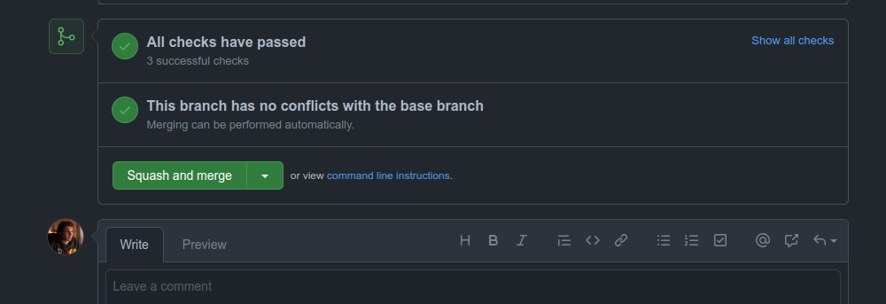
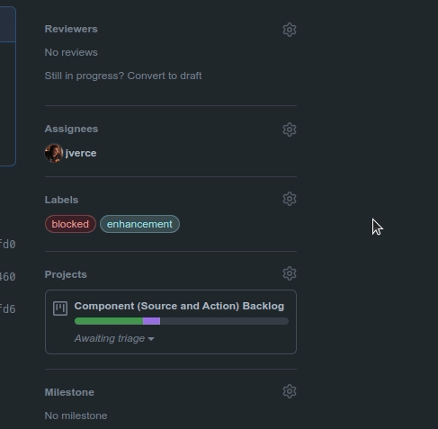
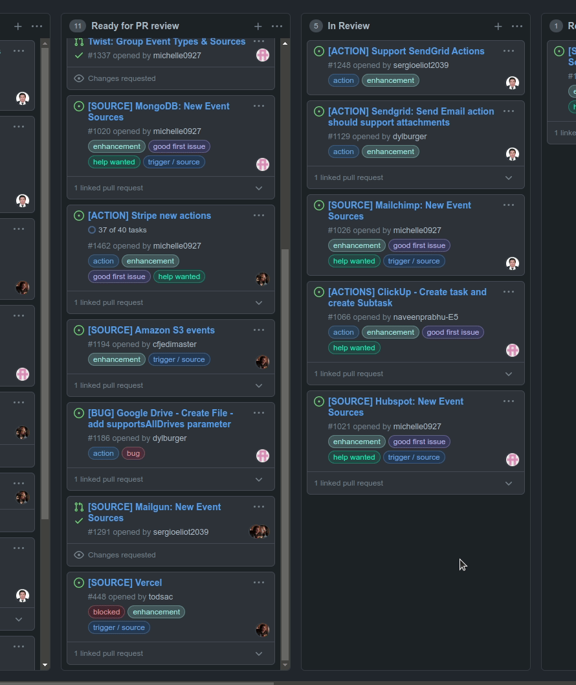

# Contributing to the Pipedream Registry

This document is intended for a technical audience (including those interested
in learning how to author and edit components). It defines guidelines and
patterns developers should follow when building components for the Pipedream
registry.

Developers may create, deploy and share [components](#components) that do not
conform to these guidelines, but they will not be eligible to be listed in the
curated registry (e.g., they may be hosted in a Github repo). If you develop a
component that does not adhere to these guidelines, but you believe there is
value to the broader community, please [reach out in our community
forum](https://pipedream.com/community/c/dev/11).

[[toc]]

## Overview

[Pipedream](https://pipedream.com) is a low code integration platform that makes
it easy to connect APIs remarkably fast. Users can select from thousands of
customizable, open source components for hundreds of apps and orchestrate their
execution in workflows. Developers can
[contribute](https://pipedream.com/contributing) to these open source components
on [Github](/code) by:

- Creating new components (sources and actions)
- Updating existing components (e.g., fixing bugs, enhancing functionality)
- Adding or updating metadata (e.g., descriptions, labels)

Once a PR is merged to the `master` branch of the
[`pipedreamhq/pipedream`](/code) repo, the components are automatically
registered and immediately become available to the 150k+ users of the Pipedream
platform.

### Components

Components are [Node.js modules](../api/#component-structure) that run on
Pipedream's serverless infrastructure. They may use Pipedream managed auth for
[300+ apps](https://pipedream.com/explore) and [use most npm
packages](../api/#using-npm-packages) with no `npm install` or `package.json`
required. Pipedream currently supports two types of components — sources and
actions.

#### Sources

- Emit events that can trigger Pipedream [workflows](/workflows/) (events may
  also be consumed outside of Pipedream via [API](/api/overview/))
- Emitted event data can be inspected and referenced by
  [steps](/workflows/steps/) in the target workflow
- Can use any of Pipedream's built-in [deduping
  strategies](../api/#dedupe-strategies)
- Can be [triggered](../api/#interface-props) on HTTP requests, timers, cron
  schedules, or manually
- May store and retrieve state using the [built-in key-value store](../api/#db)

#### Actions

- May be used as [steps](/workflows/steps/) in [workflows](/workflows/) to
  perform common functions (e.g., get or modify data in an app)
- [Data returned by actions](/workflows/steps/#step-exports) may be inspected
  and used in future workflow steps

### Pipedream Registry

The Pipedream registry consists of sources and actions that have been curated
for the community. Registered components are verified by Pipedream through the
[Github PR process](#process) and:

- Can be trusted by end users
- Follow consistent patterns for usability
- Are supported by Pipedream if issues arise

Registered components also appear in the Pipedream marketplace and are listed in
Pipedream's UI when building workflows.

## Getting Started

**If you're new to Pipedream, we recommend watching this [5 minute
demo](https://www.youtube.com/watch?v=hJ-KRbp6EO8).**

If you're ready to build a component for the Pipedream registry, we recommend
starting with our Quickstart Guides for [source](../quickstart/nodejs/sources/)
and [actions](../quickstart/nodejs/actions/). Then review the [Component API
Reference](../api/).

### Prerequisites

- A free [Pipedream](https://pipedream.com) account
- A free [Github](https://github.com) account
- Basic proficiency with Node.js or Javascript
- Pipedream [CLI](/cli/reference/)

Finally, the target app must be integrated with Pipedream. You can explore all
apps supported by Pipedream in the [marketplace](https://pipedream.com/explore).
If your app is not listed, please [create a Github
issue](https://github.com/PipedreamHQ/pipedream/issues/new?assignees=&labels=app%2C+enhancement&template=app---service-integration.md&title=%5BAPP%5D)
to request it and [reach out](https://pipedream.com/community/c/dev/11) to our
team to let us know that you're blocked on source or action development.

#### Local Checks

When submitting pull requests, the new code will run through a series of
automated checks like linting the code. If you want to run those checks locally
for quicker feedback you must have [NPM](https://www.npmjs.com/) installed and
run the following commands at the root of the project:

1. To install all the project's dependencies (only needed once):

   ```shell
   npm ci
   ```

2. To run the linter checks against your code (assuming that your changes are
   located at `components/foo` for example):

   ```shell
   npx eslint components/foo
   ```

3. Optionally, you can automatically fix any linter issues by running the
   following command:

   ```shell
   npx eslint --fix components/foo
   ```

   Keep in mind that not all issues can be automatically fixed by the linter
   since they could alter the behaviour of the code.

### Process

To create and submit a new or updated component to the Pipedream registry:

1. Anyone from the community can build [sources](/event-sources/) and [actions](/components/actions/) for integrated apps (we refer to these collectively as "[components](/components/#what-are-components)"). If you don't see the app listed in [our marketplace](https://pipedream.com/apps), you can [request it here](https://github.com/PipedreamHQ/pipedream/issues/new?assignees=&labels=app%2C+enhancement&template=app---service-integration.md&title=%5BAPP%5D).
2. Once the Pipedream team integrates the app, ask for the app's "name slug" (you'll need to reference this in your code).
3. All development happens in this [GitHub repo](https://github.com/PipedreamHQ/pipedream). Fork the repo and refer to the [contribution docs](/components/guidelines/#prerequisites) to get your development environment setup.
4. After the app is integrated with Pipedream, check if a directory already exists for the app's name slug in the `components` directory of the repo. These directories contain existing sources and actions for the app.
5. If the directory _doesn't_ exist, create it.
6. Within that directory, create an "[app file](/components/guidelines/#app-files)" for the integration using the format, `[app_name_slug].app.js` ([see this example for Airtable](https://github.com/PipedreamHQ/pipedream/blob/master/components/airtable/airtable.app.js)). App files should contain props, methods, and other code you're using across different components.
7. Refer to the quickstarts for [sources](/components/quickstart/nodejs/sources/) and [actions](/components/quickstart/nodejs/actions/) for guidance.
8. When you're ready to develop your own components, you can reference the [component API docs](/components/api/) and our [contribution guidelines](/components/guidelines/#guidelines-patterns).
9. Create a PR for the Pipedream team to review and post a message in our [community forum](https://pipedream.com/community/c/dev/11) or [public Slack](https://pipedream-users.slack.com/archives/C01E5KCTR16).
10. Address any feedback provided by Pipedream.
11. Once the review is complete and approved, Pipedream will merge the PR to the `master` branch! :tada:

Have questions? Reach out in the [#contribute channel](https://pipedream-users.slack.com/archives/C01E5KCTR16) in Slack or [on Discourse](https://pipedream.com/community/c/dev/11).

Looking for ideas? Check out [sources](https://github.com/PipedreamHQ/pipedream/issues?q=is%3Aissue+is%3Aopen+%5BSOURCE%5D+in%3Atitle)
and [actions](https://github.com/PipedreamHQ/pipedream/issues?q=is%3Aissue+is%3Aopen+%5BACTION%5D+in%3Atitle+) requested by the community!

## Reference Components

The following components may be used as models for developing sources and
actions for Pipedream's registry.

### Reference Sources

| Name                                                                                                          | App          | Type                                         |
| ------------------------------------------------------------------------------------------------------------- | ------------ | -------------------------------------------- |
| [New Card](/code/components/trello/sources/new-card/new-card.js)                                              | Trello       | Webhook                                      |
| [Search Mentions](/code/components/twitter/sources/search-mentions/search-mentions.js)                        | Twitter      | Polling                                      |
| [New or Modified Files](/code/components/google_drive/sources/new-or-modified-files/new-or-modified-files.js) | Google Drive | Webhook + Polling                            |
| [New Submission](/code/components/jotform/sources/new-submission/new-submission.js)                           | Jotform      | Webhook (with no unique hook ID)             |
| [New Stars](/code/components/github/sources/new-star/new-star.js)                                             | Github       | Webhook (with extensive use of common files) |

### Reference Actions

| Name                                                                                                   | App           |
| ------------------------------------------------------------------------------------------------------ | ------------- |
| [Create Single Record](/code/components/airtable/actions/create-single-record/create-single-record.js) | Airtable      |
| [Add Multiple Rows](/code/components/google_sheets/actions/add-multiple-rows/add-multiple-rows.js)     | Google Sheets |
| [Send Message](/code/components/discord_webhook/actions/send-message/send-message.js)                  | Discord       |
| [Append Text](/code/components/google_docs/actions/append-text/append-text.js)                         | Google Docs   |
| [`GET` request](/code/components/http/actions/get-request/get-request.js)                              | HTTP          |

## Guidelines & Patterns

### General

#### Component Scope

Create components to address specific use cases whenever possible. For example,
when a user subscribes to a Github webhook to listen for “star” activity, events
can be generated when users star or unstar a repository. The “New Star” source
filters events for only new star activity so the user doesn’t have to.

There may be cases where it's valuable to create a generic component that
provides users with broad latitude (e.g., see the [custom
webhook](/code/components/github/sources/custom-webhook-events)
event source for GitHub). However, as a general heuristic, we found that tightly
scoped components are easier for users to understand and use.

#### Required Metadata

Registry [components](../api/#component-structure) require a unique `key` and
`version`, and a friendly `name` and `description`. Action components require a
`type` field to be set to `action` (sources will require a type to be set in the
future).

```javascript
module.exports = {
  key: "google_drive-new-shared-drive",
  name: "New Shared Drive",
  description: "Emits a new event any time a shared drive is created.",
  version: "0.0.1",
};
```

#### Component Key Pattern

When publishing components to the Pipedream registry, the `key` must be unique
across registry components and should follow the pattern:

`app_name_slug`-`slugified-component-name`

#### Folder Structure

Registry components are organized by app in the `components` directory of the
`pipedreamhq/pipedream` repo.

```text
/components
 /[app-name-slug]
  /[app-name-slug].app.js
  /actions
   /[action-name-slug]
    /[action-name-slug].js
  /sources
   /[source-name-slug]
    /[source-name-slug].js
```

- The name of each app folder corresponds with the name slug for each app
- The app file should be in the root of the app folder (e.g.,
  `/components/[app_slug]/[app_slug].app.js`)
- Components for each app are organized into `/sources` and `/actions`
  subfolders
- Each component should be placed in its own subfolder (with the name of the
  folder and the name of the `js` file equivalent to the slugified component
  name). For example, the path for the "Search Mentions" source for Twitter is
  `/components/twitter/sources/search-mentions/search-mentions.js`.

You can explore examples in the [components directory](/code/components).

#### Using APIs vs Client Libraries

If the app has a well-supported [Node.js client
library](../api/#using-npm-packages), that should be preferred to manually
constructed API requests to reduce code and improve maintenance.

#### Pagination

When making API requests, handle pagination to ensure all data/events are
processed. Moreover, if the underlying account experiences and/or generates too
much data paginating through the entire collection of records, it might cause
out-of-memory or timeout issues (or both!), so as a rule of thumb the pagination
logic should:

- Be encapsulated as a [generator](https://mzl.la/37z6Sh6) so that the component
  can start processing records after the very first API call. As an example, you
  can check the [Microsoft OneDrive
  methods](/code/components/microsoft_onedrive/microsoft_onedrive.app.js) to
  list files.
- Accept a "next token/page/ID" whenever possible, so that API calls do not
  retrieve the entire collection of records during every execution but rather
  from a recent point in time. The `scanDeltaItems` generator method in the
  example above follows this pattern.
- Persist the last page number, token or record ID right after processing, so
  that following executions of the component process new records to minimize the
  amount of duplicate events, execution time and delayed events. Following the
  same Microsoft OneDrive example, check the `processEvent` method [in this
  component](/code/components/microsoft_onedrive/sources/new-file/new-file.js)
  for an example.

#### Capturing Sensitive Data

If users are required to enter sensitive data, always use
[secret](../api/#general) props.

### Promoting Reusability

#### App Files

App files contain components that declare the app and include prop definitions
and methods that may be reused across components. App files should adhere to the
following naming convention:  `[app_name_slug].app.js`. If an app file does not
exist for your app, please [reach
out](https://pipedream.com/community/c/dev/11).

##### Prop Definitions

Whenever possible, reuse existing [prop
definitions](/components/api/#prop-definitions-example).

If a prop definition does not exist and you are adding an app-specific prop that
may be reused in future components, add it as a prop definition to the app file.
Prop definitions will also be surfaced for apps the Pipedream marketplace.

##### Methods

Whenever possible, reuse [methods](/components/api/#methods) defined in the app
file or within a [common module](#common-files-optional).

As a rule of thumb, every interaction with the app-specific API should go
through the [`.app` file](#app-files). If you need to use an API for which a
method is not defined and it may be used in future components, define a new
method in the `.app` file.

Behavior that is specific to the components themselves (e.g. a method to
generate the metadata of an emitted event) can be specified in a [common
module](#common-files-optional) to be reused by other components without
polluting the main `.app` module.

#### Documentation

Use [JSDoc](https://jsdoc.app/about-getting-started.html) for formal,
lightweight documentation of each method/constant in the app or any other module
that exports constructs to be reutilized by downstream components. Provide a
description and define `@params` and `@returns` block tags (with default values
if applicable — e.g., `[foo=bar]`). This data will both help with reusability
and will be surfaced in documentation for apps in the Pipedream marketplace.

For example:

```javascript
module.exports = {
  methods: {
    /**
     * Get the most recently liked Tweets for a user
     *
     * @param {object} opts An object representing the configuration options
     * for this method
     * @param {string} opts.screenName The user's Twitter screen name (e.g.,
     * `pipedream`)
     * @param {number} [opts.count=200] The maximum number of Tweets to
     * return
     * @param {string} [opts.tweetMode="extended"] Use the default of
     * `extended` to return non-truncated Tweets
     * @returns {Array} Array of most recent Tweets liked by the specified user
     */
    async getLikedTweets(opts = {}) {
      const {
        screenName,
        count = 200,
        tweetMode = "extended",
      } = opts;
      const { data } = await this._makeRequest({
        url: "https://api.twitter.com/1.1/favorites/list.json",
        params: {
          screen_name: screenName,
          count,
          tweet_mode: tweetMode,
        },
      });
      return data;
    },
  },
};
```

#### Testing

Pipedream does not currently support unit tests to validate that changes to app
files are backwards compatible with existing components. Therefore, if you make
changes to an app file that may impact other sources, you must currently test
potentially impacted components to confirm their functionality is not negatively
affected. We expect to support a testing framework in the future.

The following sub-sections contain some tips on what to test.

##### High Traffic or Large Record Collections

- Check that no event was left unprocessed/undetected
- Ensure that events are emitted in order, when applicable. Ensuring that the
  timestamp and/or ID metadata fields match the application's API is usually
  enough, especially when dealing with webhooks that do not guarantee that
  webhook calls are made in order.

##### Deployment, Activation and Deactivation of Components

- When applicable, the deployment step of an event source should emit an
  initial list of events for testing purposes. See the [`deploy` hook
  section](../api/#deploy) for more information.
- [Deployment](../api/#deploy), [activation](../api/#activate) and
  [deactivation](../api/#deactivate) must execute without throwing any errors,
  and users expect components to be activated/deactivated at any time, any
  number of times, without experiencing any issues
- After activating a component, all the resources that it needs must be
  successfully created by the activation process (or reuse any available
  resource when applicable). Similarly, deactivating a component must perform
  the necessary cleanup, **leaving the user's app account in the same state as
  it was prior to the component being activated**.

##### Code Coverage

Even though there is no tooling available in the project to analyze the code
coverage at the moment, it is expected that the entirety of the new code is
exercised prior to submitting it for review.

#### Common Files (optional)

An optional pattern to improve reusability is to use a "common" module to
abstract elements that are used across to multiple components. The trade-off
with this approach is that it increases complexity for end-users who have the
option of customizing the code for components within Pipedream. When using this
approach, the general pattern is:

- The `.app.js` module contains the logic related to making the actual API calls
  (e.g. calling `axios.get`, encapsulate the API URL and token, etc).
- The `common.js` module contains logic and structure that is not specific to
  any single component. Its structure is equivalent to a component, except that
  it doesn't define attributes such as `version`, `dedupe`, `key`, `name`, etc
  (those are specific to each component). It defines the main logic/flow and
  relies on calling its own methods (which might not be implemented by this
  component) and accessing its own props to get any necessary data that it
  needs. In OOP terms, it would be the equivalent of a base abstract class.
- The component module of each source/action would inherit/extend the
  `common.js` component by setting additional attributes (e.g. `name`,
  `description`, `key`, etc) and potentially redefining any inherited methods.

See [Google Drive](/code/components/google_drive) for an example of this
pattern. When using this approach, prop definitions should still be maintained
in the app file.

Reutilizing code via common modules in most cases involves extending them using
the [object spread operator](https://mzl.la/3fW4S7c). This allows modules to
directly reutilize the attributes defined by the common modules as well as
allowing for any further refinement if necessary.

To illustrate this idea, let's assume that we have an app called **My App**,
which is already available in Pipedream under the `my_app` key, meaning that all
of its source code lives under `components/my_app`.

- `components/my_app/my_app.app.js`

  This is the main `.app` module which defines behavior and properties related
  to the underlying application (**My App**), including any API call and
  general-purpose prop definitions.

  ```javascript
  // We use the SDK if it's available, stable and production-ready
  const sdk = require("@my-app/nodejs-sdk");

  module.exports = {
    type: "app",
    app: "my_app",
    propDefinitions: {
      // Project ID is a property that is closely related to the underlying
      // application and it's also general enough to transcend any component,
      // therefore it's added in the `.app` module.
      projectId: {
        type: "string",
        label: "Project",
        description: "The project to associate to this source/action",
        async options({ prevContext }) {
          const { nextToken: token } = prevContext;
          const {
            projects = [],
            nextToken,
          } = await this._getProjects(token);

          const options = projects.map(({
            id,
            name,
          }) => ({
            label: name,
            value: id,
          }));
          return {
            options,
            context: {
              nextToken,
            },
          };
        },
      },
    },
    methods: {
      async _getProjects(token) {
        // Private method to be used internally. Note the `_` prefix in the
        // method's name, which is the convention used in this project for private
        // methods.
        const { data } = await sdk.getProjects({
          token,
        });
        const { projects = [] } = data;
        return projects;
      },
      /**
       * This method retrieves a list of users in a given project
       *
       * @param {string} projectId the ID of the project
       * @returns {object[]} a list of user objects
       */
      async getUsersInProject(projectId) {
        // This is a public method, meaning that it's intended to be used by any
        // component that services this app. This is the reason why this method
        // includes a JSDoc string: since it's consumed by other modules, having
        // a formal documentation facilitates automated checks and interface
        // definitions.
        //
        // In general, app modules should encapsulate and abstract any
        // API-specific details like pagination, formats or authentication
        // (to name a few).
        const { data } = await sdk.listUsers({
          projectId,
        });
        const { users = [] } = data;
        return users;
      },
    },
  };
  ```

- `components/my_app/sources/common.js`

  This is the "common" module that other sources will use in order to avoid
  duplicated code and potentially inconsistent logic.

  Please note that the name `common` is just a convention and depending on each
  case it might make sense to name any common module differently. For example,
  the [AWS sources](/code/components/aws) contains a `common` directory instead
  of a `common.js` file, and the directory contains several modules that are
  shared between different event sources.

  The example below is simplified enough so that it doesn't hurt readability of
  this doc:

  ```javascript
  const app = require("../my_app.app");

  module.exports = {
    props: {
      app,
    },
    methods: {
      /**
       * Retrieves the new data relevant to this execution
       *
       * @param {object} event the input event that the component
       * receives during each execution
       * @returns {object} an object containing list of items (i.e. `items`)
       * with the new data to process
       */
      retrieveNewData() {
        throw new Error("retrieveNewData is not implemented");
      },
      /**
       * Generates the metadata object to append to the emitted event
       *
       * @param {object} data the data being processed by the event
       * source
       * @returns {object} a metadata object containing a unique ID (`id`), a
       * summary of the event (`summary`) and its timestamp (`ts`) as
       * the number of milliseconds since the [Unix Epoch](https://en.wikipedia.org/wiki/Unix_time)
       */
      generateMeta(data) {
        const {
          id,
          created_at: createdAt,
        } = data;
        return {
          id,
          summary: `New event with ID: ${id}`,
          ts: Date.parse(createdAt),
        };
      },
    },
    run(event) {
      const { items = [] } = this.retrieveNewData(event);
      for (const item of items) {
        const meta = this.generateMeta(item);
        this.$emit(item, meta);
      }
    },
  };
  ```

### Props

#### Labels

Use [prop](../api/#user-input-props) labels to customize the name displayed in
the UI of a `prop` or `propDefinition` (independent of the variable name in the
code). The label should mirror the name users of an app are familiar with; i.e.,
it should mirror the equivalent label in the app's UI. This applies to usage in
labels, descriptions, etc. E.g., the Twitter API property for search keywords is
"q", but but label is set to "Search Term".

#### Descriptions

Include a description for a [prop](../api/#user-input-props) if it helps the
user understand what they need to do. Additionally, use markdown as appropriate
to improve the clarity of the description or instructions. When using markdown:

- Enclose sample input values in backticks (`` ` ``)
- Link descriptive text rather than displaying a full URL using markdown syntax.

Examples:

- The async option to select an Airtable Base is self-explanatory so includes no
  description:

  

- The “Search Term” prop for Twitter includes a description that helps the user
  understand what values they can enter, with specific values highlighted using
  backticks and links to external content.

  

#### Optional vs Required Props

Use optional [props](../api/#user-input-props) whenever possible to minimize the
input fields required to use a component.

For example, the Twitter search mentions source only requires that a user
connect their account and enter a search term. The remaining fields are optional
for users who want to filter the results, but they do not require any action to
activate the source:


#### Default Values

Provide [default values](../api/#user-input-props) whenever possible. NOTE: the
best default for a source doesn’t always map to the default recommended by the
app. For example, Twitter defaults search results to an algorithm that balances
recency and popularity. However, the best default for the use case on Pipedream
is recency.

#### Async Options

Avoid asking users to enter ID values. Use [async
options](../api/#async-options-example) (with label/value definitions) so users
can make selections from a drop down menu. For example, Todoist identifies
projects by numeric IDs (e.g., 12345). The async option to select a project
displays the name of the project as the label, so that’s the value the user sees
when interacting with the source (e.g., “My Project”). The code referencing the
selection receives the numeric ID (12345).

Async options should also support [pagination](../api/#async-options-example)
(so users can navigate across multiple pages of options for long lists).

#### Interface & Service Props

In the interest of consistency, use the following naming patterns when defining
[interface](../api/#interface-props) and
[service](COMPONENT-API.md#service-props) props in source components:

| Prop                | **Recommended Prop Variable Name** |
| ------------------- | ---------------------------------- |
| `$.interface.http`  | `http`                             |
| `$.interface.timer` | `timer`                            |
| `$.service.db`      | `db`                               |

### Source Guidelines

These guidelines are specific to [source](/event-sources) development.

#### Webhook vs Polling Sources

Create subscription webhooks sources (vs polling sources) whenever possible.
Webhook sources receive/emit events in real-time and typically use less compute
time from the user’s account. Note: In some cases, it may be appropriate to
support webhook and polling sources for the same event. For example, Calendly
supports subscription webhooks for their premium users, but non-premium users
are limited to the REST API. A webhook source can be created to emit new
Calendly events for premium users, and a polling source can be created to
support similar functionality for non-premium users.

#### Source Name

Source name should be a singular, title-cased name and should start with "New"
(unless emits are not limited to new items). Name should not be slugified and
should not include the app name. NOTE: Pipedream does not currently distinguish
real-time event sources for end-users automatically. The current pattern to
identify a real-time event source is to include “(Instant)” in the source name.
E.g., “New Search Mention” or “New Submission (Instant)”.

#### Source Description

Enter a short description that provides more detail than the name alone.
Typically starts with "Emit new". E.g., “Emit new Tweets that matches your
search criteria”.

#### Emit a Summary

Always [emit a summary](../api/#emit) for each event. For example, the summary
for each new Tweet emitted by the Search Mentions source is the content of the
Tweet itself.

If no sensible summary can be identified, submit the event payload in string
format as the summary.

#### Deduping

Use built-in [deduping strategies](../api/#dedupe-strategies) whenever possible
(`unique`, `greatest`, `last`) vs developing custom deduping code. Develop
custom deduping code if the existing strategies do not support the requirements
for a source.

#### Polling Sources

##### Default Timer Interval

As a general heuristic, set the default timer interval to 15 minutes. However,
you may set a custom interval (greater or less than 15 minutes) if appropriate
for the specific source. Users may also override the default value at any time.

##### Emit Events on First Run

Polling sources should emit events on the first run. This helps users to know
their source works when they activate it. This also provides users with events
they can immediately use to support workflow development. Do not emit multiple
pages of results or more than 100 events on the first run (as a general
heuristic, emit the first page of results returned by the API).

##### Rate Limit Optimization

When building a polling source, cache the most recently processed ID or
timestamp using `$.service.db` whenever the API accepts a `since_id` or "since
timestamp" (or equivalent). Some apps (e.g., Github) do not count requests that
do not return new results against a user’s API quota.

If the service has a well-supported Node.js client library, it'll often build in
retries for issues like rate limits, so using the client lib (when available)
should be preferred. In the absence of that,
[Bottleneck](https://www.npmjs.com/package/bottleneck) can be useful for
managing rate limits. 429s should be handled with exponential backoff (instead
of just letting the error bubble up).

#### Webhook Sources

##### Hooks

[Hooks](../api/#hooks) are methods that are automatically invoked by Pipedream
at different stages of the [component lifecycle](../api/#component-lifecycle).
Webhook subscriptions are typically created when components are instantiated or
activated via the `activate()` hook, and deleted when components are deactivated
or deleted via the `deactivate()` hook.

##### Helper Methods

Whenever possible, create methods in the app file to manage [creating and
deleting webhook subscriptions](../api/#hooks).

| **Description**                         | **Method Name** |
| --------------------------------------- | --------------- |
| Method to create a webhook subscription | `createHook()`  |
| Method to delete a webhook subscription | `deleteHook()`  |

##### Storing the 3rd Party Webhook ID

After subscribing to a webhook, save the ID for the hook returned by the 3rd
party service to the `$.service.db` for a source using the key `hookId`. This ID
will be referenced when managing or deleting the webhook. Note: some apps may
not return a unique ID for the registered webhook (e.g., Jotform).

##### Signature Validation

Subscription webhook components should always validate the incoming event
signature if the source app supports it.

##### Shared Secrets

If the source app supports shared secrets, implement support transparent to the
end user. Generate and use a GUID for the shared secret value, save it to a
`$.service.db` key, and use the saved value to validate incoming events.

### Action Guidelines

_(Coming soon)_

## Reviewing Code

### Preliminary Steps

As a code reviewer, whenever you'd like to review a pull request (PR) there's a
few preliminary steps that we'd like you to take in order to avoid
misunderstandings, wasted time and effort:

1. Targeting a PR:
   1. Check the [main Kanban board](/code/projects/1) for any tasks pending
      review (i.e. the **Ready for PR review** column). These tasks should be
      associated to an open PR that is waiting for a review.
   2. If the above step does not yield any PR, explicitly look for open pull
      requests without reviews and without reviewers assigned to it in the [pull
      requests page](/code/pulls). [This
      link](/code/pulls?q=is%3Apr+is%3Aopen+review%3Anone+no%3Aassignee) already
      provides a filtered view for the mentioned criteria.

2. Quickly go through the main PR view and check if it's actually ready for
   review, or if it's blocked or just not ready yet. Labels are your friend
   here, and there's a label named **blocked** that specifically indicates this.

   Another symptom that a PR is not ready for review are failed automated checks
   (like linting checks), as well as conflicts with the base branch. Scroll to
   the bottom of the PR to verify that everything is fine:

   

   If the automated checks are the only symptom of a PR that's not ready for
   review it's best to try to reach out to the author for an update (either via
   Slack or via a comment in the PR)

3. If you find a PR that you're interested in reviewing, assign yourself as the
   reviewer to avoid other contributors from also reviewing it, as well as
   notifying the author that their work is effectively under review.

   

4. After assigning yourself as a PR reviewer, move its associated task in [the
   Kanban board](/code/projects/1) to the **In Review** column. This helps us
   detect any "abandoned" work sooner rather than later.

   

### Guidelines

When reviewing a PR, there's different aspects to consider for the review to be
successful. Below is a list of things to pay attention to, but this list is by
no means exhaustive and certainly does not apply to every case, so (as always)
use your best judgment throughout the process:

- [Sensible props](#sensible-props)
- [Code structure](#code-structure)
- [Good API usage](#good-api-usage)
- [Robustness](#robustness)
- [Documentation and comments](#documentation-and-comments)
- [Styling](#styling)

#### Sensible Props

In the [Component Scope](#component-scope) section we mention that components
should address specific use cases to simplify the setup process and provide a
better user experience. However, there's cases when it makes more sense to
provide a slightly generalized component that can be customized via props.

For example, let's assume there's an event source that will emit events whenever
a file is created in a cloud storage service. Let's name this component
`cloud_storage-new-file-created`. For this cloud storage service it's also known
that a common use case is to monitor for new folders, which are files of a
specific type. Naturally, and following the guidelines above, we'd create a
customized version of the `cloud_storage-new-file-created` component named
`cloud_storage-new-folder-created` that reacts to newly created folders and
nothing else.

But what about other types of files? Spreadsheets and text documents are
probably important for some users, images and CSS files for other users, and so
on. In this case it makes much more sense to instead create a component named
something like `cloud_storage-new-file-of-type` that is customizable via a prop
of type `string[]` named `fileTypes` and let users select the types of files
they prefer to watch.

The advantage of making a module customizable is that it can then be extended
into particular use cases very easily should those be highly demanded. See the
[Code Structure](#code-structure) section for an example.

If it's unclear which components should be customizable and which ones should be
a sole component, reach out to the Pipedream team on the issue since this
usually requires input from a product perspective.

#### Code Structure

Code should be properly structured so that:

- It's easily maintainable and extendable by other contributors
- Users are able to make sense of the different modules involved in case they
  need to customize them for their specific use case
- It avoids code repetition as much as possible

Going back to our example in the [Sensible Props](#sensible-props) section,
let's assume that the Pipedream team detected that roughly 25% of users that use
this "New File of Type" component use it to watch for new PDF documents. As a
consequence, we want to create a new component called "New PDF Document" so that
those user have an easier time setting up new workflows.

The naive approach would be to copy/paste the logic in the "New File" component,
and fine tune it to fit the specific use case related to PDF documents. For
example:

- `cloud_storage/sources/new-file/new-file.js`

  This is the original event source that emits events whenever a new file is
  added to the cloud storage account. For each incoming event it emits `N`
  events, one for each new file listed in the input event (this is just an
  example for illustration purposes):

  ```javascript
  const cloudStorage = require("../cloud_storage.app");

  module.exports = {
    key: "cloud_storage-new-file",
    name: "New File",
    description: "Emits an event when a new file is created in the cloud storage drive",
    version: "0.0.1",
    props: {
      cloudStorage,
    },
    async run(event) {
      const { newFiles } = event;
      newFiles.forEach(this.$emit);
    },
  };
  ```

- `cloud_storage/sources/new-pdf-document/new-pdf-document.js`

  This is a separate event source, similar to the "New File" one but with an
  adjusted filtering logic that implements the specific use case:

  ```javascript
  const cloudStorage = require("../cloud_storage.app");

  module.exports = {
    key: "cloud_storage-new-pdf-document",
    name: "New PDF Document",
    description: "Emits an event whenever a new PDF document is detected",
    version: "0.0.1",
    props: {
      cloudStorage,
    },
    async run(event) {
      const { newFiles } = event;
      newFiles
        .filter(({ type }) => type === "application/pdf")
        .forEach(this.$emit);
    },
  };
  ```

::: danger
This approach is not ideal since it duplicates logic and can cause future
maintenance pain and confusion
:::

A better approach would be to extract any common logic outside of the specific
component (i.e. `cloud_storage-new-file`) so that both this component as well as
any new ones (e.g. `cloud_storage-new-pdf-document`) become easier to maintain
as they become smaller, while also allowing for future similar event sources to
be implemented in a straightforward manner.

Using the same example, we can extract the logic related to the processing of
new files into a common component that can be reused by many similar ones:

- `cloud_storage/sources/common/new-file.js`

  This is the base component, which implements the abstract logic around the
  processing of events: detecting new files and emitting events for those files
  that meet certain criteria (for simplicity, the criteria here is that the type
  of the file matches the expected ones):

  ```javascript
  const cloudStorage = require("../cloud_storage.app");

  module.exports = {
    props: {
      cloudStorage,
    },
    methods: {
      /**
       * This method returns a boolean flag indicating whether a
       * specific file is relevant and should be processed or not
       *
       * @param {object} file the file object included in the incoming
       * event notification
       * @returns {boolean} whether the file is relevant or not
       */
      isRelevant() {
        throw new Error("isRelevant is not implemented");
      },
    },
    async run(event) {
      const { newFiles } = event;
      const acceptedFileTypes = this.getFileTypes();
      newFiles
        .filter(this.isRelevant, this)
        .forEach(this.$emit);
    },
  };
  ```

  You'll notice this implementation of the `isRelevant` method will in fact
  result in an error. This is the equivalent of an abstract method but with a
  runtime exception instead of a compile-time one. This means that:

  - "Child" modules (i.e. modules that extend this one) must implement the
    method depending on their particular use case
  - The method should be documented so that other developers have an easier time
    understanding its purpose and provide a concrete implementation that works

  ::: warning
  Note that this module is not an event source, but rather a module with code
  to be shared by other modules.
  :::

- `cloud_storage/sources/new-file-of-type/new-file-of-type.js`

  This is the new component, which is customizable via a user prop named
  `fileTypes` (as suggested in the [Sensible Props](#sensible-props) section),
  and extends the base component above to allow the user to freely select the
  types of files to watch for:

  ```javascript
  const base = require("../common/new-file");

  module.exports = {
    ...base,
    key: "cloud_storage-new-file-of-type",
    name: "New File of Type",
    description: "Emits an event whenever a file of a specific type is detected",
    version: "0.0.1",
    props: {
      ...base.props,
      fileTypes: {
        type: "string[]",
        label: "File Types",
        description: "The types of files to watch for",
        options: [
          "application/pdf",
          "application/zip",
          "image/jpeg",
          "image/png",
          // Other types...
        ],
      },
    },
    methods: {
      ...base.methods,
      isRelevant({ type }) {
        return this.fileTypes.includes(type);
      },
    },
  };
  ```

- `cloud_storage/sources/new-pdf-document/new-pdf-document.js`

  This component is a simplified version of the above, which also extends the
  `common/new-file` module. But instead of providing the user with an option to
  select file types of interest, it fixes those types to simply
  `application/pdf` (the type of PDF documents):

  ```javascript
  const base = require("../common/new-file");

  module.exports = {
    ...base,
    key: "cloud_storage-new-pdf-document",
    name: "New PDF Document",
    description: "Emits an event whenever a new PDF document is detected",
    version: "0.0.1",
    methods: {
      ...base.methods,
      isRelevant({ type }) {
        return type === "application/pdf";
      },
    },
  };
  ```

- `cloud_storage/sources/new-file/new-file.js`

  Lastly, the `cloud_storage-new-file` component is refactored so that it reuses
  the new common logic. The new logic provides a canonical implementation of the
  new `isRelevant` method:

  ```javascript
  const base = require("../common/new-file");

  module.exports = {
    ...base,
    key: "cloud_storage-new-file",
    name: "New File",
    description: "Emits an event when a new file is created in the cloud storage drive",
    version: "0.0.2",
    methods: {
      ...base.methods,
      isRelevant() {
        return true;
      },
    },
  };
  ```

#### Good API Usage

In the previous sections we highlighted the fact that the [`.app`
files](#app-files) are the ones that contain almost all of the logic regarding
the interaction with the underlying 3rd party app. For example, the
[`gitlab.app`](/code/components/gitlab/gitlab.app.js) module defines several
methods that encapsulate calls to and knowledge about the [Gitlab
API](https://docs.gitlab.com/ee/api/).

Given that the `.app` files provide such abstractions around external APIs,
there's an opportunity for making good and efficient usage of such APIs without
exposing these details to consumers of those abstractions (i.e. the actions and
event source components). Moreover, it allows us to scope the impact of any API
changes since it will only affect (ideally) a subset of the `.app` module
definitions, similarly to an [anti-corruption layer](https://bit.ly/3grM9k0).

Since every API is different it's virtually impossible and highly impractical to
list every use case and how it should be abstracted, but over the course of this
project we detected a handful of patterns that offered a good balance between
code maintainability, efficient API usage, and component robustness. These
patterns are detailed in the sub-sections below.

##### Metadata Usage

When a component processes a record/event from an app, we must make sure that
the component relies on the correct record metadata, like:

- Record's unique ID
- Record's creation/deletion/edition timestamps
- Event timestamp (when applicable)

The correct usage of the app's metadata is what allows the component to process
the records in a predictable and reliable manner. This is because this metadata
is usually what the app itself uses to provide all its consistency guarantees,
and having the component be aligned to the app in that aspect will make the
component "inherit" those guarantees in almost all cases.

As an example, let's assume that the `cloud_storage` app provides creation and
edition timestamps of a record whenever such record is retrieved via its REST
API. The app's documentation provides information about the fields contained in
a response, and it states something like the following:

| Field        | Description                                 | Format   | Example                                |
| ------------ | ------------------------------------------- | -------- | -------------------------------------- |
| `id`         | The unique identifier of a record           | UUID     | `f5da2a72-80ac-4c70-a890-0ea2e4415cac` |
| `created_at` | The creation date of the record (immutable) | ISO 8601 | `2021-09-01T00:13:48.079Z`             |
| `updated_at` | The date when the record was last updated   | ISO 8601 | `2021-09-10T05:23:44.124Z`             |

With this information, the component can rely on certain API guarantees (e.g.
the uniqueness of the `id` field, the immutability of the creation date, etc.)
to process the records correctly and predictably:

```javascript
const base = require("../base");

module.exports = {
  ...base,
  key: "cloud_storage-new-file-instant",
  version: "0.0.1",
  name: "New File (Instant)",
  description: "Emits an event when a new file is created",
  methods: {
    ...base,
    generateMeta(file) {
      return {
        id: file.id,
        summary: `New file: ${file.name}`,
        ts: Date.parse(file.created_at),
      };
    },
    processFile(file) {
      const meta = this.generateMeta(file);
      this.$emit(file, meta);
    },
  },
};
```

The above example emits events for newly created files, and each event contains
metadata that is closely aligned to the metadata that the app exposes. This will
guarantee that the events emitted will:

- Be unique for each new file
- Maintain the same order in terms of time (i.e. the `ts` field will contain the
  same information as the app)

:::danger BAD
The below example does not make use of the app's metadata
:::

On the other hand, you might run into a case where the component does work in
principle, but it could eventually cause consistency issues when exposed to
situations of high traffic spikes:

```javascript
const { v4: uuid } = require("uuid");
const base = require("../base");

module.exports = {
  ...base,
  key: "cloud_storage-new-file-instant",
  version: "0.0.1",
  name: "New File (Instant)",
  description: "Emits an event when a new file is created",
  methods: {
    ...base,
    generateMeta(file) {
      return {
        id: uuid(),
        summary: `New file: ${file.name}`,
        ts: Date.now(),
      };
    },
    processFile(file) {
      const meta = this.generateMeta(file);
      this.$emit(file, meta);
    },
  },
};
```

The event metadata will in fact contain valid data, but it might:

- Emit duplicate events for the same file, since each emitted event is unique
  regardless of the record that produced it
- The timestamp of the events have no relation whatsoever to the record being
  processed, which can break the order guarantees

:::danger BAD
Another example of bad metadata usage
:::

This example here does use the app's metadata when processing records, but it
doesn't use it properly given the component's use case. Whereas this component
emits events for each record update, the timestamp of the events is set to the
creation date of the records (`created_at`) but it should use the update date
instead (`updated_at`).

```javascript
const base = require("../base");

module.exports = {
  ...base,
  key: "cloud_storage-file-updated-instant",
  version: "0.0.1",
  name: "File Updated (Instant)",
  description: "Emits an event when an existing file is updated",
  methods: {
    ...base,
    generateMeta(file) {
      return {
        id: file.id,
        summary: `New file: ${file.name}`,
        ts: Date.parse(file.created_at),
      };
    },
    processFile(file) {
      const meta = this.generateMeta(file);
      this.$emit(file, meta);
    },
  },
};
```

##### Generators for Pagination

As described in [this section](#pagination), generators allow consumers to
lazily retrieve pages of records without hitting memory and/or compute time
limits (or at least be able to gracefully handle them), making the components
robust and ensuring that no events are missed.

As a rule of thumb, when an API endpoint is paginated verify that its
encapsulating method:

1. Is defined as an `async` generator that yields a page of records on each
   iteration
2. The generator also accepts an optional token for the next page to retrieve
   via the API, and also yields a token for the page following the one queried
   last. A variation of this is allowing the generator to accept a record ID
   representing the last successfully processed record.
3. Process the records as soon as they are yielded by the generator, and avoid
   accumulating records (e.g. in a collection/array) before processing them if
   possible. If the API records need to be processed as a collection (e.g. they
   need to be sorted), check first if such processing can be done by the API.
4. After processing each record or page, persist the record ID or next page
   token, respectively, so that the component keeps track of the progress made
   (like a checkpoint)

Below is an example of a paginated API call wrapped around an `async` generator
method, and a component making use of it:

- `components/cloud_storage/cloud_storage.app.js`

  ```javascript
  const axios = require("axios");

  module.exports = {
    type: "app",
    methods: {
      /**
      * This method yields pages of files present in the drive with `driveId`
      * under the path `path` (the root of the drive if unspecified)
      *
      * @param {string} driveId the ID of the cloud storage drive
      * @param {object} opts additional options
      * @param {string} [opts.path="/"] the path in the drive from where to
      * retrieve the list of files
      * @param {string} [opts.lastFileId] the ID of file from which to list
      * files, exclusive: only files created after this one will be retrieved
      * @yields {object[]} the list of files in the drive, under the specified
      * path
      */
      async *listFiles(driveId, {
        path = "/",
        lastFileId,
      }) {
        const url = this._listFilesUrl();
        const params = {
          drive_id: driveId,
          path,
          since_id: lastFileId,
        };
        const requestConfig = {
          ...this._makeRequestConfig(),
          params,
        };
        while (true) {
          const { data } = await axios.get(url, requestConfig);
          const { records: files = [] } = data;
          if (files.length <= 0) {
            // No more files to scan, we can complete the pagination scan now
            return;
          }

          yield files;
        }
      },
    },
  };
  ```

  ::: tip
  Note that the interface around this API call only requires the drive ID, and
  hides the details regarding pagination. Any additional parameter is optional
  and they are high-level enough for consumers of this method to make sense of
  them without requiring any API knowledge.
  :::

- `cloud_storage/sources/new-files/new-files.js`

  ```javascript
  const cloudStorage = require("../../cloud_storage.app");

  module.exports = {
    props: {
      db: "$.service.db",
      timer: "$.interface.timer",
      cloudStorage,
      driveId: {
        type: "string",
      },
    },
    methods: {
      _getLastFileId() {
        return this.db.get("lastFileId");
      },
      _setLastFileId(lastFileId) {
        this.db.set("lastFileId", lastFileId);
      },
      processFile(file) {
        const meta = {
          id: file.id,
          summary: file.name,
          ts: file.created_at,
        };
        this.$emit(file, meta);
      },
    },
    async run() {
      const lastFileId = this._getLastFileId();
      const filesStream = this.cloudStorage.listFiles(this.driveId, {
        lastFileId,
      });
      for await (const files of filesStream) {
        for (const file of files) {
          this.processFile(file);

          // After processing the record, we persist the file ID to checkpoint the
          // progress made so far
          this._setLastFileId(file.id);
        }
      }
    },
  };
  ```

  ::: tip
  Note that after successfully processing the record we persist its ID so that
  the component can pick up from where it left off in case the execution ends
  unexpectedly
  :::

##### Records Retrieval and Processing

::: warning
Note that this section is more relevant to event source components but the
principles apply to every component involved in a workflow.
:::

In general, APIs usually offer certain endpoints to search and retrieve a subset
of records from the entire collection. Moreover, these endpoints (again, in
general) accept parameters that customize the result, such as sorting by a
specific field in a specific order. Whenever a module performs such calls to the
third party API it **must always offload as much processing as possible** when
it comes to such operations. Some of the advantages of this approach are:

- Offloading computation efforts to the third party service
- Computations performed on the service side are likely performed on the entire
  collection set. If a component were to achieve a similar result it would
  likely have to retrieve all the data from the service, store it in memory,
  pre-process it (e.g. sorting the records) and then proceed to the actual
  record processing.
- Search APIs usually provide certain consistency guarantees which are then
  transferred to the components that use them properly

::: tip GOOD
A made-up example of a proper API call
:::

```javascript{33-37}
const axios = require("axios");

module.exports = {
  type: "app",
  methods: {
    /**
     * This method yields pages of files present in the drive with `driveId`
     * under the path `path` (the root of the drive if unspecified)
     *
     * @param {string} driveId the ID of the cloud storage drive
     * @param {object} opts additional options
     * @param {string} [opts.path="/"] the path in the drive from where to
     * retrieve the list of files
     * @param {string} [opts.lastFileId] the ID of file from which to list
     * files, exclusive: only files created after this one will be retrieved
     * @param {string} [opts.orderBy="created_at"] the file field to use for
     * sorting the collection
     * @param {("asc"|"desc")} [opts.orderDir="asc"] the direction of the
     * collection sorting result
     * @yields {object[]} the list of files in the drive, under the specified
     * path
     */
    async *listFiles(driveId, {
      path = "/",
      lastFileId,
      orderBy = "created_at",
      orderDir = "asc",
    }) {
      const url = this._listFilesUrl();
      const params = {
        drive_id: driveId,
        path,
        since_id: lastFileId,
        order_by: orderBy,
        order_dir: orderDir === "desc"
          ? -1
          : 1,
      };
      const requestConfig = {
        ...this._makeRequestConfig(),
        params,
      };
      do {
        const { data } = await axios.get(url, requestConfig);
        const { records: files = [] } = data;
        if (files.length <= 0) {
          // No more files to scan, we can complete the pagination scan now
          return;
        }

        yield files;
      } while (true);
    },
  },
};
```

If you take a closer look at the highlighted section, you'll notice the
following:

- The `since_id` parameter allows the component to only retrieve records
  starting from a specific ID
- The `order_by` parameter requests the API to sort the fields by their created
  date, which is what we want in case we want to retrieve only the latest files
  added to the drive
- The `order_dir` parameter ensures that the retrieved records are ordered
  chronologically, guaranteeing that the records are processed in a coherent
  manner

::: danger BAD
The example below shows a bad usage of the API
:::

```javascript{41-43,47-51}
const axios = require("axios");

module.exports = {
  type: "app",
  methods: {
    /**
     * This method returns the list of files added to the drive with `driveId`
     * under the path `path` (the root of the drive if unspecified) after a
     * specified date
     *
     * @param {string} driveId the ID of the cloud storage drive
     * @param {object} opts additional options
     * @param {string} [opts.path="/"] the path in the drive from where to
     * retrieve the list of files
     * @param {number} [opts.lastRecordCreatedTimestamp=0] the creation
     * timestamp of the last processed record
     * @returns {object[]} the list of files in the drive, under the specified
     * path
     */
    async listNewFiles(driveId, {
      path = "/",
      lastRecordCreatedTimestamp = 0,
    }) {
      const url = this._listFilesUrl();
      const params = {
        drive_id: driveId,
        path,
      };
      const requestConfig = {
        ...this._makeRequestConfig(),
        params,
      };
      const result = [];
      do {
        const { data } = await axios.get(url, requestConfig);
        const { records: files = [] } = data;
        if (files.length <= 0) {
          // No more files to scan, we can complete the pagination scan now

          // We sort the files by creation date in ascending order
          result.sort(
            (a, b) => Date.parse(a.created_at) - Date.parse(b.created_at),
          );
          return result;
        }

        result.concat(
          files.filter(
            (file) => Date.parse(file.created_at) >= lastRecordCreatedTimestamp,
          ),
        );
      } while (true);
    },
  },
};
```

In this case, the module is performing several extra tasks that the API already
offers in a consistent and reliable way:

- Filtering each one of the retrieved records from the service based on their
  creation date. This means that during each execution, the entire collection of
  records is read from the app's database, transmitted over the Internet, and
  then most of it is discarded based on this filtering.
- Whatever record passes the creation date filter it is appended to the `result`
  array, which at the end of the routine will hold all the records to be
  processed. This can consume a lot of memory, which can crash the execution.
- Before returning the final result, this large collection of records is sorted
  by creation date. **This computation is paid for by the Pipedream user.**
- There's additional data processing needed to perform the operations above,
  such as parsing the `created_at` field which can become confusing for future
  maintainers

##### Summary

To summarize this sub-section, we provide a preliminary checklist of the areas
to focus when evaluating if a component makes proper use of an app's API:

- [Metadata Usage](#metadata-usage)
  1. [ ] ID fields are guaranteed to be unique per record, or per single event
     affecting a record
  2. [ ] The correct record timestamps are used
  3. [ ] When record timestamp information is unavailable, the component's logic
     uses a consistent approach when generating timestamps
- [Generators for Pagination](#generators-for-pagination)
  1. [ ] Paginated APIs are encapsulated around an `async` generator
  2. [ ] The generator accepts an optional page ID/number/token representing the
     next page to be retrieved
  3. [ ] The pagination logic is contained within the generator's definition
  4. [ ] There is no accumulation of data from multiple pages, but instead the
     records are processed as soon as a single page is retrieved from the API
  5. [ ] The component persists its progress as it successfully processes each
     record (or page if applicable)
- [Records Retrieval and Processing](#records-retrieval-and-processing)

#### Robustness

#### Documentation and Comments

#### Styling
