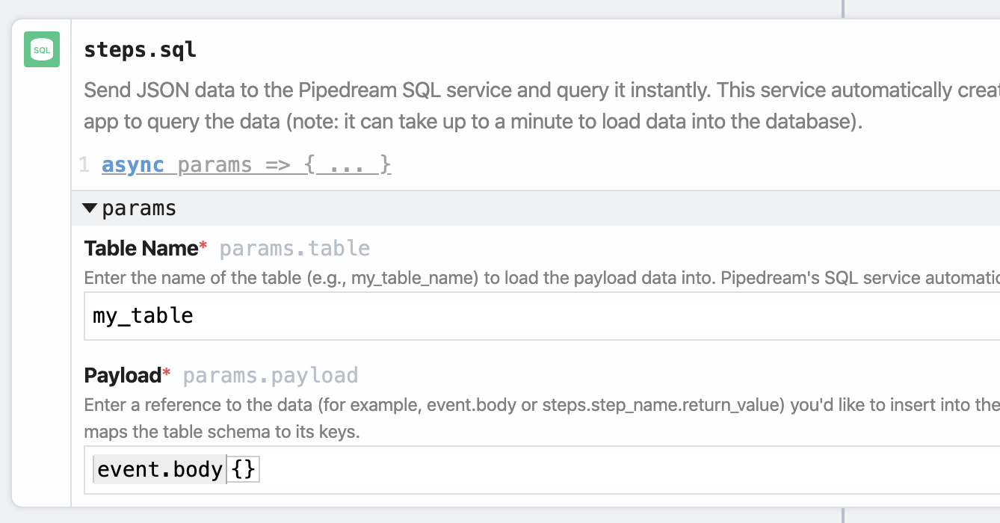
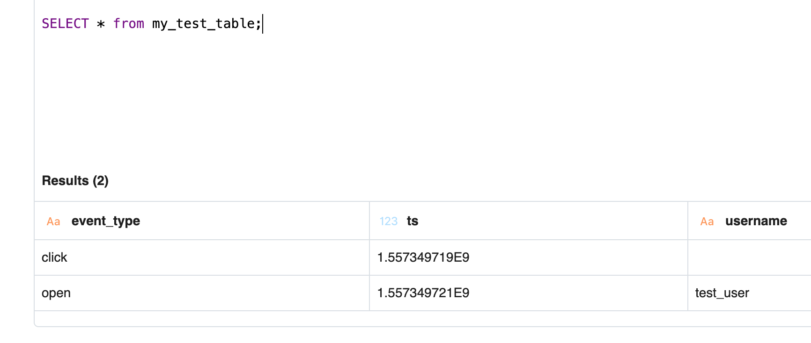
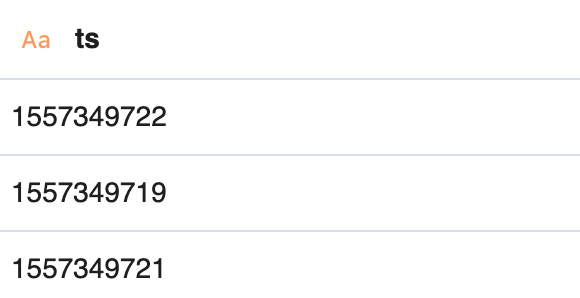

# Pipedream SQL Service

Pipedream operates a hosted data warehouse as a [Destination](/destinations/) you can send events to from a workflow. You can run SQL on any JSON you send here. We call this the **SQL Service**.

Using the SQL Service is simple: 

1. [Send data to the SQL Service from a workflow](#adding-a-sql-destination)
2. [Run SQL on that data](https://pipedream.com/sql)

You don't need to create a table or define a schema for that table before you send data. The SQL service automatically manages the schema from your data, adjusting as the structure of the data changes. **Send JSON, write SQL — that's it**.

The SQL Service is an **append-only database**. This means you cannot update or delete records you send to it - it's optimized for **logging events** from your workflows: webhook requests, errors, or other events generated by your APIs or workflows. The Pipedream SQL Service isn't a replacement for a data warehouse, but it's a simple way to start asking complex questions about your data.

[[toc]]

## Adding a SQL Destination

### Adding a Pipedream SQL Action

Adding a new SQL Destination to your workflow is easy. First, add a new step to your workflow and choose the **Send JSON to Pipedream SQL Service** action.

Then, add the **Table Name** and **Payload** you want to send to the SQL Destination. You can name the table whatever you want, within the [restrictions we impose on table names](#limitations-on-pipedream-sql-table-names).

<div>

</div>

The **Payload** must be a JavaScript object or reference a JavaScript object like `event` or `steps`. The **Payload** cannot be an arrays of JavaScript objects. If you need to send an array of objects to a SQL table, [send them in a loop, using `$send.sql()`](#using-send-sql).

Typically, your **Payload** will be something like `event`, `event.body` or a [step export](/workflows/steps/#step-exports) like `steps.nodejs.myData`.

### Using `$send.sql()`

You can send data to a SQL Destination in [Node.js code steps](/workflows/steps/code/), too, using the `$send.sql()` function. **This allows you to send data to the SQL Destination programmatically, if you need more control than Actions afford**.

`$send.sql()` takes the same parameters as the corresponding Action:

```javascript
$send.sql({
  table: "your_table_name",
  payload: event,
});
```

Like with any `$send` function, you can use `$send.sql()` conditionally, within a loop, or anywhere you'd use a function normally in Node.js.

For example, if you have an array of JavaScript objects, and you want to add _each_ object as a new row to a table in the SQL Service, you can iterate over the array and send each object like so:

```javascript
for (const payload of your_array_of_objects) {
  $send.sql({
    table: "your_table_name",
    payload,
  });
}
```

[Copy this workflow](https://pipedream.com/@dylburger/send-an-array-of-javascript-objects-to-the-sql-service-p_xMCJrm/edit) for a working example.

## What happens when you send data to a SQL Destination

Our goal is to make it easy for you to query event data via SQL, without any of the operational headache of maintaining a full data warehouse, or setting up table schemas manually. We take care of that for you.

Because we're handling this setup behind the scenes, we'd like to discuss how the data sent to SQL Destinations is processed and how we generate table schemas.

First, **payloads sent to SQL Destinations are batched and sent to the SQL service once a minute as a group. Therefore, the first event you send to a SQL Destination will take roughly one minute to be available for querying**.

**The SQL service expects a JavaScript object as payloads**. [Read more below](#how-we-handle-non-json-data-sent-to-sql-destinations).

Once delivered, we create tables and process the schema according to the following rules.

### New table

If this is the first time you've sent data for the **Table** name you added in the SQL Destination, we:

- Create this table, and
- Process all payloads included in the first batch of events, creating the schema for this table based on the structure of their fields and the data types of their values.

Let's walk through some examples to see how this works.

Assume we create a new table called `my_test_table`, and we send the following two events:

```json
{ "event_type": "click", "ts": 1557349719 }
{ "event_type": "open", "ts": 1557349721, "username": "test_user" }
```

We examine the first event, which includes `event_type` — which we mark as a `STRING` — and `ts` — which we mark as a `DOUBLE` (see [how we map JSON data types to Presto types](#mapping-json-data-types-to-presto-types)).

We record that schema and process the second event. This event includes the same two fields, with the same data types, but also includes a _third_ field: `username`. This field is also marked as a Presto `STRING`.

The first event contained two fields, and the second event contained three fields. **The resulting schema needs to capture the _union_ of the fields _across_ events, capturing all three fields**.

In this example, the schema for the `my_test_table` table is:

- **`event_type`** : `STRING`
- **`ts`** : `DOUBLE`
- **`username`** : `STRING`

If we query this table, we'll see the following results:

<div>

</div>

Note that the first event contains an _empty cell_ under `username` — technically a `NULL` value — since that event was missing in that record.

Now let's say we send a third event to this same table:

```json
{ "event_type": "open", "ts": "1557349722", "username": "test_user" }
```

It's tough to spot the difference, but `ts` is a JSON **string** in this example, not a **number** like we saw before.

`ts` now contains numbers and strings in the underlying JSON, so we change the type of this field to `STRING` in the schema, since **`STRING` data captures any arbitrary sequence of characters and allows us to "fall back" to a more general type that captures both the number and string data in the `ts` field**.

Compare the `ts` results before:

<div>

</div>

with the results after we sent this third event, where `ts` is now a `STRING` type in our schema:

<div>

</div>

We dig into these typing decisions in depth [below](#mapping-json-data-types-to-presto).

### Existing table

Once a table exists, we process new data using the same schema logic noted above: we review the fields and values of the new JSON payloads, comparing them against the existing schema and updating that schema accordingly if we encounter a new field, or if the values of an existing field are of a new type than we've previously encountered.

### Mapping JSON data types to Presto types

The automatic schema detection described above follows a set of defined rules. Since the SQL service accepts only JSON data today, we map JSON types to a Presto type that's equivalent, or as close as possible to the original type.

In general, the first time we see a given JSON data type, we convert it to its corresponding Presto / Hive type:

| JSON type | Presto / Hive type |
| --------- | :----------------: |
| String    |      `STRING`      |
| Number    |      `DOUBLE`      |
| Boolean   |     `BOOLEAN`      |
| Array     |      `ARRAY`       |
| Object    |      `STRUCT`      |
| null      |      `STRING`      |

`ARRAY` and `STRUCT` types are more complex, and contain information about the types of data they contain. For example, if we send this payload:

```json
{
  "person": {
    "first_name": "Luke",
    "last_name": "Skywalker",
    "job": "Jedi"
  }
}
```

The resulting schema will have a single **person** `STRUCT` with the following schema:

```
struct<first_name:string,last_name:string,job:string>
```

We also convert strings matching some common patterns to specific Presto types:

| Pattern                                                                    | Presto type |
| -------------------------------------------------------------------------- | :---------: |
| `/^[0-9]{4}-[0-9]{2}-[0-9]{2}\$/`                                          |   `DATE`    |
| `/^[0-9]{4}-[0-9]{2}-[0-9]{2} [0-9]{2}:[0-9]{2}:[0-9]{2}(.[0-9]{1,6})?\$/` | `TIMESTAMP` |

One point worth re-iterating: **all numbers are recorded as Presto `DOUBLE`s**. This might seem odd at first glance — why don't we treat integers as `INT`s and floating point numbers as `DOUBLE`s or `FLOAT`s? In JavaScript, numbers are just numbers — there's no special type to differentiate an integer from a floating-point number. JSON follows this same standard. We follow the guidance of the [JSON spec](https://tools.ietf.org/html/rfc7159#section-6) and use double-precision floating point numbers (in Presto, type `DOUBLE`) for all numbers. This is something we're likely to improve as the SQL service evolves over time.

### Fields with values of variable types

**If a field contains more than one type of data — for example, a number and a string — we always fall back to a field type of `STRING`**.

If you're seeing fields with values of variable types in your events — e.g. a field that contains numbers and strings for different events — coming into your workflow, and that's not expected, you have a couple of options.

1. [`CAST` the data](https://prestodb.github.io/docs/0.172/functions/conversion.html) to the desired type when making SQL queries, or
2. If you always expect events to contain fields with a single value, you can include a code cell in your workflow to check the type of the values of field, using the [`$end()` Pipedream function](/workflows/steps/code/#end) to end the workflow if a value doesn't match the expected type. Calling `$end()` in a code step before a given step cell will not send the data to that Destination.

## Data Retention

Today, **events sent to a SQL Destination are stored for 30 days. After 30 days, the data is completely deleted**.

For example, an event sent around 12:00pm on a given day will be completely deleted 30 days after we received the event, also around 12:00pm.

Therefore, if your workflow is constantly sending events to a SQL Destination, you'll always have a rolling 30-day period of data to analyze.

## Running SQL queries from the UI

Visit [https://pipedream.com/sql](https://pipedream.com/sql) to run SQL queries from the UI. The SQL Service uses the Presto [SQL dialect](#sql-dialect).

You can query `STRUCT` fields — nested objects from the original JSON payload — using "dot notation". If you send an event like this to a SQL Destination:

```json
{
  "event_type": "click",
  "ts": 1557349719,
  "person": {
    "first_name": "Luke",
    "last_name": "Skywalker",
    "job": "Jedi"
  }
}
```

you can query the `first_name` and `job` fields within the `person` object like so:

<div>

</div>

In general, you want to `SELECT struct_name.field_name`.

This can be extended to more complex JSON with multiple levels of nested fields. To query a field two nested objects deep, for example, you can `SELECT struct_1.struct_2.field_name`.

### Limits

The SQL UI returns up to 999 records of results. You can [download the full result set](#downloading-your-results) or fetch the full results [from the API](#running-sql-queries-via-api).

### Keyboard Shortcuts

#### `Meta` + `Enter`

**Run SQL query**. The [`Meta`](https://www.computerhope.com/jargon/m/meta-key.htm) key is typically to the left of your spacebar, like the `Command` key on Macs, or the `Windows` key on PCs.

### Downloading your results

After a query completes, you can download the results of that query by clicking on the download button in the bottom-right:

<div>

</div>

Results for most queries will be downloaded as CSVs. The results of some queries — for example [DDL statements](https://en.wikipedia.org/wiki/Data_definition_language) like `SHOW TABLES` — will be downloaded as `.txt` files.

### SQL dialect

Different databases and query engines support a large variety of SQL statements and functions. A function that works in one database may not be supported on another. The SQL supported on one platform vs. another is referred to as a [**SQL dialect**](https://www.oreilly.com/library/view/sql-in-a/9780596155322/ch01s03.html).

You can run any SQL supported by [Presto v0.172](https://prestodb.github.io/docs/0.172/functions.html) on our SQL service, except for [a subset of queries we prevent](#sql-queries-we-prevent). This should include all the standard SQL you're used to — `SELECT` statements, aggregation functions, joins, and more — in addition to some Presto-specific functions you may have to learn for more advanced use cases.

### SQL queries we prevent

Today, we prevent the following SQL queries:

- `ALTER DATABASE`
- `ALTER TABLE`
- `CREATE DATABASE`
- `CREATE TABLE`
- `CREATE VIEW`
- `DELETE FROM`
- `DESCRIBE VIEW`
- `DROP DATABASE`
- `DROP TABLE`
- `DROP VIEW`
- `SHOW CREATE TABLE`
- `SHOW PARTITIONS`
- `SHOW TBLPROPERTIES`
- `SHOW VIEWS`

If you issue one of these queries, you'll see a message noting that the query is not allowed.

## Running SQL queries via API

Pipedream exposes an API for running SQL queries at **{{$site.themeConfig.SQL_API_BASE_URL}}**. You can authorize requests to this API using your [Pipedream API key](/api/auth/#pipedream-api-key).

This endpoint expects an HTTP `POST` request with the SQL query in the `query` field of the HTTP payload:

```javascript
const response = await axios({
  url: `https://rt.pipedream.com/sql`,
  method: 'POST',
  headers: {
    Authorization: `Bearer PIPEDREAM_API_KEY`,
  },
  data: {
    query: "SELECT COUNT(*) FROM your_table",
  }
})
```

Some HTTP clients like `axios` automatically set a `Content-Type` header of `application/json` when you pass a JavaScript object in the `data` field, but you'll also need to ensure you set that header manually if necessary. For example, you'd make the same query above using `cURL` like so:

```bash
curl -H 'Authorization: Bearer PIPEDREAM_API_KEY' \
  -H 'Content-Type: application/json' \
  -d '{"query": "SELECT COUNT(*) FROM your_table"}' \
  https://rt.pipedream.com/sql
```

The SQL API returns a JSON string that contains metadata on column names, and an array of arrays containing your results and their data types.

The [same limits](#query-limits) governing SQL queries made in the UI apply to queries made using the API.

## Running SQL queries from a workflow

You can also run queries against the SQL service within a workflow. You can use this to run aggregate queries for basic scheduled reports, kick off SQL queries from Slack bots, and more.

In a workflow, there are two actions you can use to run SQL queries, both found under the **Pipedream** app:

- **Query SQL** : returns a formatted set of results you can pass to other steps
- **Get CSV for a SQL query execution** : given the execution ID of a SQL query (returned from the **Query SQL** action), return a formatted CSV. This action can be helpful for formatting the results of a query to send to other systems.

<div>

</div>

[This workflow](https://pipedream.com/@dylburger/send-results-of-pipedream-sql-query-to-google-sheets-p_YyCD6r/edit) shows an example of how to send the results of a query to Google Sheets, for example.

The [same limits](#query-limits) governing SQL queries made in the UI apply to workflows. Additionally, to support longer queries, you may need to extend the [default execution timeout](/workflows/settings/#execution-timeout-limit) in your workflow's settings.

## Triggering workflows on scheduled SQL queries

Just like you can trigger workflows on [HTTP requests](/workflows/steps/triggers/#http) or [cron jobs](/workflows/steps/triggers/#schedule), you can trigger a workflow from the results of a scheduled SQL query using the [Scheduled SQL Source](https://github.com/PipedreamHQ/pipedream/blob/master/components/pipedream/sql/README.md).

For example, you can schedule a query to run once a day, emitting the results to one or more workflows to send the results to Slack, S3, and more.

[Read the docs on this source here](https://github.com/PipedreamHQ/pipedream/blob/master/components/pipedream/sql/README.md).

## Query Limits

- Queries are currently limited to a runtime of 60 seconds.
- You cannot issue a query that returns over `1GB` of data.

## Limitations on Pipedream SQL table names

Table names have just a few limitations:

- They can contain alphanumeric characters.
- Additionally, the only allowed special character is the underscore (`_`), but
- You cannot _begin_ a table name with an underscore.

Some examples:

- **`my_table`** is OK, but **`my-table`** is not (_hyphen not allowed_)
- **`my_table_123`** is OK, but **`my_table@#`** is not (_no other special characters besides underscore_).
- **`table`** is OK, but **`_table`** is not (_no leading underscore_).

If you've chosen a table name that doesn't match these rules, we'll show an error message in the UI:

<div>

</div>

If you want to test potential table names against a [regular expression](https://en.wikipedia.org/wiki/Regular_expression), this pattern captures the same logic as above:

```
/^(?!_)[a-z0-9_]+$/gi
```

## How we handle non-JSON data sent to SQL Destinations

The SQL Service expects JavaScript objects as payloads. If you send a string, a CSV row, or another type of data as the payload, you may see unexpected issues when querying your data via SQL. If you do, please [reach out to our Support team](/support/) and we can help you troubleshoot.

Often, though, we'll just ignore the record when you issue queries. If you see **empty rows** in your result set, that's often an indication of a record we couldn't query using the schema defined for this table.

Technically these empty rows contain `NULL` values for every field. So you can exclude these records by including a filter on your query like:

```sql
WHERE field IS NOT NULL
```

## Still have questions?

Please [reach out](/support/) if this doc didn't answer your question. We're happy to help!
