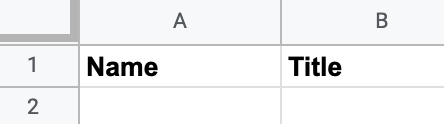
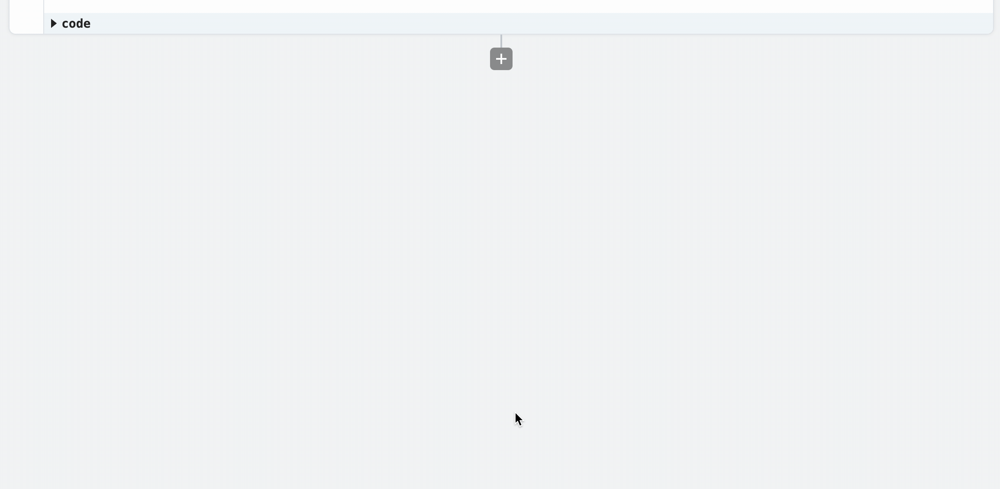
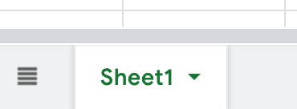
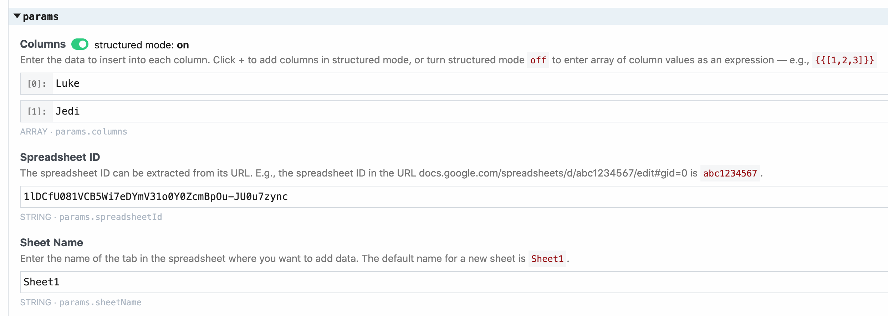
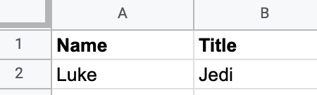
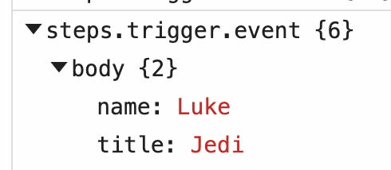
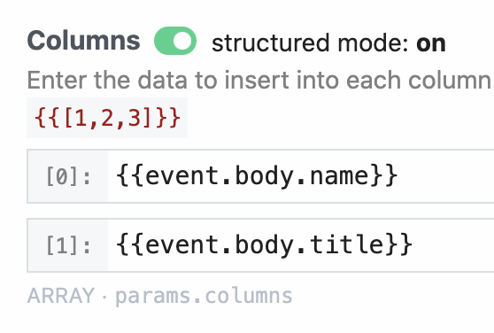
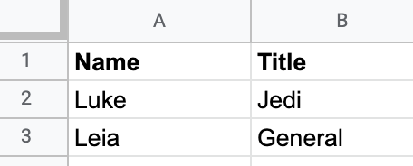
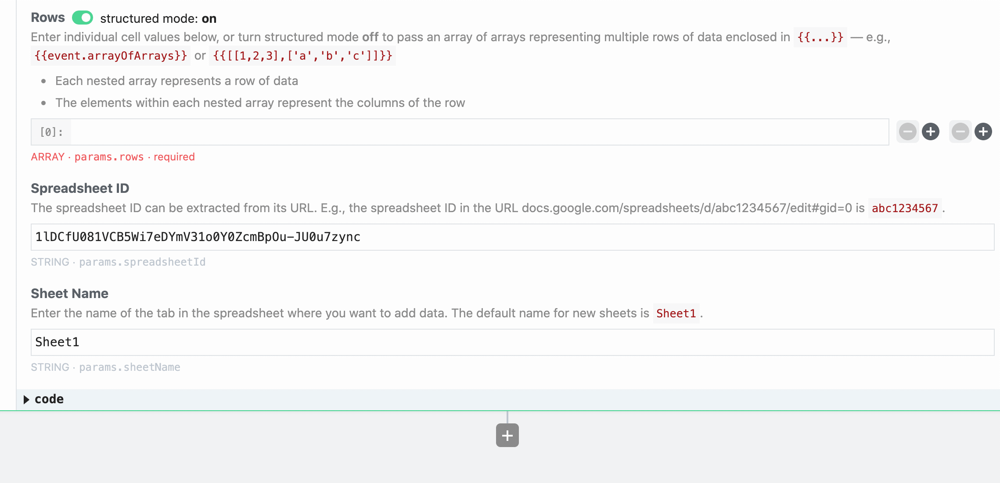

# Example: Add Rows to Google Sheets

Here, you'll find examples of how to add your data to Google Sheets. Each example has a workflow you can copy, with sample Node.js code. 

[[toc]]

## End-to-end example with sample data

The examples below use [this spreadsheet](https://docs.google.com/spreadsheets/d/1lDCfU081VCB5Wi7eDYmV31o0Y0ZcmBpOu-JU0u7zync/edit#gid=0).

<div>

</div>

Each row added to the sheet has two columns - the `Name` and the `Title` of a Star Wars character. To add a row with the name "Luke" and the title "Jedi", add the **Add Single Row to Sheet** step to your [workflow](/workflows):

1. Click on the **+** button below any step
2. Select the **Google Sheets** app
3. Choose the **Add Single Row to Sheet** step

<div>

</div>

[See this workflow](https://pipedream.com/@dylburger/google-sheets-example-add-row-to-google-sheets-with-hardcoded-data-p_G6C6ZBR/edit) for a finished example.

**To add your own data, you'll need to do four things**:

1. Click the **Connect Google Sheets** button and connect your Google Sheets account.
2. The **Columns** section is where you add your data. Each cell of data is placed in its own field in this section. In the [example workflow](https://pipedream.com/@dylburger/google-sheets-example-add-row-to-google-sheets-with-hardcoded-data-p_G6C6ZBR/edit), we added "Luke" in the first column. You can click the **+** button on the right to add another column:

<div>

</div>

3. In the **Spreadsheet ID** field, enter the ID of your spreadsheet. You can find this in the URL. In the [example spreadsheet](https://docs.google.com/spreadsheets/d/1lDCfU081VCB5Wi7eDYmV31o0Y0ZcmBpOu-JU0u7zync/edit#gid=0), it's `1lDCfU081VCB5Wi7eDYmV31o0Y0ZcmBpOu-JU0u7zync`:

<div>

</div>

4. In the **Sheet Name** field, enter the name of the specific sheet _within_ your spreadsheet that you'd like to add data to. Sheet names are found at the bottom of your spreadsheet. By default, new spreadsheets have a single sheet named "Sheet 1":

<div>

</div>

The action should look like this when finished:

<div>

</div>

and you'll see this data in the spreadsheet:

<div>

</div>

## Add data from the HTTP payload to your sheet

_[Read this section](#end-to-end-example-with-sample-data) for a general overview of how to add a row to a Google sheet_.

If you're using the HTTP trigger, you'll find your HTTP payload in the variable `event.body`. If you send this HTTP POST request:

```bash
curl -d '{ "name": "Luke", "title": "Jedi" }' https://endpoint.m.pipedream.net
```

you'll see this data when [inspecting your event](/workflows/events/#examining-incoming-event-data):

<div>

</div>

You can access this data in your workflow at the variables `event.body.name` and `event.body.title`.

[Add the Add Single Row to Sheet action](#end-to-end-example-with-sample-data) to your workflow. In the **Columns** section, add [references to those variables](/workflows/steps/params/#entering-expressions), along with the Spreadsheet ID and Sheet Name of your spreadsheet:

<div>

</div>

Send the same HTTP request to your workflow, and you should see that data in your Google sheet:

<div>

</div>

See [this workflow](https://pipedream.com/@dylburger/add-a-row-to-a-google-sheet-p_NMC9PbG/edit) for a finished example.

## Add multiple rows to a sheet

_[Read this section](#end-to-end-example-with-sample-data) for an overview of the data used in this example_.

You can add multiple rows of data to a Google sheet at one time using the **Add Multiple Rows to Sheet** action:

1. Click on the **+** button below any step
2. Select the **Google Sheets** app
3. Choose the **Add Multiple Rows to Sheet** step

<div>

</div>

Google Sheets [expects these rows to be arrays of data](https://developers.google.com/sheets/api/guides/values#writing_to_a_single_range). To add two rows of Star Wars characters to your sheet, the row data must look like this:

```
[
  ["Luke", "Jedi"],
  ["Leia", "General"]
]
```

[See this workflow](https://pipedream.com/@dylburger/google-sheets-add-multiple-rows-to-sheet-p_NMCr7R/edit) for an example of how to add this data to a Google sheet. The final data will look like this:

<div>

</div>

## Changing complex data to the row format expected by Google Sheets

_[Read this section](#end-to-end-example-with-sample-data) for a general overview of how to add a row to a Google sheet_.

Often, you can add data to a new row just by referencing the correct variable in your workflow. For example, to [store data from the HTTP payload](#add-data-from-the-http-payload-to-your-sheet) to Google Sheets, you can reference the variables directly [as params](/workflows/steps/params/):

<div>

</div>

However, your event data might contain a more complex structure that you can't directly reference in params. For example, if your data looks like this:

```json
{
  "data": [
    { "name": "Luke", "title": "Jedi" },
    { "name": "Leia", "title": "General" }
  ]
}
```

and you want to write the `name` and `title` within each object to Google Sheets:

<div>

</div>

You'll have to write [Node.js code](/workflows/steps/code/) to change that data into the [format that Google expects](https://developers.google.com/sheets/api/guides/values#writing_to_a_single_range):

```
[
  ["Luke", "Jedi"],
  ["Leia", "General"]
]
```

[This workflow shows you how to do that](https://pipedream.com/@dylburger/google-sheets-format-array-of-objects-into-array-of-arrays-p_brCL7BK/edit):

1. `steps.sample_data` returns sample data.
2. `steps.format_data` modifies that data into the format that Google expects:

```javascript
return steps.sample_data.$return_value.data.map((character) => [
  character.name,
  character.title,
]);
```

3. In the **Add Multiple Rows to Sheet** step, you can reference the data from the `steps.format_data` step by turning structured mode `off` and selecting the data in the object explorer:

<div>

</div>

<Footer />
