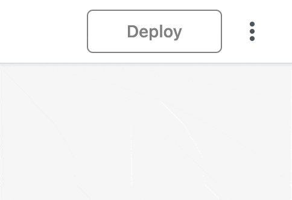
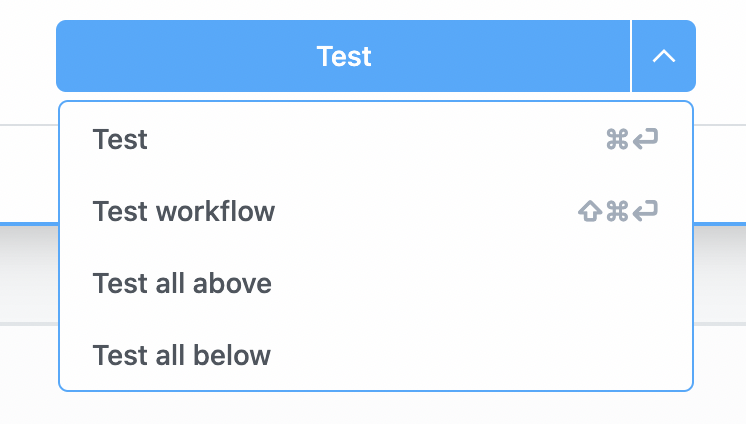
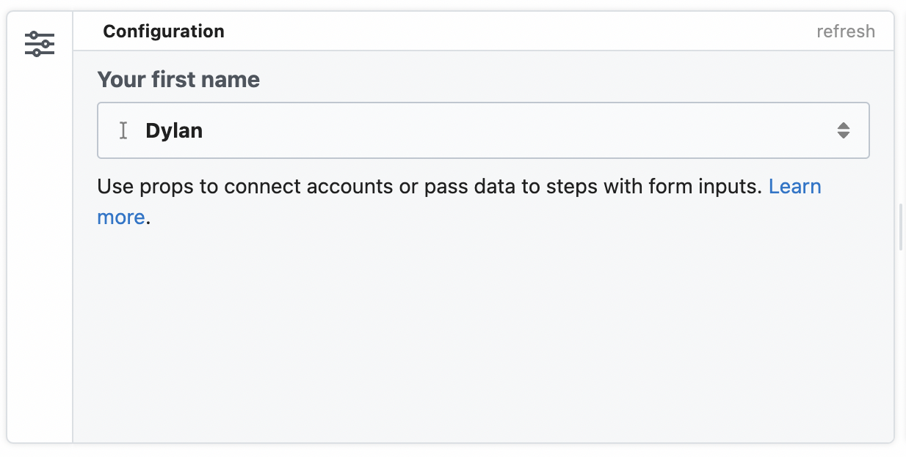
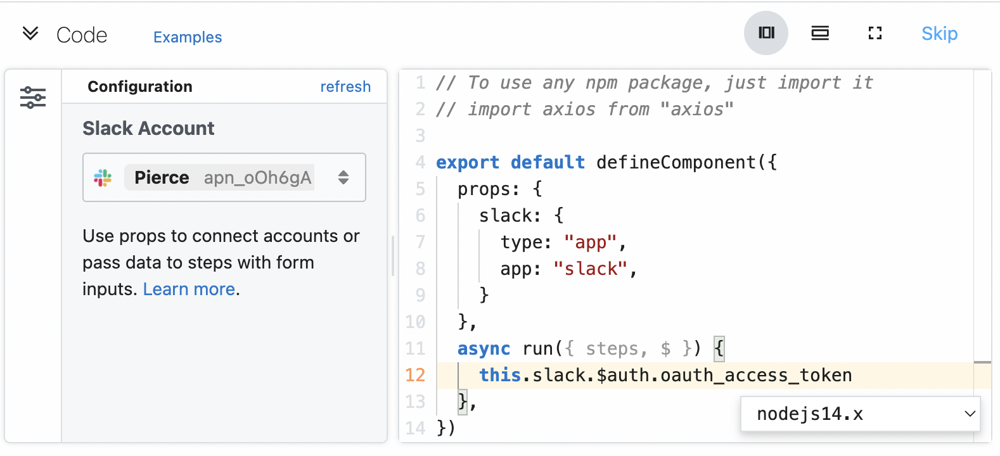

# Migrate from Pipedream v1

The newest version of the Pipedream workflow builder introduces features like creating code steps in [Python](/code/python), [Bash](/code/bash) and [Go](/code/go).

It also brings the [Node.js](/code/nodes) steps closer to our [Component API](/components/) which powers sources & actions in the platform.
We have re-imagined the UX from the ground up, made the product much easier to use and have improved performance. In addition, we are introducing powerful new features including:

* **Edit & test** your workflows in separate editing mode without impacting live workflows
* **Support for multiple languages** including [Node.js](/code/nodejs), [Python](/code/python), [Bash](/code/bash) and [Go](/code/go)
* **Granular testing** including the ability to test individual steps and more
* **Multiple triggers** are now supported per workflow
* **Improved** forms for easier configuration and streamlined building

Let's get you familiar with the changes.

## New Builder Overview

Fundamentally, the new version of the workflow builder gives you the same abilities to build, test and deploy your workflows. However, you'll notice some differences in how to build workflows.

### Editing vs Inspecting

In v1, editing your workflow and inspecting past events were visible in the same view. The new v2 builder has improved this by separating the workflow **Builder** from the workflow events **Inspector**.

Switch between these contexts using the menu in the top right of the workflow builder.



When you first open a deployed workflow, you're presented with the **Inspector** version of the workflow. In this view you can see logs of past events, and select them to see the results of each step in the workflow.

To edit the workflow, click the **Edit** button in the top right hand corner. This will close the inspector and allow you to edit your workflow without the distraction of logs from the production flow.

### Testing Changes

In the v1 workflow builder, you had to deploy the whole workflow to test changes to individual steps. This meant you were 

We've improved this flow. You can test your changes with a new **Test** button.

In addition to testing single steps, you can now selectively test portions of your workflow (e.g. all steps above or below the selected step):



### Deploying Changes

After you're happy with your changes, **deploy** them to your production workflow. Just click the **Deploy** button in the top right hand corner of the screen.

After deploying your changes, your workflow is now live, and any changes you made will run against incoming events.

## Node.js Code Step Changes

There are a few changes to the Node.js code steps that you should know about. Some functions have been renamed for more clarity, and we've aligned the Node.js code steps closer to the [Component API](/docs/components/).

### Code Scaffolding Format

In v1, the Node.js steps would automatically scaffold new Node.js steps in this format:

```javascript
async (event, steps) {
  // your code could be entered in here
}
```

In v2, the new scaffolding is wrapped with a new `defineComponent` function:

```javascript
defineComponent({
  async run({ steps, $ }) {
    // your code can be entered here
  }
});
```

1. The `event` from the trigger step is still available, but exposed in `steps.trigger.event` instead.
2. The `$` variable has been passed into the `run` function where your code is executed.

You can think of the `$` as the entry point to built in Pipedream functions. In v1, this special functions included `$end`, `$respond`, etc. In v2, these have been remapped to `$.flow.end` and `$.respond` respectively. 

These changes unify workflow development to the [Component API](/docs/components/) used by pre-built actions and also allows the [defining of props](#defining-props) from within your code steps.

### Using 3rd party packages

In v1, you had to define your imports of 3rd party packages within the scaffolded function:

```javascript
async (event, steps) {
  const axios = require('axios');
  // your code could be entered in here
}
```

Now, in v2 workflows you can `import` your packages in the top of the step, just like a normal Node.js module:

```javascript
import axios from 'axios';

defineComponent({
  async run({ steps, $ }) {
    // your code can be entered here
  }
});
```

Allowing all of the scaffolding to be edited opens up the ability to [pass props](code/nodejs/#passing-props-to-code-steps) into your Node.js code steps, which we'll cover later.

### Step Exports 

In v1, you could assign arbitrary properties to `this` within a Node.js step and the properties would be available as step exports:

```javascript
// this step's name is get_customer_data
async (event, steps) {
  this.name = 'Dylan';
  // downstream steps could use steps.get_customer_data.name to retrieve 'Dylan'
}
```

In v2 you use $.export to export data, instead::

```javascript
// this step's name is get_customer_data
defineComponent({
  async run({ steps, $ }) {
    $.export('name', 'Dylan');
    // downstream steps can use steps.get_customer_data.name to retrieve 'Dylan'
  }
});
```
::: tip
Using `return` to export data is the same from v1 to v2. You can still `return` data, and it will be available to other steps with `steps.[stepName].$return_value.
:::

### Exiting a workflow early 

In v1, the `$end` function can be called to exit a flow early:

```javascript
async (event, steps) {
  $end('Exiting the whole workflow early');
  console.log('I will never run');
}
```

In v2, this same function is available, but under `$.flow.exit`:

```javascript
defineComponent({
  async run({ steps, $ }) {
    return $.flow.exit('Exiting the workflow early');
    console.log('I will never run');
  }
});
```

### Params vs Props

In the v1 builder, you could pass input to steps using [params](/docs/v1/workflows/steps/params/). In the v2 builder, you pass input using [props](/components/props).

You can still enter free text and select data from other steps in pre-built actions. Also can add your own custom props that accept input like strings, numbers and more just like in v1.

#### Defining params

In the v1 workflow builder, params could be structured or unstructured. The [params schema builder](https://pipedream.com/docs/v1/workflows/steps/params/#configuring-custom-params) allowed you to add your own custom params to steps.

In v2, you can add your own custom props without leaving the code editor.

```javascript
export default defineComponent({
  props: {
    firstName: {
      type: 'string',
      label: 'Your first name',
    }
  },
  async run({ steps, $ }) {
    console.log(this.firstName);
  }
});

```

In the example, you added a firstName string prop. The value assigned to this prop in the workflow builder.

Additionally, Pipedream renders a visual component in the step **Configuration** to accept this input:



### Connecting apps

In the v2 builder, you can connect apps with your code using [props](/components/props).

Above the `run` function, define an app prop that your Node.js step integrates with:

```javascript
import { axios } from "@pipedream/platform"

export default defineComponent({
  props: {
    twitter: {
      type: "app",
      app: "slack",
    }
  },
  async run({ steps, $ }) {
    return await axios($, {
      url: `https://slack.com/api/users.profile.get`,
      headers: {
        Authorization: `Bearer ${this.slack.$auth.oauth_access_token}`,
      },
    }
  },
})
```

After testing the step, you'll see the Slack app will appear in the **Configuration** section on the left hand side. In this section you can choose which Slack account you'd like to use in the step.




### HTTP Response

You can still return an HTTP response from an HTTP-triggered workflow.

Use [`$.respond`](/docs/workflows/steps/triggers/#http) to send a JSON or string response from the HTTP call that triggered the workflow.

```javascript
export default defineComponent({
  async run({ steps, $ }) {
    $.respond({
      status: 200,
      headers: {},
      body: { 
        message: "hello world!"
      }
    });
  },
})
```

Please note, you'll also need to configure the HTTP trigger step to also allow custom responses. Use the dropdown in the **HTTP Response** section of the HTTP trigger to select the **Return a custom response from your workflow** option:


## Known Gaps & Limitations

However, some features from the original builder are not currently available in v2. The Pipedream team is working to quickly address these items, but if you have feedback that isn't listed here, please [[[reach out](/support).

### Sharing workflows

At this time, sharing is not yet implemented in v2 of the workflow builder.

We're working on bringing this same feature to the new version. If you need assistance transferring workflows across accounts, [please contact us](/docs/support).

### `$checkpoint`

The `$checkpoint` functionality to save data between workflow runs has been removed.

But you can leverage the `$.service.db` service to store arbitrary data across your workflow runs like unique IDs. [Read more about using `$.database` here.](https://pipedream.com/docs/code/nodejs/#managing-state)

::: warning
Please note that any values stored in `$.service.db` are only accessible in subsequent workflow runs _in the same step_.
:::

### Public workflows

At this time, all v2 workflows are private.

If you're working with Pipedream support to troubleshoot your workflow, you can share it with the support team under your workflow's **Settings**.

### Versioned deployments and rollback

In v2, you can test and save your progress on a workflow _without_ deploying it.

However, after deploying it's not possible to rollback to a prior version.

## FAQs

### What are the benefits of the new (v2) workflow builder?

* **Edit & test** your workflows in separate editing mode without impacting live workflows
* **Support for multiple languages** including Node, Python, Golang & bash
* **Granular testing** including the ability to test individual steps and more
* **Multiple triggers** are now supported per workflow
* **Improved** forms for easier configuration and streamlined building

### What are the limitations of the new (v2) workflow builder?

* `$checkpoint` has been removed from v2 workflows, but `$.database` is a near equivalent.
* Sharing workflows is not supported
* Making workflows public is not supported
* Workflows are no longer versioned

[The limitations of the new workflow builder are covered in detail here](/docs/migrate-from-v1#limitations).

### Are v2 workflows backwards compatible?

If your workflow is not using custom Node.js code and is compromised of only prebuilt actions, then there's a good chance it's supported.

We're currently bringing all of our legacy actions up to v2 which also follows the same [Component API](/docs/components/).

### Will I still be able to open and edit v1 workflows?

Yes, absolutely you will still be able to view and edit v1 workflows. There is no need to immediately change your workflows from v1 to v2.

### How do I migrate v1 workflows to v2 workflows?

At this time we do not have an automated process to change v1 to v2. To create a v2 equivalent workflow, you can recompose your v1 workflow in the v2 builder.

However, if it uses custom Node.js code steps, be sure to [follow the changes we describe in the guide above](/migrate-from-v1/#node-js-code-step-changes).

### When will the new (v2) workflow builder be the default builder for all customers?

v2 is currently an opt in feature, you can still create and edit v1 workflows if you have an grandfathered account.

We will not make the v2 builder the default workflow experience until we have reached feature parity with v1 by providing paths to overcome the [limitations of v2](#known-gaps-limitations).

### When will I no longer be able to create v1 workflows?

We will continue to support creation of v1 workflows until


