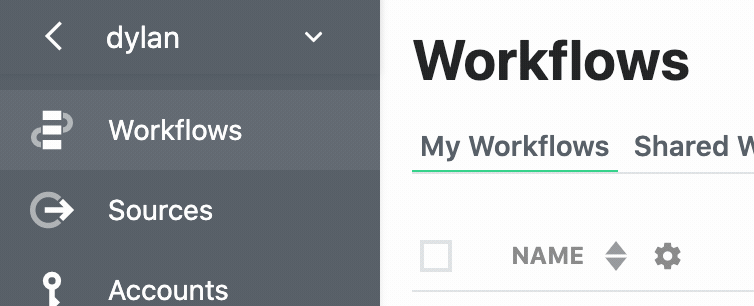
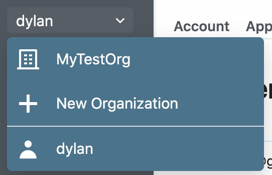

# Organizations

Organizations provide your team a way to manage resources in a shared workspace. Any resources created by the org are owned by the org and accessible to its members.

## Creating an org

Click the [context switcher](#switching-context) in the top-left of the page and select the button labeled **New Organization**:

You'll be asked to enter the org's name, which functions as its [username](/user-settings/#account), and an email address. This email address will receive system notifications (like error and usage emails). We recommend using a group email address so everyone can monitor team resources.

## Inviting users to an org

Once you've [created an org](#creating-an-org), visit [https://pipedream.com/settings/users](https://pipedream.com/settings/users) to invite new members to it. 

## Removing members from an org

Visit [https://pipedream.com/settings/users](https://pipedream.com/settings/users) and click the **...** to the right of any user. Choose the option to **Remove User**.

## Switching context

At the top-left of the Pipedream app, you'll see a drop-down menu titled with your username. When you click that, you'll see a list of any orgs you're a member of:

This is called the **context switcher**, and sets the context for creating resources in the Pipedream app.

By default, you operate within your **user context**. All resources (workflows, event sources, connected accounts, etc.) you create within this context are owned by your core Pipedream user: the username you created when you signed up for Pipedream.

When you [create an org](#creating-an-org), you'll see that org listed in the context switcher. When you select that org from the context switcher, you'll switch your context to that org. You'll see resources owned by the org here. Any resources you create in this context are owned by the org, not your personal user.