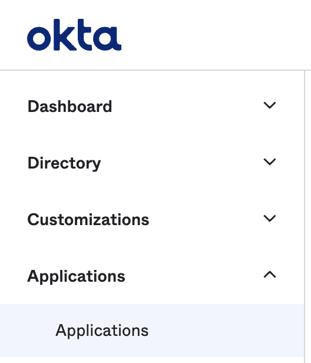

# SSO - Okta

Pipedream supports Single-sign on (SSO) with Okta. This guide shows you how to configure SSO in Pipedream to authenticate with your Okta org.

[[toc]]

## Requirements

- SSO is only supported for [organizations](/orgs/) on the [Enterprise plan](/pricing/#enterprise-plan). Visit the [Pipedream pricing page](https://pipedream.com/pricing) to upgrade.
- You must be an administrator of your Pipedream organization
- You must have an Okta account

## Configuration

1. In your Okta **Admin** dashboard, select the **Applications** section and click **Applications** below that:

2. Click **Browse App Catalog**:

3. Search for "Pipedream" and select the Pipedream app:

4. Click **Add**:

5. Fill out the **General Settings** that Okta presents, and click **Done**:

6. Select the **Sign On** tab, and click **Edit** at the top right:

7. Scroll down to the **SAML 2.0** settings. In the **Default Relay State** section, enter `organization_username`:

8. Set any other configuration options you need in that section or in the **Credentials Details** section, and click **Save**.

9. In the **Sign On** section, you'll see a section that includes the setup instructions for SAML:

Click the **Identity Provider metadata** link and copy the URL from your browser's address bar:

10. Visit your [Pipedream organization settings](https://pipedream.com/settings/account). Under the **Auth** section, add the metadata URL in the **SAML** section and click **Confirm**:

11. Back in Okta, click on the **Assignments** tab of the Pipedream application. Click on the **Assign** dropdown and select **Assign to People**:

Assign the application to the relevant users in Okta, and Pipedream will configure the associated accounts on our end.

Users can log into Pipedream at [https://pipedream.com/auth/sso](https://pipedream.com/auth/sso) by entering your organization's name (found in your [Settings](https://pipedream.com/settings/account)). You can also access your SSO sign in URL directly by visiting [https://pipedream.com/auth/sso/your_org_name](https://pipedream.com/auth/sso), where `your_org_name` is the name of your org.

## Important details

Before you configure the application in Okta, make sure all your users have matching email addresses for their Pipedream user profile and their Okta profile. Once SSO is enabled, they will not be able to change their Pipedream email address.

If a user's Pipedream email does not match the email in their IDP profile, they will not be able to log in.

If existing users signed up for Pipedream using an email and password, they will no longer be able to do so. They will only be able to sign in using SSO.
