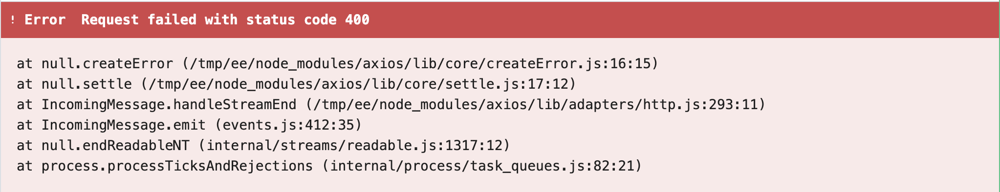
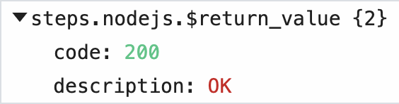
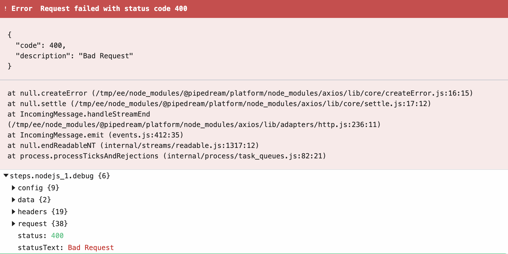

# `@pipedream/platform` axios

[[toc]]

## Why `@pipedream/platform` axios?

`axios` is an HTTP client for Node.js ([see these docs](/workflows/steps/code/nodejs/http-requests/) for usage examples).

`axios` has a simple programming API and works well for most use cases. But its default error handling behavior isn't easy to use. When you make an HTTP request and the server responds with an error code in the 4XX or 5XX range of status codes, `axios` returns this stack trace:

<div>

</div>

This only communicates the error code, and not any other information (like the body or headers) returned from the server.

Pipedream publishes an `axios` wrapper as a part of [the `@pipedream/platform` package](https://github.com/PipedreamHQ/platform). This presents the same programming API as `axios`, but implements two helpful features:

1. When the HTTP request succeeds (response code < `400`), it returns only the `data` property of the response object — the HTTP response body. This is typically what users want to see when they make an HTTP request:

<div>

</div>

2. When the HTTP request _fails_ (response code >= `400`), it displays a detailed error message in the Pipedream UI (the HTTP response body), and returns the whole `axios` response object so users can review details on the HTTP request and response:

<div>

</div>

## Using `@pipedream/platform` axios in component actions

To use `@pipedream/platform` axios in component actions, import it:

```javascript
import { axios } from "@pipedream/platform"
```

`@pipedream/platform` axios uses methods [provided by the `$` object](/components/api/#actions), so you'll need to pass that as the first argument to `axios` when making HTTP requests, and pass the [standard `axios` request config](https://github.com/axios/axios#request-config) as the second argument.

Here's an example action:

```javascript
import { axios } from "@pipedream/platform"

export default {
  key: "my-test-component",
  name: "My Test component",
  version: "0.0.1",
  type: "action",
  async run({ $ }) {
    return await axios($, {
      url: "https://httpstat.us/200",
    })
  }
}
```