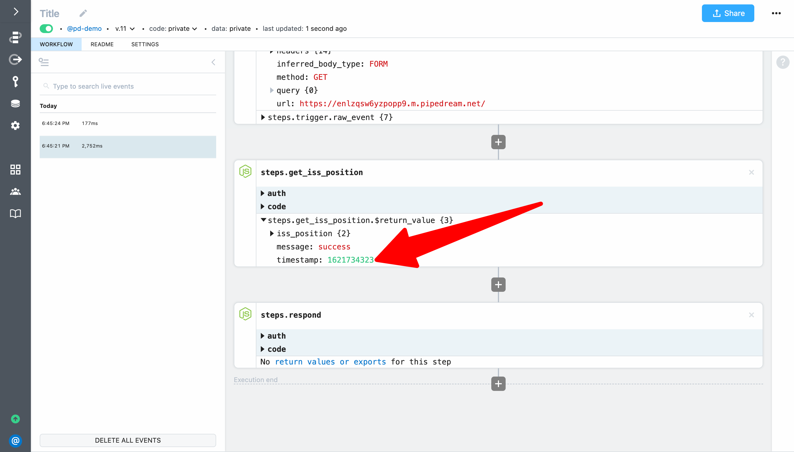
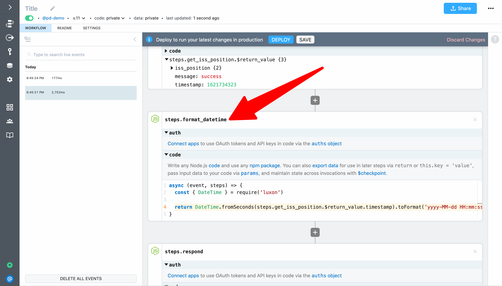
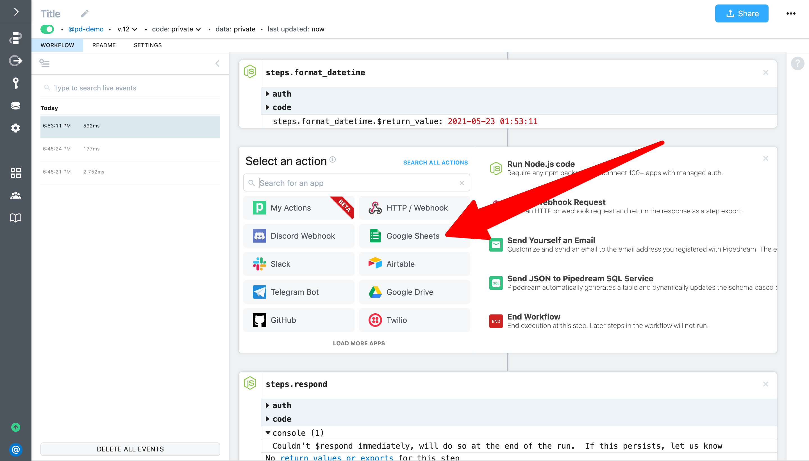
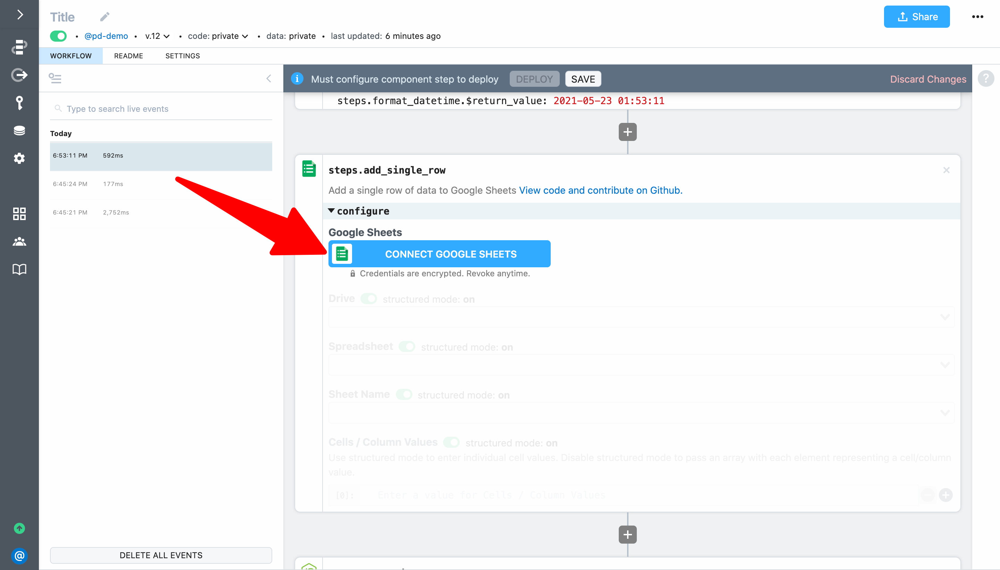
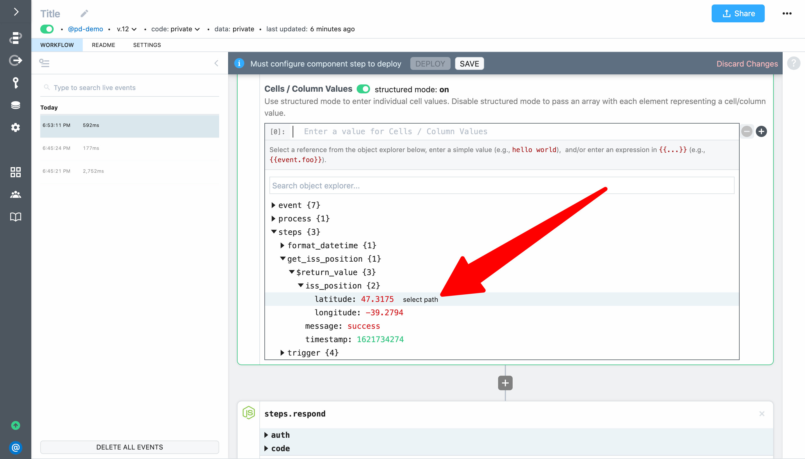
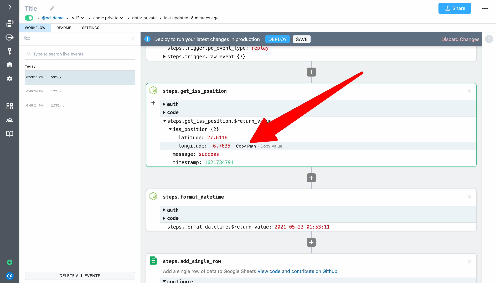
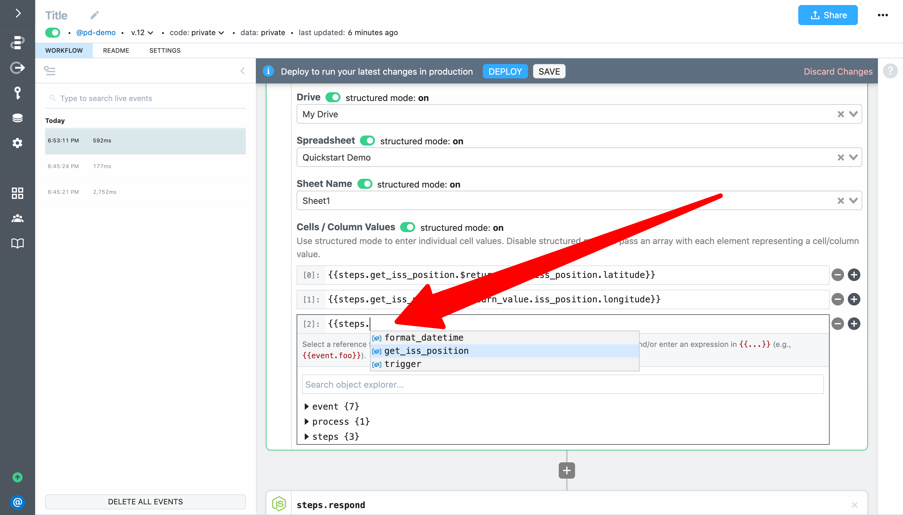
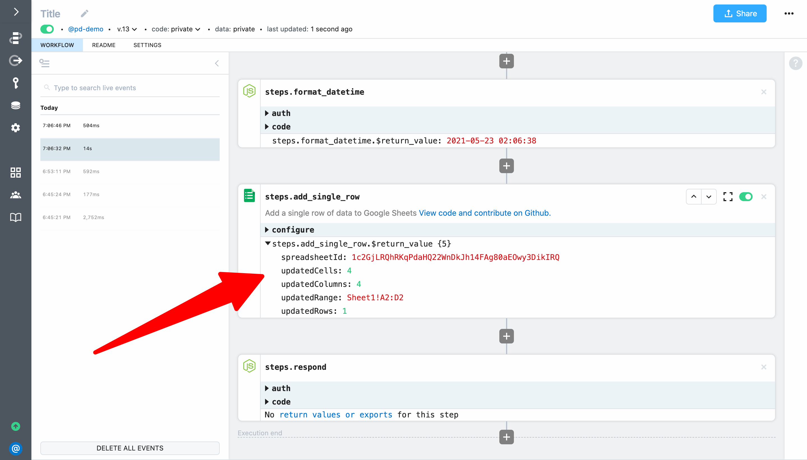

# Insert data into Google Sheets

Next, let's transform data returned by the ISS API and save it to Google Sheets. This example builds on the workflow created in [previous sections](/quickstart/hello-world/) and will cover how to:

1. Transform a timestamp into a Google Sheets compatible date/time using the `luxon` npm package
2. Reference exports for a previous step in action inputs
3. Add data to Google Sheets

First, create a Google Sheet with the columns `Latitude`, `Longitude`, `Timestamp`, and `Date/Time` in the first row:

  

Next, let's change the names of our last two steps to better reflect their purpose. First, change `steps.get_request` to `steps.get_iss_position`:


Then, change `steps.nodejs` to `steps.respond`. You also need to update the code in this step that references `steps.get_request.$return_value.iss_position` to `steps.get_iss_position.$return_value.iss_position`.


Here's the updated code for `steps.respond`:

```javascript
await $respond({
  status: 200,
  immediate: true,
  body: steps.get_iss_position.$return_value.iss_position
})
```

Then **Deploy** and make a request to your workflow endpoint to validate your changes. 

Next, select the most recent event and inspect the exports for `steps.get_iss_position`. You can see that the `timestamp` field returned by the API is not a friendly, human-readable date/time:



Let's fix that by using the `luxon` npm package to transform the timestamp into a value that is human-readable and that Google Sheets will interpret as a date/time. Based on a quick Google Search, the date/time format expected by Google Sheets is `yyyy-MM-dd HH:mm:ss`. 

Click the **+** button to add a new step after `steps.get_iss_position` and select **Run Node.js code**. 


Then add the following code to convert the timestamp to a Google Sheets compatible date/time and export it from the code step:

```javascript
const { DateTime } = require('luxon')

return DateTime.fromSeconds(steps.get_iss_position.$return_value.timestamp).toFormat('yyyy-MM-dd HH:mm:ss');
```

Let's also change the name of the step to `steps.format_datetime`



**Deploy** your changes test your changes (load the endpoint URL or use the **Replay Event** or **Send Test Event** buttons). <!---->

Next, select the most recent event. You should see a human-readable date/time as the return value for `steps.format_datetime` (in GMT).


Next click the **+** button to add a new step after `steps.format_datetime` and select the **Google Sheets** app:



Then select the **Add Single Row** action:


To configure the step, first connect your Google Sheets account. When you click on **Connect Google Sheets** Pipedream will open a popup window where you can sign in to connect your account.



When prompted by Google, allow Pipedream access:


After you connect your account, Pipdream will securely store an authorization token that you can use in actions and code steps to authenticate API requests (we'll cover how to use this token in code steps later in this guide). If you connect an OAuth account (like Google Sheets), then Pipedream will automatically refresh the token without further action (key-based APIs do not require background refresh).

Next, select your **Drive**, **Spreadsheet** and **Sheet Name** from the drop down menus.


NNext, let's configure the cells / column values. First, we'll use the object explorer to select a value. The object explorer is automatically loaded whenever you focus in an action input. You can expand any item and then select the reference you want to insert.



Another option is to explore the exports for a step and click on the **Copy Path** link. Then paste the reference into the action input.



The final option is to use autocomplete — add double braces `{{ }}` and start typing between them to get autocomplete the same way you do in code steps. 



Since we want to add four columns of data with the latitude, longitude, timestamp and the formatted date time (in that order), add the following references to the **Cells / Column Values** inputs:

**[0]:** <code v-pre>{{steps.get_iss_position.$return_value.iss_position.latitude}}</code>

**[1]:** <code v-pre>{{steps.get_iss_position.$return_value.iss_position.longitude}}</code>

**[2]:** <code v-pre>{{steps.get_iss_position.$return_value.timestamp}}</code>

**[3]:** <code v-pre>{{steps.format_datetime.$return_value}}</code>

Your fully configured step should look similar to this:


Next, **Deploy** your changes and reload your endpoint URL. Your workflow should execute successfully:



When you view the response returned from the workflow, you should see the latest position of the ISS...


...and when you check your Google Sheet you should see data about the ISS position.


**If you loaded the URL in your web browser, you'll actually see two events. We'll fix that in the next example. [Take me to the next example &rarr;](../end-workflow-early/)**


