# Insert data into Google Sheets

Next, let's transform data returned by the ISS API and save it to Google Sheets. This example builds on the workflow created in [previous sections](/quickstart/) and will cover how to:

[[toc]]

::: tip
If you didn't complete the previous examples, we recommend you start from the [beginning of this guide](/quickstart/). If you still want to start here, [copy this workflow](https://pipedream.com/@gettingstarted/quickstart-use-any-npm-package-p_pWCg5BP) and then follow the instructions below. If you have any issues completing this example, you can [view, copy and run a completed version](https://pipedream.com/@gettingstarted/quickstart-insert-data-into-google-sheets-p_KwCAR9z).
:::

### Set up a Google Sheet for this example

First, create a Google Sheet with the columns `Latitude`, `Longitude`, `Timestamp`, and `Date/Time` in the first row (or make a copy of [our sample Google Sheet](https://docs.google.com/spreadsheets/d/1ArKQhQ6EO1uaDZ2WyIU-aMBMQnsJXU9TbKIvFM_q1dY/edit)):

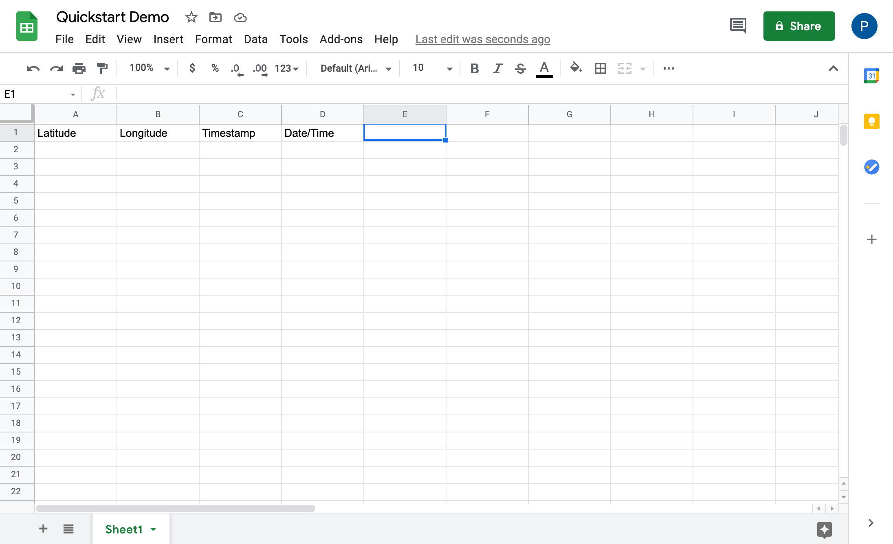  

### Transform a timestamp using the `luxon` npm package
Next, select a recent event and inspect the exports for `steps.get_iss_position`. We can see that the `timestamp` field returned by the API is not a friendly, human-readable date/time:

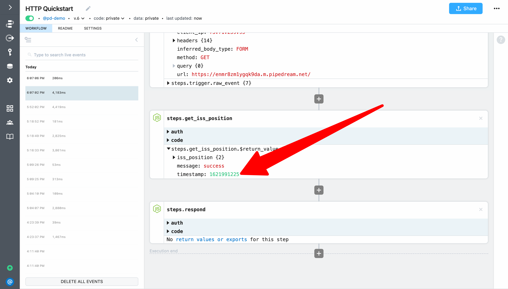

Let's fix that by using the `luxon` npm package to transform the timestamp into a value that is human-readable — and one that Google Sheets will interpret as a date/time. Based on a quick Google Search, the date/time format expected by Google Sheets is `yyyy-MM-dd HH:mm:ss`. 

Click the **+** button to add a new step after `steps.get_iss_position` and select **Run Node.js code**. 

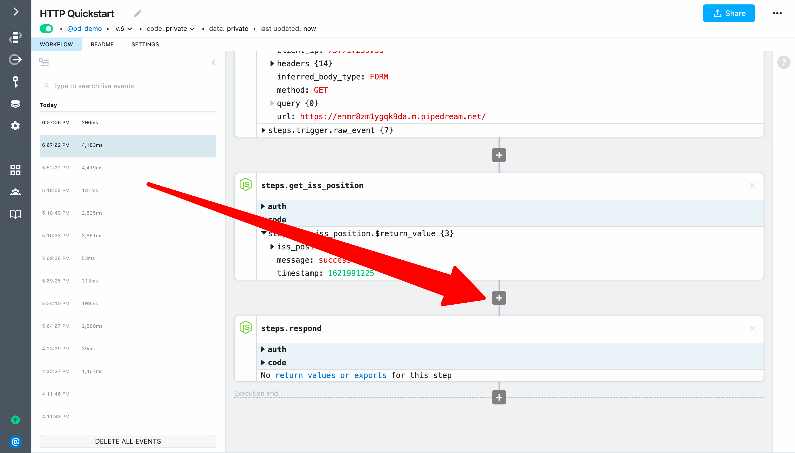

Then add the following code to convert the timestamp to a Google Sheets compatible date/time and export it from the code step:

```javascript
const { DateTime } = require('luxon')

return DateTime.fromSeconds(steps.get_iss_position.$return_value.timestamp).toFormat('yyyy-MM-dd HH:mm:ss');
```

Then update the name of the code step to `steps.format_datetime`:

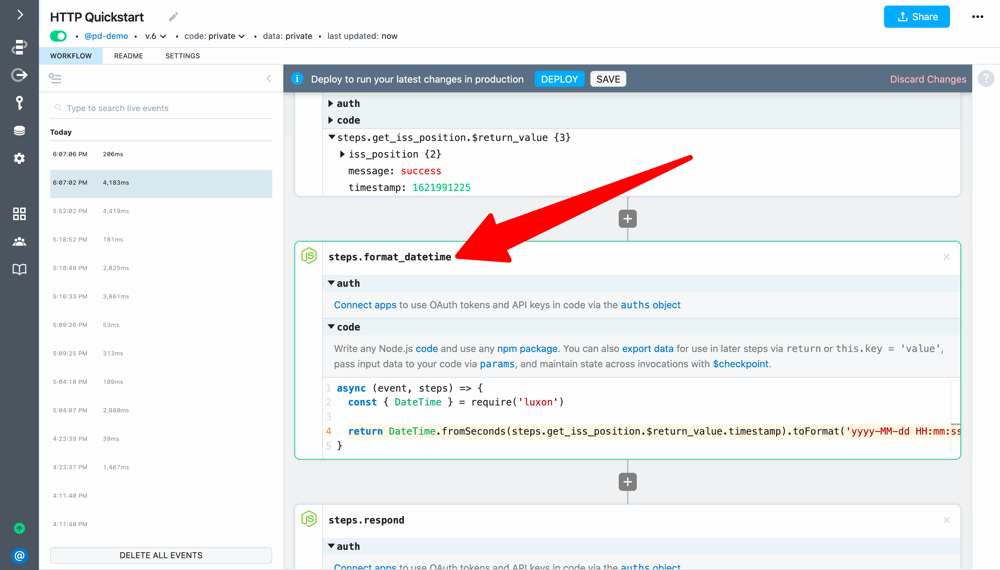

**Deploy** and test your changes (load the endpoint URL or use the **Send Test Event** button).

Next, select the most recent event. You should see a human-readable date/time as the return value for `steps.format_datetime` (in GMT).

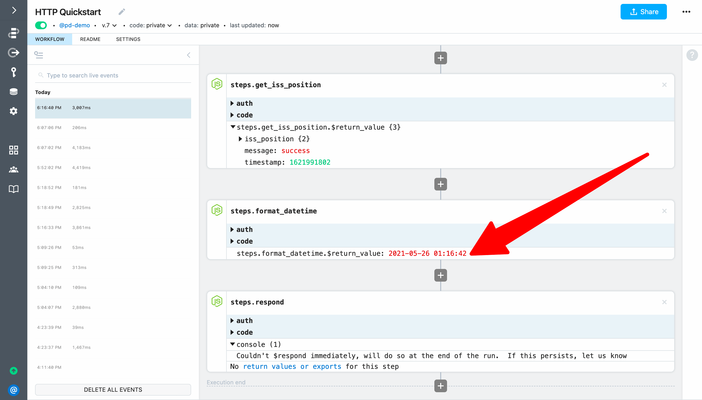

### Connect an account to use an action

Next, click the **+** button to add a new step after `steps.format_datetime` and select the **Google Sheets** app:


Then select the **Add Single Row** action:

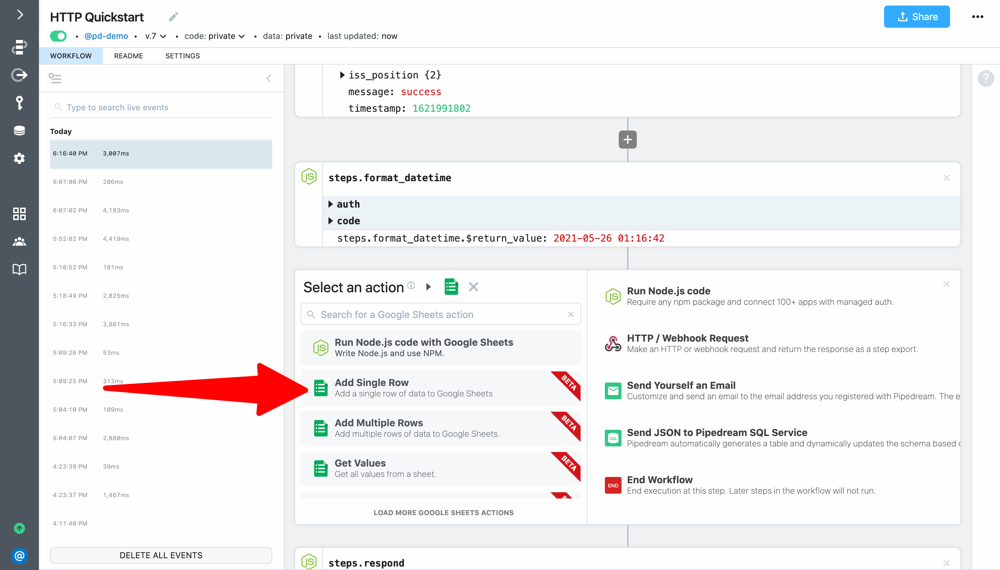

To configure the step, first click on **Connect Google Sheets** (or select an account if you've previously connected one).

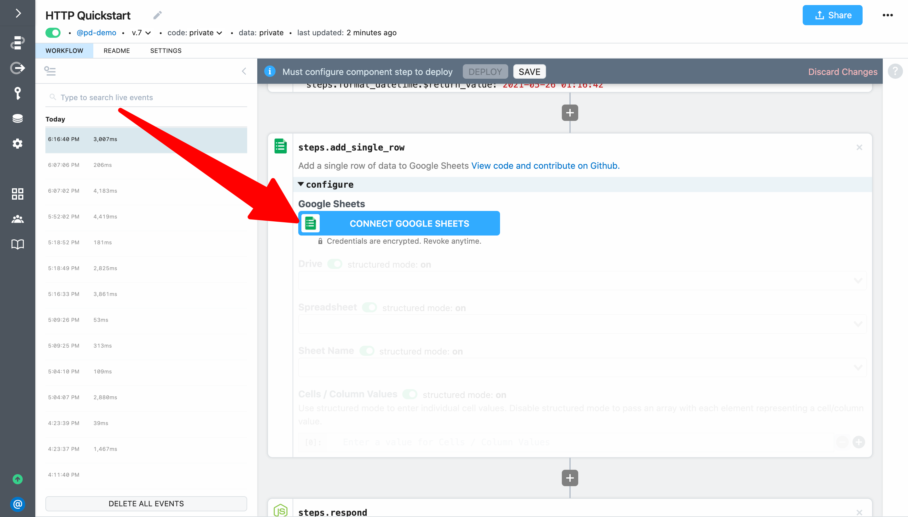

When you click on **Connect Google Sheets** Pipedream will open a popup window where you can sign in to connect your account. When prompted by Google, click **Allow**:


After you connect your account, Pipdream will securely store an authorization token that you can use in actions and code steps to authenticate API requests for Google Sheets (we'll cover how to use this token in code steps later in this guide).

Then select your **Drive**, **Spreadsheet** and **Sheet Name** from the drop down menus.

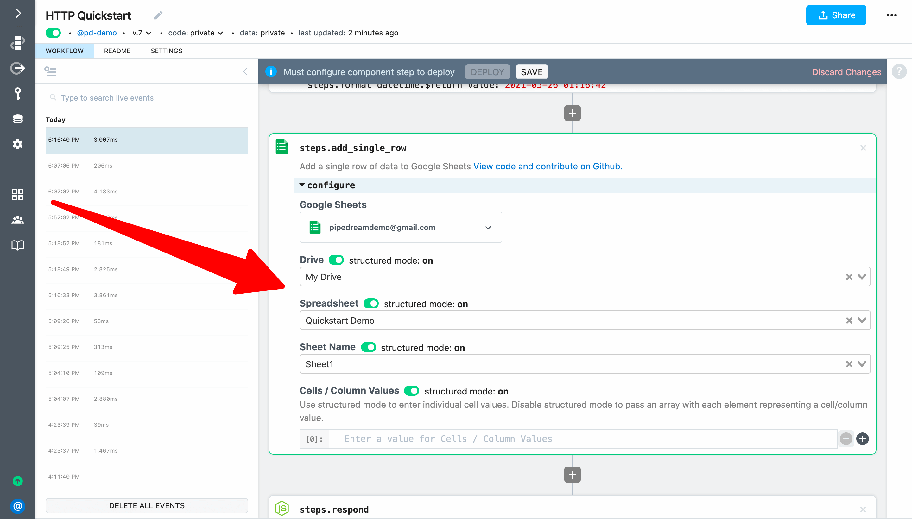

### Pass exports from a previous step to an action

Next, let's configure the cells / column values using exports from previous steps.

First, let's use the object explorer to select a value. The object explorer is automatically loaded whenever you focus in an action input. You can expand any item and then select the reference you want to insert.

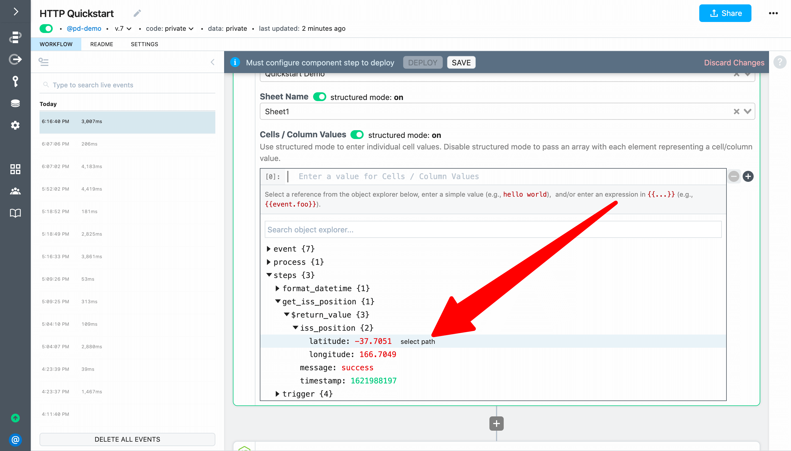

Another option is to explore the exports for a step and click on the **Copy Path** link. Then paste the reference into the action input.

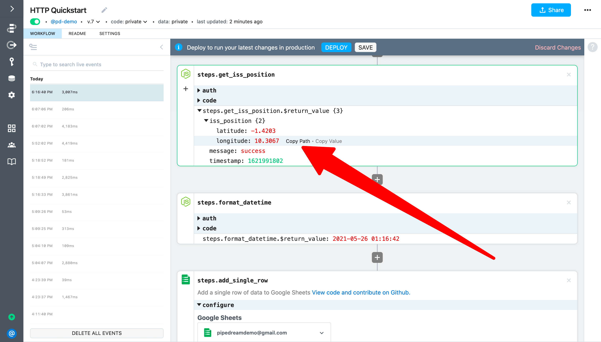

The final option is to use autocomplete — add double braces <code v-pre>{{ }}</code> and start typing between them to get autocomplete the same way you do in code steps. 

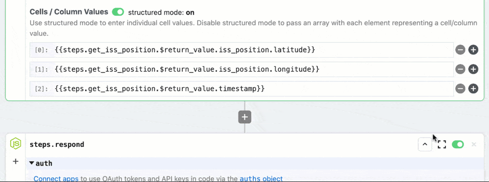

Since we want to add four columns of data with the latitude, longitude, timestamp and the formatted date time (in that order), add the following references to the **Cells / Column Values** inputs:

**[0]:** <code v-pre>{{steps.get_iss_position.$return_value.iss_position.latitude}}</code>

**[1]:** <code v-pre>{{steps.get_iss_position.$return_value.iss_position.longitude}}</code>

**[2]:** <code v-pre>{{steps.get_iss_position.$return_value.timestamp}}</code>

**[3]:** <code v-pre>{{steps.format_datetime.$return_value}}</code>

Your fully configured step should look similar to this:

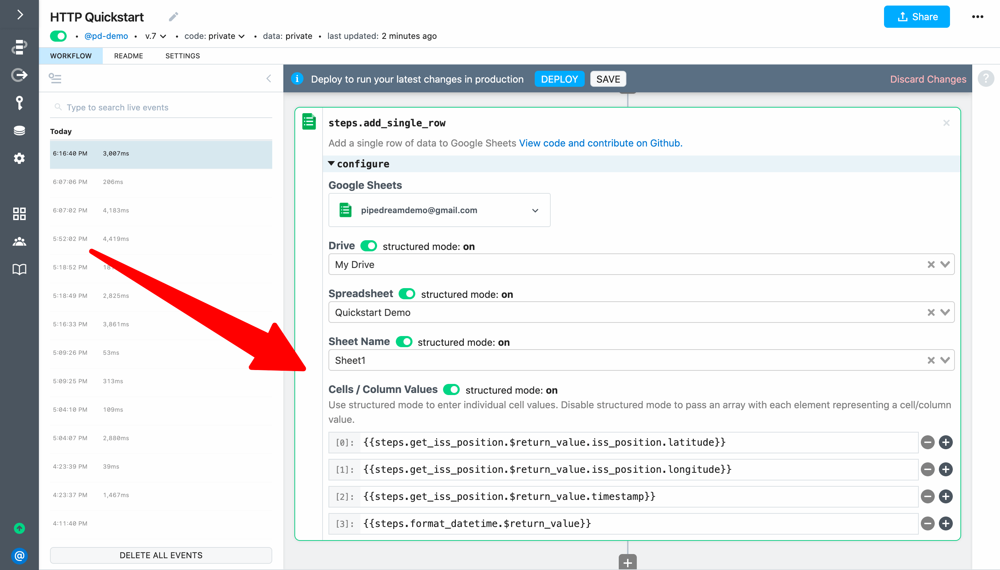

Next, **Deploy** your changes and reload the endpoint URL in your browser. 

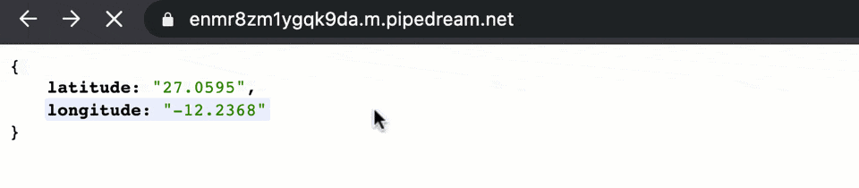

When you check the workflow, you should see exports from the add row to sheets step:

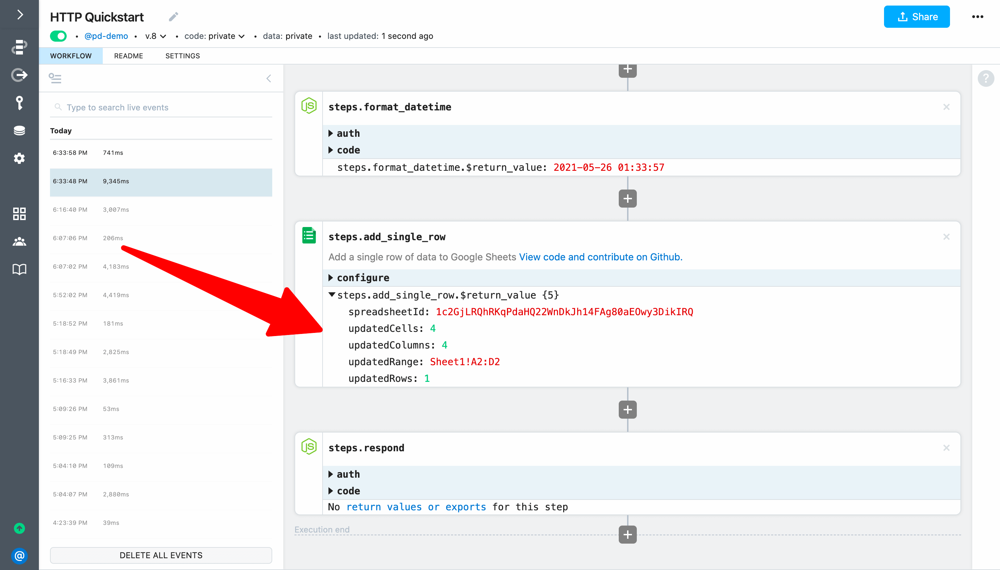


Finally, when you check Google Sheet you should see data about the ISS position.

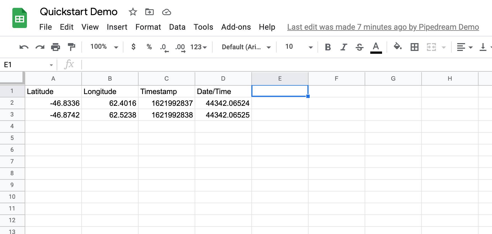


**If you loaded the URL in your web browser, you'll actually see two events. We'll fix that in the next example.**

<p style="text-align:center;">
<a :href="$withBase('/quickstart/end-workflow-early/')"></a>
</p>
