# 5. Insert data into Google Sheets

For the next example, we'll:

1. Retrieve the position of the International Space Station (ISS) on a schedule
2. Convert the timestamp corresponding to the position data to a Google Sheets compatible date and time
3. Save the data for each workflow execution to a new row in Google Sheets

First, create a Google Sheet with the labels `Latitude`, `Longitude`, `Timestamp`, `Date`, and `Time` in the first row:

  

Then create a new workflow and select the **Schedule** trigger:


Next, add an action for the **HTTP / Webhook** app to make a **GET Request**:

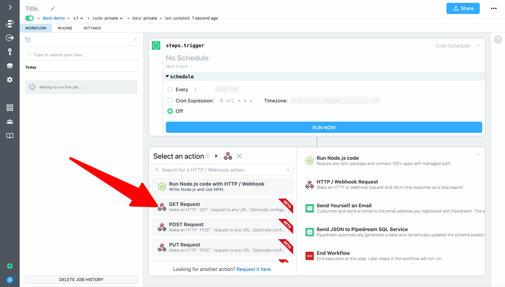

Then set the **URL** to  `http://api.open-notify.org/iss-now.json`. Similar to our earlier example, this will get the position of the International Space Station (ISS) on each workflow invocation.

Next, update the name of the **GET Request ** action step to `steps.get_iss_position`. Then **Deploy** your changes and click **Run Now**.

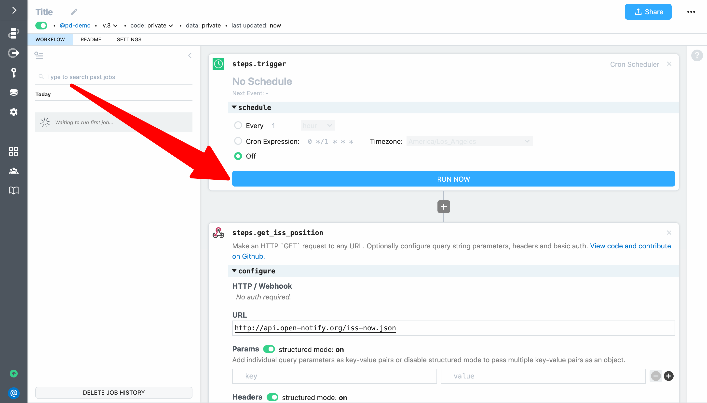

Looking at the result for `steps.get_request`, we can see that the `timestamp` field returned by the API is not a friendly, human-readable date/time. 


Let's use the `luxon` npm package to generate one. Based on a quick Google Search, the datetime format expected by Google Sheets is `yyyy-MM-dd HH:mm:ss`. 

Click the **+** button to add a new step to the end of your workflow and select **Run Node.js code**. Then add the following code to convert the timestamp to a date time and export it from the code step:

```javascript
const { DateTime } = require('luxon')

return DateTime.fromSeconds(steps.get_iss_position.$return_value.timestamp).toFormat('yyyy-MM-dd HH:mm:ss');
```

Let's also go ahead and change the name of the code step to `steps.format_datetime`


**Deploy** your changes and click **Run Now** to test your code. You should see a human-readable date/time as the return value for `steps.format_datetime`.

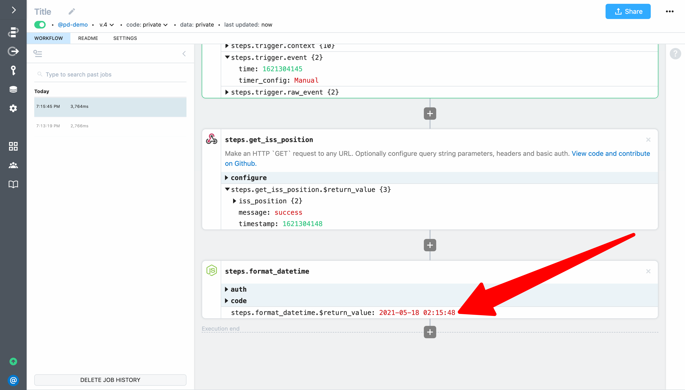

Next click the **+** button to add a new step to the end of your workflow and select the **Google Sheets** app:

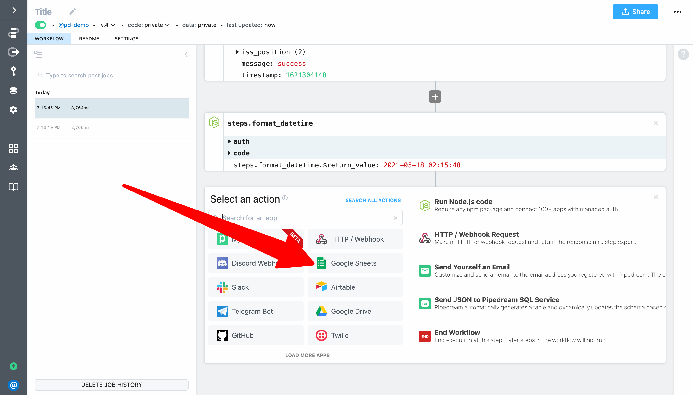

Select the **Add Single Row** action:

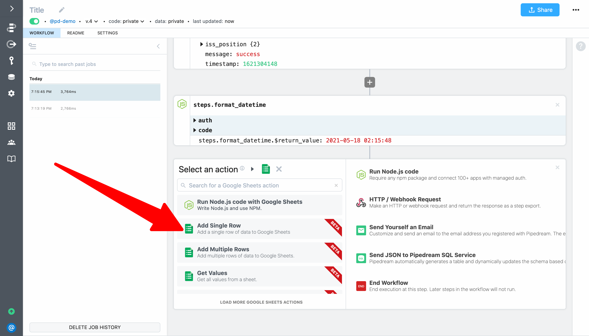

To configure the step, first connect your Google Sheets account. When you click on **Connect Google Sheets** Pipedream will open a popup window where you can sign in to connect your account. When you, Pipdream will secure store an OAuth token that allows actions to make API requests on your behalf (uou can also use these tokens yourself to authenticate API requests for your authenticated apps in code steps):

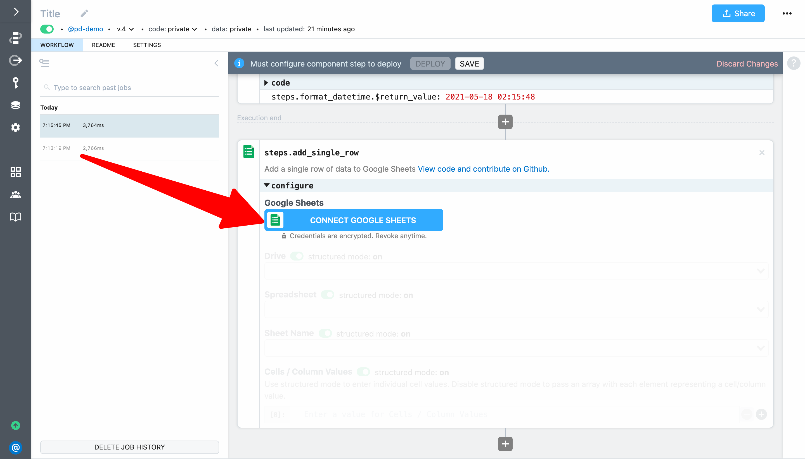

When prompted by Google, allow Pipedream access:


Next, select your **Drive**, **Spreadsheet** and **Sheet Name** from the drop down menus.


Then let's configure the cells / column values. First, we'll use the object explorer to select a value. The object explorer is automatically loaded whenever you focus in an action input. You can expand any item and then select the reference you want to insert.

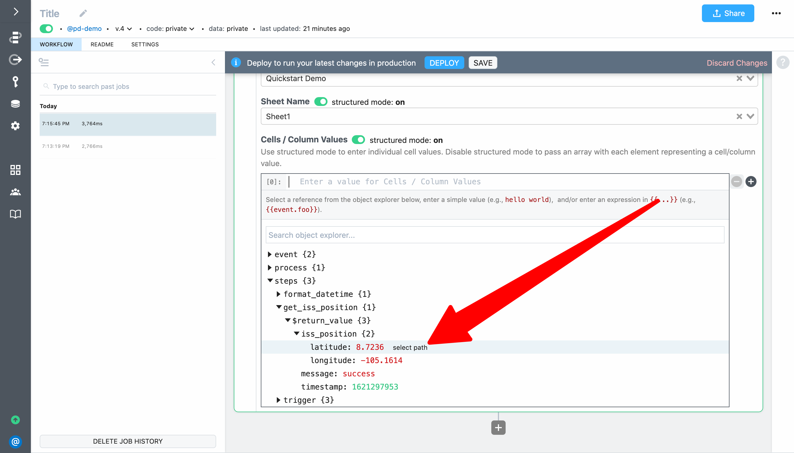

Another option is to explore the exports for a step and click on the **Copy Path** link. Then paste the reference into the action input.

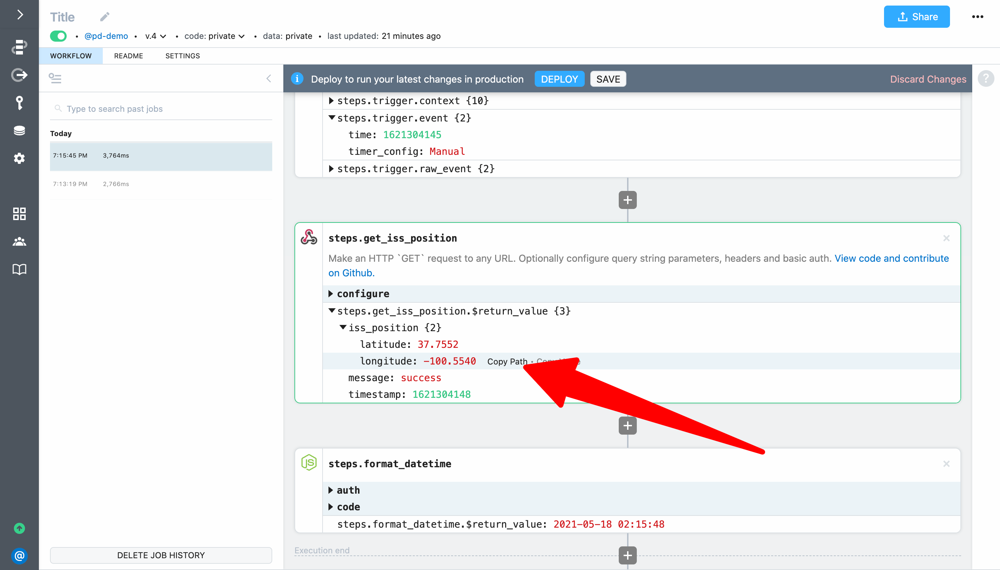

The final option is to use autocomplete — add double braces `{{ }}` and start typing between them to get autocomplete the same way you do in code steps. Since we want to add four columns of data with the latitude, longitude, timestamp and the formatted date time (in that order), your fully configured step should look like this:

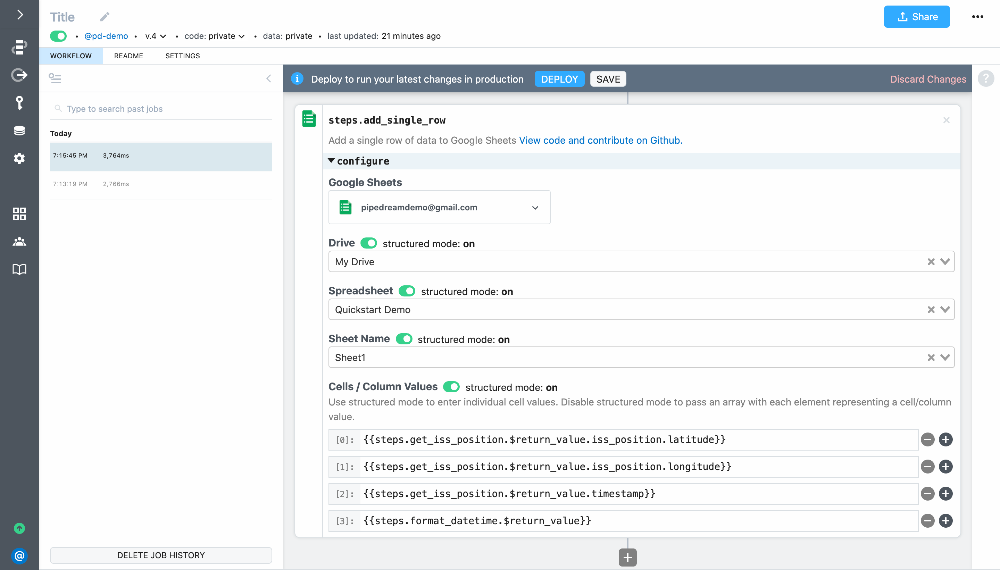

Next, **Deploy** your changes and click **Run Now**. Your workflow should execute successfully:


When you check Google Sheets you should see the values entered in the sheet:

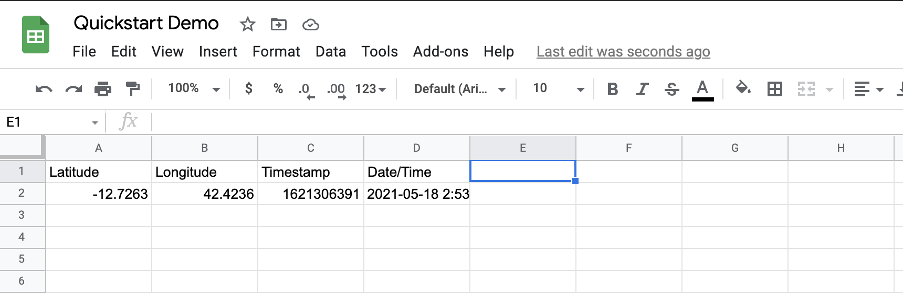

Finally, add a workflow title, configure the schedule and click **Deploy**. Your workflow will now run automatically.

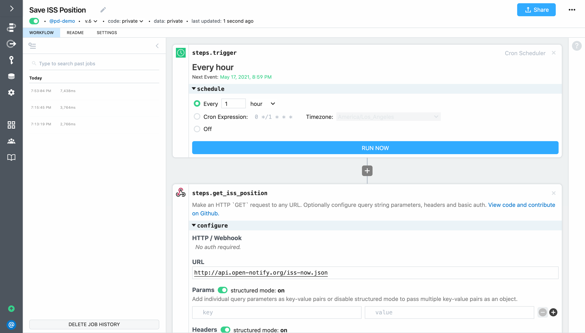 