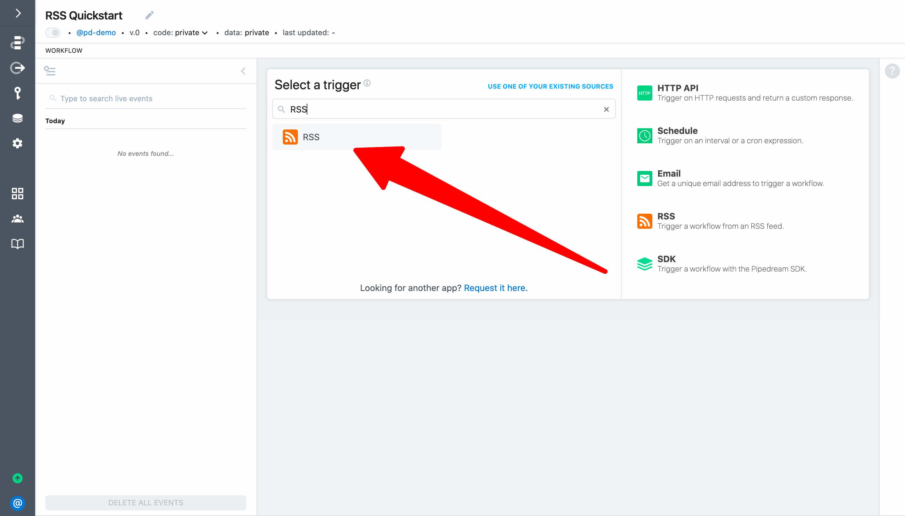
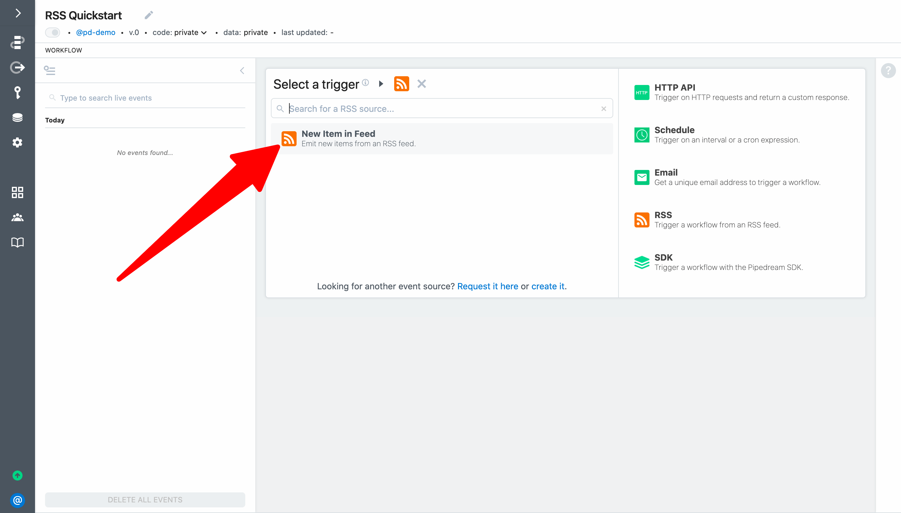
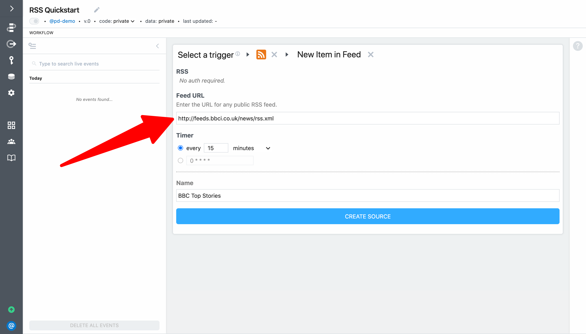
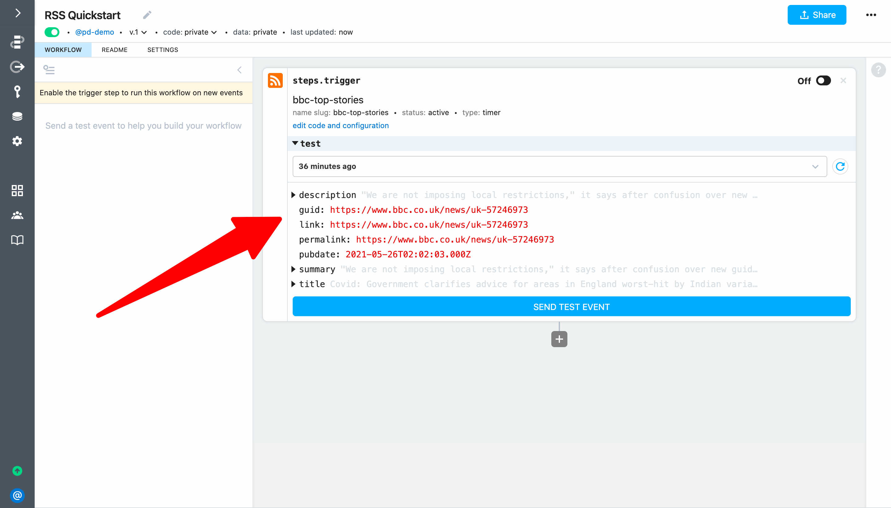
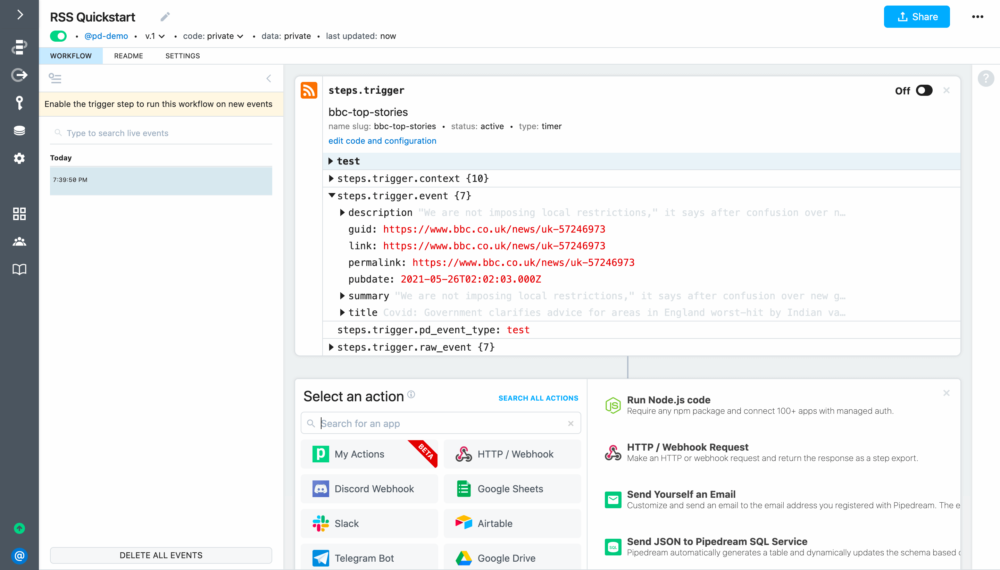
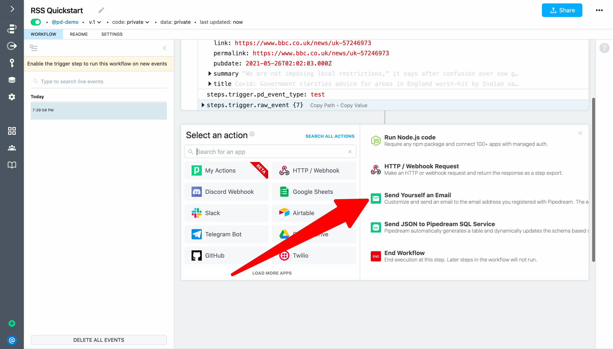
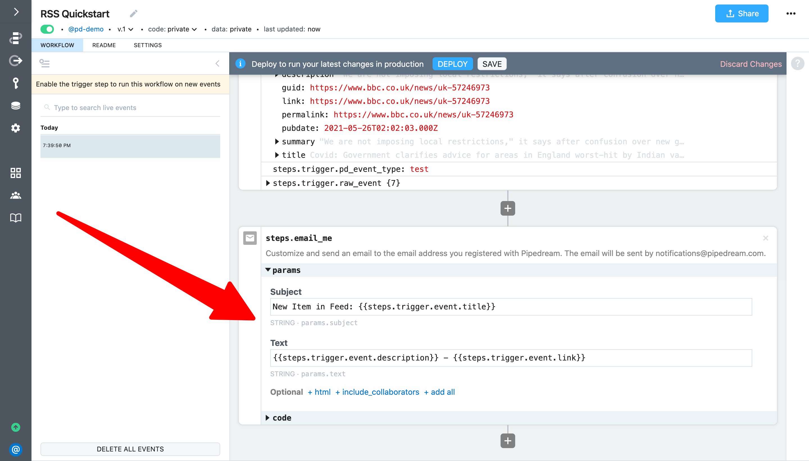
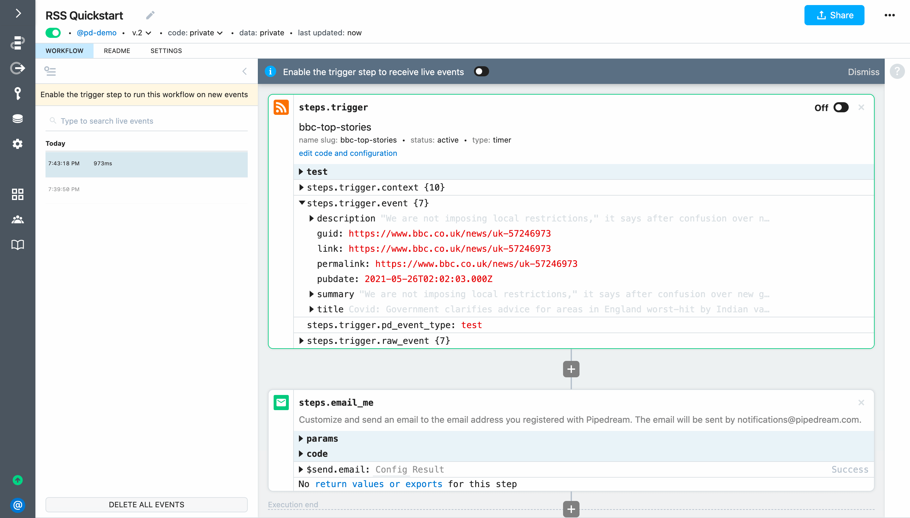
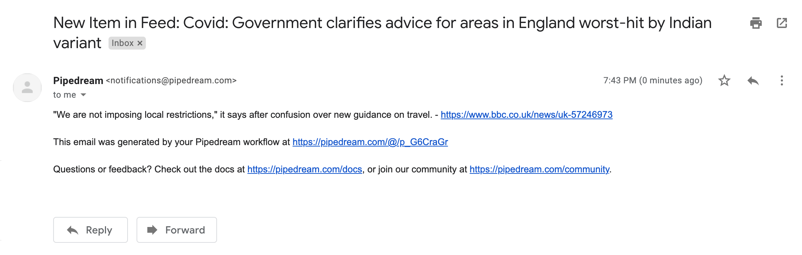
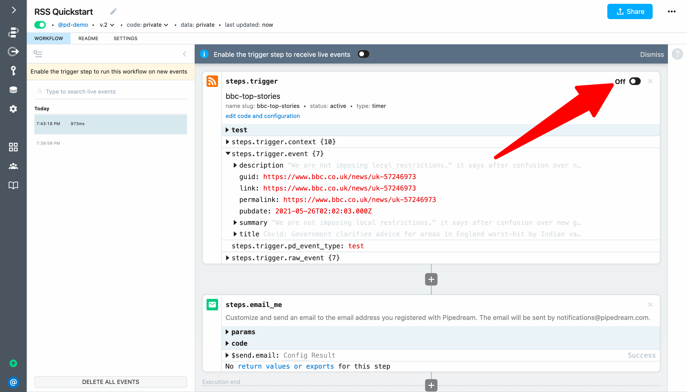

# Email yourself on new RSS items

Next, let's create a workflow triggered on app events. This example builds on concepts introduced in [previous sections](/quickstart/) and will cover how to:

[[toc]]

::: tip
If you didn't complete the previous examples, we recommend you start from the [beginning of this guide](/quickstart/) to learn the basics of workflow development. If you have any issues completing this example, you can [view, copy and run a completed version](https://pipedream.com/@gettingstarted/quickstart-email-yourself-on-new-rss-items-p_5VCKggW).
:::

### Trigger a workflow on new items in an RSS feed

First, create a new workflow and search for the **RSS** app and select it:

Then select the **New item in feed** trigger:

For this example, let's use the feed of BBC's top stories. Add `http://feeds.bbci.co.uk/news/rss.xml` as the **Feed URL**. You can optionally customize the **Timer** (it controls how often to check for new items in the feed) and the **Name**. 

 

Next, click **Create Source**. Pipedream will instantiate the source and retrieve recent items from the RSS feed. You can use these events to help you build your workflow (you can expand the drop down menu to select a different event).

Next, click **Send Test Event** to export the event for the trigger.

### Send an email to the address associated with your Pipedream account

Next, select the **Send Yourself an Email** action from the step selection menu.

To configure the action:

- Set **Subject** to <code v-pre>New Item in Feed: {{steps.trigger.event.title}}</code>
- Set **Text** to <code v-pre>{{steps.trigger.event.description}} - {{steps.trigger.event.link}}</code>

Finally, click **Deploy** and click **Send Test Event** in the trigger again to run the workflow.

Pipedream will send an email to the address asociatd with your Pipedream account:

### Activate the trigger to run your workflow on new app events

Finally, to automatically run the workflow whenever a new item is detected in the RSS feed, enable the trigger.

**For the final example of this guide, we'll address a real-world use case to post richly-formatted Tweets to Slack. [Take me to the last example &rarr;](../real-world-example/)**

