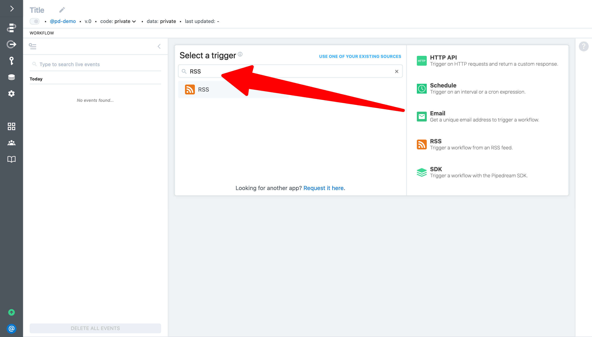
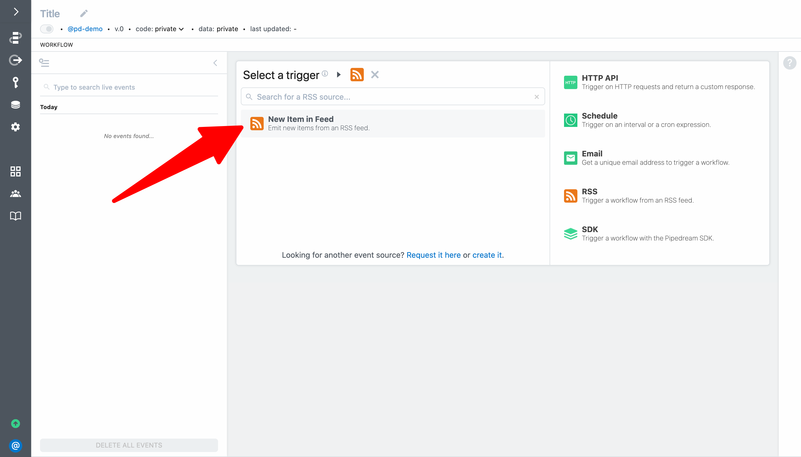
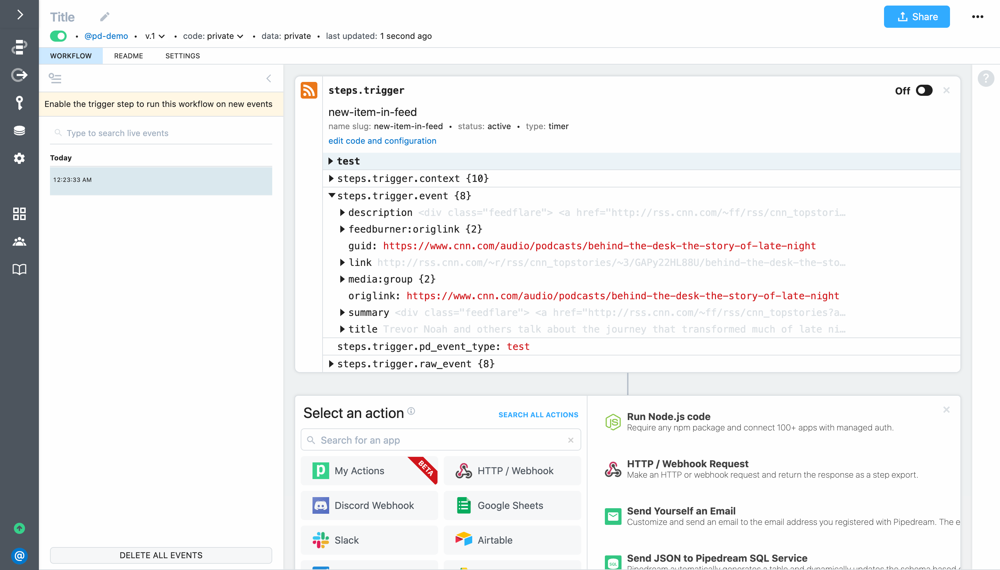
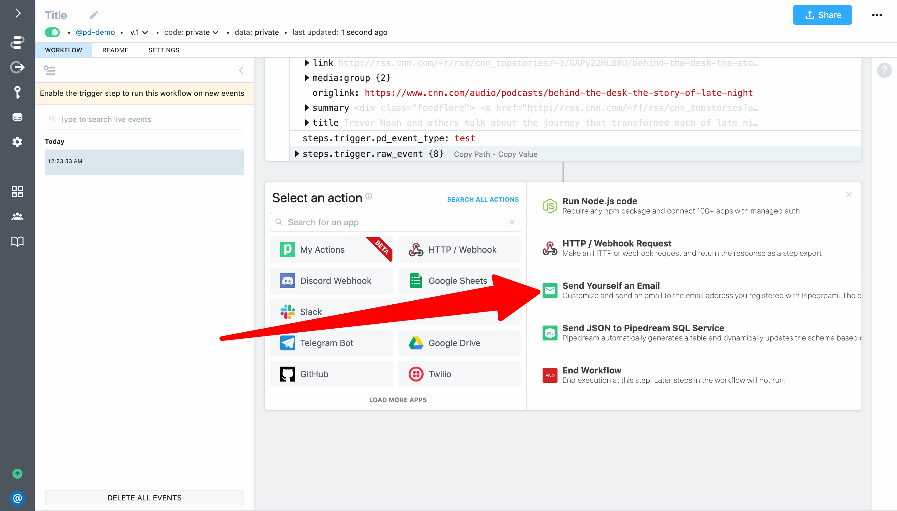
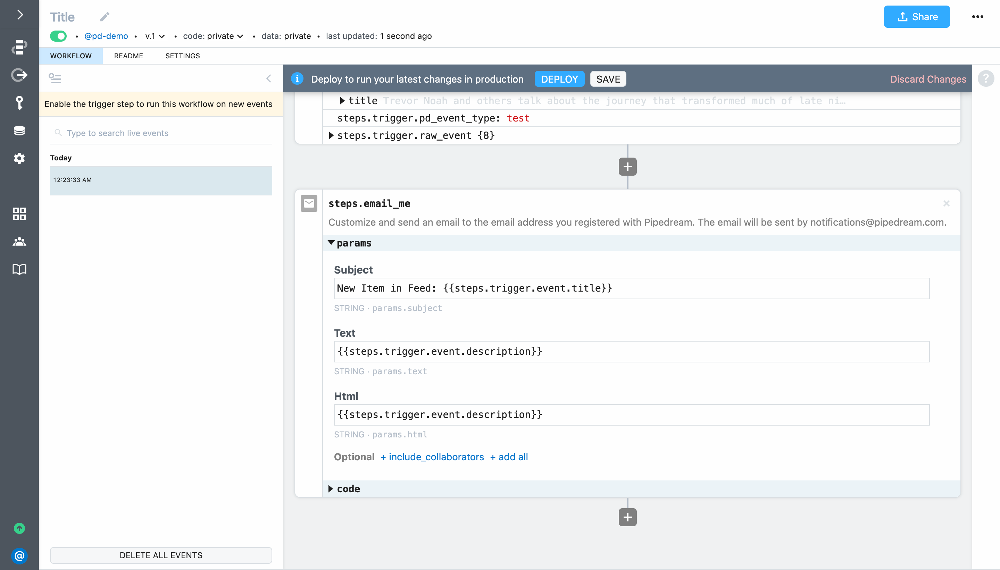
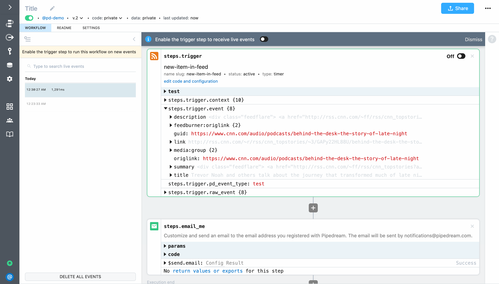
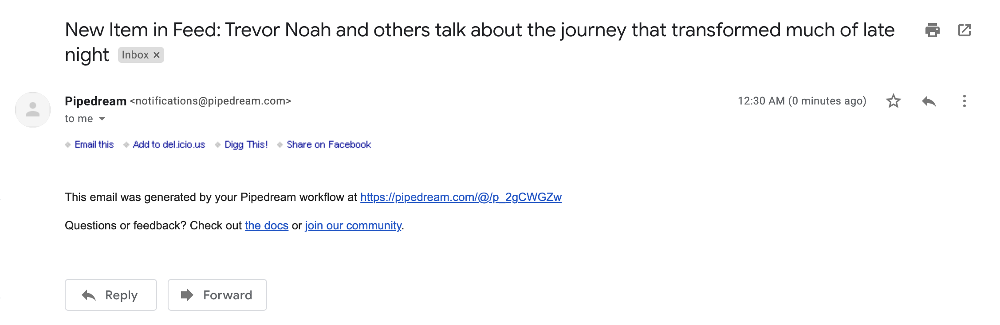

# Email yourself on new RSS items

For the next example, create a new workflow and search for the **RSS** app

Click on **RSS** and thenselect the **New item in feed** trigger:

For this example, let's use the feed of CNN's top stories. Add `http://rss.cnn.com/rss/cnn_topstories.rss` as the **Feed URL**. You can optionally customize the **Timer** (it controls how often to check for new items in the feed) and the **Name**. 

 

Next, click **Create Source**. Pipedream will instantiate the source and retrieve recent items from the RSS feed. You can use these events to help you build your workflow (you can expand the drop down menu to select a different event to help you build your workflow).

Next, click **Send Test Event** to export the event for the trigger.

Next, select the **Send Yourself an Email** action from the step selection menu.

To configure the action:

- Set **Subject** to <code v-pre>New Item in Feed: {steps.trigger.event.title}</code>
- Set **Text** to <code v-pre>{steps.trigger.event.description}</code>
- Add the optional **Html** field and set it to <code v-pre>{steps.trigger.event.description}</code>

Finally, click **Deploy** and click **Send Test Event** in the trigger again to run the workflow.

Pipedream will send an email to the email address registered for your Pipedream account:

Finally, to automatically run the workflow whenever a new item is detected in the RSS feed, enable the trigger.

