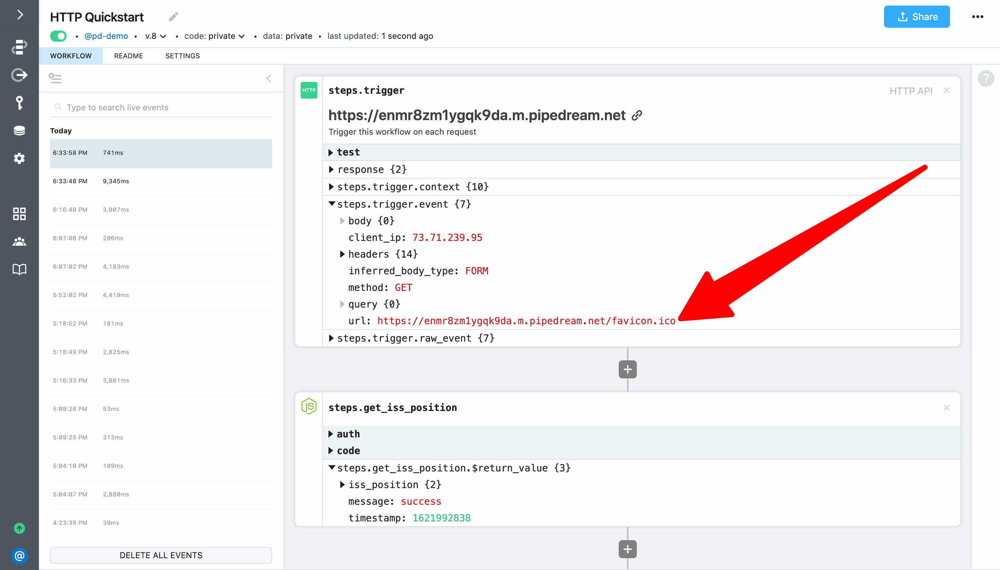
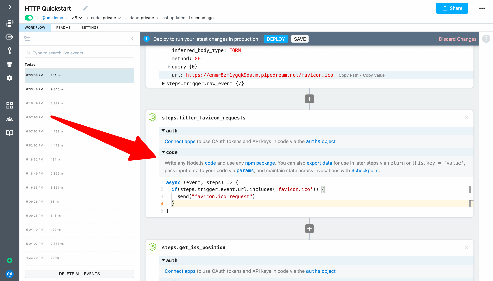
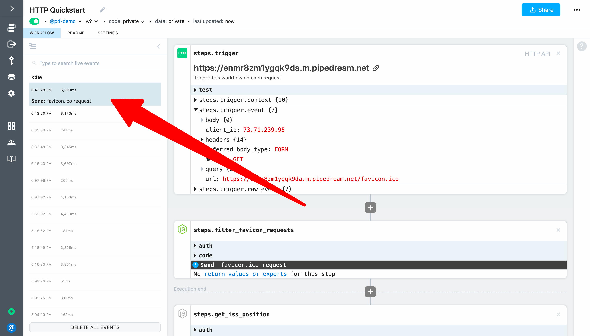
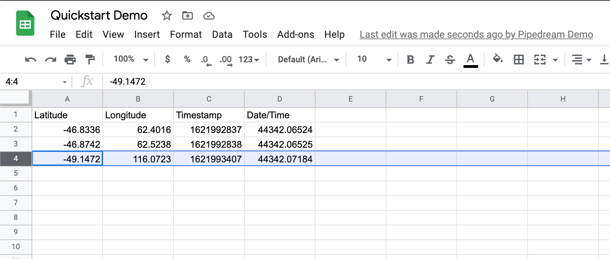
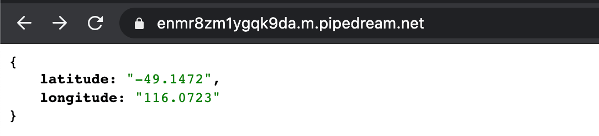

# End workflow early

Next, let's update our workflow to filter out `favicon.ico` requests. This example builds on the workflow created in [previous sections](/quickstart/) and will cover how to use the `$end()` function to end a workflow execution early.

::: tip
If you didn't complete the previous examples, we recommend you start from the [beginning of this guide](/quickstart/). If you still want to start here, [copy this workflow](https://pipedream.com/@gettingstarted/quickstart-insert-data-into-google-sheets-p_KwCAR9z) and then follow the instructions below. If you have any issues completing this example, you can [view, copy and run a completed version](https://pipedream.com/@gettingstarted/quickstart-end-workflow-early-p_RRCgNRQ).
:::


In the last example, two rows were added to Google Sheets when we loaded the endpoint URL in our browser. That's because modern web browsers automatically make a request for a [`favicon.ico`](https://en.wikipedia.org/wiki/Favicon) file. While this is an artifact of loading the workflow's endpoint in our browser, it provides a good opportunity to demonstrate `$end()`.

First, select an event that represents a `favicon.ico` request:



Next, add a **Run Node.js code** step immediately after the trigger and change the name from `steps.nodejs` to `steps.filter_favicon_requests`. Then add code to conditionally end the workflow execution if `steps.trigger.event.url` contains the string `favicon.ico`. We can also pass a reason for ending the execution to the `$end()` function. For this example, we'll pass the value `favicon.ico request`.

```javascript
if (steps.trigger.event.url.endsWith("/favicon.ico")){
  $end("favicon.ico request")
}
```



Next, **Deploy** your workflow and load the endpoint URL in your browser to trigger your workflow. While 2 events will still appear in the event list, you'll see that one of them indicates that `$end()` was invoked along with the reason we defined. Additionally, no steps after `steps.filter_favicon_requests` were executed for that event.



Next, if you select the event that did **not** invoke `$end()`, you will see it successfully executed the entire workflow. And when you load Google Sheets, you should only see a single new row added:



Finally, the data for that row will match the data returned to your endpoint.



**Next, let's use a connected account in a code step to authenticate a Google Sheets API request.**

<p style="text-align:center;">
<a :href="$withBase('/quickstart/use-managed-auth-in-code/')"></a>
</p>