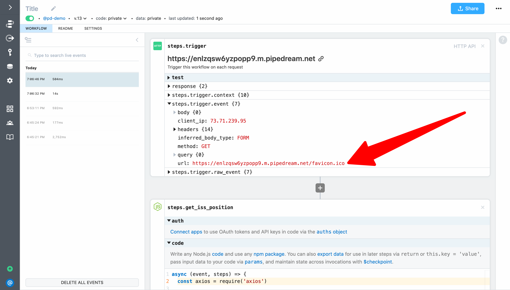
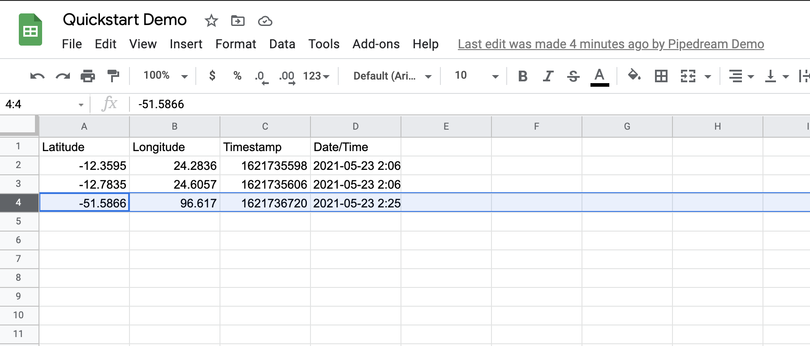
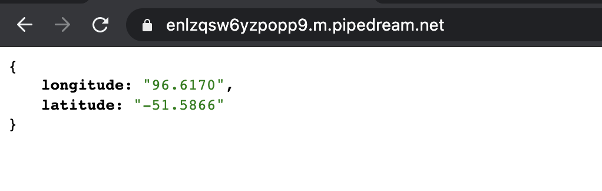

# End workflow early

Next, let's update our workflow to filter out `favicon.ico` requests. This example builds on the workflow created in [previous sections](/quickstart/hello-world/) and will cover how to use the `$end()` function to end a workflow execution early.

In the last example, two rows were added to Google Sheets when we loaded the endpoint URL in our browser. That's because modern web browsers automatically make a request for a `favicon.com` file. While this is an artifact of loading the workflow's endpoint in our browser, it provides a good opportunity to demonstrate `$end()`.

First, select an event that represents a `favicon.ico` request:



Next, add a **Run Node.js code** step immediately after the trigger and change the name from `steps.nodejs` to `steps.filter_favicon_requests`. Then add code to conditionally end the workflow execution if the request URL contains the string `favicon.ico`. We can also pass a reason for ending the execution to the `$end()` function. For this example, we'll pass the value `favicon.ico request`.

```javascript
if(steps.trigger.event.url.includes('favicon.ico')) {
  $end("favicon.ico request")
}
```


Next, **Deploy** your workflow and load the endpoint URL in your browser to trigger your workflow. While 2 events will still appear in the event list, you'll see that one of them indicates that `$end()` was invoked along with the reason we defined. Additionally, no steps after `steps.filter_favicon_requests` were executed.


Finally, if you select the event that did **not** invoke `$end()`, you will see it successfully executed. And when you load Google Sheets, you should only see a single new row added:



Additionally, the data for that row should match the data returned to your endpoint.



**Next, let's use a connected account in a code step to authenticate a Google Sheets API request. [Take me to the next example &rarr;](../use-managed-auth-in-code/)**
