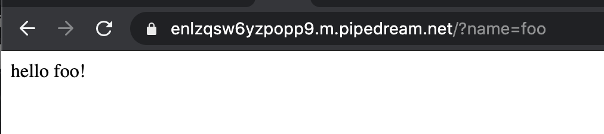

# 2. hello ${name}!

Next, let's modify the previous example so we can pass a name on HTTP requests that is returned in the HTTP response. To do that, we'll pass a name as a query parameter when loading the endpoint URL.

First, modify the url and add `?name=foo` to the end. For example, `https://enlzqsw6yzpopp9.m.pipedream.net/?name=foo`.

Then load the URL to make a request to your workflow and select the event (if loading from your web browser, make sure you select the request that is not associated with `favicon.ico`). You should now see a `query` field — expand it to see the query parameter and value for the request (for our example, the parameter is `name` and the value is `foo`):


Next, let's modify our custom response to use this data that was passed in our trigger event. Expand the code section of your code step if it's collapsed. Then modify the value for the `body` parameter in the `$respond()` function. Change the double quotes around `hello world!` to backticks to convert it to a template literal. Then, replace `world` with `${steps.trigger.event.query.name}` to reference the value we're passing as the query data:

```javas
await $respond({
  status: 200,
  immediate: true,
  body: `hello ${steps.trigger.event.query.name}!`
})
```


Next, click the **Deploy** button, and then reload the previous URL:


Your workflow will now return `hello foo!` instead of `hello world!`. You can change the value you're passing for the name to test further.

