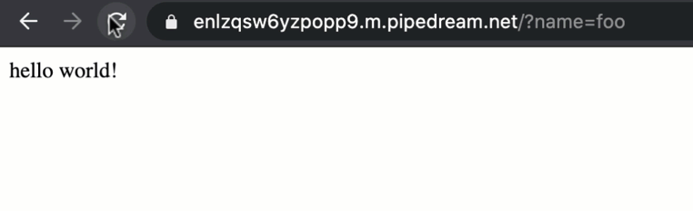

# hello ${name}!

Next, let's pass a name in each HTTP request and return it in the workflow response. This example builds on the workflow we created in [hello world!](/quickstart/hello-world/) and will cover how to:

1. Pass data to an HTTP triggered workflow via query parameters
2. Inspect the query data sent to the workflow 
3. Customize the HTTP response using data sent to the workflow

First, modify the endpoint URL you loaded in your browser to trigger your workflow and add `?name=foo` to the end (e.g., `https://ENDPOINT-ID.m.pipedream.net/?name=foo`). Then load it to make another request to your workflow. You should still see `hello world!` returned as the response from your workflow.


Return to Pipedream and select the event you just generated from the event list. You should now see `{1}` next to the `query` field indicating it has nested values. Expand it to inspect the query parameter and value for the request. 


::: tip
If you don't see any query data, check the `url` parameter in the `steps.trigger.event` observation to make sure you didn't select the event associated with the browser's `favicon.ico` request.
:::

Next, let's incorporate this data into the workflow response. Expand the code section of `steps.nodejs` if it's collapsed. Then modify the value for the `body` parameter of the `$respond()` function and replace `world` with `${steps.trigger.event.query.name}` to reference the name we're passing to the trigger:

```javascript
await $respond({
  status: 200,
  immediate: true,
  body: `hello ${steps.trigger.event.query.name}!`
})
```


Finally, **Deploy** and reload the URL in your browser:



Your workflow will now return `hello foo!` (or whatever value you pass to `name`) instead of `hello world!`.

**Next, let's add an action to make an HTTP request from this workflow.** [Take me to the next example &rarr;](../make-http-request/) 
