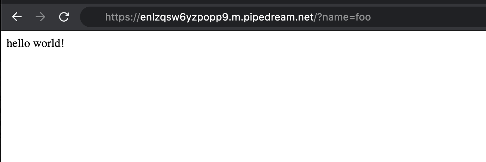
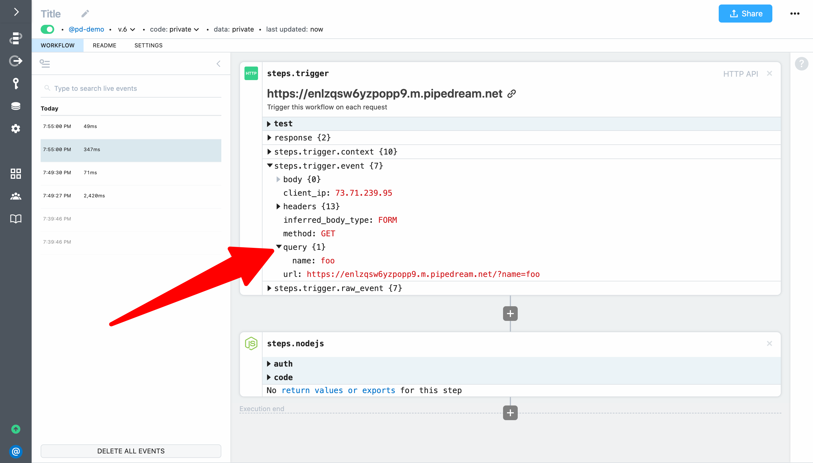
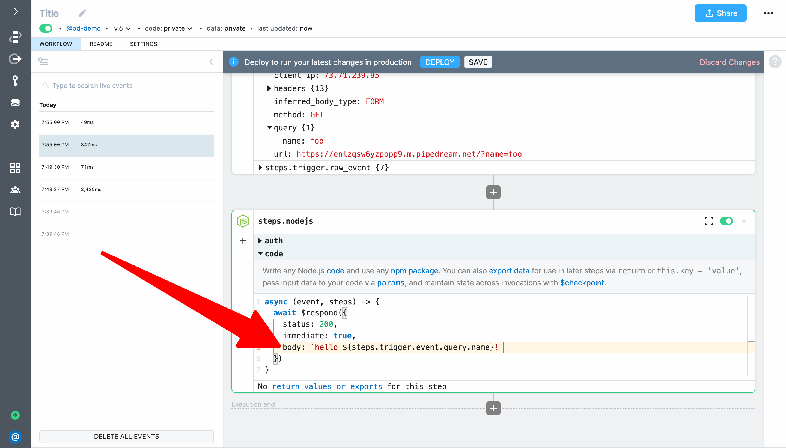

# hello ${name}!

Next, let's modify the previous example to pass a name on HTTP requests and return it in the HTTP response.

This example will take  **2 - 3 minutes** and will cover how to:

1. Pass data to an HTTP triggered workflow via query parameters
2. Inspect the query data sent to the workflow 
3. Customize the HTTP response based on data passed in the trigger event

First, modify the url and add `?name=foo` to the end — for example, `https://ENDPOINT-ID.m.pipedream.net/?name=foo` — and load the URL to make a request. You should still see `hello world!` returned as the response from your workflow.



Return to your workflow and select the event you just sent — make sure you select the request that is **not** associated with `favicon.ico`. You should now see `{1}` next to the `query` field indicating it has nested values. Expand it to see the query parameter and value for the request (for this example, the parameter should be `name` and the value should be `foo`):



Next, let's incorporate this data into the workflow response. Expand the code section of `steps.nodejs` if it's collapsed. Then modify the value for the `body` parameter in the `$respond()` function — replace `world` with `${steps.trigger.event.query.name}` to reference the value we're passing as the query data:

```javascript
await $respond({
  status: 200,
  immediate: true,
  body: `hello ${steps.trigger.event.query.name}!`
})
```

Next, click the **Deploy** button:



Finally, reload the URL in your browser:


Your workflow will now return `hello foo!` instead of `hello world!`. You can change the value you're passing for the name to test further.

**Next, we'll add an action to this workflow to make an HTTP request and retrieve data from a simple API, and we'll return the payload in our workflow's HTTP response.** [Take me to the next example &rarr;](../make-http-request/) 
