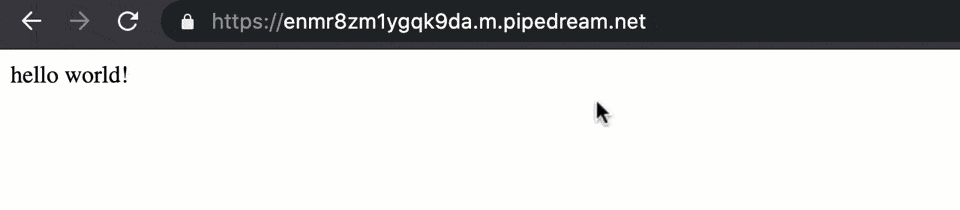
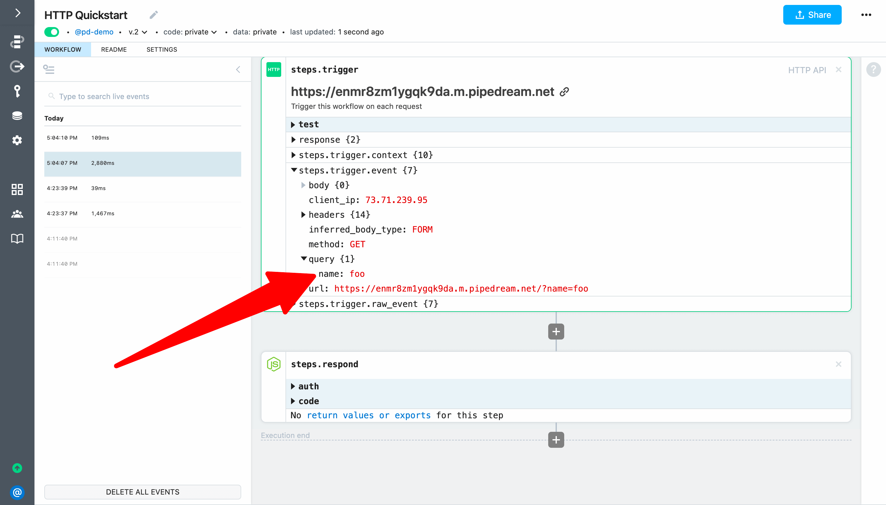
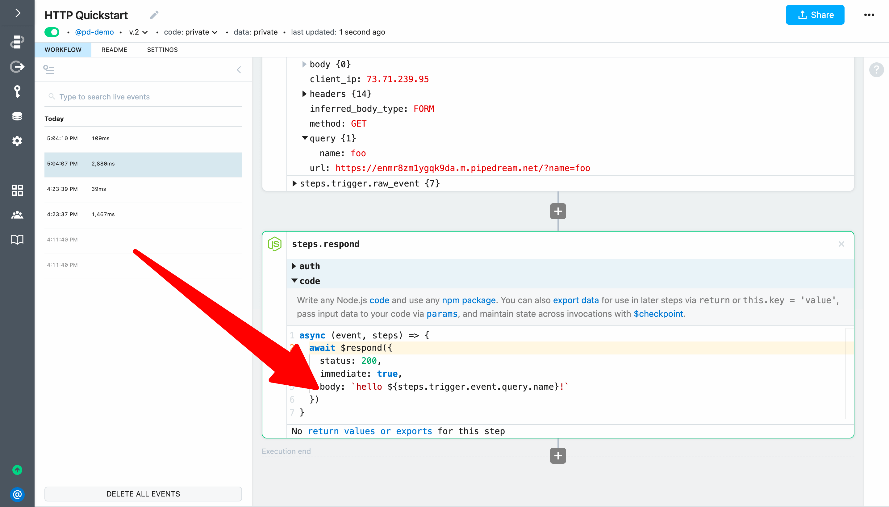
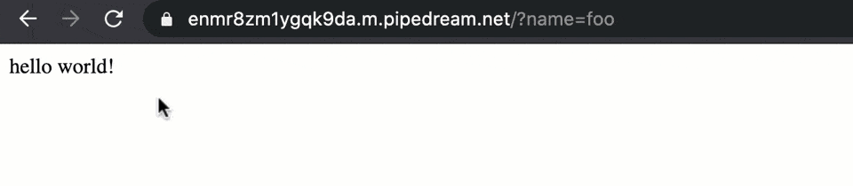

# hello ${name}!

Next, let's pass a name in each HTTP request and return it in the workflow response. This example builds on the workflow we created in [hello world!](/quickstart/hello-world/) and will cover how to:

[[toc]]

::: tip
If you didn't complete the previous example, we recommend you start from the [beginning of this guide](/quickstart/). If you still want to start here, [copy this workflow](https://pipedream.com/@gettingstarted/quickstart-hello-world-p_2gCWpmk/) and then follow the instructions below. If you have any issues completing this example, you can [view, copy and run a completed version](https://pipedream.com/@gettingstarted/quickstart-hello-name-p_WxCqxbR).
:::

### Pass data to an HTTP triggered workflow via query parameters

First, modify the endpoint URL you loaded in your browser to trigger your workflow and add `?name=foo` to the end (e.g., `https://ENDPOINT-ID.m.pipedream.net/?name=foo`). Then load it to make another request to your workflow. You should still see `hello world!` returned as the response from your workflow.



### Inspect the query data sent to the workflow

Return to Pipedream and select the event you just generated from the event list. You should now see `{1}` next to the `query` field indicating it has nested values. Expand it to inspect the query parameter and value for the request. 



::: tip
If you don't see any query data, check the `url` parameter in the `steps.trigger.event` observation to make sure you didn't select the event associated with the browser's `favicon.ico` request.
:::

### Customize the HTTP response using data sent to the workflow

Next, let's incorporate this data into the workflow response. Expand the code section of `steps.respond` if it's collapsed. Then modify the value for the `body` parameter of the `$respond()` function and replace `world` with `${steps.trigger.event.query.name}` to reference the name we're passing to the trigger:

```javascript
await $respond({
  status: 200,
  immediate: true,
  body: `hello ${steps.trigger.event.query.name}!`
})
```



Finally, **Deploy** and reload the URL in your browser:



Your workflow will now return `hello foo!` (or whatever value you pass to `name`) instead of `hello world!`.

**Next, let's add an action to make an HTTP request from this workflow.**

<p style="text-align:center;">
<a :href="$withBase('/quickstart/make-http-request/')"></a>
</p>