# hello world!

First, let's create an HTTP-triggered workflow and return a response of `hello world!`. This example will cover how to:

[[toc]]

::: tip
If you have any issues completing this example, you can [view, copy and run a completed version](https://pipedream.com/@gettingstarted/quickstart-hello-world-p_2gCWpmk/).
:::

### Create a new workflow

First, create a new workflow by clicking **New** from [https://pipedream.com/workflows](https://pipedream.com/workflows):


Pipedream will launch the workflow builder:

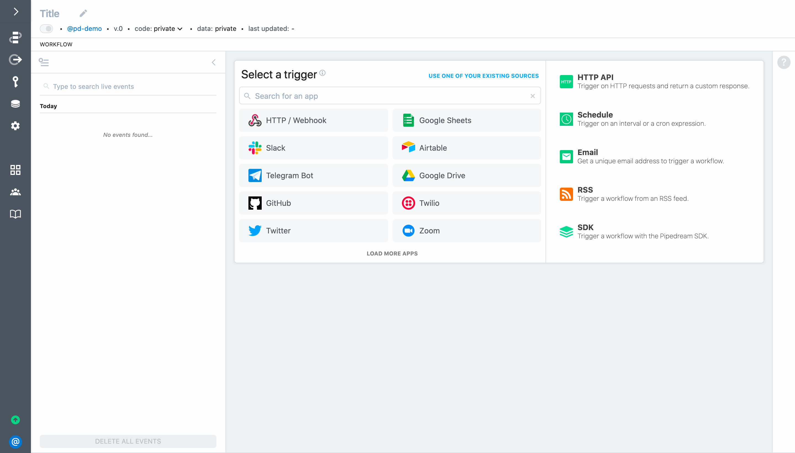

Following is an brief overview of the screen layout:

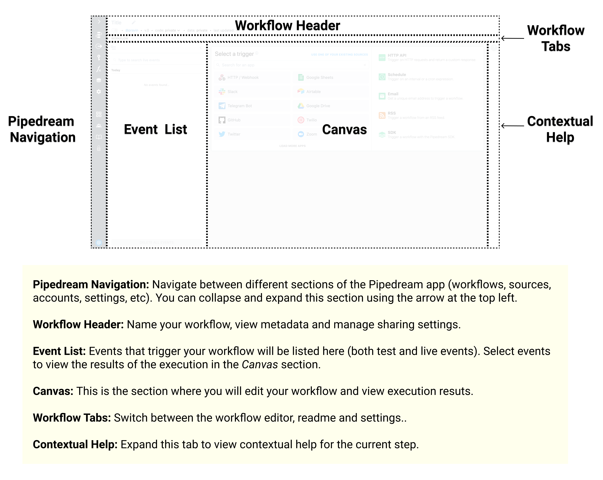

### Generate a unique endpoint URL to trigger the workflow

To create an HTTP or webhook-triggered workflow, select the **HTTP API** trigger. 

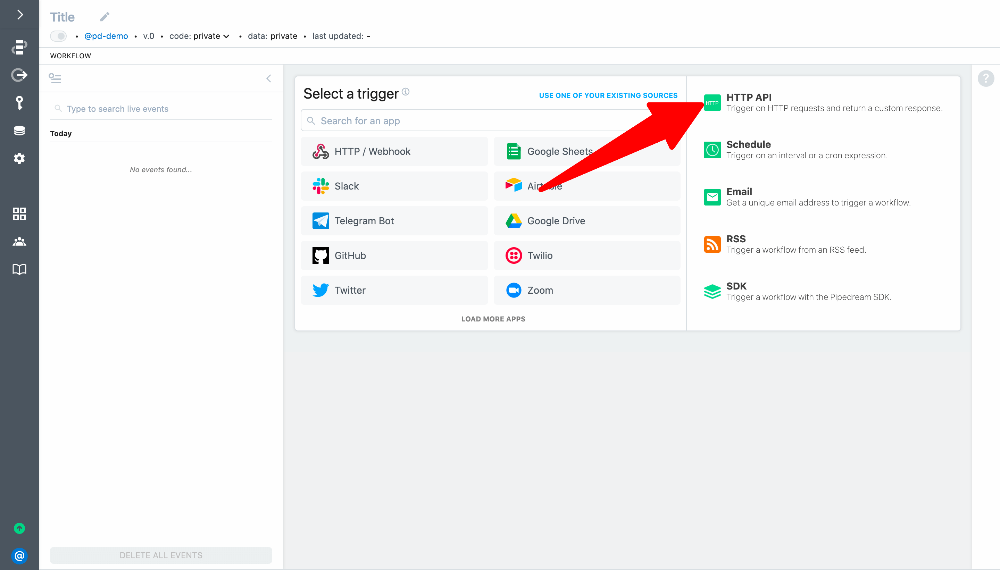

Your workflow will automatically deploy and Pipedream will generate a unique endpoint URL.

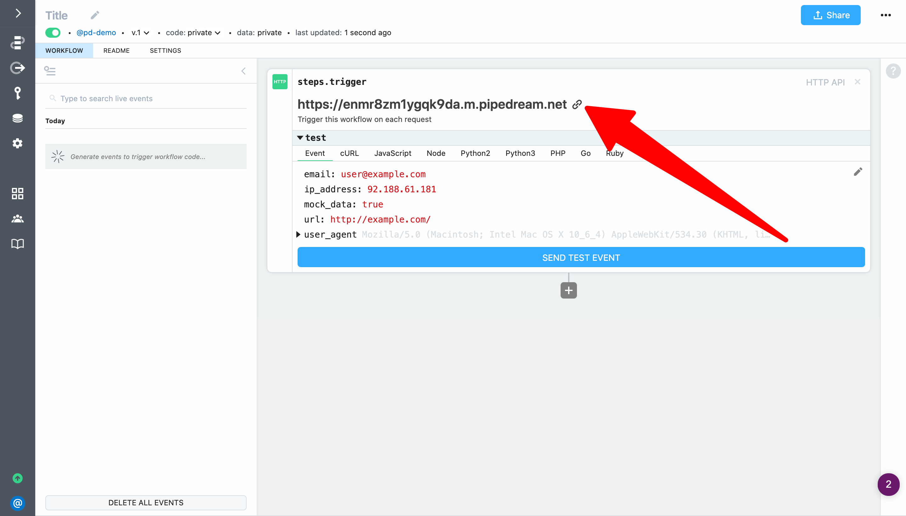

### Send HTTP requests to your workflow

Any requests you make to the endpoint URL will trigger your workflow. To test it out:

1. Copy the endpoint URL generated by Pipedream
2. Open a new browser tab and load the URL

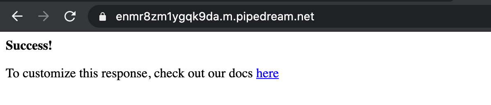

When you return to your workflow, you'll see the requests in the event list (events appear in real-time — you don't need to refresh the page). 

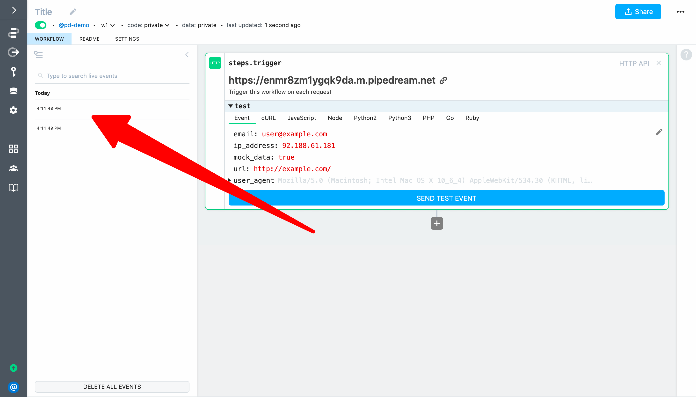

**IMPORTANT:** You may see multiple events appear in the event list each time you load the endpoint URL in a web browsers's address bar. That happens because modern browsers automatically request a `favicon.ico` resource when you load a URL. We'll update our workflow to handle this case in a later section of the quickstart.

### Inspect workflow events

Select an event from the list to inspect the associated exports and logs (click on an event again to de-select it). The HTTP trigger exports data including the `url` invoked, `method`, `body`, `headers`, `query parameters` and more. This data can also be referenced by steps in your workflow via the `steps` object (for example, to use the trigger event in a later step you can reference `steps.trigger.event` — we'll cover this in the next example). 

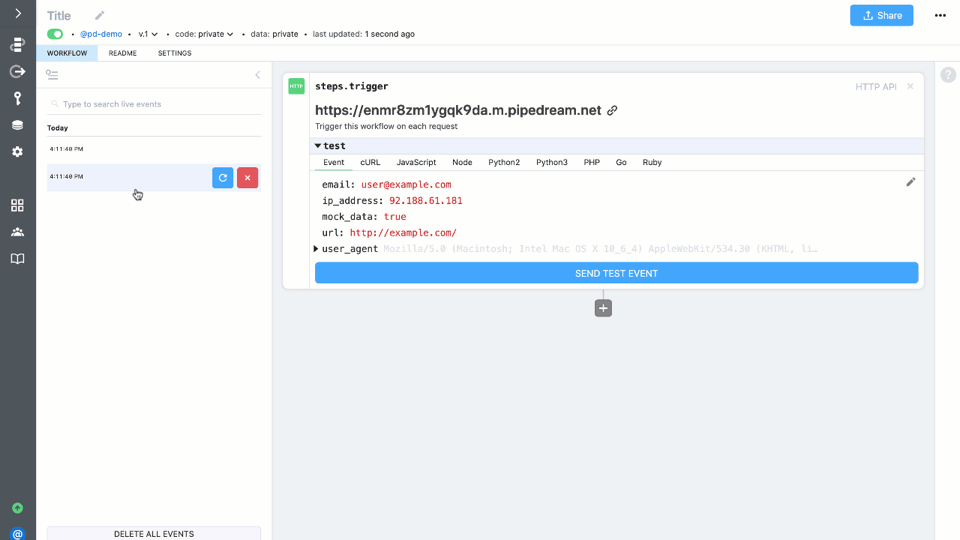

### Return a custom response on each HTTP request

Next, let's use Pipedream's `$respond()` function to return a custom response from the workflow. First, click on **Run Node.js code** to add a code step (if the step menu is not expanded, click the **+** button below the trigger).

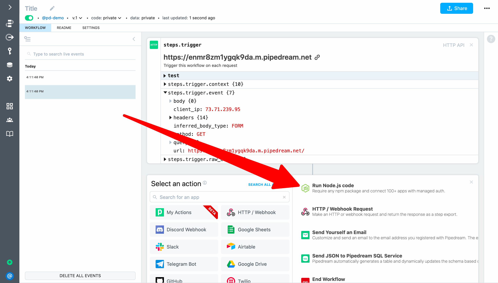 

Pipedream will add a code step to your workflow. 

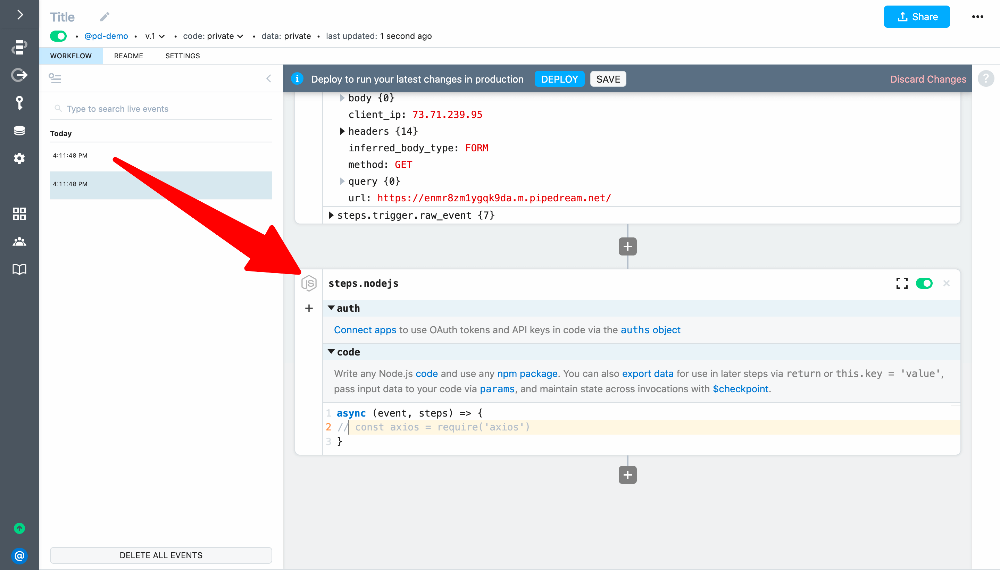

You can write any Node.js code and use any npm package (we'll cover npm in a later part of this guide). For this example, add the following code to return a custom response of `hello world!` on each HTTP request:

```javascript
await $respond({
  status: 200,
  immediate: true,
  body: `hello world!`
})
```

Next, rename the step from `steps.nodejs` to `steps.respond`. **IMPORTANT:** Step names affect workflow functionality and must be unique within a workflow. When you share data between steps, you'll use step names to reference data.

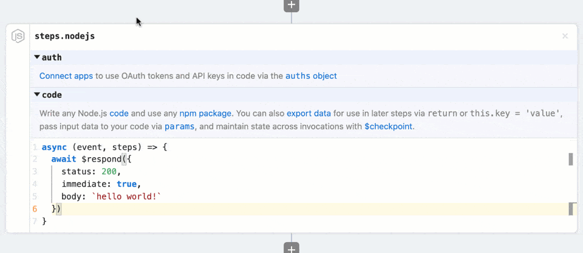

Then click **Deploy** to run your changes on each new event.

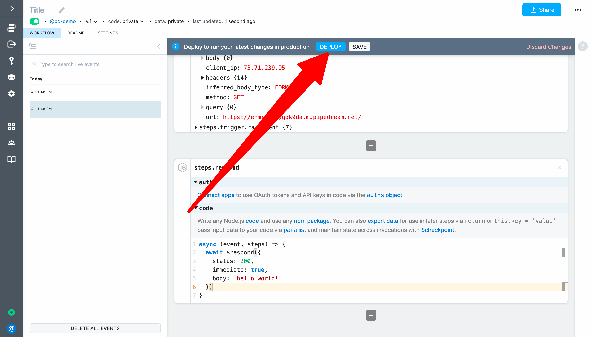

The deploy should complete in about 1-2 seconds. Then reload the endpoint URL in your browser — the response should change to `hello world!`.

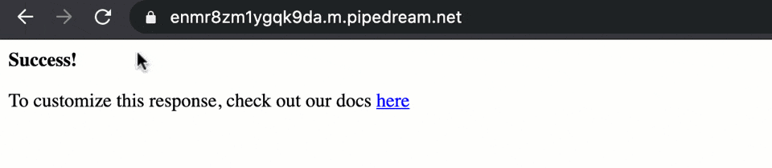

Finally, give your workflow a friendly name like `HTTP Quickstart`.

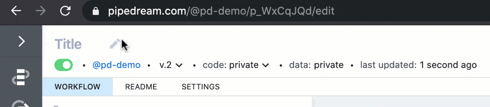

Congratulations! You just built your first serverless workflow! 

**Next, let's pass data in the HTTP request and use it to customize the workflow response.**

<p style="text-align:center;">
<a :href="$withBase('/quickstart/hello-name/')"></a>
</p>