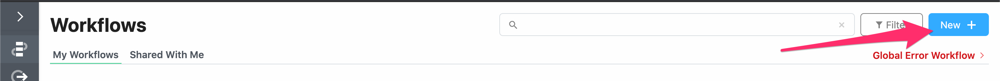
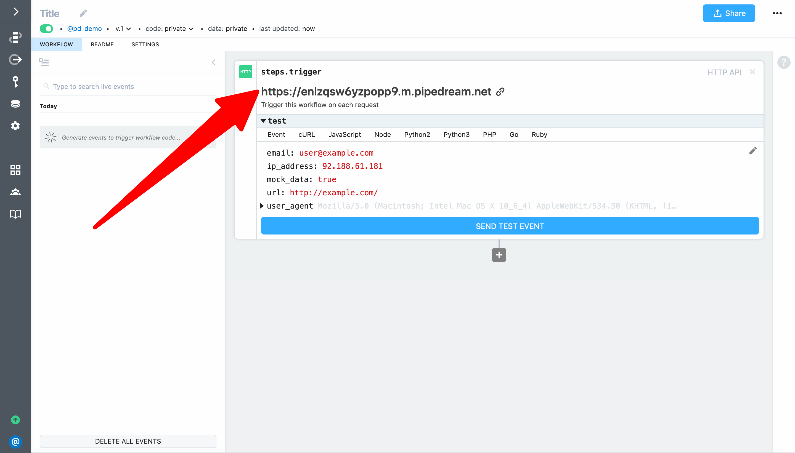
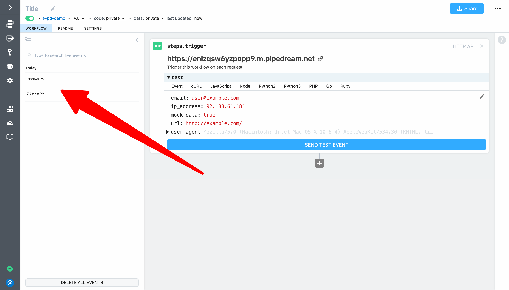
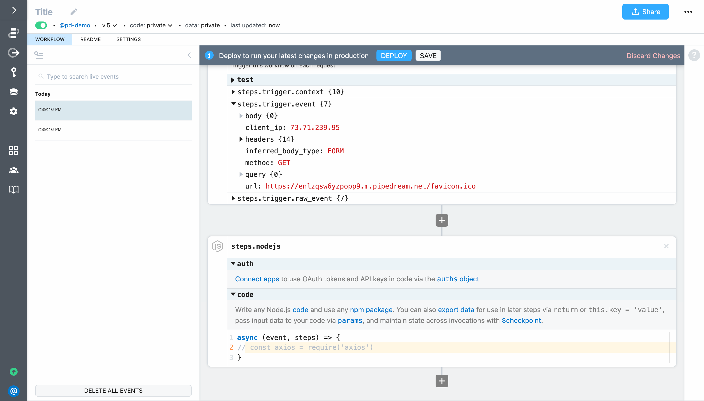

# hello world!

First, let's create an HTTP triggered workflow and return a response of `hello world!`. This example will cover how to:

- Create a new workflow
- Generate a unique endpoint URL to trigger the workflow
- Send HTTP requests to the workflow and inspect them
- Return a custom response on each HTTP request

First, create a new workflow by clicking the **New** button from [https://pipedream.com/workflows](https://pipedream.com/workflows):



Pipedream will launch the workfow builder:


Following is an brief overview of the screen layout:


To create an HTTP or webhook triggered workflow, select the **HTTP API** trigger. 


Your workflow will automatically deploy and Pipedream will generate a unique endpiont URL.



Any requests you make to the endpoint URL will trigger your workflow. To test it out:

1. Copy the endpoint URL generated by Pipedream
2. Open a new browser tab and load the URL


When you return to your workflow, you'll see the requests appear in the event list (events appear in real-time — you don't need to refresh the page). 



**IMPORTANT:** You may see multiple events appear in the event list each time you load the endpoint URL in a web browsers's address bar. That happens because modern browsers automatically request a `favicon.ico` resource when you load a URL. We'll update our workflow to handle this case in a later section of the quickstart.

When you select an event from the list, the data associated with that event will appear below each of the steps in your workflow. For the trigger, that means details related to the inbound request (e.g., the URL, method, body, headers, query parameters) can be inspected. This data can also be referenced by steps in your workflow via the `steps` object (for example, to use the trigger event in a later step you can reference `steps.trigger.event` — we'll cover this in the next example). 


Next, let's use Pipedream's `$respond()` function to return a custom response from the workflow. First, click on **Run Node.js code** to add a code step (if the step menu is not expanded, click the **+** button below the trigger step).

 

Pipedream will add a code step to your workflow. 



You can write any Node.js code that is supported in `async` Javascript functions and use any npm package (we'll cover npm in a later part of this guide). For this example, just add the following code to return a custom response of `hello world!`:

```javascript
await $respond({
  status: 200,
  immediate: true,
  body: `hello world!`
})
```

Then click **Deploy** to run your changes on each new event.


The deploy should complete in about 1-2 seconds. Then reload the endpoint URL in your browser — you the response should change to `hello world!`.


Congratulations! You just built your first serverless workflow! 

**Next, let's pass data in the HTTP request and use it to customize the workflow response. [Take me to the next example &rarr;](../hello-name/)**